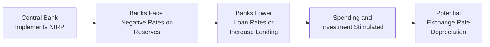

## Introduction

I still remember the day I first heard about interest rates going below zero. I was having coffee with a colleague, and we both paused for a minute—like, wait, negative rates? It sounds so counterintuitive, right? After all, most people believe that lending money should earn you some interest, not charge you for the privilege. Yet, here we are discussing the Zero Lower Bound (ZLB) and how policymakers sometimes push interest rates below zero. Let’s explore how these negative interest rate policies (NIRP) emerged, how they work in practice, why central banks adopt them, and the many ways they shape financial markets, bank behaviors, and investor decisions.

## Understanding the Zero Lower Bound

The Zero Lower Bound is a concept in monetary economics suggesting that interest rates (particularly short-term nominal rates) can’t easily go much below zero. Conventional wisdom long assumed that once rates hit zero, central banks lose one of their primary tools of monetary stimulus—they can’t push nominal rates lower, because who would want to hold a deposit that yields a negative return?

However, in the wake of global financial crises, stagnating growth, and persistent deflationary pressures, several central banks decided to test the long-standing assumption that zero is truly the lower limit. We’ve seen examples in Europe, Japan, and other parts of the world where rates went fractionally below zero—or sometimes more than fractionally. This dynamic has massive implications for lending, spending, currency values, and financial stability.

### Why Zero is Viewed as a ‘Natural Floor’

• People can hold cash. If your account yields a negative rate, you might just withdraw your funds and store them under your mattress—or in a vault—thus avoiding the “fee” from the bank.  
• Institutional constraints make negative deposit rates challenging for banks to pass on to retail customers (due to reputational risk).  
• Contractual constraints in many financial products (like certain money market funds) historically didn’t allow for “negative” yields.

But as we’ll see, in practice, central banks have tested pushing rates below zero, albeit with careful calibration.

## Negative Interest Rate Policies (NIRP)

Negative Interest Rate Policies effectively charge commercial banks—or other financial institutions—for excess reserves they park at the central bank. The idea is that if banks must pay to hold surplus funds, they’ll be more inclined to lend these funds out. Lending stimulates consumption and investment, which boosts economic activity and, ideally, inflation.

### Key Motivations for NIRP

• Stimulating Growth: In periods of extremely low growth and near-zero inflation (or deflation), central banks employ negative rates to encourage commercial banks to lend.  
• Encouraging Risk-Taking: By making safe assets less attractive, negative rates nudge investors toward equities, corporate bonds, and other higher-yielding (but higher-risk) options—potentially lifting asset prices and creating wealth effects.  
• Influencing Exchange Rates: Lower or negative rates can prompt depreciation of the local currency, which can help boost exports by making them cheaper in foreign markets.  

## How Negative Rates are Transmitted

It might seem mind-boggling that negative rates don’t simply trigger mass withdrawals or financial chaos. The truth is, central banks usually implement a tiered system. They might apply negative rates only to a portion of excess reserves—often in multiple tiers with differing penalty rates. This approach limits the direct burden on banks (and, down the line, depositors). At the same time, the negative rate environment seeps into money markets, bond markets, and eventually influences broader financial conditions.

Let’s visualize a simplified view of how negative interest rates flow through the economy:

### Bank Profitability Concerns

When the central bank imposes a negative rate on excess reserves, banks are effectively penalized for holding idle funds. If banks try to pass those negative rates to retail customers, they could risk deposit flight—nobody wants to pay for depositing money! In practice, many banks avoid directly negative deposit rates for retail clients but charge them for large corporate depositors instead. 

However, the interest margin typically shrinks in a negative rate environment, pressuring profitability. Banks must often rely on additional fees or pivot to other lines of business (like wealth management or investment banking) to offset the narrower margins on traditional lending.

### Saving Behavior and the “Cash Under the Mattress” Problem

From an individual’s perspective, faced with negative rates, you might wonder, “Should I just keep my money in cash?” In theory, yes, negative rates might lead to a jump in currency hoarding. But there are real costs and risks to storing large amounts of physical cash:

• Security concerns and insurance costs.  
• Difficulty in making large transactions.  
• Inconvenience factor (lugging around big wads of notes is not fun).  

So while negative rates do push deposit rates down, and might make people grumble, large-scale physical hoarding rarely becomes an overwhelming phenomenon—unless rates go significantly negative for a long time.

## Real-World Examples

### Eurozone

The European Central Bank (ECB) introduced negative deposit facility rates in June 2014, gradually moving them lower over subsequent years. Their objective was to battle too-low inflation and tepid growth following the Eurozone debt crisis. The ECB’s negative rate policy aimed to stimulate lending across member states, support broader economic expansion, and steer inflation back up near its 2% target.

### Japan

The Bank of Japan (BoJ), already engaged in robust quantitative easing, adopted negative rates in January 2016. Japan faced decades of deflationary pressures. By imposing rates below zero on certain reserve balances, the BoJ sought to spur increased lending and break the deflationary mindset that had long plagued the economy.

### Other Economies

Switzerland, Denmark, and Sweden have also used negative deposit rates. In some cases, these policies are aimed at influencing currency appreciation pressures. For instance, the Swiss National Bank used negative interest rates partly to discourage massive safe-haven capital inflows that were strengthening the Swiss franc beyond desirable levels.

## Potential Consequences and Pitfalls

While negative rates can theoretically stimulate the economy, they also carry some messy side effects:

• Bank Profit Squeeze: Net interest margins get narrower, potentially constraining bank lending over the longer term or encouraging more risk-taking to preserve profitability.  
• Distortions in Asset Prices: By making “safer” assets yield negative returns, investors chase yields in riskier assets—potentially inflating bubbles.  
• Public Opinion: Negative rates can be a tough sell. People may feel uneasy about policies that, on the surface, seem to penalize savers.  
• Cash Hoarding: While not typically widespread, if negative rates become too deep or protracted, more people or institutions may consider storing cash outside the banking system.  
• Limited Room Before Policy Hits Diminishing Returns: Once you push rates too far negative, the potential benefits could be offset or overshadowed by the unintended consequences.

## Strategies for Mitigating Negative Rate Challenges

Central banks and financial institutions deploy several strategies to lessen the pain of negative rates:

• Tiered Reserve Systems: Only a fraction of bank reserves is charged a negative rate, reducing the overall burden.  
• Communication and Forward Guidance: Central banks often pair negative rate policies with clear statements on how long the “penalty” might remain, which can shape expectations and reduce market uncertainty.  
• Diversified Bank Revenue Models: Banks may increase reliance on fee-based services, wealth management, or other lines of business where interest rates are less crucial to profitability.  
• Complementary Fiscal Policies: In some cases, expansions in government spending or targeted tax measures can work alongside negative rates to stimulate aggregate demand more effectively.

## Market Reactions and Currency Implications

From a capital market perspective, negative rates frequently lead to yield curve shifts across government and corporate bonds. At times, we see a peculiar scenario where even very long-term bonds slip into negative yield territory—meaning investors pay the issuer instead of receiving interest. 

On the currency front, negative rates can put downward pressure on exchange rates, making domestic goods more competitive abroad. However, if every major economy starts using negative rates, the “race to the bottom” can lead to policy spillovers and complicate global trade dynamics.

## Risk Management and Investment Considerations

Portfolio managers dealing with negative yields often rethink their strategies. For instance, some might increase allocation to equities, real estate, or alternative asset classes to chase higher returns. Others may adjust duration exposures or use derivative overlays to manage interest rate risks. 

Meanwhile, risk management becomes crucial because negative yields might signal underlying economic stagnation or deflationary forces—conditions that might not bode well for corporate earnings or broader market performance. 

Ethically, from a CFA Institute Code and Standards perspective, advisers should clearly communicate these unusual market conditions to clients, explaining why certain traditionally “safe” instruments might now have negative yields, and what that means for longer-term portfolio objectives.

## Exam Tips for CFA Candidates

• Understand key terms: The exam might test your grasp of the Zero Lower Bound concept—e.g., why it exists and what it implies about conventional monetary policy tools.  
• Evaluate scenarios: You may see item sets or constructed-response questions where you must interpret how negative policy rates affect bond yields, exchange rates, and portfolio positioning.  
• Remember the global context: Negative rates aren’t limited to one region. The CFA exam might ask you to compare policies across Europe, Japan, or North America.  
• Integration with other topics: NIRP might appear in broader macroeconomic scenario analysis or in discussions about risk management and fixed-income valuation.  
• Don’t forget the unintended consequences: The exam loves to probe your understanding of potential pitfalls (like bank profitability, currency effects, or asset price distortions).

## Glossary

• **Zero Lower Bound (ZLB)**: A near-zero limit on nominal interest rates, where traditional economic theory suggests rates cannot fall below zero without causing significant distortions, such as cash hoarding.  
• **Negative Interest Rate Policy (NIRP)**: A situation in which central banks push short-term nominal interest rates below zero, effectively charging banks (and potentially other depositors) for holding funds, with the intent to stimulate lending, spending, and investment.

## References and Further Reading

• Rognlie, M. (2016). “What Lower Bound? Monetary Policy with Negative Interest Rates.” Brookings Papers on Economic Activity.  
• IMF Policy Discussion Papers on NIRP:  
  (https://www.imf.org)  
• European Central Bank (ECB) official communications and monetary policy announcements:  
  (https://www.ecb.europa.eu)

## Test Your Knowledge: Zero Lower Bound and Negative Interest Rates



### 1. A primary reason the Zero Lower Bound is considered binding is that:
- [ ] Many depositors prefer digital currencies to physical cash.  
- [x] Depositors can hoard physical cash to avoid negative interest rates.  
- [ ] Bond yields rarely drop below 0.10%.  
- [ ] Governments impose penalties for storing physical currency.  

> **Explanation:** The ability to hold cash physically creates a “floor” on how low rates can go before depositors flee the banking system entirely.

### 2. Negative interest rate policies (NIRP) most directly aim to:
- [ ] Reduce the cost of government borrowing.  
- [x] Encourage banks to lend out excess reserves.  
- [ ] Increase money market rates.  
- [ ] Discourage foreign investors from entering the market.  

> **Explanation:** By charging banks to hold reserves, central banks push banks to lend more, thereby stimulating investment and spending.

### 3. Which of the following is a common potential side effect of negative interest rates?
- [x] Bank profitability can be squeezed due to narrower net interest margins.  
- [ ] Inflation will necessarily remain below 1%.  
- [ ] Households will massively convert deposits to stocks.  
- [ ] Business investment halts abruptly.  

> **Explanation:** Negative rates compress interest margins, affecting bank profitability. The other listed effects are not necessarily direct or guaranteed outcomes of NIRP.

### 4. Tiered reserve systems under negative rates are designed to:
- [x] Limit the penalty on a portion of bank reserves while still applying negative rates to excess reserves.  
- [ ] Eliminate negative rates for all commercial bank deposits.  
- [ ] Pass negative rates on to individuals only, not corporations.  
- [ ] Make all reserve balances above a threshold earn a higher positive rate.  

> **Explanation:** Tiered systems aim to mitigate the cost of negative rates by charging only on a subset of reserves, reducing pressure on bank profitability.

### 5. When interest rates turn negative, one major concern for commercial banks is:
- [x] Customer backlash if negative rates are handed down to retail depositors.  
- [ ] Excessive inflation caused by the rates.  
- [ ] Inability to perform currency exchanges across borders.  
- [x] Shrinking net interest margin if deposit rates remain near zero.  

> **Explanation:** Banks risk losing customers if they start charging negative deposit rates. Simultaneously, if they do not pass on those negative rates effectively, net interest margins shrink, affecting profitability.

### 6. Which central bank has deployed negative interest rates in recent years?
- [x] European Central Bank (ECB)  
- [ ] Federal Reserve (FED)  
- [ ] Bank of England (BoE) only  
- [ ] Reserve Bank of Australia (RBA) only  

> **Explanation:** The ECB introduced negative rates in 2014, and other banks such as the Bank of Japan have followed similar policies. The Fed and BoE have not adopted NIRP measures.

### 7. In a negative interest rate environment, currency depreciation may occur because:
- [x] Lower returns in the domestic currency discourage foreign capital inflows.  
- [ ] Negative rates immediately cause defaults on government debt.  
- [x] Investors may shift funds to economies with higher interest rates.  
- [ ] The central bank rules prohibit currency purchases.  

> **Explanation:** Negative rates reduce the incentive to hold the domestic currency, which can lead to depreciation. Investors might seek higher returns elsewhere.

### 8. Negative interest rates are often introduced during periods of:
- [x] Low inflation or deflationary environments.  
- [ ] High economic growth and rising wage pressures.  
- [ ] Booming equity markets with soaring commodity prices.  
- [ ] Hyperinflation and currency collapse.  

> **Explanation:** Central banks generally use negative rates to combat deflation, stimulate growth, and raise inflation expectations.

### 9. A potential “escape route” from negative deposit rates for individuals is:
- [x] Withdrawing cash and storing it physically.  
- [ ] Switching all funds into short-term government bonds paying large premiums.  
- [ ] Buying only derivatives with negative time value.  
- [ ] Issuing personal loans to neighbors at below-zero rates.  

> **Explanation:** In theory, depositors can avoid negative bank rates by storing cash privately, though this involves risks and logistical considerations.

### 10. True or False: Negative interest rate policies always guarantee higher inflation in the long run.
- [x] False  
- [ ] True  

> **Explanation:** While negative rates can help stimulate spending, there is no guarantee they will always achieve higher inflation, especially if other economic headwinds or structural issues persist.


