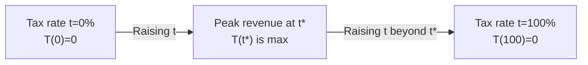

## Overview and Key Concepts

It’s funny—when I first heard someone say that lowering taxes could eventually increase tax revenue, I remember thinking, “Wait, that sounds a bit upside-down.” Well, that intuitive head scratcher is exactly the gist of supply-side economics and the Laffer Curve. In essence, supply-side economics argues that cutting taxes and reducing regulatory burdens can, under certain circumstances, promote long-term economic growth. Meanwhile, the Laffer Curve is a reminder that if you raise taxes beyond a certain threshold, you actually discourage earning and producing, thereby lowering tax revenue.  

While these topics can get quite controversial, they remain central to fiscal policy debates in both academic and policymaking circles. For CFA® candidates—especially those preparing for advanced levels—understanding how supply-side concepts feed into big-picture macroeconomic and investment decisions is crucial. Let’s explore how it all works.

## The Foundations of Supply-Side Economics

Supply-side economics focuses on stimulating aggregate supply (i.e., the productive capacity of an economy). It emphasizes removing barriers to production and enhancing incentives for enterprises and individuals. The rationale is straightforward enough: if firms can keep more of their earnings (due to lower corporate tax rates) or if people get to keep a higher share of their income (due to reduced personal tax rates), they will be more motivated to invest, innovate, and expand operations.

Many supporters of supply-side economics also stress that efficient markets require fewer regulatory stipulations. If you reduce red tape, the argument goes, companies can more easily launch new products, adopt novel technologies, and achieve economies of scale—with the overall effect being higher real GDP growth.  

### Core Policy Levers

Although different governments have tried various permutations, common supply-side policy tools include:

• Corporate Tax Cuts: By cutting corporate taxes, policy makers hope firms will have more capital to spend on research, development, and expansion—boosting long-term growth.  
• Capital Gains Tax Reductions: Lower tax rates on investment profits aim to encourage increased capital formation and risk-taking in equity or business ventures.  
• Investment Incentives: These might include accelerated depreciation schedules or targeted tax credits, making it easier for firms to reinvest profits into plant and equipment.  
• Labor Market Reforms: These can range from reducing payroll taxes to easing hiring and firing regulations—designed to encourage labor participation and productivity.

The underlying assumption is that the potential boost in economic activity (or expansion of the tax base) will eventually compensate for reduced tax rates, offsetting potential shortfalls in government revenue. However, this outcome is by no means guaranteed; it depends on how individuals and businesses respond to changed incentives.

## Introducing the Laffer Curve

The Laffer Curve, made famous by economist Arthur Laffer, captures this idea that changing tax rates can have complex, non-linear impacts on tax revenue. The curve is essentially a thought experiment—if the government charges a 0% tax rate, revenue is obviously zero. Conversely, if it charges a 100% tax rate, revenue also collapses to zero, because no one would bother earning taxable income if all of it is taxed away.

So as you travel from 0% tax to 100% tax, total revenue first rises—after all, you’re gradually capturing a portion of economic output—but beyond a certain point, you discourage so much work, investment, and productivity that the total tax base starts shrinking.

### The Curve in Simple Mathematical Terms

A simplified formula often used to illustrate the Laffer Curve is:


T(t) = t \times B(t),


where:  
• \\( t \\) is the tax rate (expressed as a decimal).  
• \\( B(t) \\) is the tax base, which itself can change depending on \\( t \\).  

The function \\( B(t) \\) can decrease significantly if \\( t \\) becomes too large, reflecting the notion that individuals and firms reduce productive endeavors (or shift activity to jurisdictions with lower tax rates).  

For instance, if we hold the tax base constant (which might be an oversimplification), total revenue would theoretically increase linearly with the tax rate. But in reality, the tax base shrinks at higher tax rates, so the overall function takes on a shape somewhat resembling a bell (or an inverted “U”).

### Visualizing the Laffer Curve

Below is a simple Mermaid diagram demonstrating how the maximum point of tax revenue might occur at some tax rate \\( t^* \\). Before \\( t^* \\), raising taxes can increase revenue; after \\( t^* \\), raising taxes reduces revenue.



The controversy revolves around determining the actual location of \\( t^* \\)—that is, which side of the curve a given economy may be on at any particular point in time.

## Benefits and Critiques of Supply-Side Economics

Are we sure that lower tax rates will always pay for themselves via higher growth? Not necessarily. This is where debates about supply-side economics get particularly heated, and where real-world complexities come in.

### Potential Benefits

• Encourages Entrepreneurship: Lower personal income taxes and more capital for reinvestment can fuel the creation of new businesses.  
• Improves Global Competitiveness: Reductions in corporate taxes may lure multinational corporations and foreign direct investment, benefiting domestic labor markets.  
• Simplifies Tax Structures: Some supply-siders advocate for flat taxes or streamlined systems that reduce compliance costs and inefficiencies.  

### Common Criticisms

• Risk of Large Deficits: If the growth or productivity boost doesn’t materialize, public finances can suffer as government revenue falls with no offsetting surge in economic activity.  
• Income Inequality: Tax cuts aimed at top income brackets can deepen wealth disparities if the gains are not broadly shared or reinvested.  
• Timing and Political Realities: Even if supply-side measures produce more robust growth, results might take time to show up. Meanwhile, policymakers have to keep funding current government programs—potentially increasing the debt load.  

In advanced capital market settings, we frequently see debates about whether the next “stimulus” measure should be more spending or more tax cuts, and how best to keep government’s budget balanced. In a sense, it’s a balancing act between short-run demand-side policies and longer-run supply-side considerations.

## Real-World Glimpses

If you’ve ever studied the fiscal policies of the 1980s in the United States, you might recall the so-called “Reaganomics.” This movement included significant tax cuts on personal income and capital gains. Advocates credit these measures with boosting investment, promoting a robust expansion, and taming inflation (in combination with monetary policy). Critics respond that the growth surge was partially cyclical and that deficits soared, leading to a near doubling of federal debt over the decade.

In other countries—like Estonia, Latvia, or Slovakia—in the 2000s, flat-rate tax systems were introduced to spur economic growth and simplify administration. For a period, these countries experienced healthy economic expansion, but they also faced challenges when global cycles turned, and revenues were not enough to cover social spending and infrastructure needs.

## Policy Tools for Supply-Side Implementation

Let’s highlight some specific mechanisms policymakers might adopt when seeking to stimulate supply:

• Corporate Tax Deductions for R&D: Offering credit for research and development expenses encourages innovative activities and may elevate the nation’s competitive edge.  
• Reduction in Capital Gains Tax: Aiming to spur investment into equities, venture capital, and business expansions.  
• Loosening of Labor Market Regulations: Governments might relax constraints on hiring and terminating employees. Supporters say this lowers the risk of hiring, leading to a more robust labor market.  
• Deregulation: Spanning from environmental regulations to financial rules, deregulation can significantly reshape industry structures. This can facilitate new market entrants or reduce production costs for established players.

### Balancing with Monetary Policy

Supply-side measures are often accompanied by an appropriate monetary stance. If central banks keep interest rates excessively high just as the government is trying to stimulate supply (for instance, during a period of inflationary risk), newly minted businesses may struggle to secure affordable loans. On the other hand, a too-expansionary monetary policy might put unwanted upward pressure on prices. The interplay between supply-side fiscal initiatives and monetary policy remains a delicate dance: get it right, and you could see robust growth without runaway inflation; get it wrong, and you could be left with high debt and still-lackluster productivity.

## Python Example: Rough Simulation of a Laffer Curve

Sometimes, a little computational experiment helps drive home the point. Let’s check out a toy simulation in Python that calculates hypothetical tax revenue for varying tax rates, factoring in a shrinking tax base at higher taxes.

```python
import numpy as np
import matplotlib.pyplot as plt

# Let's say it grows with economic growth at low tax rates
def tax_base(tax_rate):
    # A simple shape where base grows initially but peaks and declines
    return 1000 * (1 - 0.8*tax_rate)**3 if tax_rate < 1 else 0

tax_rates = np.linspace(0, 1, 101)  # from 0% to 100% in increments of 1%
revenues = []

for t in tax_rates:
    # T(t) = t * B(t)
    base = tax_base(t)
    rev = t * base
    revenues.append(rev)

plt.plot(tax_rates, revenues, label="Laffer Curve")
plt.xlabel("Tax Rate")
plt.ylabel("Tax Revenue")
plt.title("Hypothetical Laffer Curve")
plt.legend()
plt.show()
```

In this tiny snippet, once the tax rate climbs high enough, the dramatic decline in the tax base dominates, causing overall revenue to tail off.

## Challenges, Pitfalls, and Best Practices

• Pinpointing Optimal Rates: One real pitfall is the difficulty in pinpointing the precise tax rate that maximizes revenue—macro models are full of assumptions that may not hold in the real world.  
• Short vs. Long Term: Supply-side reforms might take time to bear fruit. Policymakers need to manage short-term budgetary constraints without undermining longer-term prospects.  
• Political Realities: Even if a government enacts broad tax reforms, institutional inertia and unexpected external shocks (like an oil crisis) can derail the intended economic boost.  
• Externalities: Supply-side expansions could potentially lead to environmental stresses or resource overuse if not accompanied by well-structured regulatory frameworks.

In a portfolio management context, when supply-side policies are introduced, you’ll want to track changes in interest rates, yield curves, and inflation expectations. Potential improvements in corporate earnings (due to lower effective tax rates) can alter equity valuations, while anticipated budget deficits may drive bond yields higher. Understanding where the policy is taking the economy can help in asset allocation decisions.

## Exam Tips for CFA® Candidates

For the CFA® exam, particularly as you move into advanced item sets or essay-based questions, you might be asked to:

• Evaluate the Effects of Tax Policy in a Scenario: For instance, how does cutting corporate tax rates influence investment or GDP?  
• Identify the Position on the Laffer Curve: You might need to compare hypothetical economies—one on the left side of the curve and one on the right—and determine how a tax rate change might affect revenue.  
• Link to Monetary Policy: You could be asked how central bank actions complement or counteract supply-side measures.  
• Discuss Critiques of Supply-Side Theories: Show that you understand the potential drawbacks, especially regarding deficits, income inequality, and the distribution of benefits.

When you see a question about supply-side tools, keep an eye out for multi-part tasks: you might be required to do quick numeric calculations (e.g., to see if a certain point is above or below the revenue-maximizing tax rate) and then interpret the result in the context of broader macroeconomic conditions.

## Conclusion

It’s easy to get lost in the big, swirling debates around supply-side economics—particularly about whether tax cuts pay for themselves. But it’s hard to deny that changes in taxation and regulation do influence labor, capital allocation, and overall economic growth. The Laffer Curve, for all its controversy, serves as a neat and memorable visual that reminds us of the non-linear incentives behind taxation.

For CFA® professionals, being well-versed in these theories will help you interpret government policy shifts, assess potential impacts on both market behavior and corporate fundamentals, and shape a cohesive investment strategy. While we can’t control the precise shape of the Laffer Curve in real life, staying alert to how economic participants might respond to tax incentives can give you a vital edge in portfolio management and macro forecasting.

## References and Further Reading

• Laffer, A. B. (2004). “The Laffer Curve: Past, Present, and Future.” Heritage Foundation Backgrounder.  
• Feldstein, M. (2008). “Effects of Taxes on Economic Behavior.” National Tax Journal.  
• Barro, R. (1999). “Ramsey Meets Laffer: Optimal Dynamic Taxation and the Supply Side.” MIT Press.  
• Mankiw, N.G. (2013). Principles of Economics. Cengage Learning.  

---

## Test Your Knowledge: Supply-Side Economics and the Laffer Curve



### Which statement best describes the main premise of supply-side economics?

- [ ] Government spending multipliers drive most economic growth.
- [x] Lower tax barriers and reduced regulations can improve production incentives, potentially raising overall economic output.
- [ ] The money supply must grow at a constant rate to stabilize prices and growth.
- [ ] Controlling aggregate demand is the only driver of long-term economic growth.

> **Explanation:** Supply-side economics posits that removing barriers—like high tax rates or excessive regulation—encourages productivity and innovation, thus stimulating growth.

### In the context of the Laffer Curve, which of the following is true?

- [ ] Tax revenue always increases in a one-to-one ratio with higher tax rates.
- [x] Beyond some optimal tax rate, further increases in tax rates cause total tax revenue to decline.
- [ ] A 100% tax rate will generate the highest possible tax revenue for a government.
- [ ] A 0% tax rate consistently results in higher total revenue than a small positive tax rate.

> **Explanation:** At extreme values (0% or 100%), revenue is zero. The shape of the Laffer Curve suggests there exists a peak tax rate that maximizes revenue, and going beyond that point reduces revenue as economic activity is discouraged.

### A policymaker suggests cutting personal income taxes from 40% to 35% to boost labor participation. Which challenge is most relevant?

- [ ] Rising consumer prices due to supply shocks.
- [x] Increased risk of fiscal deficits if the projected growth fails to materialize.
- [ ] Excess monetary tightening from the central bank is guaranteed.
- [ ] A fall in the money supply that automatically leads to deflation.

> **Explanation:** One common critique of supply-side tax cuts is that if higher growth does not occur or is slower than expected, government revenues may drop, increasing budget deficits.

### When analyzing supply-side policies for portfolio management purposes, an investor would likely focus on:

- [x] Potential improvements in corporate earnings and changes in inflation expectations.
- [ ] Implementation of tight capital controls on commercial banking.
- [ ] Only international currency fluctuations over the short term.
- [ ] A pegged exchange rate system and its direct effect on gold.

> **Explanation:** Supply-side reforms typically have a direct impact on corporate profitability (through tax cuts) and inflation expectations (via shifts in productivity and potentially the deficit outlook), both of which can affect asset prices and bond yields.

### Suppose an economy is situated at the left side of the Laffer Curve peak. What implication does this hold for changes in tax rates?

- [ ] Reducing tax rates would definitely raise tax revenue.
- [x] Raising tax rates could still increase government revenue, assuming the economy is not at or beyond the peak.
- [ ] Any change in tax rates will have no impact on revenue collection.
- [ ] Government revenues can never exceed the current level, regardless of rate changes.

> **Explanation:** On the left side of the peak, tax rates are relatively low, so incremental increases could still bring in more revenue before the negative effects on work incentives overpower the increase in rates.

### Which of the following is a common argument in favor of supply-side economics?

- [x] Lowering taxes can foster entrepreneurship and investment, potentially raising long-term GDP.
- [ ] High government spending is the only way to achieve equilibrium.
- [ ] The Phillips Curve has no relevance in modern policymaking.
- [ ] The central bank should solely focus on maintaining a fixed exchange rate regime.

> **Explanation:** Supply-siders assert that making it more profitable to invest or take risks leads to entrepreneurship, productivity gains, and economic growth.

### One risk of implementing sweeping supply-side reforms is:

- [ ] Deflation is guaranteed to spiral out of control.
- [x] Policies may widen income inequality if tax reductions favor higher-income earners.
- [ ] Monetary policy becomes immediately obsolete.
- [ ] Labor unions automatically adopt the policy framework.

> **Explanation:** Tax cuts often disproportionately favor higher-income earners, which can widen income disparities unless carefully paired with other measures.

### If a central bank adopts a tight monetary policy while the government implements supply-side tax cuts, we might see:

- [x] Higher interest rates restraining the debt-financed stimulus effect of tax cuts.
- [ ] Inflation spiraling upward due to combined overspending.
- [ ] Unconditional acceptance of the policy stance by foreign investors.
- [ ] Zero effects on bond markets or equity valuations.

> **Explanation:** Tight monetary policy can keep borrowing costs high, limiting how much corporations and individuals can leverage new supply-side incentives—altering the net effectiveness of the tax cuts.

### Which of the following is least likely to be considered a supply-side policy measure?

- [ ] Deregulating specific industries to lower production costs.
- [ ] Offering investment tax credits to encourage capital formation.
- [x] Creating direct cash transfer programs to stimulate consumer demand.
- [ ] Reducing capital gains tax rates to stimulate equity investment.

> **Explanation:** Supply-side economics predominantly focuses on enhanced productive capacity; direct cash transfers mainly target immediate demand stimuli.

### From the Laffer Curve perspective, which statement is true?

- [x] True
- [ ] False

> **Explanation:** The Laffer Curve indicates that at very high tax rates, additional rate increases can push total revenue downward—not upward—due to lower economic activity.


