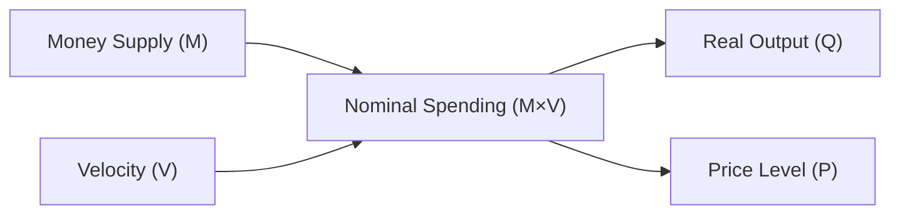

## Why Households and Firms Hold Money
It can be surprising, right? You’d think people would rather invest all their cash into high-interest accounts, stocks, or something presumably more rewarding. Yet households and firms across the globe keep part of their wealth in good old-fashioned money. A big reason is that money is extremely convenient—no headaches with selling bonds or dealing with stock price volatility when you need to buy groceries or pay wages. 

In general, economists like to categorize the demand for money into three main motives:
• Transactions Motive: We all have regular expenses—gas, groceries, Netflix. Firms must pay salaries, suppliers, and utilities. Holding enough money to cover these daily (or monthly) transactions is simply easier than constantly liquidating assets.
• Precautionary Motive: Life is uncertain. Households and businesses alike keep a cushion of surplus cash in case of emergencies—an unexpected hospital bill, a sudden drop in sales, or a spike in input costs.
• Speculative Motive: Sometimes, it’s all about timing. For instance, if you think interest rates are about to rise, you might prefer to hold cash rather than bonds (whose prices typically fall when rates go up). Or if you anticipate a stock market dip, you might exit equities momentarily and wait in cash until new buying opportunities emerge.

In everyday life, it’s kind of like having a wallet with enough bills so you don’t scramble for your credit card every time you buy coffee. But at the corporate level, these decisions are more strategic, involving liquidity requirements and the outlook for future market conditions.

## The Keynesian Approach to Money Demand
John Maynard Keynes emphasized that people hold money because they prefer liquidity (hence the term “liquidity preference”). According to Keynes, the interest rate is the price of giving up the “convenience” of cash. The higher the interest rate, the greater the opportunity cost of sitting on cash that earns no return.

Keynes split the demand for money into:
• Transaction Demand: Largely a function of income or output. As real GDP grows, people need more money for their transactions.  
• Precautionary Demand: Influenced by uncertainty about the future. The more uncertain the economy, the more individuals and firms want a buffer of cash.  
• Speculative Demand: Driven by expectations of future changes in interest rates or asset prices. If you expect bond yields to rise (and bond prices to fall), you might reduce bond holdings and wait with cash to pick them up later at a discount.

This view implies that money demand is somewhat elastic with respect to interest rates. If the central bank lowers rates too much, people might decide to hold extra money since they don’t lose out on much potential interest. Conversely, if rates are high, they’d rather invest in interest-bearing assets. In Keynes’s framework, the equilibrium interest rate gets “worked out” by balancing the supply of money (set by the central bank) with the public’s demand for holding money.

## The Monetarist View and the Quantity Theory of Money
Contrast Keynes’s liquidity preference with Monetarists, led famously by Milton Friedman. Monetarists often emphasize the Quantity Theory of Money, a perspective that says changes in the money supply are the primary drivers of price levels over the long run. 

Instead of focusing on interest rates as a key determinant of money demand, Monetarists look at the broader relationship:  
(1) MV = PQ,  
where:  
• M is the money supply,  
• V is the velocity of money (how often a dollar circulates in a year),  
• P is the price level, and  
• Q is real output.

Monetarists typically assume that velocity (V) is fairly stable over time (though it can fluctuate in shorter periods). As a result, changes in M tend to influence nominal GDP (P×Q). In the long run, Q (real output) is mostly determined by real factors like technology, resources, and labor productivity. Hence, if M grows faster than real output—in other words, if M grows rapidly for a sustained period—price levels (P) tend to rise, leading to inflation.

This perspective often leads to policy prescriptions that central banks should manage the growth of money supply in line with the potential growth of real GDP. That way, the economy avoids both runaway inflation (too much money relative to output) and deflation (too little money relative to output).

## The Equation of Exchange in More Detail
The equation of exchange,  
M × V = P × Q,  
is more than just a neat identity. It reminds us that total nominal spending in an economy—money times velocity—must equal total nominal output—price times quantity.

Depending on how we interpret velocity, we can arrive at quite different policy implications. If V is assumed constant, an increase in M directly raises P×Q. But in real-world settings, velocity can swing due to financial innovation (new payment technologies make money circulate faster), changes in confidence, or shifting economic structures. When velocity is unpredictable, controlling inflation solely by controlling M proves challenging.

Here is a simple conceptual Mermaid diagram illustrating the relationship among money supply, velocity, real output, and price level:

In practice, you might think of each dollar “turning over” multiple times per period. The faster that turnover, the higher the velocity, and the more nominal GDP can grow—even if M doesn’t budge.

## Changes in Money Demand, Interest Rates, and Central Bank Response
When people suddenly want to hold more money—say, due to economic worries—this shifts the money demand curve rightward. If the central bank doesn’t offset that shift by supplying more money, interest rates tend to rise. The logic? More people want to hold cash, which is in limited supply, so they sacrifice more interest income to hold it.

Yet central banks often adjust monetary policy (e.g., by open market operations, discount rate changes, or reserve requirement tweaks) to stabilize interest rates or meet their inflation targets. When money demand surges, a central bank might announce a bond-buying program to flood the market with liquidity, thereby keeping rates from spiking. On the other hand, if money demand were to fall dramatically, and people flooded banks with deposits seeking interest-yielding assets, the central bank might tighten the money supply to keep inflationary pressures in check.

So it’s not just about how central banks manipulate interest rates; it’s also about how the public’s appetite for holding money interacts with supply. In that sense, money demand is crucial to understanding short-run fluctuations in interest rates and overall liquidity conditions.

## Narrow vs. Broad Money
In measuring money, economists distinguish between various “monetary aggregates.” Narrow money (often called M1 in some countries) includes currency in circulation plus checking accounts—essentially the forms of money readily available for daily use. Broad money (often called M2, M3, and so forth) includes everything in M1 plus less-liquid forms like savings deposits, time deposits, money market mutual funds, and certain other near-money instruments.

• Narrow Money (e.g., M1):  
  – Physical currency and coins in circulation  
  – Demand deposits  
  – Other checkable deposits  

• Broad Money (e.g., M2, M3):  
  – All components of narrow money  
  – Savings deposits  
  – Time deposits  
  – Money market funds  

Why do these measures matter? Well, different monetary aggregates can behave quite differently, especially during financial stress. Households might move funds in and out of savings accounts or money market funds at different rates than they handle the currency in their wallets. Consequently, velocity can differ across these aggregates. Policymakers watch both narrow and broad money aggregates for clues about liquidity conditions in the economy.

## Practical Insights and Possible Pitfalls
• Overlooking Velocity’s Fluctuations: Putting too much faith in a stable velocity can lead to policy missteps. If velocity suddenly plunges (e.g., during a financial crisis), simply maintaining a constant money supply may not be enough to avoid recessionary pressures.  
• Failing to Track Expectations: Money demand is strongly tied to expectations about inflation, interest rates, and the broader economy. Underestimating the impact of public sentiment on speculative money demand can leave policymakers (and investors) flat-footed.  
• Confusing Real vs. Nominal Variables: The equation of exchange might look straightforward, but mixing up real output growth with nominal expansions can muddy the analysis. Always keep track of whether you’re talking about nominal or real variables when applying MV=PQ.  

## Best Practices and Exam Tips
• Understand Both Theories: You may spot exam questions that pit the Keynesian framework (with an interest-rate focus) against the Monetarist approach (with a money-supply focus). Be ready to explain each perspective clearly.  
• Keep an Eye on Money Aggregates: It’s often tested which components belong to narrow vs. broad money. The difference is not merely academic—central banks watch different aggregates to track liquidity.  
• Watch for Shifts in Money Demand: On exam day, you could see scenario-based questions about what happens to interest rates if precautionary demand for money spikes or if major uncertainty hits global markets.  
• Practice with MV=PQ: You might get a question about how an increase in the money supply impacts nominal GDP or the price level, assuming velocity is stable versus velocity being variable.  
• Look for Real-World Clues: Don’t forget the real economy. If output is near capacity, more money might mostly raise prices (inflation). If significant slack remains, more money might spur real output growth.  

## References and Further Exploration
• Friedman, M. (1968). “The Role of Monetary Policy.” The American Economic Review.  
• Laidler, D. (1985). “The Demand for Money: Theories, Evidence, and Problems.” Harper & Row.  
• For an in-depth exploration, consult official CFA Institute curriculum readings on monetary policy and money demand.  
• Online resources like the Federal Reserve Bank’s publications often have user-friendly dashboards of monetary aggregates and velocity metrics.  

## Test Your Knowledge: Demand for Money and the Equation of Exchange



### Which primary motive for holding money addresses unforeseen expenses?
- [ ] Transactions motive
- [x] Precautionary motive
- [ ] Speculative motive
- [ ] Investment motive

> **Explanation:** The precautionary motive is about keeping extra cash on hand just in case unexpected expenses or emergencies arise.

### According to Keynes, which key factor most directly affects speculative money demand?
- [ ] The level of overall output
- [ ] Corporate profits
- [x] Expected changes in interest rates
- [ ] Government spending

> **Explanation:** Keynesian theory emphasizes the idea that the speculative demand for money is centered on anticipated future interest rate movements.

### In the quantity theory of money, what is typically assumed about the velocity of money (V) in the long run?  
- [ ] It fluctuates wildly with government policy.  
- [ ] It constantly declines as technology improves.  
- [x] It remains relatively stable over the long run.  
- [ ] It grows more quickly than real output.

> **Explanation:** Monetarists assume that velocity does not change rapidly in the long run, thus making the money supply the key determinant of nominal GDP.

### If the central bank does not accommodate a sudden increase in the demand for money, what is the short-run effect on interest rates?  
- [ ] They remain the same because the money demand curve is perfectly elastic.  
- [x] They increase because the demand for money drives up the “price” of holding cash.  
- [ ] They decrease as people attempt to hold more money.  
- [ ] They become negative.

> **Explanation:** Higher money demand with unchanged supply implies scarcity of liquid funds, pushing interest rates upward in the short run.

### What does narrow money typically include?  
- [ ] Time deposits exclusively  
- [ ] Precious metals and foreign currencies held abroad  
- [x] Currency in circulation and checking accounts  
- [ ] Government bonds

> **Explanation:** Narrow money (e.g., M1) comprises physical currency and easily accessible deposit accounts.

### Which statement best describes the speculative motive for holding money?
- [ ] Holding money to protect against stock market crashes  
- [x] Holding money to take advantage of future changes in asset prices  
- [ ] Holding money exclusively to pay bills  
- [ ] Holding money to melt into precious metals

> **Explanation:** The speculative motive focuses on timing markets or waiting for favorable rates to invest or buy assets.

### If velocity (V) falls significantly while the money supply (M) is held constant, what is the immediate implication for nominal GDP (P×Q)?
- [x] Nominal GDP decreases
- [ ] Nominal GDP increases
- [ ] Nominal GDP is unaffected
- [ ] Prices increase while real output decreases

> **Explanation:** Nominal GDP = M × V, so if V drops sharply and M is unchanged, nominal GDP declines.

### Which of the following tools might a central bank use to accommodate increased money demand and keep interest rates stable?
- [ ] A government ban on hoarding cash
- [ ] A huge, one-time tax on savings
- [x] Purchasing government securities in open market operations
- [ ] Restricting commercial bank lending

> **Explanation:** By buying securities, the central bank injects liquidity into the banking system, offsetting increased demand for money and stabilizing interest rates.

### Which statement aligns with the Keynesian liquidity preference theory?
- [x] Money demand depends on income, precautionary needs, and expectations of future interest rate changes.
- [ ] Money demand is unaffected by interest rates.  
- [ ] Income levels do not affect transaction demand for money.  
- [ ] Velocity is assumed to be constant regardless of economic shifts.

> **Explanation:** Keynesian theory explicitly addresses transaction, precautionary, and speculative components of money demand, with interest rates playing a critical role.

### True or False: When real output (Q) rises, the total nominal spending (M×V) must decrease proportionately.  
- [ ] True  
- [x] False  

> **Explanation:** There’s no necessity that nominal spending must decrease if output increases. If Q goes up, some combination of M or V (or both) could also increase so that M×V still equals P×Q.


