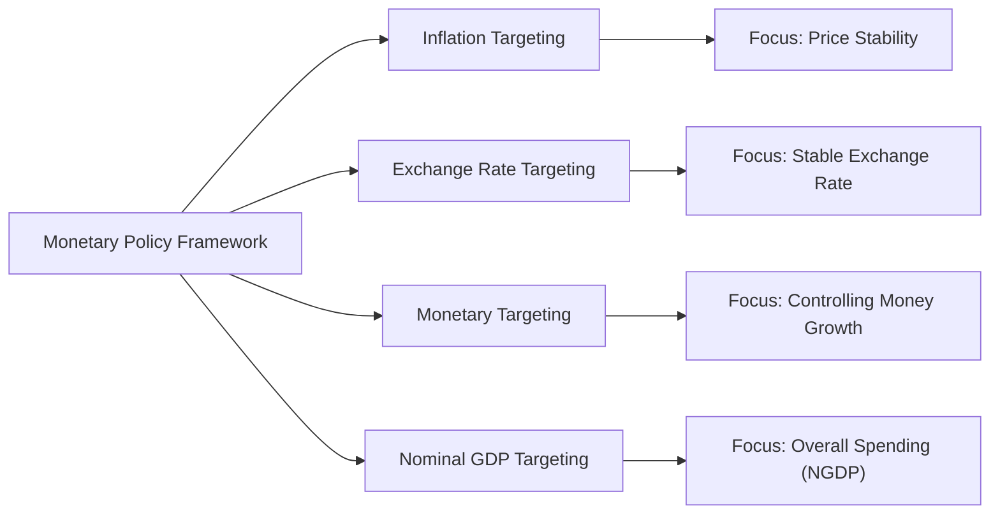

## Introduction and Overview

Inflation targeting is one of those topics I first encountered when I was casually reading about central banks years ago. You know how it goes—sometimes you stumble upon an article that mentions interest rates, and before you know it, you’re diving into complicated concepts like nominal anchors and forward guidance. Anyway, inflation targeting has profoundly shaped modern monetary policy frameworks around the world, and it remains at the heart of many economists’ discussions. 

In this section, we’ll talk about inflation targeting, why central banks often find it appealing, and how it compares to other regimes such as exchange rate targeting, monetary targeting, and nominal GDP targeting. We’ll also dip into the benefits, challenges, and crucial role of communication strategies for building central bank credibility.

Feel free to reference previous sections in this chapter if you need a refresher on the money supply process (Section 7.1) or the demand for money and the equation of exchange (Section 7.2). By the end, my hope is that you’ll not only grasp the mechanics of these policy regimes, but also appreciate the real-world intricacies of anchoring inflation expectations and responding to economic shocks.

## Inflation Targeting: Meaning and Mechanics

### Core Principles

Inflation targeting is a monetary policy framework where a central bank publicly announces an inflation rate goal (often something like 2% or 3% annually) and commits to steering actual inflation toward that target over time. Central banks often adopt this framework to provide clarity and predictability to markets, households, and businesses.

Why does this matter? Because inflation expectations can influence behavior across the entire economy. For instance, if firms believe inflation will be around 2% next year, they might set long-term wage contracts accordingly, while investors consider it when determining required returns. 

A key component in inflation targeting is the “nominal anchor,” which in this framework is the target inflation rate itself—serving as a reference point for the general price level and providing stability to the economic environment.

### Monetary Policy Tools to Achieve the Target

To keep inflation near the target, a central bank typically manipulates short-term interest rates (e.g., the policy rate such as the federal funds rate in the United States). But that’s just the tip of the iceberg. Central banks may also use:

• Open market operations (buying or selling government securities to affect the money supply).  
• Reserve requirements (though used less frequently in many developed countries).  
• Discount window lending.  
• Forward guidance (explicit communication of future policy intentions).  
• Unconventional quantitative easing measures (particularly when rates are near zero).  

For example, if inflation is running below target, the central bank might cut interest rates or purchase long-term securities to stimulate demand. Conversely, if inflation is rising too fast, the central bank will tighten policy by raising rates or reducing its balance sheet holdings.

### Transparency and Accountability

One hallmark of inflation targeting is transparency: the central bank frequently publishes inflation reports, provides economic projections, and offers clear statements on its policy decisions. This approach fosters accountability. If the central bank fails to meet its target, it must explain why and outline the corrective steps. 

I recall reading one of the Bank of England’s quarterly inflation reports: so many charts, forecasts, and justifications for its current stance. It really hammered home that people in the U.K. expect the central bank to keep that inflation figure in check—and if not, they demand explanations.

### Benefits of Inflation Targeting

• Anchoring Inflation Expectations: When people trust the central bank to deliver on its inflation promise, wage- and price-setting behavior becomes more stable.  
• Policy Clarity: Both markets and the public know the central bank’s goal and can plan accordingly.  
• Reduced Inflation Variability: Consistent success at targeting can lower the volatility of inflation over time.  
• Credibility and Lower Risk Premia: Transparent and rule-based policies can lead to lower inflation risk premia in bond markets.

### Challenges and Criticisms

• Lagged Effects: Monetary policy can take several months or even years to fully impact economic activity. If you’re only targeting inflation, you may overlook asset bubbles or other systemic risks.  
• Potential Narrow Focus: Central banks might ignore broader goals such as financial stability or full employment if they concentrate narrowly on inflation.  
• Data Quality: Reliable inflation data and timely indicators are crucial. Emerging markets and developing economies might find these data constraints more challenging.  
• Communication Dilemmas: Adjusting the target or missing the target for too long can undermine central bank credibility.

## Other Monetary Policy Regimes

While inflation targeting is popular, it’s not the only game in town. Many central banks historically relied on other anchors or frameworks. Let’s explore the main alternatives:

### Exchange Rate Targeting

Under exchange rate targeting (also known as a fixed or pegged exchange rate regime), a country pegs its currency to another country’s currency (like the U.S. dollar) or to a basket of currencies. This approach offers a clear nominal anchor: the exchange rate itself. 

• Advantage: Simplicity. It mentally translates to “We will keep our currency at, say, 7.8 units per U.S. dollar.” It also helps manage inflation if the anchor currency has low inflation.  
• Disadvantage: The country gives up an independent monetary policy. If the anchor currency’s central bank raises rates, your domestic interest rates must typically follow to maintain the peg.  

Some small, open economies favor this regime to reduce exchange rate volatility, especially if trade is heavily dependent on the anchor country. However, it can be risky if there is a speculative attack on the currency or if the anchor currency’s economic conditions diverge significantly from yours.

### Monetary Targeting

Monetary targeting involves setting a growth rate target for a monetary aggregate—like M1 or M2—and using that as your guide for policy decisions. 

Imagine announcing: “We’ll try to keep annual M2 growth at 5%.” The underlying theory (rooted in monetarism) suggests that controlling money supply growth stabilizes inflation over the long run, often referencing the equation of exchange:


\displaystyle M \cdot V = P \cdot Y


where \\( M \\) is the money supply, \\( V \\) is velocity, \\( P \\) is the price level, and \\( Y \\) is real output. If velocity \\( V \\) is relatively stable, changes in \\( M \\) are strongly correlated with changes in the nominal side of the economy (\\( P \cdot Y \\)).

• Advantage: Simple in theory, especially when velocity is stable.  
• Disadvantage: Velocity can shift due to financial innovation, changes in payment habits, or demographic shifts. That can undermine the reliability of a fixed monetary growth rule.  

Monetary targeting was quite fashionable in the late 1970s and early 1980s—particularly among central banks like the Bundesbank. But as financial markets grew more complex, stable velocity became less predictable, making pure monetary targeting frameworks less common.

### Nominal GDP Targeting

Nominal GDP targeting sets a target for the growth rate (or level) of nominal GDP, i.e., real GDP times the price level. In essence, the central bank tries to keep the economy’s total spending on track. For instance, the central bank might aim for a 5% annual growth in nominal GDP—which could be 2% real growth plus 3% inflation, or 3% real growth plus 2% inflation, etc.

• Potential Advantage: It balances both output and price stability. If real growth slows, the central bank might allow slightly higher inflation to remain on the nominal GDP path.  
• Potential Disadvantage: Complexity in communicating the target. People don’t always focus on nominal GDP figures the way they do on inflation or the exchange rate. And measuring real-time GDP accurately can lag or be revised significantly.

A few economists—most famously Bennett McCallum and Scott Sumner—have championed the idea. Some argue that nominal GDP targeting could be especially useful during demand shocks, but less so for supply shocks or when inflation deviates due to external energy prices or exchange rate movements.

## Communication and Credibility

### Central Bank Communication Strategies

Regardless of the monetary policy regime, communication plays a pivotal role in shaping market expectations and maintaining credibility. A central bank that effectively, clearly, and consistently explains its goals—through regular reports, press releases, speeches, or press conferences—is less likely to be misunderstood by the markets. 

Under inflation targeting regimes, the communication is often formalized in an “Inflation Report” or “Monetary Policy Report,” released on a schedule (like quarterly). With exchange rate targeting, the central bank must reaffirm its commitment to the peg. With monetary or nominal GDP targets, clarity is needed on exactly why the central bank sets a specific target and how it intends to adjust policy if the target is missed.

### Why Credibility Matters

Credibility is central to policy effectiveness. If people believe the central bank will do “whatever it takes” to keep inflation near 2%, they will behave in ways that make that goal easier to realize. Long-term contracts, labor negotiations, and investment decisions all reflect inflation expectations. Conversely, if a central bank has a reputation for missing its targets, or for frequently changing the policy regime, the public is less likely to respond to official announcements, and inflation may become volatile.

Here’s a small personal example: A few years ago, I opened a small business in a country with a credible inflation-target regime. We didn’t even bother factoring high inflation in our cost estimates because we trusted the central bank’s track record. That mental shortcut would have been a gamble in a place with unpredictable inflation or a history of currency devaluations.

## Putting It All Together: Policy Trade-Offs

Each regime has strengths and weaknesses. The choice often depends on the economy’s structure, the degree of financial market development, the independence of the central bank, and political preferences. Emerging markets sometimes struggle with inflation targeting if they lack the institutional capacity for accurate inflation measurement or if they face volatile capital flows, pushing them to consider exchange rate pegs. Advanced economies with deep capital markets and robust reporting systems often lean toward inflation targeting, partly because it’s transparent, flexible, and has a strong track record.

Below is a conceptual diagram illustrating how different regimes fit into the broader framework of monetary policy choices:

In practice, a central bank may blend features: inflation targeting plus an informal exchange rate band, or an inflation goal alongside a broad money growth reference. The real world is rarely neat and tidy.

## Policy Implications for Financial Analysts

For CFA candidates and finance professionals alike, understanding the central bank’s monetary policy regime is critical. The regime heavily influences:

• Interest rate curves (and thus discount rates for valuation).  
• Currency risk and exchange rate forecasting.  
• Inflation hedging strategies (such as using inflation-linked bonds or derivatives).  
• The economic scenario assumptions in equity or fixed-income models.

When analyzing investment opportunities, you’ll want to consider how the central bank’s policy stance might affect interest rates, bond yields, equity risk premiums, and foreign exchange risk. For instance, if the central bank is fully committed to an exchange rate peg, be alert to the risk of a sudden devaluation if the peg becomes unsustainable. If a central bank is pursuing a strict inflation target, watch inflation indicators or statements from the monetary policy committee to gauge how likely it is that rates will rise.

## Common Pitfalls and Exam Tips

• Over-Simplifying Policy Transmission: Remember, changes in interest rates filter through to the real economy with lags. Realize that inflation can respond slowly.  
• Ignoring External Shocks: Oil price spikes, global financial crises, and other external factors can challenge the best-designed policy regime.  
• Confusing Policy Goals with Tools: Distinguish between the “target” (such as inflation) and the “instruments” (interest rates, open market operations).  
• Underestimating Communication: On the Level I exam, you might see scenarios where the central bank’s credibility is in question. Communication strategies often figure into the bank’s success.  

It’s also essential to pay attention to the real-world context. The exam might reference a scenario in which an emerging market transitions from exchange rate targeting to inflation targeting, or question how a sharp rise in velocity might undermine a monetary targeting regime. Approach these scenario-based questions systematically: identify the policy anchor, consider the pros and cons, and then analyze how unexpected events would affect that anchor and the broader economy.

## Concluding Thoughts

Inflation targeting remains the dominant monetary policy regime among developed economies, thanks to its transparency and relative effectiveness at stabilizing inflation expectations. But it’s far from a panacea. Central banks must balance multiple objectives, update their communication strategies regularly, and address financial stability concerns alongside pure inflation mandates. Exchange rate targeting, monetary targeting, and nominal GDP targeting each have their place in specific contexts. As with most economic policy tools, there’s no one-size-fits-all solution.

At the end of the day, the power of any monetary policy regime hinges on the trust and participation of economic agents—businesses, consumers, and investors. Build credibility, and the anchor holds. Lose it, and policy instruments begin to flail. Understanding these frameworks is crucial for anyone in finance because central bank policies directly shape the risk and return landscape of global investments.

## References and Further Reading

• Bernanke, B. S., & Mishkin, F. S. (1997). “Inflation Targeting: A New Framework for Monetary Policy?” Journal of Economic Perspectives.  
• Svensson, L. E. O. (1999). “Inflation Targeting as a Monetary Policy Rule.” Journal of Monetary Economics.  
• Bank of England. Inflation Reports (available on www.bankofengland.co.uk).  
• IMF. (Various). World Economic Outlook and Global Financial Stability Reports.

---

## Practice Questions on Inflation Targeting and Monetary Policy



### Which of the following best describes the core principle of inflation targeting?

- [ ] Maintaining a fixed exchange rate against a major currency.
- [ ] Ensuring a certain level of money supply growth every year.
- [x] Publicly announcing an inflation goal and using monetary policy to achieve it.
- [ ] Focusing exclusively on controlling nominal GDP growth.

> **Explanation:** Inflation targeting involves a publicly announced inflation rate as the main policy goal, combined with policy actions—typically interest rate adjustments—to keep inflation near that target.

### In an exchange rate targeting framework, what is the greatest drawback for the central bank?

- [ ] It fosters excessive transparency.
- [ ] Inflation tends to spiral out of control.
- [x] The central bank loses its ability to conduct an independent monetary policy.
- [ ] Velocity of money becomes extremely unstable.

> **Explanation:** Under a fixed exchange rate regime, the central bank must follow the policy stance of the anchor currency’s central bank to maintain the peg, sacrificing autonomy over domestic interest rates.

### Which of the following is a direct benefit of a well-communicated inflation-targeting regime?

- [x] It helps anchor inflation expectations among consumers and businesses.
- [ ] It guarantees higher real GDP growth.
- [ ] It completely eliminates the risk of asset-price bubbles.
- [ ] It removes all uncertainty about monetary policy lags.

> **Explanation:** Inflation targeting, especially if well-communicated, reduces uncertainty about future price levels, thus anchoring inflation expectations. It does not guarantee higher real growth or eliminate asset bubbles, nor does it negate policy lags.

### A central bank that sets a target growth rate for M2 is using what policy framework?

- [ ] Inflation targeting.
- [ ] Exchange rate targeting.
- [x] Monetary targeting.
- [ ] Nominal GDP targeting.

> **Explanation:** Monetary targeting involves targeting a monetary aggregate like M2. Inflation targeting uses an inflation rate target, while nominal GDP targeting aims for a specific expansion path of nominal GDP.

### Which statement most accurately depicts a challenge of nominal GDP targeting?

- [ ] It completely ignores the price stability objective.
- [ ] It usually requires the central bank to fix the money growth rate.
- [ ] It cannot account for supply and demand shocks at the same time.
- [x] It can be more difficult to communicate and measure in real time than inflation targeting.

> **Explanation:** Nominal GDP targeting can be harder to communicate and measure, especially because real-time GDP data is often revised or lagged, making it tougher to respond promptly compared to inflation targeting.

### Under inflation targeting, why is transparency considered a key feature?

- [x] Because the central bank regularly releases reports and forecasts to the public.
- [ ] Because the central bank keeps its operational targets confidential.
- [ ] Because it ties the currency to gold reserves.
- [ ] Because it outlaws open market operations.

> **Explanation:** Transparency in an inflation targeting regime involves publishing forecasts, explaining policy decisions, and committing to a clear inflation goal, which helps the public form stable expectations.

### If a central bank in a small open economy pegs its currency to the U.S. dollar, what immediate policy trade-off does it face?

- [ ] It gains full autonomy to set interest rates.
- [ ] It must target nominal GDP levels exclusively.
- [x] It effectively loses control over its domestic interest rate policy.
- [ ] It can no longer accumulate foreign exchange reserves.

> **Explanation:** By pegging its currency to the dollar, the central bank must adjust its monetary policy in line with the Federal Reserve, surrendering monetary policy independence in the process.

### How might monetary policy lags complicate inflation targeting endeavors?

- [ ] They ensure inflation reacts instantly to policy changes.
- [ ] They eliminate the need for public communication.
- [ ] They cause real-time GDP data to become more accurate.
- [x] They can delay the impact of policy actions, risking overshoot or undershoot of the inflation target.

> **Explanation:** Monetary policy operates with time lags due to the slow adjustment of prices, wages, and consumption decisions. This lag can create a risk that the central bank’s policies will affect the economy too late or too strongly.

### In a scenario where financial stability risks arise, what is a possible drawback of a strict inflation targeting regime?

- [x] The central bank might focus excessively on consumer price inflation, ignoring asset price bubbles.
- [ ] The regime automatically manages credit creation and lending standards.
- [ ] Financial stability remains unaffected by monetary policy.
- [ ] All macroeconomic variables are automatically optimized.

> **Explanation:** A narrowly focused inflation-targeting framework might overlook surging housing or equity markets, which can create instability despite stable consumer price inflation.

### True or False: A credible central bank can often lower the long-term risk premium in bond markets.

- [x] True
- [ ] False

> **Explanation:** When markets trust a central bank to contain inflation, they typically demand lower compensation for inflation risk, lowering the long-term risk premium on bonds.


