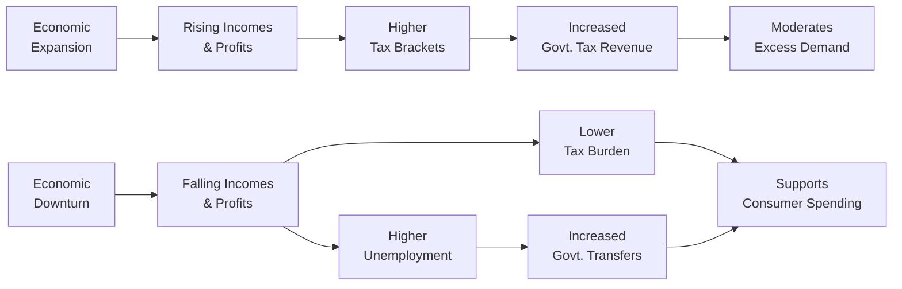

## Overview and Significance

Automatic stabilizers are among the most fascinating (and often underappreciated) components of fiscal policy. They spring into action whenever the business cycle peaks or troughs, gently nudging the economy back toward equilibrium—all without new laws or policy shifts. Often, people don’t even notice these “built-in shock absorbers” until they compare economies that have robust stabilizers to those that don’t. Sometimes, I’ll recall a conversation I once had with an economist friend who said, “Automatic stabilizers are like seatbelts in a fast-moving car: you barely notice them until you hit a bump.” In this section, we’ll break down the mechanics of automatic stabilizers, contrast them with discretionary fiscal policies, and examine the important (if somewhat daunting) role of government debt in financing them. Finally, we’ll discuss structural deficits and cyclical deficits, both of which shape the debate around the long-term sustainability of public finances.

## Defining Automatic Stabilizers

An automatic stabilizer is built right into the fiscal framework, ready to temper economic fluctuations without explicit intervention by lawmakers or government agencies. The most common forms include:

• Progressive Tax Systems: As income rises during economic booms, individuals and businesses move into higher tax brackets, automatically boosting tax revenue. In downturns, tax liabilities shrink because incomes fall or capital gains dry up, so households keep more of their (declining) income.  
• Government Transfer Programs: Programs such as unemployment benefits, welfare payments, and food assistance. When the economy weakens, more individuals qualify for these benefits; conversely, when the economy heats up, fewer people need them.

### Comparing Automatic Stabilizers with Discretionary Fiscal Policy

• Automatic Stabilizers: Kick in right away—no legislative action required. They smooth out downturns by providing a safety net and reduce overheating by sapping excess demand.  
• Discretionary Fiscal Policy: Involves deliberate changes to tax rates, government expenditures, or stimulus checks. This type of policy usually requires a legislative process or executive order. It aims to further amplify (or sometimes counter) what automatic stabilizers are already doing, but these measures often suffer lag times (legislative lags and operational lags).  

If you’ve read Section 7.5 on Implementation Lags in Monetary and Fiscal Policy, you know that the biggest challenge for discretionary measures is the time it takes to detect recessions, debate legislation, and then finally implement changes. Automatic stabilizers sidestep those lags because they’re an integral part of the fiscal structure from the start.

## How Automatic Stabilizers Smooth out the Business Cycle

In expansions, progressive income taxes effectively skim higher proportions of additional earnings, helping moderate aggregate demand. Similarly, fewer people qualify for unemployment benefits or food aid, so government spending on these transfers decreases.

In recessions, by contrast, tax burdens shrink as incomes decline, so households and businesses free up some disposable income. Government transfer payments, notably unemployment insurance, ramp up, offsetting at least part of the loss in household income. This cyclical pattern of reduced tax receipts and increased government payouts contributes to a stabilizing effect—automatically.

Below is a simplified diagram illustrating how automatic stabilizers respond to the business cycle:

As you can see, in expansions you have higher tax revenue, and in downturns you have stronger safety nets—both working to stabilize overall demand.

## Financing Stabilizers and the Role of Government Debt

### Government Deficits

When economic conditions are harsh, government revenues can decline sharply due to lower tax inflows; simultaneously, spending for transfer programs (like unemployment insurance) usually increases. The result often is a higher budget deficit—government spending exceeding tax revenues. Over time, persistent deficits accumulate into government debt.

That leads us to one of the biggest, scariest terms in the broader debate: sustainability of public finances. If deficits balloon every time the economy falters, can the government still borrow at favorable rates? Will markets demand a higher yield on bonds if debt-to-GDP shoots too high? Do rating agencies eventually slap on a downgrade?

### How High Debt Levels Affect Fiscal Flexibility

High levels of government debt can constrain future policy options. Imagine a scenario where a government has already borrowed heavily during past recessions. Suddenly, a new crisis strikes—maybe a financial meltdown or a pandemic—and the government wants to launch a massive stimulus program. In principle, that’s standard Keynesian practice. But the debt markets might perceive a risk that the government could struggle to service its existing debt plus new borrowing. That risk can pressure interest rates upward, making additional debt or stimulus expensive to finance—or politically controversial.

Moreover, investors might be reluctant to fund perpetual deficits if they sense the government lacks a credible plan to stabilize or reduce the debt over time. This concern is especially relevant in advanced countries where aging populations, pension obligations, and healthcare costs place additional strains on government budgets. For instance, if your country is paying higher interest on outstanding government bonds, the increased debt service crowds out other spending priorities—education, infrastructure, or further economic stimulus.

## Cyclical vs. Structural Deficits

The distinction between cyclical deficits and structural deficits is crucial for analyzing government finances:

• **Cyclical Deficit**: The portion of the deficit that appears (and hopefully disappears) as a result of the business cycle. When the economy is in a downturn, tax revenues fall, and transfer payments rise, creating or enlarging the deficit. During expansions, the cyclical deficit theoretically shrinks or vanishes.  
• **Structural Deficit**: A deficit that persists even when the economy is at—or near—full employment and potential output. In other words, it’s the baseline shortfall after adjusting for the state of the business cycle. A structural deficit indicates ongoing imbalances in tax and spending policies that generally point to deeper fiscal problems.

### Illustrating the Difference

Let’s do a quick numeric illustration. Suppose a government’s budget deficit is 5% of GDP in a recession. Economists estimate that 3% of GDP is attributable to the recession itself (i.e., lower tax receipts, higher automatic transfers). That 3% is the cyclical component. The remaining 2% persists because the government’s normal spending commitments exceed its tax revenues even at full employment. That 2% is the structural part.

Understanding this difference matters for investment decisions, interest rate forecasts, and even currency valuation. Markets pay close attention to structural deficits because they suggest the government, at best, is perpetually reliant on new borrowing or at risk of forcing dramatic changes in spending or taxation down the line.

## Risks and Constraints

### Crowding Out

High debt levels can potentially “crowd out” private investment if government borrowing soaks up the available pool of savings, driving up interest rates. For example, consider an economy seeking robust private-sector expansion. If the government’s bond issuance is large and competes with corporations for investors’ funds, the cost of capital for private firms may rise. Depending on your reading of economic theory (and other real-world frictions), that crowding-out effect can hinder long-term growth.

### Credit Ratings

A government that chronically runs high structural deficits may face ratings downgrades. Higher yields for government bonds translate to dearer borrowing costs for the entire economy. This domino effect can also weigh on currency values, inflation, and interest rates, all of which can hamper the success of additional stabilization measures.

## Practical Perspectives for CFA Candidates

From a portfolio management or asset allocation standpoint, it’s key to remember that large government debt and deficits often influence the interest rate environment—an essential factor in bond valuations and equity discount rates. For instance, if markets anticipate large deficits, they may price in future monetary tightening or crowding-out effects, which can pressure risk assets. Conversely, if the government has credible tools to reduce structural deficits, bond yields may stabilize or even decline, providing a supportive environment for risk-taking.

Keep in mind how automatic stabilizers can affect macroeconomic statistics, such as GDP growth rates, inflation, or the unemployment rate. When analyzing an economy’s outlook (see also Chapter 1: Economic Analysis and Setting Capital Market Expectations), factoring in cyclical deficits versus structural deficits can help you gauge whether a government’s finances might hamper future stimulus efforts.

## Best Practices and Common Pitfalls

• **Assess Long-Term Sustainability**: It’s not enough to note a government’s current budget deficit; you need to differentiate between cyclical and structural components.  
• **Watch the Debt-to-GDP Ratio**: Debt grows faster than GDP during severe recessions. If it remains high after a recovery, it can stifle policy response in the next downturn.  
• **Consider Investor Behavior**: Market participants are forward-looking. They may begin demanding higher interest rates well before a government’s finances reach a crisis point.  
• **Beware Political Constraints**: Automatic stabilizers are typically less controversial because they’re seen as built-in. However, discretionary stimulus can get bogged down in partisan disputes or may be mistimed.

## Quick Reflection

Well, we’ve all been there—reading the headlines about stimulus votes, government shutdowns, and heated debates on “ballooning deficits.” It’s easy to get lost in the drama. With automatic stabilizers, though, the system just does its thing in the background. There’s no need for a big vote (or political standoff). Yes, the government might run a deficit, but that’s a feature, not a bug, during a downturn. As long as those deficits don’t become structurally embedded (and excessive), automatic stabilizers effectively keep a floor under the economy.

## Conclusion and Exam Tips

Heading into the CFA exam, remember that automatic stabilizers minimize the amplitude of economic cycles without new legislation. Understanding their interaction with discretionary fiscal measures—and the debt constraints that influence policy options—will help you craft arguments in essay questions and respond to item sets requiring deeper economic insight. Practice parsing data to separate cyclical and structural deficits. That skill is invaluable for analyzing real-world economies and policy moves in the financial markets.

• **Exam Tip 1**: If you see a question referencing an “unemployment insurance program that adjusts automatically,” you’re talking about an automatic stabilizer.  
• **Exam Tip 2**: For item-set questions dealing with debt levels, watch for clues about how interest rates and government bond yields could shift market perceptions.  
• **Exam Tip 3**: Distinguish clearly between cyclical deficits (temporary) and structural deficits (long-term). If a question discusses full-employment deficits, you’re likely dealing with a structural scenario.

## References & Further Reading

- Auerbach, A. J., & Feenberg, D. (2000). “The Significance of Federal Taxes as Automatic Stabilizers.” Journal of Economic Perspectives.  
- OECD—Economic Outlook: https://www.oecd.org/economy/  

## Mastering Automatic Stabilizers & Government Debt: 10 Practice Questions



### 1. Which of the following best describes an automatic stabilizer in fiscal policy?

- [ ] A tax or spending policy that requires new legislation to be implemented.  
- [ ] A central bank measure that affects interest rates.  
- [x] A pre-existing tax or spending feature that naturally responds to changes in economic activity.  
- [ ] An arrangement where the government directly fixes wage levels in the economy.  

> **Explanation:** Automatic stabilizers are built-in fiscal mechanisms—like progressive tax systems or unemployment benefits—that adjust naturally, thus moderating fluctuations without further legislative action.

### 2. Which of these is an example of an automatic stabilizer?

- [ ] A government-funded infrastructure stimulus package announced by parliament.  
- [ ] A one-time rebate check offered to households.  
- [x] A progressive income tax system that collects higher marginal tax rates as income rises.  
- [ ] A sudden cut in the central bank’s policy rate.  

> **Explanation:** Progressive taxes operate automatically as incomes change, increasing tax revenue in booms and reducing it in recessions without new policy decisions.

### 3. What is the defining factor that distinguishes automatic stabilizers from discretionary fiscal policy?

- [ ] The central bank designs and implements automatic stabilizers.  
- [x] Automatic stabilizers do not require legislative or executive approval to function.  
- [ ] Automatic stabilizers operate only during recessions.  
- [ ] Discretionary fiscal policy does not impact the budget deficit.  

> **Explanation:** Automatic stabilizers respond immediately to changing economic conditions. In contrast, discretionary policies require explicit government actions such as passing a law.

### 4. A “cyclical deficit” is one that:

- [ ] Arises due purely to structural imbalances at full employment.  
- [x] Occurs primarily because of economic downturns or recessions.  
- [ ] Persists even when the economy is operating at potential output.  
- [ ] Is unaffected by the business cycle.  

> **Explanation:** Cyclical deficits are associated with economic weakness (e.g., lower tax revenues, higher transfer payments). They decrease or disappear as the economy recovers.

### 5. A structural deficit is best described as:

- [ ] A deficit that occurs only when the unemployment rate exceeds the natural rate.  
- [x] A deficit present even when the economy operates at its potential output.  
- [ ] A budget surplus that artificially inflates government revenues.  
- [ ] A deficit that arises from strictly one-time policy decisions.  

> **Explanation:** Structural deficits remain in place even after cyclical factors are accounted for, indicating deeper fiscal imbalances.

### 6. High levels of government debt might constrain a government’s ability to conduct fiscal stimulus because:

- [x] Investors may demand higher bond yields, increasing the cost of borrowing.  
- [ ] Central banks are required to lower interest rates to boost borrowing.  
- [ ] Automatic stabilizers no longer function when debt is high.  
- [ ] Transfer payments automatically decline.  

> **Explanation:** When debt levels are high, the market can demand higher yields on new issuances, making future fiscal expansions more expensive or politically challenging.

### 7. Which of the following is a potential advantage of automatic stabilizers over discretionary fiscal policies?

- [x] No time-consuming legislative process is required.  
- [ ] They are more effective at boosting GDP in recessions.  
- [x] They are more politically popular, as they avoid new debates.  
- [ ] They are fully immune to changes in economic conditions.  

> **Explanation:** Automatic stabilizers kick in immediately and without political wrangling, which can make them both faster and less controversial in many cases.

### 8. Which statement correctly explains a risk associated with large structural deficits?

- [ ] They reduce currency volatility by stabilizing exchange rates.  
- [ ] They eliminate the need for monetary policy intervention in recessions.  
- [x] They may limit the government’s ability to finance new deficits in future recessions.  
- [ ] They strengthen automatic stabilizers, making them more effective.  

> **Explanation:** Structural deficits add to a country’s debt burden and may constrain the government’s flexibility to respond to future economic downturns.

### 9. In terms of automatic stabilizers, how do progressive taxes generally help modulate the business cycle?

- [x] They collect proportionally more revenue when incomes rise, reducing disposable income and moderating demand.  
- [ ] They only affect low-income households, leaving the business cycle unaffected.  
- [ ] They are applied at higher rates during recessions, incentivizing spending reductions.  
- [ ] They remain constant regardless of income levels.  

> **Explanation:** Progressive income taxes mean that in economic expansions, more income is taxed at higher rates, helping cool excess demand. In recessions, tax liabilities decrease automatically.

### 10. True or False: Automatic stabilizers require significant policy debate each time a recession begins.

- [ ] True  
- [x] False  

> **Explanation:** By design, automatic stabilizers function without new legislative action. They operate based on existing fiscal frameworks, easing or amplifying deficits as the economy cycles.


