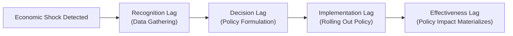
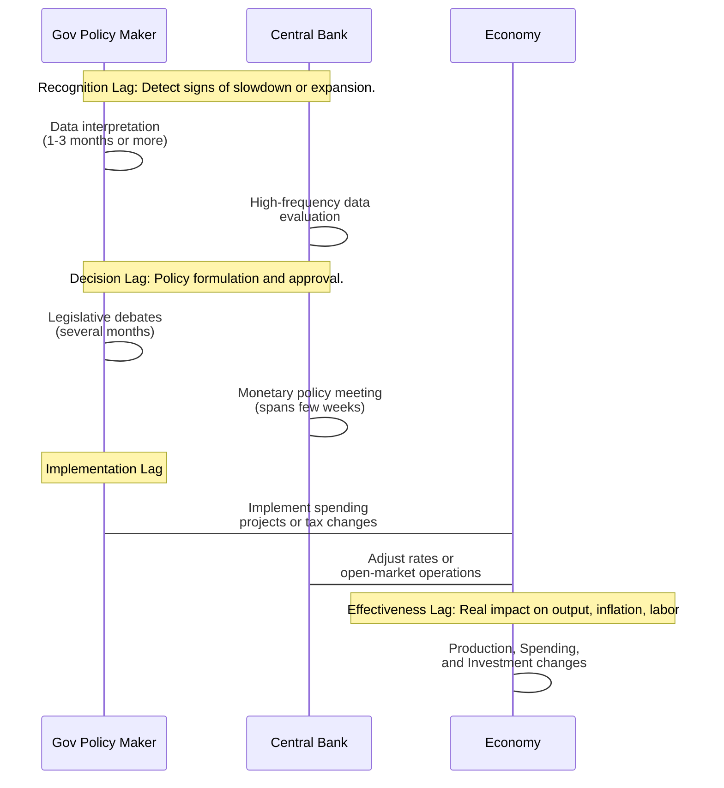

## Overview and Context

Implementation lags in monetary and fiscal policy rank among the most important—and often frustrating—phenomena for policymakers, economists, and investors. Across economic cycles, policy shifts seldom produce immediate impacts. Instead, changes in interest rates, tax levels, or government spending can take months or even years to show discernible results. For CFA candidates, understanding how these lags unfold deepens your grasp of macroeconomic forecasting, scenario analysis, and ultimately, rational portfolio construction.

In earlier sections of Chapter 7, we explored how fiscal authorities (government bodies) and monetary authorities (central banks) design and apply policy tools. This section extends that discussion by dissecting why policy measures take so long to become effective, the consequences of these delays for the economy, and how to integrate this knowledge into your investment strategies—particularly for multi-asset portfolio decisions.

## The Nature of Policy Lags

A policy lag is simply the time interval between recognizing an economic issue (such as rising unemployment) and the point when remedial policies meaningfully influence economic behavior (e.g., stimulating job creation). These lags can lead to policy misalignment, where corrective actions might be applied too late, too early, or with the wrong magnitude—ultimately increasing the risk of macroeconomic volatility.

Policy lags are commonly grouped into four categories:

• Recognition lag  
• Decision (legislative or administrative) lag  
• Implementation lag  
• Effectiveness lag  

Although these lags often overlap, identifying them separately helps policymakers manage expectations and consider how to minimize disruptions.

## Recognition Lag

The recognition lag describes the distance in time between when an economic trend or shock begins and when policymakers become sufficiently aware of it. Economic data arrive with a delay, and once published, they are subject to revisions. Consequently, it can take months before central banks or fiscal authorities identify that a downturn or an overheat is underway. 

Within the context of Chapter 3 (Business Cycles), we saw that certain indicators—like leading economic indicators (Section 3.6) or real-time labor market data (Section 3.12)—aim to shorten this recognition lag. Nonetheless, the inherent delays in data reporting and the volatility in high-frequency data remain major obstacles.

## Decision (Legislative or Administrative) Lag

The decision lag (often called the legislative lag in fiscal policy contexts) is the period required to formulate and pass a policy response. For monetary authorities, the time to decide on an interest-rate change or to introduce a liquidity program can be relatively short, especially if the central bank has a coherent governance structure and sets regular policy meeting schedules. However, for fiscal authorities, the legislative process can be lengthy and politically constrained, involving multiple committees, votes, and potential amendments. 

• Monetary policy example: A central bank’s policy committee (like the Federal Open Market Committee in the United States) generally meets on a regular schedule, so it may respond to new data within a matter of weeks.  
• Fiscal policy example: Designing a government spending package, adjusting tax codes, or launching a new infrastructure project often requires extensive debate and negotiation, contributing to a more substantial decision lag.

## Implementation Lag

Even after authorities decide on the most appropriate policy course, enacting measures on the ground can take considerable time:

• Monetary tools often exhibit short implementation lags: once a central bank decides on open market operations or interest-rate adjustments, these changes can be instituted virtually overnight.  
• Fiscal tools can face longer implementation lags: for example, even after legislatures pass an infrastructure bill, the practical steps—securing contractors, finalizing project designs, distributing grants to state governments—can take months or longer before any spending flows through the economy.

In certain scenarios, the speed of fiscal deployment can be accelerated (e.g., one-time tax rebates). However, large-scale projects or institutional reforms (like setting up new oversight agencies) typically require extended timelines, exacerbating the implementation lag.

Below is a high-level timeline illustrating the interplay of these lags:

## Effectiveness Lag

The effectiveness lag represents the interval between policy introduction and when it fully influences economic output, employment, or inflation. The principal cause of this lag is behavioral:

• Businesses require time to adjust investment decisions based on new interest rates or tax incentives.  
• Consumers might postpone spending until they feel confident in the stability of newly enacted measures.  
• Financial markets may bake in new expectations about future policy paths, impacting exchange rates, equity valuations, and bonds.

Monetary authorities often note that changing policy rates influences financing conditions swiftly, but it can take two or more quarters for credit growth, consumer spending, and investment decisions to reflect the new environment comprehensively. In the context of Chapter 6 (Currency Exchange Rates), an interest-rate cut might depreciate a currency in the forward market within hours or days, but the effect on net exports and real economic activity typically unfolds over a longer horizon.

## Comparing Monetary and Fiscal Policy Lags

### Monetary Policy Lags

• Recognition Lag: Central banks often benefit from high-frequency market data and refined forecasting tools, but they still encounter substantial uncertainty about real-time economic conditions.  
• Decision Lag: Typically shorter—monetary policy committees convene frequently, and governors possess discretionary power to act promptly in times of crisis.  
• Implementation Lag: Usually minimal once a rate decision is made or a new liquidity operation is announced.  
• Effectiveness Lag: Can be significant. Shifts in interest rates may take many months to impact the real economy. Credit channels require time to process new conditions, and the public may initially be skeptical about policy changes.

### Fiscal Policy Lags

• Recognition Lag: Similar to that of monetary authorities, albeit governments can sometimes be slower to gather consensus on the data’s implications.  
• Decision (Legislative) Lag: Often lengthy. Multiple political stakeholders must align to pass fiscal measures, especially in large or diverse legislatures.  
• Implementation Lag: Depending on the program or spending initiative, it can be extensive. Building infrastructure, for instance, can stretch out for several years.  
• Effectiveness Lag: Once the fiscal spending or tax cut is in effect, the real economy may react relatively quickly, but the full multiplier effect sometimes emerges over more than one budget cycle.

## Potential Consequences of Policy Lags

### Risk of Overshooting

One major challenge is the possibility of overshooting or undershooting the policy objective if the economic environment has already changed by the time the policy takes effect. For instance:

• If the economy starts to recover naturally from a recession while fiscal stimulus is still in the legislative pipeline, it may arrive when growth is already picking up. This can risk fueling inflation more than intended.  
• Alternatively, if central banks overestimate inflation risk, they might tighten monetary policy just as an unexpected global slowdown hits, inadvertently stifling growth.

### Policy Misalignment

In practice, policy misalignment can occur not only between intended outcomes and actual economic trends but also between fiscal and monetary authorities themselves. As discussed in Section 7.9 (Interactions between Monetary and Fiscal Policy), conflicting macroeconomic objectives or political motives can further complicate synchronization, exacerbating the detrimental effects of lags.

### Market Uncertainty and Volatility

Financial markets attempt to price in expectations of future policy moves. When lags introduce uncertainty over timing and magnitude, asset prices can experience whipsaw movements. For example, if investors anticipate a fiscal boost that is delayed or diluted, equities that initially rallied on expected stimulus might correct sharply once they realize the actual spending will be smaller or slower than hoped.

## Practical Case Studies and Examples

1. The Great Financial Crisis (2008–2009):  
   • Monetary Lag: Central banks, notably the Federal Reserve, slashed interest rates rapidly. However, accompanying quantitative easing programs took several months to roll out and even longer to influence credit dynamics.  
   • Fiscal Lag: Legislators enacted the American Recovery and Reinvestment Act in early 2009, but disbursal of funds for infrastructure projects and tax benefits took more time to filter into the broader economy.

2. Global Pandemic-Related Recession (2020):  
   • Monetary Lag: Many central banks quickly cut policy rates or launched emergency facilities. Yet the full benefits (e.g., ensuring credit access to businesses) materialized over subsequent quarters.  
   • Fiscal Lag: Governments introduced relief packages. Some one-time payments to households had fairly short implementation lags, but major support for programs like small-business loans and unemployment benefits faced approval and logistical hurdles.

## Implications for Portfolio Management

From a Level I perspective, you might focus on the macro fundamentals: how delayed policy effects alter the business cycle outlook, interest rate expectations, or inflationary trends. At a more advanced (Level III) stage, you would integrate policy-lag considerations with multi-asset strategies:

• Tactical Asset Allocation: Anticipating relatively slow legislative processes can shape your position in cyclical or defensive equity sectors. You might expect infrastructure companies to see delayed but eventually strong demand if a large government spending bill is pending.  
• Fixed Income Strategy: When the central bank announces an abrupt rate cut, the market reaction may be nearly instantaneous for short-term treasuries. However, you can see a slower normalizing effect in corporate yields, impacting credit spreads. Recognizing the lag here is crucial in yield-curve positioning.  
• Currency Hedging: Quick policy decisions often shift currency values rapidly, but export competitiveness might shift only over subsequent quarters. Managing FX exposure thus requires an understanding of both immediate market reactions and eventual real-sector conditions.  

## Managing the Challenges of Policy Lags

### Early Warning Indicators

Reviewing an array of indicators (leading, coincident, and lagging) can help reduce the recognition lag. As discussed in Section 3.6, leading indicators—like stock-market performance or changes in building permits—offer hints about near-future movements, mitigating risks of late policy interventions.

### Policy Coordination

Close coordination between fiscal and monetary authorities may temper the negative impact of lags. If, for example, a central bank signals that it is about to tighten monetary policy, the fiscal side can prepare complementary actions (e.g., altering borrowing requirements or adjusting government spending priorities) to keep the broader policy stance consistent.

### Stabilization Tools and Automatic Stabilizers

Automatic stabilizers—like unemployment insurance or progressive tax systems—can partially circumvent legislative lags. Because they go into effect as soon as income declines or unemployment rises, they help moderate downturns without preapproval from lawmakers in each cycle.

### Communication Strategies

Central banks often rely on forward guidance to shape market expectations. By clearly communicating the expected path of policy rates, central banks attempt to reduce uncertainty, compress risk premiums, and accelerate the transmission mechanism of monetary policy. However, forward guidance is not a panacea—it too can be subject to reevaluation if macro data deviate from forecasts.

## Mermaid Illustration of Lag Accumulation

Below is another illustration focusing on how each lag can accumulate and potentially push policy action out of alignment with prevailing economic conditions:

## Common Pitfalls and Challenges

• Underestimating Data Delays: Policymakers and investors sometimes place undue confidence in the latest data release, forgetting it may be revised.  
• Overreliance on One Indicator: A single piece of data—like headline unemployment—may not give a complete picture of economic momentum.  
• Political Disagreements: Prolonged legislative haggling can extend the decision lag to the point that a different macro condition emerges by the time an agreement is reached.  
• Reactionary, Not Proactive, Policies: By the time policy changes occur, the underlying economic trend might have reversed.  

## Exam Tips and Key Takeaways

1. Be precise in defining each lag. On the CFA exam, you might be asked to identify which type of lag is primarily associated with fiscal policy or how an effectiveness lag differs from an implementation lag. 
2. Connect these lags to real-world policy scenarios. Essay or item-set questions may present a scenario where a central bank lowers rates at the onset of a recession, and you need to assess how quickly that policy shift will filter through the economy. 
3. Differentiate between short- and long-run effects. In short-run contexts, monetary policy often moves faster, but in the long run, significant changes in taxes or spending can overshadow moderate rate adjustments. 
4. Think critically about misalignment. A question might describe a period of economic turbulence, highlighting that by the time policymakers intervene, the economy has begun a natural recovery. You could be asked to evaluate the consequences of such a timing mismatch.  

## References and Further Reading

• Blinder, A. S. (2004). “The Quiet Revolution: Central Banking Goes Modern.” Yale University Press.  
• Romer, D. (2000). “Keynesian Macroeconomics without the LM Curve.” Journal of Economic Perspectives.  
• Chapter 3 of this volume for business cycle metrics.  
• Chapter 6 for exchange rate dynamics and how monetary policy shifts can affect currency valuations.  
• Chapter 7, Sections 7.1 and 7.2 for foundational knowledge on money supply and central banking frameworks.

---

## Test Your Knowledge: Policy Lags and Their Impacts



### Which type of lag refers to the time it takes policymakers to recognize that the economy has shifted?

- [x] Recognition lag
- [ ] Decision lag
- [ ] Implementation lag
- [ ] Effectiveness lag

> **Explanation:** The recognition lag is the delay before policymakers identify that economic conditions have changed, primarily due to data collection and revision processes.

### Which of the following is most associated with a long legislative process and political debate?

- [ ] Recognition lag
- [x] Decision lag
- [ ] Implementation lag
- [ ] Effectiveness lag

> **Explanation:** The decision (legislative) lag reflects the time spent formulating and approving policy measures, which is especially long in the fiscal domain.

### When a central bank lowers interest rates, but it takes several quarters before consumer spending and business investment respond, this period refers to:

- [ ] Recognition lag
- [ ] Decision lag
- [ ] Implementation lag
- [x] Effectiveness lag

> **Explanation:** The effectiveness lag is the interval between when a policy is enacted (rate cut) and when it significantly influences economic behavior.

### Which policy generally has the shortest overall decision lag?

- [x] Monetary policy
- [ ] Expansionary fiscal policy
- [ ] Automatic stabilizers
- [ ] Discretionary fiscal policy

> **Explanation:** Central banks typically can convene policy committees regularly and enact changes swiftly, whereas fiscal policy changes often require extensive legislative approval.

### What is the primary difference in effectiveness lags between monetary and fiscal policy?

- [x] Monetary policy's transmission to the real economy can be lengthy, but once interest rates are changed, the implementation is quick. Fiscal effectiveness might be more direct but follows a slower decision and implementation phase.
- [ ] Fiscal policy always has a shorter effectiveness lag than monetary policy.
- [ ] Fiscal policy decisions can be taken more quickly, leading to minimal effectiveness lag.
- [ ] Monetary policy has no implementation lag at all.

> **Explanation:** Once monetary decisions are made, market interest rates adjust quickly, but the real economy may take time to respond. Fiscal policy, meanwhile, can directly inject or withdraw funds from the economy, yet legislative and implementation hurdles delay when it finally takes effect.

### Which type of lag best explains the scenario where a government decides to build a new high-speed rail, but actual construction and job creation do not begin for many months?

- [ ] Recognition lag
- [x] Implementation lag
- [ ] Decision lag
- [ ] Effectiveness lag

> **Explanation:** Even after the decision is made, the actual process of rolling out infrastructure (project approvals, contracts, etc.) can introduce an implementation lag.

### Which of the following scenarios best illustrates a risk of policy overshooting?

- [x] Fiscal stimulus passed late in a recession, arriving when the economy is already recovering.
- [ ] A central bank raising interest rates in response to immediate inflation.
- [x] A central bank cutting rates when the currency is already strengthening due to strong exports.
- [ ] Lowering taxes during an economic boom.

> **Explanation:** If the stimulus arrives after the economy naturally recovers, it can push demand beyond capacity, risking inflation. Similarly, cutting rates when a currency is strong could fuel a larger than intended expansion in domestic credit.

### How do automatic stabilizers mitigate the decision lag?

- [x] They activate instantly based on existing law, requiring no additional legislative steps.
- [ ] They accelerate legislative approval.
- [ ] They prolong the implementation lag.
- [ ] They eliminate the need for monetary policy.

> **Explanation:** Features like unemployment insurance are already on the books; they respond quickly to changing economic conditions without extra approval.

### Which factor generally contributes to a shorter monetary policy decision lag compared to fiscal decisions?

- [x] Central banks hold regular meetings and have concentrated decision-making authority.
- [ ] Monetary policy relies on multi-layer legislative approvals.
- [ ] Fiscal policy is constitutionally mandated to move faster.
- [ ] Recognition lag is simpler for governments than central banks.

> **Explanation:** Central banks typically have streamlined internal committees and predefined meeting schedules, whereas fiscal policy requires negotiations across broader legislative bodies.

### True or False: Effectiveness lags can cause even the most well-timed policy to have an impact that arrives too late to prevent a downturn.

- [x] True
- [ ] False

> **Explanation:** Despite careful timing, the real economy might take so long to respond that conditions have already deteriorated or shifted significantly by the time the policy starts to show results.


