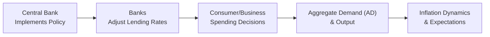

## Overview

Central banks have a unique responsibility: guiding the economy by adjusting the cost and availability of money and credit. When economists talk about “monetary policy,” they usually mean how a central bank (like the Federal Reserve in the United States, the European Central Bank in the Eurozone, or the Bank of England in the UK) influences interest rates and liquidity in the financial system. After all, these factors trickle through to consumer spending, business investment, exchange rates, and innumerable other economic variables.

We’ll dig into the main instruments that central banks use to implement monetary policy—open market operations (OMOs), policy rates, and reserve requirements. We’ll also see how these tools actually work in practice: from changes in short-term interest rates all the way to how they affect inflation and output. And, since you might have heard of it quite a bit since the global financial crisis, we’ll also discuss forward guidance and its role in shaping market sentiment.

One anecdote before diving in: during a seminar I attended, a seasoned economist joked that using monetary policy is like “steering a massive cargo ship through thick fog—reaction times are slow, and visibility is limited.” That’s precisely why understanding the transmission mechanism matters: a small turn of the wheel today (say, lowering policy rates by 25 basis points) can have a big impact months or even years down the line. Let’s see how these tools and mechanisms come together.

## Major Monetary Policy Tools

### Open Market Operations (OMOs)

Open Market Operations (OMOs) involve a central bank buying or selling government securities—such as Treasury bills or government bonds—to influence the level of reserves that commercial banks hold.

• When a central bank buys government securities from banks, it pays them (usually with newly created electronic reserves). The banks then have extra reserves to lend, which tends to push interest rates down, stimulating credit creation and, by extension, the broader economy.  
• Conversely, when a central bank sells government securities to the market, it removes reserves from the banking system. This action can put upward pressure on short-term interest rates and temper credit expansion.

In the United States, the Federal Reserve sets target ranges for its federal funds rate and then uses OMOs to guide the actual market rate toward the target. In other words, it fine-tunes supply and demand for reserves, so the actual interest rate that banks charge each other for overnight loans stays near the intended policy rate.

From a global standpoint, mechanisms differ slightly. The European Central Bank (ECB) conducts regular “Main Refinancing Operations,” while the Bank of Japan carries out its own bond-buying programs. Regardless of the specific label, the principle is the same: changing the liquidity in the banking system influences interest rates and shapes credit conditions.

### Policy Rates (Discount Rate, Base Rate, Fed Funds Rate)

Policy rates are the cornerstone of monetary policy. You might hear differing names—discount rate, base rate, repurchase (repo) rate, or federal funds rate—depending on the jurisdiction. In essence, these terms refer to the interest rate that central banks set or heavily influence to anchor short-term borrowing costs.

• In the United States, the Federal Reserve influences the “federal funds rate”—the rate at which commercial banks lend to one another overnight.  
• The Fed also sets a “discount rate,” which is the rate banks pay to borrow short-term funds directly from the Federal Reserve’s “discount window.”  
• The Bank of England uses the “Bank Rate” to signal monetary policy stance, influencing interbank lending rates.  
• The European Central Bank references the “refinancing rate,” which shapes the interest costs that banks incur when borrowing from the ECB.

When the policy rate goes up, banks and other lenders raise the rates they charge businesses and consumers. That higher cost of borrowing can reduce demand for credit and cool off an overheating economy. In contrast, lowering the policy rate encourages more borrowing and spending, spurring growth.

### Reserve Requirements

Reserve requirements dictate the fraction of deposits that banks must keep on hand—either in their vaults or at the central bank. A higher reserve requirement means banks can lend a smaller proportion of each deposit, effectively tightening credit creation. A lower reserve requirement does the opposite, freeing banks to lend more.

Consider the baseline money multiplier relationship:
  

m = \frac{1}{r}


Where:  
• m is the theoretical money multiplier,  
• r is the required reserve ratio (expressed as a decimal).

If r = 10\%, for instance, a \$1 deposit could support up to \$10 in total money supply (in theory). Lowering the reserve ratio to 5\% would push that multiplier to 20 (again, theoretically). In practice, banks hold additional reserves for safety, and other factors can dampen these multipliers. Still, it’s a robust conceptual lens: raising or lowering reserve requirements affects how easily commercial banks can create money through lending.

Bear in mind, though, not all countries use reserve requirements aggressively. Some central banks (e.g., the Bank of Canada) rely more on market-based tools (like interest targeting) and do not impose strict reserve requirements. The United Kingdom effectively abolished formal reserve requirements in 1981, though it still has liquidity and capital regulations to ensure stability.

### Additional & Evolving Tools

While the three tools above are the classic triad, central banks also have other instruments at their disposal:

• Interest on Excess Reserves (IOER): The Federal Reserve pays interest on the reserves banks hold at the Fed. By adjusting this rate, the Fed can shape how attractive it is for banks to keep funds in reserve versus lending them out.  
• Term Auction Facilities: During liquidity crises, central banks might introduce special lending programs or auction-based mechanisms to ensure banks can access dependable credit.  
• Quantitative Easing (QE) or Large-Scale Asset Purchases: Though not a day-to-day tool, QE involves buying massive quantities of longer-term securities (government bonds, mortgage-backed securities) to push long-term interest rates lower when short-term rates are near zero.

## Monetary Policy Transmission Mechanisms

Once the central bank pulls these policy levers, how do they ripple through the economy? The “transmission mechanism” describes the chain of events—from the initial tool (like an OMO) to the final effect on output, employment, inflation, and even the exchange rate. The path isn’t always straightforward, but it’s typically broken down into a few key channels.

### The Interest Rate Channel

One of the most direct routes is the interest rate channel. When the central bank lowers short-term policy rates:  
1. Banks can borrow funds more cheaply.  
2. They reduce the rates they charge on mortgages, business loans, and consumer credit.  
3. Lower rates encourage businesses to invest in projects (since borrowing is cheaper) and households to spend more on items like cars or homes.  
4. Increased spending lifts aggregate demand (AD), which can raise real output and, eventually, inflationary pressures.

Conversely, raising rates slows down lending and dampens consumption and investment, putting a brake on inflationary momentum.  

### The Exchange Rate Channel

Interest rates also matter for exchange rates. Suppose a central bank raises its policy rate. International investors often find the nation’s interest-bearing assets more attractive, leading to an influx of foreign capital. This capital inflow boosts demand for the domestic currency, typically causing it to appreciate. A stronger currency can help reduce import prices but can also make a country’s exports more expensive abroad, potentially cooling domestic output growth.

This is one reason why open economies pay close attention to monetary policy decisions in major currencies—such as the Fed’s or ECB’s decisions. A shift in U.S. interest rates can meaningfully reshape exchange rates around the world, influencing export competitiveness, inflation, and broader economic conditions.

### The Asset Price Channel

Monetary policy also influences broader asset prices—stocks, bonds, real estate, etc. When policy rates go down:  
• Lower discount rates can lift stock valuations (future corporate earnings are discounted at a lower rate).  
• Mortgage rates fall, which can boost real estate prices.  
• Corporate bond yields may drop, making equities relatively more appealing.

As asset values rise, households often feel wealthier, which can spur additional consumption (the so-called “wealth effect”). On the other hand, when policy tightens, valuations can cool, dampening that wealth effect and slowing consumption.

### The Credit Channel

Some economists split the credit channel into two sub-channels:  
1. The bank lending channel: When reserves are abundant and policy rates are low, banks are more willing to lend to businesses and consumers. If the central bank tightens by removing liquidity, banks can ration credit, hampering economic activity.  
2. The balance sheet channel: Lower rates can improve borrowers’ net worth (because of higher asset prices), making it easier for them to obtain credit on good terms. Conversely, higher rates and falling asset prices can degrade balance sheets and restrict access to loans.

### The Expectation and Forward Guidance Channel

Forward guidance—essentially, central banks telling the public where they see monetary policy going—can be a powerful lever. By stating that “rates will remain low for an extended period,” for example, a central bank might induce businesses and households to accelerate their investment or spending decisions. If people expect rates to stay low, it shapes their planning horizon for big-ticket items: building factories, adding new product lines, or taking out a mortgage.

Forward guidance can also anchor inflation expectations. If the central bank credibly signals its intention to keep inflation near a certain target (e.g., 2%), businesses and workers will adjust price- and wage-setting accordingly, which can reinforce stable inflation. If, however, the commitment isn’t credible, or the central bank changes course unexpectedly, markets can become volatile, and inflation expectations may become unanchored.

## Summarizing the Monetary Policy Transmission Mechanism

In general, the transmission mechanism flows like this:

1. The central bank changes a key policy tool (OMOs, policy rate, reserve requirement, forward guidance).  
2. The commercial banking system adjusts liquidity and the cost of lending.  
3. Interest rates, exchange rates, and asset prices shift in response.  
4. Households and businesses modify spending, saving, and investment decisions.  
5. Aggregate demand (AD) and real economic activity respond.  
6. Inflation and inflation expectations follow, depending on the economy’s capacity, labor market conditions, and external factors.

Though it’s typically taught as a neat sequence, in practice, these channels interact simultaneously and with varying lags. Monetary policy is not immediate. It can take several months (sometimes more) for a single rate move to fully work its way into economic data.

## Practical Insights, Challenges, and Best Practices

• Timing and Uncertainty: Monetary policy operates with significant time lags. Economists sometimes refer to these as “inside lags” (the time to detect economic problems and implement policy) and “outside lags” (the time for the policy to affect the economy). Getting that timing right can be tricky, and overshooting or undershooting is a real risk.

• Zero Lower Bound (and Negative Interest Rates): When policy rates approach zero, central banks lose some of their conventional firepower. This scenario has pushed some banks (like the ECB and Bank of Japan) to experiment with negative interest rates or large-scale asset purchase programs (quantitative easing) to stimulate demand.

• Global Spillovers: In an interconnected world, major central banks’ decisions can have outsize impacts on other economies. A rate hike in the U.S. might lead to capital outflows from emerging markets, for instance, causing those markets to tighten their own policies, sometimes at inconvenient times for their domestic business cycle.

• Alignment with Fiscal Policy: Monetary policy often interacts with government spending and taxation policies (discussed in earlier sections of Chapter 7). While monetary authorities aim for price stability and moderate long-term interest rates, fiscal authorities may stimulate or cool the economy through public spending and tax adjustments. Coordination between the two can help stabilize the economy; misalignment can sow confusion or create conflicting signals.

• Regulatory Environment: Reserve requirements and interest rate adjustments don’t operate in a vacuum. Government regulations on capital adequacy, liquidity coverage, and consumer protections also influence how banks lend, how much they lend, and on what terms.

## Linkages to Other Chapters

• Chapter 3 (Business Cycles and Aggregate Demand/Supply): Monetary policy directly influences the AD side of the AD/AS framework, shifting the demand curve through changes in consumer and business spending.  
• Chapter 4 (Inflation and Deflation): Policy changes often aim to keep inflation within a targeted range, tying closely to the Phillips Curve framework.  
• Chapter 7.3 (Inflation Targeting and Other Monetary Policy Regimes): This section delves deeper into how central banks adopt different policy frameworks—like inflation targeting or exchange rate targeting—to guide their actions.  
• Chapter 7.14 (Supply-Side Economics and the Laffer Curve): While monetary policy usually focuses on short-run stabilization, supply-side policies can affect the long-run productive capacity of the economy, thereby influencing how monetary policy interacts with overall economic output.

## Real-World Case Study: The Federal Reserve’s Forward Guidance

Between 2010 and 2015, the Federal Reserve explicitly stated targets for how long it would keep interest rates near zero (sometimes referencing an unemployment threshold). This was an early example of transparent forward guidance. The market responded by flattening the yield curve—long-term rates stayed low, encouraging borrowing and boosting equity valuations. Critics argued that the Fed risked fueling asset bubbles. Nonetheless, the period showed how merely communicating a policy path can have tangible effects on markets and the real economy.

## Exam Tips and Practical Advice

• Understand each tool’s effect on bank reserves, interest rates, and credit availability.  
• When analyzing a policy question (like a potential rate hike), walk through the transmission mechanism step by step.  
• Watch for contradictory signals. For instance, if a central bank lowers the policy rate but the yield on long-term bonds increases due to inflation fears, the overall effect may be muted.  
• Familiarize yourself with relevant diagrams (like the AD/AS model), because the CFA exam often asks you to illustrate how a policy shock might shift demand, affect output, or change inflation expectations.  
• Expect scenario-based questions: you’ll need to discuss how a country’s central bank might respond to a surge in inflation or a recession threat and then assess possible side effects on exchange rates or trade balances.

## References

• Walsh, C. E. (2017). “Monetary Theory and Policy.” MIT Press.  
• Federal Reserve Bank of New York. “Monetary Policy Implementation.” Retrieved from: https://www.newyorkfed.org/markets/monetary-policy-implementation

• For a broader look at monetary policy frameworks, see:  
  – Mishkin, F. S. (2019). “The Economics of Money, Banking and Financial Markets.” Pearson.  
  – Woodford, M. (2003). “Interest and Prices: Foundations of a Theory of Monetary Policy.” Princeton University Press.

## Test Your Knowledge: Monetary Policy Tools and Transmission Mechanisms



### Which of the following best describes the function of Open Market Operations (OMOs)?

- [x] Buying or selling government securities to influence the level of reserves in the banking system  
- [ ] Adjusting the reserve requirement for banks to control how much they can lend  
- [ ] Setting the official discount rate on central bank loans to commercial banks  
- [ ] Paying interest on reserves that banks hold at the central bank  

> **Explanation:** OMOs involve a central bank purchasing or selling government securities to manage liquidity and shape short-term interest rates.

---

### When a central bank raises its policy rate, which one of the following is a likely short-term consequence?

- [ ] It immediately causes government spending to rise  
- [x] It reduces the incentive for commercial banks to issue new loans  
- [ ] It forces consumer prices to rise instantly  
- [ ] It distributes higher profits to private banks  

> **Explanation:** An increased policy rate raises the cost of funds for banks, causing them to be less inclined to extend credit.

---

### A decrease in reserve requirements generally:

- [x] Allows banks to lend more, potentially expanding the money supply  
- [ ] Contracts the money supply by restricting credit creation  
- [ ] Forces banks to raise interest rates to protect profitability  
- [ ] Has no effect on lending capacity because banks are fully capitalized  

> **Explanation:** Lower reserve requirements free up more deposits for lending, expanding the money supply.

---

### Which channel of monetary policy transmission specifically deals with changes in exchange rates?

- [ ] The interest rate channel  
- [x] The exchange rate channel  
- [ ] The asset price channel  
- [ ] The credit channel  

> **Explanation:** The exchange rate channel focuses on how shifts in interest rates affect capital flows and thus the value of the domestic currency.

---

### Which statement is true regarding the asset price channel?

- [x] Lower policy rates can boost equity and real estate values, creating a wealth effect  
- [ ] Lower policy rates have no impact on stock prices  
- [ ] Higher policy rates directly increase bond prices across all maturities  
- [ ] Real estate prices typically decline in a low-rate environment  

> **Explanation:** Reduced borrowing costs and lower discount rates often inflate asset values, prompting a wealth effect.

---

### Which of the following is the primary goal of forward guidance?

- [ ] To eliminate central bank independence  
- [ ] To set a permanent nominal interest rate  
- [x] To shape market expectations about future monetary policy  
- [ ] To abolish the central bank’s open market operations  

> **Explanation:** Forward guidance aims to communicate future policy intentions, anchoring expectations of long-term interest rates and inflation.

---

### How might an increase in the policy rate affect aggregate demand (AD)?

- [x] It tends to shift AD left by discouraging business and consumer spending  
- [ ] It shifts AD right by boosting investment immediately  
- [ ] It has no effect on aggregate demand  
- [ ] It can only affect short-run aggregate supply (SRAS)  

> **Explanation:** Higher interest rates typically reduce consumption and investment, lowering aggregate demand.

---

### Which of the following explains why monetary policy changes do not have an immediate effect on economic output?

- [ ] Because each policy action must be approved by multiple government branches  
- [x] Because of time lags in how borrowing, investment, and consumer spending respond  
- [ ] Because central banks must await parliamentary consent to implement changes  
- [ ] Because banks generally ignore central bank policy guidelines  

> **Explanation:** Monetary policy works with a lag, meaning it can take months or longer for changes in interest rates to fully influence spending and investment.

---

### How does the credit channel support the interest rate channel?

- [x] By influencing banks’ willingness to lend and firms’ balance sheet strength  
- [ ] By directly regulating currency exchange rates  
- [ ] By automatically setting discount rates based on loan demand  
- [ ] By removing credit risks from bank balance sheets  

> **Explanation:** Through the bank lending channel and the balance sheet channel, credit conditions reinforce or dampen the effects of interest rate adjustments.

---

### If a central bank lowers interest rates and simultaneously communicates it will keep them low for a prolonged period, this is an example of:

- [x] True  
- [ ] False  

> **Explanation:** This is precisely the use of both the interest rate tool and forward guidance, combining policy rate adjustments with a communication strategy to anchor market and consumer expectations.


