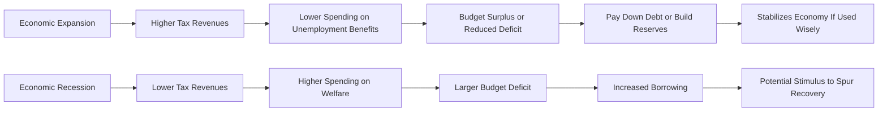

## Overview

Fiscal policy is all about how governments spend their money, collect taxes, and manage budgets. If it sounds like a mouthful, well, it kind of is—yet it's a critical topic for understanding macroeconomic environments and their direct influence on financial markets. You might have heard policymakers debate public infrastructure projects, tax reforms, or new budgeting rules. Each of those decisions sparks profound ripple effects in private consumption, investment, and ultimately, asset prices.  

In this section, we'll dig into core fiscal policy tools: government spending, taxation, and the formation (and implications) of budgets. We’ll also dissect the relationship between deficits and surpluses, see how they tie into various phases of the business cycle, and highlight how these forces can impact interest rates and crowd out private spending. We’ll employ some personal anecdotes (like how a new road construction changed the dynamics of a local town’s economy—yes, that happened near my old high school!) and keep it slightly casual as we go along. But don’t worry: we won’t skip the critical finer points or gloss over advanced topics relevant to higher-level financial analysis.

## Government Spending

Government spending is a key way that policymakers inject funds into an economy, support certain sectors or demographics, and allocate resources to essential services. The categories can be massive and varied:

### Public Goods

Public goods, such as national defense, roads, public parks, and large-scale infrastructure, generally benefit society as a whole. They’re non-excludable (you can’t really stop someone from using them) and non-rival (one person’s use doesn’t reduce availability for others). Because private markets often fail to provide adequate public goods (there’s just not much profit in building a missile defense system!), governments step in.  

• Defense and Security: Spending on military and homeland security ensures national defense. Although it might not always generate immediate economic return, it provides national safety and stability, which indirectly fosters an attractive environment for investment.  

• Infrastructure: Think public highways, bridges, and telecommunications networks. Adequate infrastructure development can reduce transportation costs, make supply chains more efficient, and boost local productivity. I remember a new road project that drastically reduced travel time between two cities, raising property values overnight.

### Transfer Payments

Governments also make direct transfers to individuals through social safety nets or welfare programs:

• Welfare Programs: These provide support to low-income families or unemployed workers through cash grants, food assistance, or healthcare subsidies.

• Social Security and Pensions: Retirement benefits or disability assistance that ensure a basic standard of living.

The aim is to enhance social equity and reduce poverty. Economically, these payments increase disposable income for lower-income groups, which tends to have a higher marginal propensity to consume (MPC). This can stimulate aggregate demand, especially during downturns.

### Subsidies

Subsidies are targeted government payments to support specific industries (like agriculture or renewable energy) or demographics (e.g., student loan interest subsidies). Although subsidies can stimulate production and lower prices for consumers, they also can distort free-market price signals. Over time, an industry that becomes reliant on subsidies might have less incentive to innovate and control costs.

### Interest on Debt

When governments run budget deficits, they finance them by issuing debt (e.g., treasury bonds). These debts accrue interest obligations. As debt mounts, the share of the budget dedicated to interest payments can balloon, leaving fewer funds for productive areas like infrastructure or education. High interest payments also raise concerns about sustainability and long-term solvency.

## Taxation Policies

Taxes are how governments collect revenue to finance spending. Different structures influence consumption, savings, and investment decisions.  

### Progressive, Regressive, and Proportional Taxes

• Progressive Tax: A tax rate that increases as the taxable base (e.g., income) increases. Higher-income individuals pay a larger share of their income in taxes. The goal is to reduce income inequality, but critics argue it might discourage productivity at higher income levels.

• Regressive Tax: A tax that takes a larger percentage of income from lower-income earners than from higher-income earners. An example is a uniform sales tax on necessities, which disproportionately hits lower-income individuals who spend a big fraction of their income on these items.

• Proportional (Flat) Tax: Everyone pays the same percentage of their income, regardless of whether the income is high or low. It’s considered simpler, but whether it is fair is subject to debate.

### Effect on Disposable Income and Investments

Tax policies directly affect households’ disposable income. If individuals have more take-home pay, consumption tends to rise (especially if they’re in lower to middle income brackets), stimulating economic growth. On the other hand, higher taxes can discourage consumption or reduce the after-tax returns on investments. High corporate taxation may cause firms to reevaluate investment plans, shift operations, or exploit tax havens.  

### Behavioral Dynamics

Taxes also come with behavioral feedback loops. For example, if capital gains taxes are too high, investors might hold onto assets longer (“lock-in effect”), which can reduce market liquidity. Conversely, tax benefits or credits for certain investments (e.g., solar tax credits) can supercharge growth in targeted sectors.  

## Budget Formation

Creating a government budget is often a multistage process involving proposal, legislative approval, and execution. Let’s break it down:

• Proposal: Executive branches (like a ministry of finance or treasury) draft an initial plan, projecting revenues and expenditures. They consider macroeconomic forecasts, political priorities, and pre-existing spending commitments.

• Approval: A legislative body debates and modifies the proposal. Potential constraints or rules might exist—such as balanced-budget amendments or debt ceiling limits.  

• Implementation: Funds are allocated, and government agencies execute spending. Monitoring and audits help ensure compliance, though, frankly, inefficiencies often creep in.

• Fiscal Rule Constraints: Some countries adopt mandatory deficit limits, caps on debt, or rules that tie spending growth to GDP growth. These rules aim to impose discipline and maintain investor confidence.

## Deficits, Surpluses, and the Business Cycle

A government’s budget balance (deficit or surplus) often swings with the business cycle. During expansions, tax revenues generally rise, and certain social spending (like unemployment benefits) decreases, bringing surpluses or at least smaller deficits. Recessions typically reduce tax revenues and increase spending on social safety nets, widening deficits.  

Economists differ on the best approach. Some argue for balanced budgets, while others advocate countercyclical fiscal policy—running deficits in recessions to boost aggregate demand and surpluses in expansions to cool inflationary pressures.  

Below is a simple flowchart of how deficits and surpluses can fluctuate with the business cycle:

## The Multiplier Effect

When the government spends $1 on new public works, it doesn’t just generate $1 of total economic output. It can multiply through the economy as those receiving the initial funds (e.g., construction workers, suppliers) spend part of their income on goods and services, which in turn supports other suppliers, and so on.

The size of the multiplier depends on the marginal propensity to consume (MPC). If households spend a large portion of any additional income, the multiplier can be quite high. However, if consumer confidence is low or taxes are high, part of that initial spending might leak out of the local economy or get saved, reducing the overall multiplier.

## Crowding-Out Effect

Crowding-out occurs when large-scale government spending or borrowing pushes up interest rates, which can discourage private sector investment. If the government issues many bonds to fund its deficits, bond supply increases and, all else being equal, interest rates rise to attract buyers. Then businesses face steeper borrowing costs, potentially cutting back on capital investments.  

At times, the crowding-out effect can be partial. In a recession with low interest rates, increased government borrowing might have a minimal effect on private investment. However, in a robust economy with tight credit markets, higher government borrowing can lift rates sharply, displacing private investment.

**Crowding-Out Effect** (definition): A situation where increased public sector spending reduces private sector spending or investment, often by driving up interest rates.

## Practical Implications for Investment Analysis

From a portfolio manager’s standpoint, understanding fiscal policy can be essential:

• Expansionary Fiscal Policy: Can boost GDP growth and corporate earnings, pushing equity prices up in the short run. Yet, if deficits balloon uncomfortably, bond yields may spike on default fears or inflation expectations, hurting fixed-income valuations.

• Tax Policy Shifts: If capital gains taxes are cut, equity investors might be more willing to divest and rebalance portfolios. Meanwhile, new excise taxes or a dividend tax hike could shift the risk/return profile of certain assets.  

• Deficit Management: A government’s credibility in managing deficits and debt influences sovereign bond yields. Credit rating agencies watch for unsustainable paths that might lead to downgrades.  

It’s vital to incorporate expected fiscal scenarios into top-down economic forecasts (see also: Macroeconomic Forecasting in prior sections) and adjust asset allocation accordingly.

## Best Practices, Challenges, and Pitfalls

• **Best Practices**:  
  - Strive for transparency in budgeting processes.  
  - Use balanced or countercyclical rules to limit political opportunism or short-sighted spending.  

• **Challenges**:  
  - Predicting multipliers can be tricky; real behavior often deviates from theoretical assumptions.  
  - Political cycles can override purely economic motivations.  
  - External shocks (like a global crisis) can throw even the best-laid budgets off track.

• **Pitfalls**:  
  - Overreliance on deficit spending during expansions can lead to unsustainable debt.  
  - Overly tight budgets during recessions might prolong economic downturns.  
  - Inadvertent regressivity: Some so-called “neutral” taxes can disproportionately impact vulnerable populations.

## Conclusion and Final Exam Tips

Fiscal policy is a multi-faceted instrument, impacting everything from day-to-day household consumption to bond yields in the global capital markets. Understanding its core components—government spending, taxation, and budgets—allows one to better forecast economic trends and optimize investment strategies.  

• **For the Essay Questions**: When the CFA exam asks you to evaluate how a country’s fiscal policy might affect its current account deficit or bond yields, remember to consider both cyclical and structural factors.  
• **For Item Sets**: Watch for data on tax changes or unexpected government spending announcements, and factor those into your return or volatility forecasts.  
• **Time Management**: Some questions about multiplier effects or deficits might involve data interpretation. Familiarize yourself with quick ratio/trend analysis to handle these under time pressure.

## References  
- Barro, R. J. (1990). “Government Spending in a Simple Model of Endogenous Growth.” Journal of Political Economy.  
- International Monetary Fund (IMF) Fiscal Monitor. Available at: https://www.imf.org/external/np/fad/fiscalmonitor/  

--------------------------------------------------------------------------------

## Test Your Knowledge: Fiscal Policy Tools Quiz



### Which category of government spending typically includes funding for roads and bridges?

- [x] Public goods
- [ ] Transfer payments
- [ ] Subsidies
- [ ] Interest on debt

> **Explanation:** Roads and bridges are classic examples of public goods because they are non-excludable and non-rival, ensuring broad societal benefit.

### When the government runs large deficits that drive up interest rates, potentially reducing private sector investment, this phenomenon is referred to as:

- [ ] Hysteresis
- [ ] Fiscal multiplier
- [x] Crowding-out
- [ ] Debt overhang

> **Explanation:** Crowding-out effect happens when increased public sector borrowing pushes up interest rates, deterring private investment.

### A progressive tax system is characterized by:

- [x] Higher tax rates for higher income levels
- [ ] Equal tax rates for all income levels
- [ ] Higher tax rates for lower income levels
- [ ] No taxation on dividends or capital gains

> **Explanation:** A progressive tax applies increasing marginal rates to larger taxable incomes, which helps in income redistribution but can also be criticized for disincentivizing high earners.

### In which phase of the business cycle are government deficits likely to shrink naturally, even without policy changes?

- [x] Economic expansion
- [ ] Recession
- [ ] Depression
- [ ] Stagflation

> **Explanation:** During expansions, tax revenues rise and certain social spending (like unemployment benefits) declines, narrowing the deficit automatically.

### Which of the following is generally considered a transfer payment?

- [x] Unemployment benefits
- [x] Public pension disbursements
- [ ] Corporate bond interest payments
- [ ] Military equipment purchases

> **Explanation:** Transfer payments are direct government payments to individuals without expectation of goods or services in return—commonly exemplified by unemployment benefits and pensions.

### If a government wishes to stimulate the economy quickly, which fiscal policy tool is most likely to have a direct and immediate impact?

- [x] Increased government purchases of goods and services
- [ ] Decreasing capital gains tax rates over 10 years
- [ ] Issuing more treasury bonds
- [ ] Implementing new tariffs

> **Explanation:** Actual government purchases of goods and services (think infrastructure projects or other direct spending) have an immediate impact on aggregate demand, while tax changes can be slower to filter through, and bond issuance itself is simply a financing mechanism. Tariffs don’t necessarily stimulate the economy quickly; they alter trade flows.

### A government adopts a flat (proportional) tax rate of 20%. If an individual earns $50,000 annually, how much tax would they pay under this system?

- [x] $10,000
- [ ] $5,000
- [ ] $15,000
- [ ] $20,000

> **Explanation:** Under a flat 20% tax, you calculate 0.20 × $50,000 = $10,000.

### Which of the following statements about fiscal multipliers is most accurate?

- [x] A high marginal propensity to consume leads to a larger fiscal multiplier.
- [ ] A high saving rate results in a larger multiplier.
- [ ] Fiscal multipliers are unaffected by changes in the business cycle.
- [ ] Fiscal multipliers are always the same regardless of spending type.

> **Explanation:** The size of the multiplier depends heavily on how much additional income households spend (MPC). The higher the MPC, the greater the multiplier effect.

### Which legislative limitation might force policymakers to keep deficits from exceeding a certain amount?

- [x] Debt ceiling
- [ ] Progressive tax system
- [ ] Means-tested benefits
- [ ] Tariff quotas

> **Explanation:** A debt ceiling is a legal cap on how much the government can borrow, effectively limiting the size of deficits it can run.

### True or False: One disadvantage of a balanced-budget rule is that it may prohibit necessary government deficits during recessions.

- [x] True
- [ ] False

> **Explanation:** Balanced-budget rules can prevent governments from employing countercyclical stimulus measures in downturns, potentially worsening a recession.


