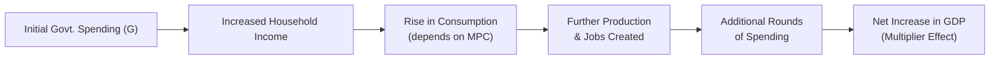

## Introduction

You know how it sometimes feels when you think, “Wow, each dollar I spend seems to circulate around—my friend receives my dollar, then she buys something from someone else, who then pays another person, and so on?” Well, the government’s spending has a similar effect on the broader economy, but on a much bigger scale. Economists measure this ripple-like effect through something called the fiscal multiplier.

In advanced macroeconomics (and for the CFA® exam), fiscal multipliers are front and center when discussing how government interventions impact aggregate demand, national income, and overall economic activity. And let me tell you from personal experience, when I first learned about fiscal multipliers, it completely changed the way I viewed government budgets. Suddenly, the idea of government stimulus wasn’t just about a number on a page—it was about how a single policy decision might set off a chain reaction of production, income, spending, and growth. But, as always, the devil’s in the details: factors like the economy’s openness, marginal propensity to consume (MPC), and even the confidence of households and investors matter big time.

In this section, we’ll explore how fiscal multipliers are defined, how they operate, and why they matter for understanding real-world policy decisions. As we go along, we’ll also dig into the differences between three main types of multipliers—spending, tax, and balanced-budget—and highlight the many influences that can shrink or expand the multiplier effect. Let’s dive in.

## Defining Fiscal Multipliers

A fiscal multiplier is the ratio of the change in national income (often measured as real GDP) to the change in government spending or taxes that prompts that change in income. More formally:

If ΔY is the change in national income and ΔG is the change in government spending, then the spending multiplier k can be written as:


k = \frac{\Delta Y}{\Delta G}.


In words, if the government increases its spending by 1 unit (say $1 billion, for instance), the multiplier tells you how many additional units of GDP are generated as a result.

### Why Do Multipliers Exist?

The intuitive story behind multipliers is that one person’s spending becomes another person’s income. When the government injects money into the system—say, by building a new highway—local construction companies pay their workers and suppliers, who then spend that income at grocery stores, restaurants, etc. Each round of spending stimulates further activity until eventually these secondary effects taper off. In a closed-economy model, the total effect can be elegantly summarized, but real-life complexities like imports, taxes, public debt, or changes in interest rates all feed into how big or small the overall multiplier turns out to be. 

## Government Spending Multiplier

### Conceptual Overview

The government spending multiplier (often just called the fiscal multiplier) is probably the most straightforward type. It measures how much a unit increase in government spending—say, on infrastructure or healthcare—affects the entire country’s gross domestic product. The classic formula for a simple Keynesian model (in a closed economy without government or external trade) uses the marginal propensity to consume (MPC):


\text{Government Spending Multiplier} = \frac{1}{1 - \text{MPC}}.


But guess what: that’s just in a stripped-down world. If we add in taxes (with a marginal tax rate t) and some propensity to import (m), the multiplier’s denominator becomes (1 – MPC(1 – t) + m). The numerator is still 1, but the shape of the multiplier changes as soon as you incorporate more realistic features. The qualitative takeaway? The higher the MPC, the bigger the multiplier; the higher the tax rate or import leakage, the smaller the multiplier.

### Example

Suppose an economy has an MPC of 0.75 and is essentially closed (no imports), with no direct taxes. A $100 million government spending boost for highway repairs sets off subsequent rounds of spending. The multiplier in this very simplified scenario is 1 / (1 – 0.75) = 4. So, that initial $100 million might ultimately produce around $400 million in additional GDP over the full “ripple.”

In the real world, of course, taxes, imports, and other complexities mean you often see smaller real multipliers—but you get the idea.

## Tax Multiplier

### Core Idea

The tax multiplier measures the effect on national income of a change in taxes. While they work in a similar manner to spending multipliers, the sign is typically negative (because raising taxes generally reduces disposable income and, hence, consumption). In many textbooks, the absolute value of the tax multiplier is found to be smaller than the spending multiplier, reflecting that government spending is often more “direct” in stimulating demand than letting it filter through households’ disposable income decisions.

### Simple Formula

In a basic model where t represents a lump-sum tax, the tax multiplier might look like:


\text{Tax Multiplier} = \frac{-\,\text{MPC}}{1 - \text{MPC}}.


The negative sign indicates that an increase in taxes leads to a decrease in aggregate output, all else equal. And hey, if you find yourself thinking, “Wait, is that always true?”—real economies add layers of complexity (e.g., changes in business confidence might overshadow or offset this effect). For the CFA® exam, though, the standard approach is to treat the negative sign as the baseline rule of thumb.

### Quick Illustration

If the MPC is 0.8 and taxes rise by $100 million, the immediate reduction in disposable income might reduce consumption by 80% of that $100 million, but subsequent rounds of spending reductions further amplify it. So, in a super-simplified sense, the total drop in GDP could be:


\Delta Y = \left( \frac{-0.8}{1 - 0.8}\right) \times 100 \, \text{million} = -4 \times 100 \, \text{million} = - \$400\, \text{million}.


Again, real numbers can differ widely, but the conceptual framework is often tested in exam settings.

## Balanced-Budget Multiplier

### The Special Case

Now, what if the government increases both spending and taxation by the same amount—say, an additional $100 million of spending, financed entirely with $100 million of new taxes? Intuition might say the net stimulus effect should be zero, right? But interestingly, in basic macro models, the balanced-budget multiplier is often slightly above 1. That means that even if the government raises the same amount in taxes as it spends, total national income can expand.

This effect arises because each dollar of government spending goes directly into the economy’s spending stream, while each dollar of new taxes only partially reduces consumption (depending on the MPC). If you don’t fully reduce consumption by $1 for each dollar of tax, the net impact on national income ends up positive.

### Caveats

Obviously, real-world complexities—like how quickly taxes are collected or how government spending is allocated—will shape whether the balanced-budget multiplier is meaningfully above 1. Nonetheless, it’s a concept worth memorizing because it shows up often in macroeconomic policy discussions and exam questions.

## Factors Influencing the Size of Fiscal Multipliers

### Marginal Propensity to Consume (MPC)

The MPC is the portion of additional income that households spend rather than save. A higher MPC generally boosts the multiplier because more of any new income filters back into consumption. In simpler terms: If people have a high tendency to spend each extra dollar they earn, the multiplier effect is large.

> GLOSSARY:  
> • Fiscal Multiplier: The effect on aggregate output of a unit change in government spending or taxation.  
> • Marginal Propensity to Consume (MPC): The portion of additional income that is spent on consumption.

### Openness of the Economy

In an open economy, some portion of new spending buys imported goods. That money then leaks abroad rather than circulating domestically. The bigger the import share, the smaller the multiplier. If people in your country buy a lot of foreign-produced goods whenever they get extra income, that extra spending won’t do as much to increase local production or local wages.

### Level of Spare Capacity

If the economy is operating well below its potential output (e.g., high unemployment, idle factories), a boost in demand might translate into a large multiplier effect. However, if resources are already fully employed, government spending can push up inflation, crowd out private investment, and generate a smaller multiplier.

### Public Debt and Interest Rates

High public debt may dampen multipliers, especially if the market perceives an increased default risk leading to higher interest rates. Also, central banks might raise interest rates to curtail an overheated economy if they believe a deficit-financed government stimulus is inflationary, reducing the net expansionary effect.

### Automatic Stabilizers

Automatic stabilizers, like progressive taxes or unemployment benefits, effectively change the multiplier in real time. For instance, if a positive shock raises incomes, more taxes get automatically collected. This helps smooth out the extremes of the business cycle but can also reduce the size of fiscal multipliers. Or, in a downturn, increased benefit payments cushion the blow—though that might actually amplify the expansionary effect when the government tries to stimulate.

## Crowding Out and Liquidity Traps

### Crowding Out

Crowding out occurs when government borrowing to finance deficits pushes up interest rates, thereby displacing private investment. Picture it like a competition for funds. If business owners see higher interest rates, they might pull back on capital projects, thereby offsetting the government’s injection. Crowding out tends to shrink the multiplier, sometimes significantly.

### Liquidity Trap Scenarios

In certain low-interest-rate environments—affectionately known as liquidity traps—monetary policy might lose traction because rates can’t effectively go lower to stimulate private spending. In this scenario, a fiscal stimulus might actually have a larger-than-normal multiplier because the typical offsetting effect of monetary tightening (or rising interest rates) doesn’t happen. You might remember headlines after the 2008 financial crisis where many analysts argued that fiscal policy was more potent precisely because interest rates were stuck near zero.

## Confidence and Policy Credibility

You might wonder: “What if nobody believes the government will follow through?” Confidence and credibility are crucial. If individuals suspect that today’s spending spree will just lead to big tax hikes down the road, they might save rather than spend their extra income, negating the multiplier effect. Conversely, if policymakers are credible about sustaining growth-friendly policies, households and businesses are more likely to spend and invest, reinforcing the stimulus.

- In times of financial stress, confidence can be fragile. Households might be more cautious about their new income, saving more for a rainy day.  
- If the government has a strong track record of responsible budgeting, the private sector may respond more positively to fiscal expansion, leading to a more robust multiplier.

## Practical Considerations, Pitfalls, and Strategies

Below are some best practices, common pitfalls, and real-world strategies related to fiscal multipliers, especially relevant to those preparing for advanced financial exams like the CFA Level III:

• Best Practices:  
  - Evaluate the economy’s cyclical position. The multiplier effect is usually higher when an economy is in recession, with ample spare capacity.  
  - Consider structural factors such as automatic stabilizers and the existing level of public debt.  

• Common Pitfalls:  
  - Ignoring Time Lags: It can take months or years for government expenditures to work their way through the economy.  
  - Overlooking Behavioral Changes: Elevated taxes might change incentives for businesses and workers; it’s not just about arithmetic.  
  - Underestimating Policy Interactions: Monetary authorities might offset part of an expansionary fiscal stance by raising rates if inflationary pressures loom.  

• Strategies to Overcome Issues:  
  - Pair fiscal policy with transparent communication to manage expectations.  
  - Ensure monetary-fiscal coordination when stimulus measures are large.  
  - Use scenario analysis: Stress-test how different multiplier assumptions impact growth and inflation forecasts.

## Visual Representation of the Multiplier Process

Below is a simplified Mermaid diagram that shows the sequential process of how an injection of government spending can ripple through the economy.

Remember, in real life, the magnitude of each arrow depends on factors like tax rates, interest rates, import propensity, and confidence levels. But the general chain reaction is what underpins the idea of a multiplier.

## Conclusion

Fiscal multipliers are a fundamental concept in macroeconomics—and you’ll almost certainly see them in both theoretical and practical contexts. Understanding them is key to sizing up the potential impact of a new spending package, a tax reform, or a balanced-budget approach. As the CFO of your own portfolio (or the manager of client assets), you want to appreciate how these multiplier effects might influence broader market conditions, interest rates, inflation, and consumer demand.

But be mindful: multipliers are not cast in stone. Real-world complexities such as crowding out, liquidity traps, automatic stabilizers, and investor confidence can dial them up or down in unexpected ways. As you move toward more advanced studies and possibly the CFA Level III exam, focus on how these topics can appear in scenario-based item sets or essay questions. Often, exam questions revolve around applying the concept in specific contexts—like recessions vs. expansions, or open vs. closed economies—rather than just reciting formulaic definitions.

Happy studying, and here’s to turning theory into practical insights!

## References & Further Reading

- Spilimbergo, A., Symansky, S., & Blanchard, O. (2009). “Fiscal Multipliers.” IMF Staff Position Note.  
- Ramey, V. A. (2011). “Can Government Purchases Stimulate the Economy?” Journal of Economic Literature.  
- CFA Institute. 2025 Curriculum, CFA® 2025 Level I, Volume 1: Quantitative Methods.  
- Blanchard, O. & Johnson, R. (2017). Macroeconomics. 7th ed., Pearson Education.

## Test Your Knowledge of Fiscal Multipliers



### Which statement best defines a fiscal multiplier?

- [ ] The ratio of government savings to government spending.
- [x] The ratio of a change in national income to the change in government spending or taxation.
- [ ] The difference between taxes collected and total spending.
- [ ] The total amount of government expenditure as a proportion of GDP.

> **Explanation:** A fiscal multiplier captures how a given change in government spending or taxes leads to a proportional change in national income (GDP).

### In a simple closed economy without taxes or imports, which of the following formulas represents the government spending multiplier?

- [ ] 1 ÷ (1 + MPC)
- [x] 1 ÷ (1 – MPC)
- [ ] MPC ÷ (1 – MPC)
- [ ] 1 – MPC

> **Explanation:** In a simple closed-economy Keynesian model, the government spending multiplier is 1 ÷ (1 – MPC). Higher MPC results in a larger multiplier.

### When the MPC increases, the fiscal multiplier generally:

- [x] Increases because households spend a higher fraction of additional income.
- [ ] Remains unchanged because taxes offset higher spending.
- [ ] Decreases because people save more.
- [ ] Moves inversely with aggregate demand, reducing GDP growth.

> **Explanation:** A higher MPC means people consume more out of every extra dollar earned, thereby strengthening the chain reaction of spending through the economy.

### Which of the following factors is most likely to reduce the size of the fiscal multiplier in an open economy?

- [ ] A low marginal propensity to import (MPI).
- [ ] The absence of any automatic stabilizers.
- [x] Significant levels of imports, causing much of the stimulus to leak abroad.
- [ ] Higher MPC and no change in import behavior.

> **Explanation:** In an open economy, much of the spending will go to imported goods if the propensity to import is large, reducing the domestic impact and shrinking the multiplier.

### The balanced-budget multiplier suggests:

- [ ] A tax hike used to finance new government expenditure always results in a net zero effect on GDP.
- [x] Government spending financed by an equal increase in taxes can still increase GDP by a small positive amount.
- [ ] The only way to maintain a balanced budget is to keep the multiplier at unity.
- [ ] Balancing the budget fully negates any multiplier effect.

> **Explanation:** Under a simple Keynesian framework, the balanced-budget multiplier is typically slightly above 1 because each dollar in government spending enters the economy fully, while each dollar in taxes only partly reduces private consumption.

### Crowding out refers to:

- [ ] The automatic effect of higher government spending raising household spending.
- [ ] The idea that private consumption is always zero after a tax increase.
- [x] The process by which increased government borrowing pushes interest rates higher, reducing private investment.
- [ ] The phenomenon of liquidity traps in advanced economies.

> **Explanation:** Crowding out occurs when government demand for loanable funds raises interest rates, making it harder or more expensive for private firms to finance their investments, thereby diminishing the full multiplier effect.

### A liquidity trap scenario implies that:

- [x] Monetary policy’s effectiveness is weakened because interest rates can’t effectively go lower.
- [ ] Fiscal policy is meaningless because nobody is willing to spend.
- [ ] Higher government spending always leads to higher interest rates.
- [x] The fiscal multiplier might be larger if monetary policy cannot offset increased government spending.

> **Explanation:** In a liquidity trap, interest rates are near zero, so monetary policy is constrained. Fiscal measures can be more potent because the usual offsetting rise in interest rates may not occur.

### Suppose the government increases spending by $50 million and also raises taxes by $50 million in an economy where MPC=0.8. Under a classic Keynesian model, the net effect on GDP tends to be:

- [ ] Strictly zero.
- [x] Slightly positive, typically around $50 million (i.e., balanced-budget multiplier close to 1).
- [ ] Negative because higher taxes reduce private consumption.
- [ ] Very large because the tax rise does not affect the economy at all.

> **Explanation:** The balanced-budget multiplier in a simple model is typically around 1 (or slightly above), meaning that the equal increase in spending and taxes still slightly increases GDP.

### In which situation might a fiscal multiplier be comparatively larger?

- [x] When the economy is below full employment and no significant crowding out occurs.
- [ ] When the economy is overheated and operating at full capacity.
- [ ] When the marginal propensity to consume is very low.
- [ ] When policy uncertainty is high and confidence is depressed.

> **Explanation:** If there is plenty of spare capacity (e.g., high unemployment), government stimulus can spur real output gains without hitting resource constraints, resulting in a higher multiplier.

### True or False: Government credibility and stable policy expectations can enhance the potency of fiscal stimulus measures.

- [x] True
- [ ] False

> **Explanation:** If firms and consumers trust the government’s policies and believe they will not face sharp tax hikes later, they are more likely to spend rather than save additional income, raising the multiplier effect.


