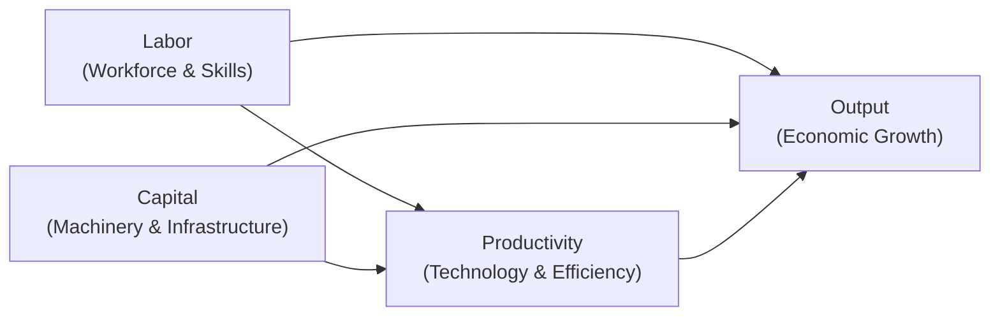

## Introduction

So, let’s talk about what makes an economy really tick. When we see nations grow—that is, expand their total output, create more jobs, and raise household incomes—the usual suspects behind that growth are labor, capital, and productivity. If you recall times you’ve considered starting a small business, you might have thought, “How many employees do I need? Do I have enough savings to buy equipment? Can we leverage new technology to do this better?” Well, that’s the same conversation policymakers and economists have, just on a macro scale.

In broad strokes, labor is the workforce—people who provide their time and skills. Capital is the stuff you use to produce things, such as machinery and buildings. Productivity is how efficiently you turn all that labor and capital into finished goods and services. These three pillars not only determine how fast an economy can expand but also shape people’s standard of living. Below, we’ll dive into each component in detail, discuss how they fit together, and consider how government policy, business decisions, and market conditions influence the pace and sustainability of economic growth.

## Labor as a Driver of Economic Growth

Labor represents the human side of production. It’s not just the sheer size of the workforce but also the composition of skills, education, and experience within that workforce. When we talk about a country’s “labor force participation rate,” we mean the percentage of the working-age population that is employed or actively seeking employment. A robust labor force typically means more hands on deck to produce goods and services.

But it’s not only about the number of workers. The quality of labor matters too. This is where “human capital” enters the picture. Education, on-the-job training, and professional certifications all raise workers’ ability to create value. When you hear stories about emerging markets pushing college education or vocational training, that’s a push toward enhancing overall human capital. In the context of an economy, higher human capital translates to stronger problem-solving skills, better adaptability to new technologies, and generally a more efficient workforce.

I vividly recall visiting a manufacturing plant in a developing country some years back. They had plenty of workers, but many of them lacked specific technical training, so the productivity was shaky. The moment management introduced targeted training modules—like how to operate new automated saws—output rose much faster than anyone expected. Workers became more confident, and the plant saw less waste and fewer accidents. This, in essence, is how an upgrade in labor quality directly boosts growth.  

One caveat: as you add more and more workers, you may hit diminishing marginal returns if those extra workers do not have sufficient capital or technology to support them. If you hire 10 new employees but only give them one old computer to share, productivity might drop instead of rise. That’s precisely why labor interacts so closely with capital and productivity improvements.

## Capital Accumulation and Deepening

Now, let’s shift to capital—often visualized as machines, tools, factories, roads, ports, and other physical assets. In fancy economic terms, this is your “capital stock,” basically the sum total of physical resources available for production. At a small scale, think of it like setting up a food truck: you need the truck itself, the cooking equipment, maybe a point-of-sale system—really all the tangible “stuff” that helps you produce and sell your product.

In macroeconomics, capital accumulation refers to how an economy grows its total capital stock: new factories are built, more advanced machinery is purchased, or infrastructure like highways and bridges is expanded. The more capital workers have at their disposal—known as “capital deepening”—the more output per worker typically rises. If each worker has a high-performance computer, or the latest batch of robots for certain tasks, it can enhance efficiency significantly.

For instance, imagine a garment factory: if 50 workers manually stitch clothing, production might be limited by the speed of their hands. Introduce advanced sewing machines or semi-automated cutters, and suddenly each worker can double the garment output. This is capital deepening in action; you’re increasing the capital per worker, and with it, presumably, you’re boosting labor productivity.

Capital accumulation depends on a few important factors:

• Savings and investment rates: High domestic savings can fund investment in new capital, while low saving can slow it.  
• Access to capital markets: Countries integrated into global financial markets can attract foreign direct investment (FDI) to expand their capital stock.  
• Government incentives: Tax breaks, subsidies for capital purchases, or stable regulations that encourage foreign or domestic investors to spend money on factories and equipment.

Yet, as with labor, there can be diminishing marginal returns to capital if you keep piling on machines without complementary changes in workforce training or technological improvement. A factory with 20 identical machines but only two skilled workers may not operate all machines efficiently.

## Productivity as the Real Engine

Productivity is, in many ways, the powertrain behind real economic growth. It answers the question, “How well does an economy convert labor and capital into goods and services?” If labor and capital stay the same but output keeps growing, you can guess that’s due to a rise in productivity.

Economists often talk about “technological progress” or “productivity growth” as the game-changer. This can come from advanced software, better management practices, or innovations in supply-chain processes. The share-economy revolution (think ride-sharing or short-term lodging platforms) is a prime example of how better utilization of existing assets can skyrocket productivity. If you have a technology that allows more efficient matches between supply and demand, a single car or apartment can generate more revenue without large extra capital or labor outlays.

For the more mathematically inclined, we often represent GDP (total output) in a simplified Cobb-Douglas production function:


Y = A \times F(K, L)


Here, \\( Y \\) is total output, \\( K \\) is capital, \\( L \\) is labor, and \\( A \\) is the technology or productivity parameter. It’s basically a compact way of saying that output depends on how much labor and capital you have, but technology—captured by \\( A \\)—scales the entire production process. If you enhance \\( A \\), you get more output for every unit of labor and capital.

## Interplay among Labor, Capital, and Productivity

One of the coolest aspects of studying economic growth is seeing how these three elements reinforce or limit each other. Take an example:

• Labor Force Expands: If more people enter the workforce, the potential output increases—provided they have sufficient skills and are matched with adequate capital.  
• Capital Deepening: Firms respond by investing in machinery to equip these new workers, or by upgrading the equipment for the existing workforce.  
• Productivity Gains: Over time, better technology or processes mean each worker gets more output from the same machines.

But a mismatch can stall growth. If you expand the labor force without parallel investment in capital or technology, you might see diminishing returns. Equally, if you purchase a bunch of new machines without upgrading worker skills, or if you’re using outdated production methods, you won’t get the maximal return on your capital spending. Economies that grow quickly usually have a strong synergy among these three.

## Role of Government Policy, Taxation, and Infrastructure

No discussion of growth factors is complete without mentioning the role of policy. Governments shape how labor, capital, and productivity evolve through:

• Education and Training: Scholarships, free public education, or training incentives can boost human capital.  
• Tax Incentives: Lower corporate taxation, investment tax credits, or allowances for research and development can promote capital accumulation.  
• Infrastructure Development: Roads, ports, power plants, and communications networks reduce transaction costs and can drastically enhance productivity.  
• Stable Regulation: Clear and consistent policies encourage domestic and foreign investment, fueling both capital deepening and technology transfer.  
• Intellectual Property Rights: Strong protections can spur innovation, enabling productivity gains.

One personal anecdote: I once met an entrepreneur in a region where government grants were readily available for tech start-ups. They successfully secured a government grant to develop advanced robotics for agriculture. That little push from public funding gave them the resources to build sophisticated prototypes, hire skilled engineers, and eventually expand production capacity. Within a few years, they were exporting these solutions internationally. It was a real-world testament to how public policy incentives can nudge private businesses to innovate and boost overall productivity.

## Diminishing Returns and the Need for Innovation

It’s tempting to think, “Just keep adding labor and capital, and you’ll get infinite growth,” but the law of diminishing marginal returns says otherwise. As you add more of one input—say worker hours—while holding other inputs constant—say machines or technology—the additional output gained from each new hour of labor can taper off over time.

This is why long-run growth stories almost always circle back to productivity improvements. A richer skill set, a breakthrough in technology, or brand-new organizational models can offset the natural diminishing returns you get from continuously adding more workers or more equipment.

## Connecting Factors of Growth to Living Standards and Global Competitiveness

When a country effectively deploys its labor, invests in capital, and fosters productivity, you typically see rising per capita incomes and improving standards of living. Over decades, even small differences in productivity growth can lead to massive divergences in living standards across countries. These differences also affect a country’s competitiveness on the global stage. International investors often look at how effectively a nation uses capital or invests in worker training; that signals how profitable it might be to set up business there.

At the end of the day, these factors of growth also influence income distribution and social outcomes. A well-educated and productive workforce often commands higher wages. If capital is in short supply or very costly, that can limit how quickly new firms can expand—impacting job creation and wage growth. Policymakers keep an eye on these dynamics, sometimes introducing policies to ensure that growth benefits a wide segment of the population.

## Visualizing the Growth Factors

Below is a simple Mermaid diagram illustrating how labor, capital, and productivity interconnect to drive overall economic growth:

In this visualization, labor and capital each directly contribute to output, but productivity also amplifies their effectiveness. Additionally, improvements in productivity often require complementary developments in skills (labor) and capital investment.

## Practical Applications and Case Studies

Consider the example of South Korea in the second half of the 20th century. The country made a massive push in education, raising literacy rates and the skill level of its workforce. At the same time, policies supported capital formation (like steel plants and shipyards). The government also championed technology adoption, leading to the rise of electronics giants. Over a matter of decades, South Korea transformed itself from a largely agrarian economy into a high-tech, export-driven powerhouse.

On a smaller scale, a typical manufacturing firm in a developed economy might constantly seek ways to integrate AI-driven processes, increasing output with roughly the same number of employees and machines. This is productivity in action: the same inputs—labor and capital—can produce more goods once you harness a new piece of tech or refine a process.

## Best Practices and Pitfalls

– Balancing Inputs: You want to ensure that labor, capital, and productivity improvements grow together. Over-emphasis on one factor without sufficient development in others can limit returns.  
– Education and Training: Upgrading human capital is an ongoing process. Even highly developed economies invest in lifelong learning to keep up as technology evolves.  
– Avoid Overreliance on Natural Resources: If a country depends solely on resource extraction without diversifying, it may see short-lived booms and minimal productivity gains.  
– Policy Stability: Frequent regulatory changes can scare off investment. A predictable environment fosters long-term productivity projects.  
– Infrastructure Gaps: Poor roads or erratic power supply can hamper the gains from an otherwise skilled workforce or advanced machinery.

## Exam Tips for CFA Candidates

• For essay-type (constructed-response) questions, illustrate growth dynamics with real-world examples or short calculations. If a prompt gives you partial data on capital stock or workforce skill level, show how these might lead to diminishing returns.  
• You might see item-set questions referencing a government’s policy changes—like tax incentives for new machinery. Connect that policy to capital deepening and highlight potential productivity effects.  
• Don’t forget to integrate ethics, especially if a question touches on how labor policies or technology adoption might affect different stakeholders in society. The CFA Institute Code and Standards often require you to consider fairness and transparency.  
• Practice explaining the production function. Formulas like \\( Y = A \times F(K, L) \\) often appear in exam scenarios testing your conceptual understanding of growth.  
• Watch for new data or a shift in “A,” the productivity parameter. Changes in technology can dramatically alter growth outlook, so it’s a favorite exam angle to see how you handle that shift in your analysis.

## References

- Mankiw, N. G. (2019). Principles of Economics. Cengage Learning.  
- Barro, R., & Sala-i-Martin, X. (2004). Economic Growth (2nd ed.). MIT Press.  
- World Bank. (2020). World Development Indicators. https://data.worldbank.org/  

---

## Test Your Knowledge: Factors of Economic Growth Quiz



### Which of the following best defines human capital?

- [ ] The total physical machinery used in production.
- [ ] The amount of money firms allocate to research and development.
- [x] The skills, education, and knowledge possessed by a workforce.
- [ ] The accumulated inventories of unsold goods.

> **Explanation:** Human capital refers to the intangible assets workers bring to the table in terms of skills, knowledge, and training.

### If an economy keeps adding workers without investing in more equipment or improving processes, what is the most likely outcome?

- [ ] Productivity per worker will rise indefinitely.
- [x] Productivity per worker could decline due to diminishing marginal returns.
- [ ] Productivity per worker stays constant.
- [ ] Productivity will be determined solely by population size.

> **Explanation:** Adding labor alone eventually runs into the law of diminishing marginal returns unless capital or technology also expands.

### Increasing capital per worker in an economy is referred to as:

- [ ] Labor force participation.
- [x] Capital deepening.
- [ ] Outsourcing.
- [ ] Foreign direct investment.

> **Explanation:** “Capital deepening” occurs when each worker has more capital to use, often increasing productivity.

### A country invests heavily in research and development, and GDP grows faster than labor and capital can explain. Economists might attribute the extra growth to:

- [x] Productivity or technological progress.
- [ ] Higher birth rates.
- [ ] More raw materials.
- [ ] Changes in trade policy.

> **Explanation:** When growth cannot be accounted for by labor or capital alone, we often attribute it to gains in total factor productivity, often stemming from technology.

### Which government policy can best encourage greater capital accumulation?

- [ ] Strict wage controls.
- [ ] Tariffs on technology imports.
- [x] Investment tax credits.
- [ ] Limiting foreign direct investment.

> **Explanation:** Investment tax credits reduce the cost of capital acquisition for firms, stimulating capital accumulation.

### In a simple production function, if both capital (K) and labor (L) remain constant, but output (Y) increases, it is most likely due to:

- [ ] A decrease in labor costs.
- [x] An improvement in productivity (A).
- [ ] A slowdown in population growth.
- [ ] Decline in the capital-to-labor ratio.

> **Explanation:** Without changes in inputs, the only way to get more output is to increase total factor productivity, often denoted as “A.”

### What factor could offset diminishing marginal returns to labor and capital?

- [ ] An unchanged level of technology.
- [x] Technological progress or increased productivity.
- [ ] Higher global interest rates.
- [ ] Lower government spending on education.

> **Explanation:** Technological progress or more efficient use of inputs can offset diminishing returns by raising the overall productivity.

### Why might government spending on public education contribute to economic growth?

- [ ] It raises government debt, forcing public austerity.
- [x] It boosts human capital, thereby improving labor productivity.
- [ ] It replaces private investment in capital.
- [ ] It encourages inflation to go lower.

> **Explanation:** Public education enhances skills, which increases productivity and fosters long-term economic growth.

### A key indicator that measures what portion of the working-age population is employed or seeking work is:

- [ ] Productivity ratio.
- [ ] Unemployment rate.
- [x] Labor force participation rate.
- [ ] Capital utilization rate.

> **Explanation:** The labor force participation rate focuses specifically on the share of working-age adults who are either working or attempting to find work.

### True or False: A government policy that encourages stable, predictable business environments can attract more foreign direct investment, thereby enhancing capital accumulation.

- [x] True
- [ ] False

> **Explanation:** Predictable environments reduce investment risk, encouraging foreign entities to allocate resources to that market and thereby increase the capital stock.


