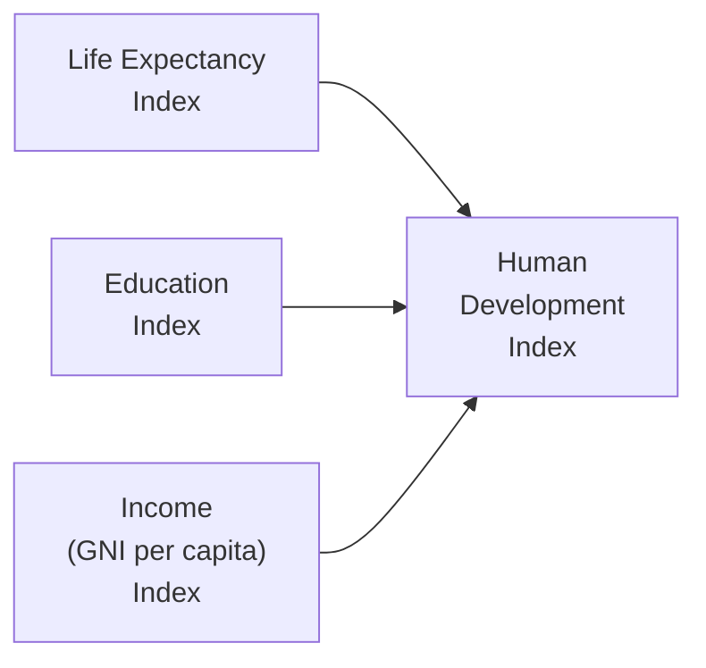

## Introduction

Sometimes, you look at a country that boasts a rapidly growing GDP, and you think, “Wow, they must be doing great!” But here’s the thing: GDP isn’t always the best at telling you whether people are truly better off. After all, you can have growth while large portions of the population remain unemployed or undereducated, right? This is where more holistic indicators like the Human Development Index (HDI) come in. They capture multiple facets of well-being—health, education, and income—rather than just focusing on an economy’s size.

Drawing on the context we’ve developed throughout Chapter 8, this section considers what “living standards” really mean, why it matters, and how to measure it effectively. We’ll look at the HDI, talk about inequality and poverty measures, cover certain “happiness” indices, and explore how saving can be “adjusted” for environmental depletion. Ultimately, the goal is to reveal how an economy’s performance can be understood in human terms, which is especially crucial when you’re making longer-term investment or policy decisions.

## Assessing Living Standards Beyond GDP

Before we tackle the more refined measures, let’s have a quick refresher on GDP’s limitations. We often teach that GDP is an essential statistic for capturing a nation’s economic output. And it is useful—few would disagree. But it doesn’t address wealth distribution, environmental degradation, or even the average citizen’s well-being. If a nation’s production is skewed to a tiny wealthy sliver of its population, the per-capita GDP number can disguise significant poverty.

Imagine a scenario: a hypothetical “Paradiso Republic” sees its GDP double in a decade due to rapid commodity exports. But maybe 60% of the population lives in slums, children’s literacy is low, and environmental damage is skyrocketing. In that case, purely focusing on GDP might paint a rosy picture—and it’s incomplete, to say the least. This is precisely why we need broader indicators that map onto the real experiences of people who live within these economies.

## Human Development Index (HDI)

One of the most established “beyond GDP” metrics is the United Nations Development Programme (UNDP)’s Human Development Index (HDI). This composite index, introduced in 1990, tries to measure progress in three dimensions simultaneously: health, education, and income.

Health is typically captured by life expectancy at birth. Education is gauged through a combination of actual average years of schooling (for adults) and expected years of schooling (for children). And for income, the HDI relies on Gross National Income (GNI) per capita, adjusted for purchasing power parity (PPP) so you get a fair cross-country comparison.

Below is a simple diagram showing how these components flow into the overall HDI:

### Why HDI Adds Value

• Multidimensional Focus: HDI picks up health and education levels, reminding us that an economy can’t just grow in financial terms—it must also nurture a healthy, educated workforce.  
• Cross-Country Comparisons: Standardizing life expectancy, schooling, and income allows a quick side-by-side comparison of well-being in different regions.  
• Policy Benchmarking: Policymakers use HDI to identify lagging areas. For instance, if a country is strong in income but weak in education, HDI numbers can catalyze reforms.

### Limitations of HDI

But hey, let’s not treat HDI as the final word. HDI is still an average measure—it doesn’t capture inequalities within a country. Also, the weights assigned to each dimension can be somewhat subjective. So while HDI is definitely a step forward, it’s far from perfect. For instance, two countries with the same HDI might mask major differences in how income and education benefits are distributed across different demographics.

## Alternative Welfare Indicators

So, yes, we love HDI for broad insights. But we can go further. Over time, various organizations and researchers have developed a host of other indices, each shining a light on unique challenges in capturing real well-being.

### Multidimensional Poverty Index (MPI)

The Multidimensional Poverty Index (MPI) tries to pinpoint aspects of deprivation in a single index, including:

• Health Indicators: Nutrition, child mortality.  
• Education Indicators: Years of schooling, school attendance.  
• Living Standard Indicators: Access to cooking fuel, sanitation, water, electricity, and asset ownership.

You might recall the times you heard about entire communities lacking sanitation or facing poor water quality. Even if a country’s income statistics look “okay,” MPI quickly uncovers whether that “okay” average is skewed by a small wealthy group. The MPI is particularly insightful for large, developing nations where pockets of extreme poverty persist even amid rising GDP figures.

### Gini Coefficient

If you want to measure inequality, the Gini Coefficient is your friend. It’s a single number that runs from 0 (perfect equality) to 1 (extreme inequality). In practice, many countries fall somewhere between 0.25 and 0.60. So, if a question on the CFA exam (or just a real-world policy debate) comes up about how equally wealth is distributed, the Gini is a quick go-to measure.

Sample scenario: Two countries might boast the same GDP per capita, but one has a Gini of 0.30 and the other 0.60. Immediately, that alerts you to a stark difference in distribution. In the 0.60 country, large wealth gaps might create political instability or hamper consumer demand from lower-income groups, ultimately affecting both public policy and investment strategies.

### Gross National Happiness (GNH)

Here’s one that sparks a lot of conversation: the Gross National Happiness Index. It was popularized by Bhutan, which famously declared that mental well-being and happiness matter more than pure material output. GNH typically taps into psychological well-being, cultural diversity, ecological resilience, and good governance.

Sure, it can sound somewhat idealistic (and some folks might call it “fuzzy”), but it underscores a key point: well-being goes beyond the typical silos of economic measurement. If you’re investing in frontier markets, or you’re into environmental, social, and governance (ESG) factors, paying attention to intangible well-being can be an interesting angle.

### Adjusted Net Savings (ANS)

This measure is all about sustainability. Also known as “genuine savings,” it adjusts typical households’ and firms’ savings for:

• Investments in human capital (education, health).  
• Depletion of natural resources (forests, minerals, fossil fuels).  
• Pollution damage (carbon emissions, water contamination).

In plain terms, ANS addresses the question: Are we saving or squandering future wealth by consuming our natural capital today? If a country’s net savings rate is negative after these adjustments, it suggests that future generations might be left in the lurch. For you, as a finance professional or policymaker, it may also indicate the long-run risk of resource depletion or climate-related liabilities.

## Comparing and Interpreting Composite Indices

Composite indices often rely on weighting schemes. For example, HDI tries to give equal weight to health, education, and income. But should these weights always be 1/3 each? Some economists prefer a heavier weight on education; others might place more emphasis on environmental factors. So if you see an index that claims to measure “development” but offers no transparency on how it’s weighted, take it with a grain of salt.

Here are a few best practices when interpreting composite indices:

• Drill Into Subcomponents: If the HDI is high but the education index is significantly lower relative to health, you know the country’s overall performance might be fragile.  
• Understand Methodological Choices: Pay attention to how each dimension is measured. Do they use standardized tests or graduation rates for the education dimension? Is personal income adjusted for cost of living?  
• Beware of Country-Specific Bias: Some elements used in one country might not apply perfectly to another. A measure that emphasizes, say, government-provided healthcare might disadvantage nations with more private healthcare systems, even if outcomes are good.

## Implementation Tips and Pitfalls

As a CFA candidate (or a practicing financial analyst), you might wonder how all this ties back to investment decision-making. A few real-world tips:

• Macro-Level Investment Analysis: When you build or advise on a global equity or fixed-income portfolio, these broader development metrics can help you assess long-run stability. Countries scoring poorly on “alternative” indicators may face social unrest or policy unpredictability.  
• ESG Integration: If your asset management firm is focusing on sustainability, you’ll want to look at measures like ANS or Gini to gauge potential ESG risks. High inequality might translate to labor strikes or populist policies aimed at redistributing wealth, which can affect corporate earnings.  
• Policy Advocacy: Those in government or policy-adjacent roles draw on indices such as HDI and MPI to push for targeted interventions, e.g., better educational facilities or universal healthcare coverage.  
• Common Misinterpretations: Don’t interpret a single year’s index reading in absolute terms. Trends over time are more telling. Also, indexes can be “gamed” by short-term fixes—a country might temporarily boost education spending in ways that artificially inflate certain metrics yet leave long-term systemic challenges unaddressed.

## Conclusion and Final Exam Tips

Measuring living standards is about more than just income. Indices like the HDI, MPI, Gini Coefficient, Gross National Happiness, and Adjusted Net Savings each shine a light on different facets of economic and social well-being. As a Level I CFA candidate, grasping these alternative measures isn’t just theoretical—it can inform real-world investment decisions, risk analysis, and policy evaluations. You’ll likely see or use these concepts in scenario-based exam questions, where interpreting broader societal trends or disparities can play a key role in portfolio allocation or macro forecasts.

A few exam-taking strategies:

• Know the Definitions: It sounds obvious, but be crystal clear on definitions: HDI, MPI, Gini, GNH, and ANS.  
• Understand the Mixed Dimensions: On the exam, they might love to ask how health or education influences the HDI or compares to plain old GDP data.  
• Look for Potential “Binary Traps”: If the question is about well-being, purely focusing on money-based metrics could lead to missing key points about distribution or environment.  
• Synthesize Information: Many item-set questions will blend macroeconomic data with social data, requiring you to interpret them collectively.

## References

- United Nations Development Programme. Human Development Reports.  
  http://hdr.undp.org/  

- Stiglitz, J. E., Sen, A., & Fitoussi, J. P. (2009). Report by the Commission on the Measurement of Economic Performance and Social Progress.  

- World Bank (2021). Poverty and Shared Prosperity.  
  https://www.worldbank.org/en/publication/poverty-and-shared-prosperity  

- For a broader look at growth drivers and sustainability, review earlier sections of Chapter 8 in this volume and cross-reference with Chapter 3 on Business Cycles regarding macroeconomic stability over time.

## Test Your Knowledge: Measuring and Comparing Living Standards



### Which of the following statements best explains why GDP alone may misrepresent living standards?

- [x] GDP fails to capture inequalities and environmental factors that affect well-being.
- [ ] GDP only focuses on the indebtedness of a country relative to its investment returns.
- [ ] GDP already incorporates measures of life expectancy and education levels.
- [ ] GDP directly translates into improvements in human welfare.

> **Explanation:** GDP is a broad measure of output and income but lacks insight into inequality, resource depletion, and non-monetary welfare.

### Which component is NOT typically included in the Human Development Index?

- [ ] Life expectancy at birth  
- [x] Unemployment rate  
- [ ] Gross National Income per capita (PPP adjusted)  
- [ ] Average years of schooling

> **Explanation:** HDI includes life expectancy, per capita income, and education outcomes. The unemployment rate is not part of the HDI calculation.

### What does the Multidimensional Poverty Index (MPI) primarily measure?

- [ ] A country’s total factor productivity  
- [ ] Environmental sustainability relative to output  
- [x] Multiple aspects of deprivation, such as health, education, and living standards  
- [ ] Overall satisfaction with government policies

> **Explanation:** The MPI combines various indicators of poverty (health, education, standard of living) to understand the depth and breadth of poverty in a community.

### A Gini Coefficient of 0.60 suggests:

- [ ] Perfect equality  
- [x] Higher inequality compared to a country with a Gini of 0.30  
- [ ] No correlation to equality or inequality  
- [ ] Only moderate levels of income disparity

> **Explanation:** Gini ranges from 0 (perfect equality) to 1 (extreme inequality). A value of 0.60 implies a substantial disparity in income distribution.

### Which index is specifically associated with Bhutan’s approach to measuring well-being?

- [ ] Multidimensional Poverty Index (MPI)  
- [ ] Human Development Index (HDI)  
- [x] Gross National Happiness (GNH)  
- [ ] Adjusted Net Savings (ANS)

> **Explanation:** Bhutan popularized the Gross National Happiness index to measure psychological well-being and other quality-of-life factors.

### What is the primary differentiator of Adjusted Net Savings (ANS) compared to standard saving metrics?

- [ ] It only accounts for household savings.  
- [ ] It emphasizes short-term interest rate variations.  
- [ ] It excludes resource depletion expenses.  
- [x] It subtracts environmental depletion and accounts for human capital investments.

> **Explanation:** ANS (or genuine savings) adjusts for the depletion of natural resources, environmental damage, and invests in human capital—offering a sustainability perspective absent in typical measures.

### If a country boosts GDP but depletes its forests and natural resources in the process, what might the ANS figure reveal?

- [ ] An increase in happiness scores.  
- [x] A more negative or lower net savings rate, reflecting unsustainable growth.  
- [ ] A sudden spike in per-capita schooling measures.  
- [ ] A decreased Gini Coefficient.

> **Explanation:** ANS deducts resource depletion from savings, potentially revealing that the country’s apparent gains in GDP might not be sustainable.

### Which statement best describes how composite indices should be interpreted?

- [ ] Composite indices rely on a single standardized formula recognized worldwide.  
- [x] They must be examined for their weighting and underlying data to avoid misinterpretation.  
- [ ] They perfectly capture the true well-being of an economy.  
- [ ] They are immune to biases or subjective weighting.

> **Explanation:** Composite indices are valuable, but their methodology (weighting, measurement techniques, data sources) can influence results. Users should dig into the details.

### In a nation where HDI is high but inequality is also high, what is a likely explanation?

- [ ] The GDP per capita is misleadingly low.  
- [ ] Life expectancy is likely below the global average.  
- [x] The average indicators (health, education, income) are strong, but distribution is uneven.  
- [ ] The Gini Coefficient is close to zero.

> **Explanation:** HDI captures average levels of education, health, and income. High inequality can coexist with high averages if wealth and services are concentrated among certain groups.

### True or False: A rise in HDI always implies an improvement in income distribution.

- [ ] True  
- [x] False

> **Explanation:** HDI measures averages in life expectancy, education, and income, and it does not directly assess how income is distributed.


