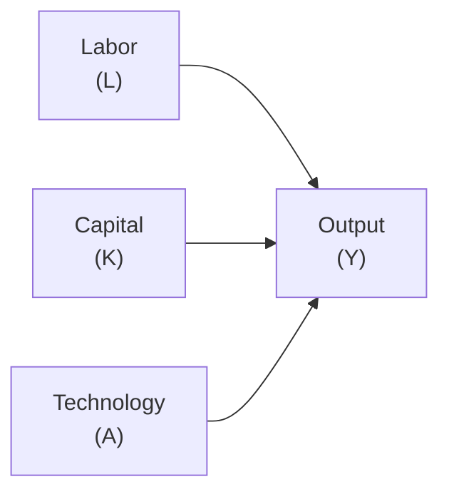
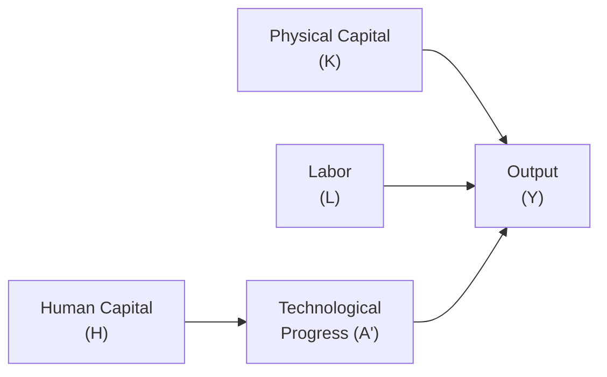

## Classical Growth Theory

Classical Growth Theory has its roots in the works of economists such as Thomas Malthus and David Ricardo. If you’ve ever read Malthus’s essays, you might recall a certain doom-and-gloom vibe: he was convinced population growth would outstrip our ability to produce enough food, driving living standards back down to, well, harsh subsistence levels. It sounds dramatic, but he was writing in an era where technological advancements were slow, and agriculture was heavily labor-intensive.

Fundamentally, Classical Growth Theory rests on the idea that resources (especially land) are scarce and subject to diminishing returns. If more and more labor is applied to a fixed amount of land, eventually each new worker adds less to total output. Over time, the result can be stagnation: as population rises, per-capita income hovers just above the point needed to sustain basic life. In modern terms, we might say the Classical view underestimated the power of technology and innovation to offset resource constraints.

Classical economists emphasized:
• Land and natural resources as constraints on growth.  
• Population growth as a key factor that can eat away at any temporary gains in per-capita income.  
• Minimal focus on technological or policy interventions to break this cycle.

Though historical in perspective, the Classical view is still relevant in discussions about resource depletion and environmental sustainability. However, modern reality has repeatedly shown that innovation can expand effective resource capacity.

## Neoclassical Growth Theory

If you’ve heard someone casually toss around the phrase “Solow Model,” they’re referencing the Neoclassical approach. Robert Solow and Trevor Swan, in the 1950s, developed a formal model explaining how capital (K), labor (L), and a mysterious factor called “technology” (A) drive output (Y). They assumed technology is exogenous—meaning it more or less arrives from outside the model as a gift from the innovation fairy. Let’s break this down.

A common production function in the Neoclassical framework is:

$$
Y = A \times f(K, L)
$$

• K is capital: machines, buildings, etc.  
• L is labor: the workforce.  
• A is total factor productivity, capturing technology’s role.  

### Diminishing Returns and the Steady State

Neoclassical Theory posits diminishing returns to capital: each additional unit of capital yields smaller incremental output than the one before. Over time, if you keep piling on capital while labor and technology remain unchanged, growth in output per worker eventually slows down. The economy converges to a steady state in which any further capital accumulation beyond the break-even level merely offsets depreciation. Growth in per-capita output then hinges on technological improvements.

### Convergence

A famous implication: open economies that start off with lower capital stock (and hence lower productivity) can grow faster by importing or imitating technology from wealthier countries. Eventually, they might “catch up” in terms of per-capita income. This concept is known as convergence. You can imagine a lesser-developed economy that invests in modern factories and logistics, leaps forward in productivity, and narrows the gap with developed nations.

### Visualization of Neoclassical Production

Below is a simple Mermaid diagram showing how labor, capital, and technology feed into overall output in the Solow Model:

Those three factors—L, K, and A—are the core building blocks. Meanwhile, the policy lesson from Neoclassical Theory is to foster an environment where capital accumulation is encouraged and technology can flow freely.

## Endogenous Growth Theory

Unlike the Neoclassical folks who treated technology as exogenous (manna from heaven, so to speak), Endogenous Growth Theory says technology emerges from within the economy. Scholars like Paul Romer argued that what really drives sustained long-run growth is investment in ideas—R&D, education, and innovation.

### Increasing Returns from Knowledge

In typical industrial production, you get diminishing returns (one more worker at a small factory doesn’t double output). But in knowledge production, you can achieve increasing returns. Once you create an idea, it can be used by many others at very little additional cost. For instance, the formula for a life-saving vaccine, once discovered, can be replicated around the world with only moderate expense. This potential for widespread usage of knowledge, known as knowledge spillover, can boost productivity far beyond the original inventor or research institution.

### Role of Policy

Endogenous Growth Theorists often emphasize that governments and private firms can shape innovation and growth. Policies supporting education, intellectual property rights, and R&D tax credits may accelerate the discovery of new technologies. If you recall a time you felt excited by a new smartphone upgrade—like it made your day more efficient—well, multiply that effect by billions of users. That’s the essential premise of Endogenous Growth: we all benefit from shared innovation.

### Visualization of Endogenous Growth Factors

A simple depiction of Endogenous Growth includes not only capital and labor but also explicit R&D and human capital accumulation:

Here, technology (A’) isn’t just a lucky break; it’s the result of research, innovation, and a well-educated workforce.

## Comparing the Theories

It’s helpful to see how these models differ in practice:

| Theory           | Key Drivers                | Role of Technology                | Policy Emphasis                                    | Concern for Diminishing Returns      |
|------------------|----------------------------|-----------------------------------|----------------------------------------------------|----------------------------------------|
| Classical        | Land, labor, and capital   | Little role for technology        | Minimal policy scope; warns about population growth| Very strong diminishing returns due to limited land |
| Neoclassical     | Capital accumulation, labor, exogenous tech | Exogenous; “arrives” from outside the model | Encourage saving/investment, allow tech inflow      | Diminishing returns to capital; must rely on tech for sustained growth |
| Endogenous       | Capital, labor, innovation (R&D, knowledge) | Endogenous; outcome of R&D and education | Active policy support for innovation, education, and knowledge spillover | Mitigated by increasing returns to knowledge creation |

## Productivity Growth and Capital Deepening

All three theories talk about capital deepening—raising the amount of capital per worker. Classical and Neoclassical theories say that eventually, adding more capital runs into the wall of diminishing returns. Endogenous Growth Theory, though, sees a potential workaround: if you expand the knowledge base simultaneously (e.g., training the workforce, investing in R&D), you can outpace diminishing returns through continuous innovation.

## Policy Implications and Strategies

• Classical Policy Perspective: Historically, classical economists saw a limited role for policy, given their concern about resource constraints and population growth overshadowing progress.  

• Neoclassical Policy Agenda: Focus on capital investment, decent infrastructure, stable legal frameworks, and open trade to enable technological transfer. The assumption is that technology will keep advancing exogenously if countries remain open and well-governed.  

• Endogenous Agenda: Stimulate investment in R&D, promote education, protect intellectual property, and foster collaboration across enterprises, universities, and research labs. Good policy can raise the long-run growth rate by expanding “the idea factory.”

## Pitfalls in Practice

• Relying too heavily on the Classical “resources are everything” stance can ignore the transformative power of technology.  
• Failing to invest in R&D under the assumption that technology is free and exogenous may stall productivity gains in the long run.  
• Overlooking diminishing returns can lead to overly optimistic capital spending. Neoclassical theory warns that capital alone won’t carry the day forever.  
• Underestimating how policy, institutions, or human capital can reshape an economy might cause complacency or misallocation of resources.

## Real-World Applications

Think of emerging markets that leapfrogged traditional stages of development by adopting digital and mobile technologies (like mobile payment systems in parts of Africa). A Neoclassical lens would say these countries are converging by importing advanced tech. An Endogenous perspective emphasizes the local entrepreneurs and knowledge networks that adapt or improve imported technologies for regional use.

## Connection to Portfolio Management and Capital Market Expectations

In the CFA Program context, these growth theories can inform your long-term economic outlook, impacting asset class forecasts. For example:

• If you believe in strong Endogenous Growth, you might anticipate robust equity returns in sectors that innovate heavily—like tech or biotech.  
• If you see a Neoclassical catch-up scenario for emerging markets, you might tilt your portfolio toward emerging-market equities in anticipation of faster convergence-based growth.  
• If a region faces resource constraints and population pressures (Classical scenario), you might expect weaker growth unless something changes technologically or institutionally.

Understanding the interplay of capital, labor, and technology is essential for framing macroeconomic expectations, scenario analysis, and stress-testing. You might integrate these growth assumptions into discounted cash flow models or multi-factor risk models when setting strategic or tactical asset allocations.

## Slightly Informal Anecdote

Sometimes I think about my grandmother’s stories of farming with old manual tools, and I can’t help but reflect on Malthus’s fear we’d all be out of food by now. Turns out, thanks to technology like GPS-guided tractors and genetically modified seeds, we’ve kept production way ahead of population—at least in most parts of the world. So maybe Malthus wasn’t totally wrong—who could see 200 years into the future? But it’s an example of how we shouldn’t underestimate the power of knowledge and innovation.

## Best Practices for Exam Preparation

• Familiarize yourself with the production function notation: Y = F(K, L, A).  
• Remember how the Neoclassical model solves for a steady state and how technology influences long-term growth.  
• Keep in mind the difference between exogenous and endogenous technology.  
• Be ready for item-set questions that ask about a country that invests in R&D (endogenous) versus a country that simply accumulates capital (neoclassical).  
• Practice scenario-based questions: “If a country invests heavily in education, which theory best explains the subsequent growth pattern?”

## Final Exam Tips

• In essay or constructed-response questions, succinctly define each growth theory and highlight the primary factors driving growth.  
• For item-set questions, watch for keywords like “diminishing returns,” “technology spillover,” or “convergence.”  
• If you see a question about government policies (e.g., R&D subsidies), connect them to Endogenous Growth Theory.  
• Show clarity in differential diagnoses: for instance, if a question says “Country X has high savings but no improvement in productivity,” suspect they’re stuck in a Neoclassical trap without exogenous tech or policy changes.

## References

• Romer, P. M. (1986). Increasing Returns and Long-Run Growth. Journal of Political Economy.  
• Solow, R. M. (1956). A Contribution to the Theory of Economic Growth. Quarterly Journal of Economics.  
• Weil, D. (2012). Economic Growth (3rd ed.). Routledge.

## Test Your Mastery: Growth Theories - Classical, Neoclassical, and Endogenous



### Which characteristic best describes Classical Growth Theory?

- [ ] Focus on endogenous technology improvements  
- [x] Limited land leading to diminishing returns and population pressure  
- [ ] Emphasis on continuous R&D investment  
- [ ] No role for labor in the production process  

> **Explanation:** Classical Growth Theory highlights how finite resources, especially land, limit long-term per-capita income gains once population expands.

### In the Neoclassical Solow Model, technology is usually treated as:

- [ ] Entirely within the control of government policy  
- [ ] Non-existent  
- [x] Exogenous  
- [ ] Dependent solely on labor inputs  

> **Explanation:** In the Solow Model, technology (A) arrives “from the outside.” It is not explained by investment or R&D within the model but is taken as given.

### Convergence in the Neoclassical model suggests that:

- [x] Poorer countries can potentially grow faster by adopting existing technologies  
- [ ] Richer countries always outgrow poorer ones due to advanced R&D  
- [ ] Labor growth alone ensures perpetual high output growth  
- [ ] Only resource-rich countries catch up with others  

> **Explanation:** Because of their lower capital base and capacity to adopt existing technologies, poorer nations may realize faster growth rates, eventually converging on the income levels of richer economies.

### According to Endogenous Growth Theory, one major source of sustained economic growth is:

- [ ] Expanding farmland  
- [ ] Natural resource abundance  
- [ ] Increasing the population growth rate  
- [x] Continuous knowledge spillovers and R&D  

> **Explanation:** Endogenous theories emphasize that knowledge creation and spillovers can propel long-run growth by offsetting diminishing returns to physical capital.

### A policymaker who believes primarily in Endogenous Growth Theory would most likely:

- [x] Increase funding for research, education, and innovation  
- [ ] Reduce all government interventions to zero  
- [x] Encourage strong intellectual property protections  
- [ ] Focus solely on building more factories with no regard to skill-building  

> **Explanation:** Endogenous Theory holds that growth is boosted by policies fostering human capital development, R&D, and knowledge spillovers, which breaks persistent diminishing returns.

### Malthus’s perspective on growth is best summarized by:

- [x] Population growth eventually outstrips growth in food supply  
- [ ] Endogenous technological progress can always outpace resource limits  
- [ ] Unlimited power to float real output above ever-rising demand  
- [ ] Capital and labor as the only inputs to production  

> **Explanation:** Malthus worried that population growth would press downward on living standards because resources were finite.

### Which term refers to poorer economies catching up with richer ones in per-capita income?

- [x] Convergence  
- [ ] Divergence  
- [x] Catch-up effect  
- [ ] Dynamic equilibrium  

> **Explanation:** “Convergence” or the “catch-up effect” is a key idea that countries with lower initial capital stocks can grow faster owing to higher marginal returns on capital.

### In the Solow model, when an economy reaches the steady state:

- [x] Net investment is zero because capital growth matches depreciation  
- [ ] Output declines indefinitely  
- [ ] Labor is no longer necessary for production  
- [ ] Technology stops changing  

> **Explanation:** The steady state occurs when new investment in capital just offsets depreciation, stabilizing the capital-to-labor ratio.

### Human capital accumulation is most emphasized under:

- [ ] Classical Growth Theory  
- [ ] Neoclassical Growth Theory only  
- [x] Endogenous Growth Theory  
- [ ] None of the mainstream growth theories  

> **Explanation:** Endogenous Growth Theory highlights the importance of human capital in generating new ideas, innovation, and long-run growth.

### "Increasing Returns to Scale" in Endogenous Growth Theory is primarily driven by:

- [x] Knowledge spillovers  
- [ ] Larger physical capital  
- [ ] Sustained population growth  
- [ ] Strict resource constraints  

> **Explanation:** Once new knowledge is created, it can be used repeatedly at little extra cost, creating potential for increasing returns from accumulated expertise.


