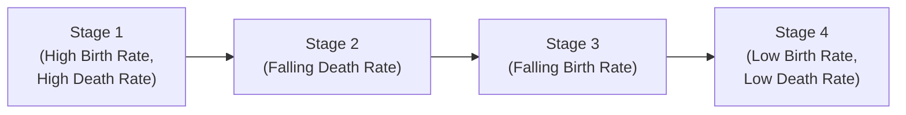

### Overview  
Let me start with a quick personal note—years ago, I remember visiting a small town that was once booming thanks to a massive influx of young workers. Over time, I noticed the population started aging, and, well, everything changed: local businesses struggled to find fresh talent, real estate prices drifted, and the entire area began rethinking its infrastructure. This simple anecdote really hammered home how demographics can shape an economy’s trajectory over the long run.

When we talk about economic growth, many of us dive straight into capital accumulation, technological development, or productivity improvements. But demographics? They often get overlooked. Yet factors like birth rates, life expectancy, and the age structure of a population can have an equally profound effect on labor supply, savings, investment, and everything in between. That’s what we’ll explore here—how different demographic forces influence economic growth, and how in turn they shape long-term capital market expectations.

### The Demographic Transition  
One of the most important conceptual frameworks to understand is the demographic transition. In short, this transition describes how populations shift from high birth and death rates to low birth and death rates as a country develops. Early in a society’s development, mortality rates tend to be high—limited healthcare, higher accident rates, poor nutrition, you name it—so families often have lots of children to compensate. Over time, improvements in medicine and sanitation reduce mortality rates, while birth rates remain relatively high, sparking a population boom. Eventually, birth rates start to drop—perhaps parents realize their children are more likely to survive, or maybe the culture shifts as urbanization increases. So you end up with a more stable and mature population structure with fewer children per family.

Here’s a simple diagram illustrating the typical stages of the demographic transition:

• Stage 1: Pre-industrial. Both birth and death rates are high, so the population is stable or grows slowly.  
• Stage 2: Death rates drop fast due to improvements in healthcare, farming, and overall nutrition, but birth rates still remain high, fueling rapid population growth.  
• Stage 3: Birth rates eventually decline too, reducing the rate of population growth.  
• Stage 4: Low birth and death rates result in a stable, mature population. Some models even consider a Stage 5, where birth rates may fall below death rates, causing population decline.

### Age Structures and Dependency Ratios  
When you hear about age structures, you might picture a population pyramid—a graphical illustration of a country’s age distribution. These pyramids can reveal if a nation’s population skews younger, older, or is relatively balanced.  

• A younger population can be an economic plus, because you’ve got a fresh labor force, new ideas, and loads of energy that can drive productivity. But here’s the catch: kids need education, infrastructure, and healthcare. This puts pressure on government resources and can stress household budgets.  

• An aging population (think of a “top-heavy” population pyramid) brings different challenges: healthcare costs typically rise, pension systems get strained, and businesses grapple with a smaller pool of working-age individuals. On the upside, older workers might hold substantial wealth—leading to a higher capital-to-labor ratio and potentially boosting output per worker.  

We often see these effects through something called the dependency ratio, defined as:
  
Dependency Ratio = (Population under 15 years + Population over 64 years) / Population aged 15 to 64  

When the ratio is high, each working-age individual is responsible for supporting a larger share of dependents. This can slow per-capita growth since resources may be redirected to non-productive uses (like education for children or healthcare for the elderly). Conversely, a lower dependency ratio (often seen during the “demographic dividend” stage) can spur investment, job creation, and rapidly rising incomes.  

### Population Growth, Labor Force, and Capital Accumulation  
Population growth on its own isn’t necessarily good or bad—it’s more about whether that influx of new workers can find productive employment and whether the available capital can be allocated effectively.  

• Rapid population expansion can push up the labor supply, but if the demand for labor isn’t keeping pace, wages might stagnate.  
• A moderate population growth rate, combined with robust investment in education and infrastructure, can create a sweet spot for balanced economic expansion.  
• If population growth is too slow or negative, you can face labor shortages, higher dependency ratios, and the threat of reduced consumer demand.

### The Demographic Dividend  
You might come across the term “demographic dividend”—that scenario where birth rates drop (so fewer mouths to feed) but the labor force is still large. The economy gains a productivity boost from a high proportion of working-age individuals. Typically, this can spur higher savings, more investment, and broad-based economic gains—if governments and businesses use the window of opportunity wisely. Countries in East Asia during the late 20th century famously leveraged this demographic dividend into remarkable growth runs.  

### Problems with Aging Populations  
Now, let’s be honest: talking about aging might make some of us a little anxious. I remember hearing a friend of mine say, “We’re about to become a world of retirees.” That might be an overstatement, but it is true that in many developed economies, fertility rates have dropped below replacement levels (about 2.1 children per woman). People are living much longer thanks to medical advances, so the share of older folks is rapidly growing.  

Key challenges:  
• Rising healthcare and pension costs: As more retirees claim benefits, the fiscal burden on public pensions grows.  
• Shrinking labor supply: Fewer young workers might hinder growth potential or increase labor costs.  
• Savers vs. spenders: Older populations often shift from accumulating assets to drawing down on them, which can affect capital markets and consumption patterns.

There’s a bright side: limited labor supply can encourage investment in automation, technology, and higher productivity. An older workforce might also hold substantial capital, which can keep interest rates low (due to a high supply of loanable funds).  

### Urbanization and Migration  
You often hear stories of people moving from rural areas to cities in search of better jobs, especially in emerging markets. This internal migration can be massive, pushing governments to (sometimes frantically) build out housing, transportation, and basic services. The shift benefits many workers and businesses, but also creates potential congestion, pollution, or social challenges.  

Cross-border migration matters, too—especially if a labor shortage in one country can be remedied by workers from another. Skilled immigration can spark big gains in productivity and innovation. Anecdotally, we see technology hubs around the world that thrive largely due to an inflow of highly educated immigrants. In some advanced countries with aging populations, allowing immigration might help stabilize the labor supply. On the flip side, large emigration from developing regions can cause “brain drain,” where the departure of highly skilled professionals hinders local growth.

### Demographic Shifts and Economic Variables  
Demographic changes—whether it’s a falling fertility rate or a rise in life expectancy—have ripple effects on economic variables. Let’s break down some of the most important ones:

| Population Characteristic          | Potential Economic Impact                                                       | Example                                      |
|------------------------------------|--------------------------------------------------------------------------------|----------------------------------------------|
| High Birth Rate, Falling Mortality | Rapid population growth, potential “baby boom,” higher investment in schools   | Many African nations in early-late transition|
| Aging Population                   | Rising healthcare/pension costs, possible worker shortage but higher capital   | Japan, parts of Europe                       |
| Urbanization                       | Increased labor productivity but strains on infrastructure and housing          | China, experiencing massive city growth      |
| High Migration (Inflow)           | Extra labor supply, possible skill diversification, potential cultural tensions | United States historically, Germany recently |
| High Migration (Outflow)          | Brain drain in origin countries, remittance inflows can help local consumption  | Latin American migration to the US           |

### Impact on Savings, Investment, and Consumption  
1. Savings Behavior: Households that anticipate longer retirements in an aging society may save more, boosting the supply of loanable funds. Younger societies can also save, but usually the need to spend on child-rearing, housing, and other life-cycle considerations might influence saving rates differently.  

2. Investment Dynamics: A large working-age population with fewer dependents can mean more discretionary income is channeled into investments, including housing, infrastructure, and capital markets.  

3. Consumption Patterns: An older population might shift consumption toward healthcare, leisure, and retirement services. Younger populations might prompt consumption of education, housing, and basic goods.  

4. Government Policy: Policymakers may alter tax rates, pension schemes, or healthcare regulations to cope with demographic stressors. For instance, governments might introduce incentives for families to have more children, or they may raise the retirement age to keep older workers in the labor force.  

### Demographic Policies and Interventions  
• Family Planning and Education: Improving access to family planning can reduce unplanned births, helping reduce fertility rates. Better child health and education can also break intergenerational cycles of poverty.  
• Pension Reform: With aging populations, governments might encourage private retirement savings or restructure public pensions to remain solvent as the support ratio falls.  
• Immigration Policy: Allowing skilled (and sometimes unskilled) workers into a country can partially offset labor shortages. Policies that integrate immigrants effectively can bolster growth while reducing social tensions.  
• Urban Planning: Governments that anticipate migration trends can plan for denser housing, expanded public transport, and greener, more sustainable urban environments.  

### Real-World Example: East Asia’s “Economic Miracle”  
Take East Asia from the 1960s to the 1990s—a region that serves as a classic example of harnessing the demographic dividend. Fertility rates declined, fewer dependents existed per worker, and governments and businesses poured resources into manufacturing, education, and technology adoption. Sure, that’s a simplification, but if you compare it to regions that never capitalized on their youth bulge, you can see how vital forward-looking policies are in determining whether a demographic shift leads to sustained growth.  

### Potential Pitfalls  
• Overreliance on a “young population advantage.” Being young helps, but if the workforce isn’t educated or if job creation lags, the youth bulge might lead to unemployment and social unrest.  
• Failure to adapt to an aging society. If governments ignore pension reform or do not encourage higher labor-force participation among older adults, a substantial drag on public finances can emerge.  
• Not managing urbanization effectively. Rapid internal migration puts huge pressure on city resources, leading to slums, pollution, and infrastructural collapse if not handled properly.  

### Exam Relevance and Final Tips  
From a CFA Level III standpoint, linking demographics to economic growth is key when forming capital market expectations or understanding risk factors for long-term investments. A shift in the dependency ratio can reshape interest rates, equity risk premiums, default risk, and even real estate demand. Essay and item-set questions could challenge you to interpret how a country’s demographic outlook affects asset allocation choices, or to evaluate the sustainability of pension funds under shifting age structures.

When you encounter exam questions on demographics, keep in mind:  
• Connect the dots between population changes, labor force size, and capital demands.  
• Think about how demographic transitions can influence consumption patterns.  
• Recall that government policies—like immigration, retirement ages, educational investment—can mitigate or compound demographic pressures.  

### References  
- Bloom, D. E., Canning, D., & Sevilla, J. (2003). The Demographic Dividend: A New Perspective on the Economic Consequences of Population Change. RAND Corporation.  
- United Nations (2022). World Population Prospects. [Link](https://population.un.org/wpp/)  

---

## Test Your Knowledge: Demographics, Economic Growth, and Development



### Which stage in the demographic transition typically features a rapidly declining death rate, but a still-high birth rate?

- [ ] Stage 1
- [x] Stage 2
- [ ] Stage 3
- [ ] Stage 4

> **Explanation:** In Stage 2, improvements in public health, agriculture, and medicine reduce death rates, while birth rates remain high, accelerating population growth.

### In an economy experiencing a demographic dividend, which of the following is typically observed?

- [x] A relatively large working-age population and fewer dependents
- [ ] Rapidly rising birth rates and mortality rates
- [ ] A small working-age population relative to the elderly
- [ ] Declining labor supply

> **Explanation:** A demographic dividend emerges when birth rates fall, but the working-age segment remains large for a period, allowing for increased savings and investment.

### A high dependency ratio in a country implies:

- [ ] Higher potential tax revenue from the working population
- [x] A heavier financial burden on the labor force to support non-workers
- [ ] Lower healthcare spending
- [ ] Increased labor force participation among retirees

> **Explanation:** With more dependents (either children or elderly), each worker shoulders a larger share of resources for those who are not working.

### Which macroeconomic variable is most directly influenced by rapid urbanization?

- [ ] Commodity price volatility
- [ ] Sovereign debt levels in developed countries
- [x] Infrastructure demand in urban centers
- [ ] Central bank FX reserves

> **Explanation:** A surge of rural-to-urban migration strains roads, housing, water, and sanitation systems, significantly increasing infrastructure demands.

### Which of the following is a potential benefit of an aging population?

- [x] Higher capital per worker
- [ ] Unlimited labor supply
- [ ] Permanently high consumption of durable goods
- [x] Potential increased automation investments

> **Explanation:** Older populations can hold substantial capital, boosting capital per worker. Labor scarcity may spur automation to cope with fewer available workers.

### A falling fertility rate combined with rising life expectancy will most likely lead to:

- [x] A higher proportion of older individuals in the population
- [ ] A continuously large youth population
- [ ] A dramatic reduction in pension costs
- [ ] Negligible changes in labor market dynamics

> **Explanation:** When fewer children are being born and people are living longer, the age structure tilts older, increasing old-age dependency ratios.

### A major challenge for cities dealing with large inflows of rural migrants is:

- [x] Increased demand for public transportation, housing, and sanitation
- [ ] Decreasing population density
- [x] Potential for rapid growth in informal housing (slums)
- [ ] An immediate surge in the elderly population

> **Explanation:** In many emerging economies, urban centers can become overcrowded, sometimes leading to inadequate housing, overburdened infrastructure, and informal settlement growth.

### Why might governments introduce policies to incentivize higher birth rates?

- [x] To stabilize or increase the future labor force
- [ ] To reduce public spending on education
- [ ] To eliminate cyclical unemployment entirely
- [ ] To decrease healthcare costs in the short term

> **Explanation:** When fertility rates fall below replacement levels, governments may encourage larger families to ensure a sustainable workforce and avoid excessive aging of the population.

### Which policy measure can help a country offset the challenges of an aging population?

- [x] Increasing retirement age
- [ ] Reducing labor participation
- [ ] Curtailing digital infrastructure development
- [ ] Banning foreign labor migration

> **Explanation:** Raising the retirement age keeps experienced individuals in the labor force longer, alleviating pressure on pension systems and labor shortages.

### If a nation's outward migration pattern primarily involves skilled workers leaving the country, what is the term commonly used to describe this phenomenon?

- [x] Brain drain
- [ ] Reverse migration
- [ ] Circular migration
- [ ] Transient refuge

> **Explanation:** “Brain drain” refers to the exodus of talented and educated workers from a country, often in search of better opportunities abroad.


