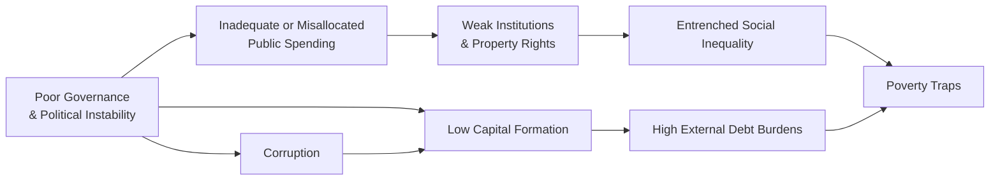

## Introduction

Sometimes we forget just how many hurdles stand in the way of a country’s progress. I once visited a region that had the most incredible potential—stunning natural resources, a young workforce hungry for growth, and a strategic geographical location. But, to my surprise, the local entrepreneurs were struggling to stay afloat, foreign investment was timid, and infrastructure was minimal. The main culprit? The lack of strong institutions and policies that could support development. It’s almost like wanting to grow a garden full of flowers but having rocky soil and no irrigation system—no matter how great the seeds, they just never flourish.

Barriers to economic development can seem dauntingly complex, especially when we look at them through a global lens. This section explores many of the most common obstacles: from poor governance to corruption to high external debt burdens. We’ll walk through real-world examples, illustrate theoretical underpinnings, and highlight how these barriers may apply to your exam context and real-life policy decisions. Staying true to your CFA® studies, we’ll also discuss how these issues connect to evaluation frameworks, investment risk analysis, and overarching macroeconomic considerations.

## Governance and Political Stability

In many ways, governance is the backbone of economic development. Good governance provides the framework for enforcing property rights, maintaining public infrastructure, and encouraging inclusive economic growth. On the flip side, poor governance—characterized by political instability, weak institutions, and blurred checks and balances—can undermine any progress from private or foreign investments.

When political transitions are unpredictable or corrupt, long-term investment plans can become incredibly risky. Investors worry that rules could be changed abruptly, or that new administrations might seize assets without fair compensation. This environment fosters uncertainty, scaring away precisely the kind of investment (both domestic and foreign) that is needed to jump-start growth.

For instance, in certain countries, changes in power have historically been accompanied by renegotiations or outright cancellation of mining or infrastructure contracts. Firms operating there got stuck in legal disputes, leading to steep financial losses. Under such conditions, new cross-border financing is often withheld or demanded at prohibitively high interest rates to compensate for the perceived political risk.

## Corruption and Weak Rule of Law

Corruption is a toxic force that can permeate an entire economy in ways that are sometimes invisible but always corrosive. Whether it’s bribery or nepotism or opaque public procurement processes, corruption funnels resources away from productive uses, limits competition, and ultimately weakens trust in institutions.

One widely used benchmark is the Corruption Perceptions Index (CPI) from Transparency International, which ranks countries based on perceived corruption. Generally, nations that score poorly on the CPI also struggle to attract stable long-term capital. In addition, corruption can exacerbate social inequalities by benefiting a small group of rent-seekers at the expense of the broader population.

Imagine a scenario where government officials accept bribes in allocating public tenders. Funds that should have built roads, schools, and healthcare clinics instead line pockets or finance lavish personal projects. Over time, these distortions hinder economic development and keep entire communities from improving their standard of living. This persistent lack of infrastructure then repels new investment, compounding the problem.

## Low Capital Formation

Capital formation is the fuel for economic growth. It includes physical capital—like factories, machinery, and infrastructure—and human capital—like education, technology skills, and health. Unfortunately, many developing economies face chronic underinvestment in both types. A shortage of domestic savings often leaves governments and local businesses heavily dependent on foreign direct investment or international aid.

When domestic saving is low, it limits the funds available for reinvestment. Households in very low-income environments generally spend most of their earnings on daily necessities. This means that the pool of savings for future projects is minimal, hindering the creation or expansion of businesses that could generate new jobs.

Some nations attempt to remedy this by borrowing from abroad. However, if institutions are fragile or debt burdens get unwieldy, capital flight may occur: local and foreign investors withdraw funds en masse due to fear of default, currency devaluation, or capital controls. This reaction can create a vicious cycle of instability.

## Inadequate or Misallocated Public Spending

Public spending, when managed effectively, can be a major catalyst for growth. Think of well-paved roads, robust education systems, reliable electricity grids, and consistent healthcare services. Such public goods reduce production costs and raise overall productivity, boosting economic development. But if spending is misallocated—often due to poor governance, corruption, or conflict—public resources might fail to deliver meaningful improvements.

Sometimes, external factors like conflicts or wars damage critical infrastructure. In other cases, even in peaceful times, government budgets are siphoned off by poor procurement oversight or directed toward projects with little social return. I once encountered a local official who proudly displayed a brand-new sports stadium in a region lacking functional roads and hospitals. Sure, the stadium was shiny, but it wasn’t exactly the best use of limited public money.

The paradox is that emerging markets often need the government to be an efficient spender to attract foreign investment. Without basic infrastructure and skilled workers, corporate investors see limited profitability potential—and that tends to reinforce a stagnation cycle.

## High External Debt Burdens

When external debt is massive relative to a country’s GDP, the dreaded concept of a “debt overhang” can emerge. This is a state where existing debt obligations crowd out new borrowing and investment because creditors worry they won’t ever be repaid. Debt overhang can be especially crippling for low-income countries, where tax revenues are already tight and currency volatility is high.

Large debt-service obligations limit how much governments can allocate to health, education, and infrastructure projects—key pillars of long-term development. If external lenders become nervous, they may impose punitive interest rates or refinancing conditions, leading to a cycle of dependency. During your exam, you might see scenarios illustrating how debt-servicing issues can trigger currency depreciation or fiscal crisis, thus reinforcing the link between macroeconomic stability and debt management.

## Institutional Barriers

Institutions are the rules of the game in a society. They include laws, regulations, and the organizations that enforce them. If institutions are well-designed and transparent, they usually incentivize innovation and productivity. But in many economies, institutional barriers—like excessive red tape, lack of regulatory clarity, or burdensome licensing requirements—stifle entrepreneurship.

Entrepreneurs, both local and foreign, assess risk-return trade-offs carefully. If the “rules of the game” keep changing, or if obtaining a license to operate a business takes years, people might opt to channel funds into informal markets or entirely different countries. The friction here isn’t just about the time and money wasted—it’s the opportunity cost of all that unrealized innovation.

Moreover, institutional corruption or nepotism can lead to a phenomenon known as rent-seeking, where certain groups exploit their influence to gain economic benefits at the expense of overall productivity. This behavior skews competition, driving away potential investors and dissuading would-be innovators.

## Inadequate Property Rights

Property rights encourage individuals and firms to invest in tangible and intangible assets, confident they’ll reap the benefits. Weak or ambiguous property rights, however, create uncertainty. Consider farmers who can’t formalize ownership of their land. They might never invest in better irrigation or higher-value crops because at any moment, their land could be seized or reallocated.

Urban areas can also be affected. In some countries, slum dwellers with no formal property titles live in constant fear of eviction. They can’t borrow against their homes, limiting the capital they can access to invest in microenterprises or other livelihood-improving initiatives. If such property-rights issues are widespread, they hamper the entire economy’s ability to unlock capital and boost productivity.

## Social Inequality and Education Gaps

Entrenched social inequality—often based on class, ethnicity, gender, or other divides—can severely limit a society's ability to realize its full economic potential. When large segments of the population are systematically excluded from quality education, healthcare, or job prospects, it’s like trying to compete in a relay race with half your team stuck behind the starting line.

Low literacy rates and inadequate training mean that workers can’t pivot to growing sectors or use new technologies effectively. It also means weaker domestic demand because many households lack purchasing power. Over time, these inequalities can foster political discontent, social unrest, and further instability—yet another reason investors might steer clear.

## The Dynamics of Poverty Traps

One of the most frustrating feedback loops in development economics is the so-called “poverty trap.” This occurs when low income leads to low saving, which in turn restricts investment, perpetuating low income. In many poor regions, insufficient infrastructure, inadequate healthcare, and the lack of basic financial services (e.g., microcredit or community banks) combine to lock communities in a state of persistent poverty.

Take a smallholder farmer who can’t afford high-quality seeds or fertilizer. Her crops produce modest yields, generating meager income. Because her savings are minuscule, she can’t invest next year in better farm technology. This cycle repeats, reinforcing the status quo. Over a generation, communities trapped like this see little improvement.

Such poverty traps aren’t purely financial. Social issues—like health crises (HIV/AIDS, malaria) or forced labor—can keep entire populations from reaching the threshold needed to break free of the cycle. Development economists often emphasize the crucial role of targeted interventions—cash transfers, microloans, healthcare expansions—to break these traps.

## Visual Overview of Barriers

Below is a simple Mermaid diagram summarizing the key barriers we’ve discussed in this section. Note that real-world interactions can be far more nuanced, but this gives you a big-picture snapshot of how different barriers interlink.

Each barrier doesn’t exist in isolation; rather, they collectively undermine the environment needed for sustained economic growth.

## Practical Insights and Common Pitfalls

• Ignoring Institutional Context in Investment Decisions: When analyzing a country’s growth potential, it’s tempting to focus solely on metrics like GDP growth and interest rates. However, the “soft” factors—corruption levels, quality of governance, transparency—often shape whether those growth rates are even reliable or sustainable.

• Failing to Recognize the Long-Term Effects of High Debt: Analysts sometimes treat debt levels as a purely fiscal matter. In reality, heavy debt burdens affect human capital, infrastructure spending, and investor confidence in ways that shape the entire economy for years.

• Underestimating Social Inequality: It’s not just about moral or humanitarian concerns. A severely unequal society may face chronic instability, brain drain, and reduced consumer demand, all of which hamper investments.

• Overlooking Property Rights: If legal structures are shaky, forecasting the returns on real estate or agriculture projects becomes guesswork. You might see case studies in your exam that hinge on property-rights disputes, resulting in volatile returns for investors.

## Real-World Case Example: Post-Conflict Recovery

Think about a hypothetical country emerging from decades of civil war. The new leadership might scramble to revive the economy by lowering trade barriers, seeking foreign capital, or privatizing state-owned enterprises. Unfortunately, if the judiciary is weak and legislative reforms are half-baked, private interests might dominate these processes. Faced with favoritism and opacity, honest foreign investors and local entrepreneurs might throw up their hands and leave. The tragedy is that, in the short run, these shady deals might enrich a select few while leaving the general population even more impoverished.

To break this negative cycle, the country needs to strengthen regulatory oversight, ensure fair competition, and reinvest any revenues into social services that benefit the majority. Otherwise, the root barriers to development remain, resulting in stagnant or even regressive growth.

## Exam Relevance and Portfolio Management Perspectives

From a CFA Level III standpoint, recognizing these barriers is crucial for building country-risk models, assessing sovereign bonds, and evaluating the viability of international equity markets in an asset allocation. You might be given an item set describing a fictional country with high external debt, inadequate infrastructure, and rampant corruption—and asked to forecast long-term GDP growth or determine the risk premium demanded by investors. Moreover, an understanding of these barriers can inform your approach to Environmental, Social, and Governance (ESG) investing, which is becoming increasingly significant in global capital markets.

## Conclusion

Barriers to economic development are multifaceted and deeply intertwined. Poor governance, corruption, and weak institutional structures can stifle growth just as effectively as insufficient capital, inadequate infrastructure, or entrenched social inequalities. For professionals evaluating emerging markets, recognizing these complexities is vital—both for ethical, long-term investing and for implementing sustainable development strategies.

Ultimately, economic development hinges on breaking vicious cycles—from poverty traps to debt overhangs—and fostering environments where innovation, entrepreneurship, and inclusive policies can thrive. With a firm grasp of these barriers, you’ll be better equipped to analyze country-level risks, design more robust investment hypotheses, and appreciate the intricate dynamics that shape global economic growth.

## References

- Sachs, J. D. (2005). The End of Poverty: Economic Possibilities for Our Time. Penguin Press.  
- Transparency International. Corruption Perceptions Index.  
  https://www.transparency.org/cpi  
- Acemoglu, D. & Robinson, J. A. (2012). Why Nations Fail: The Origins of Power, Prosperity, and Poverty. Crown.  

## Test Your Knowledge: Barriers to Economic Development



### Which of the following statements best describes how poor governance can hinder economic development?

- [ ] It automatically reduces a nation's foreign exchange reserves.
- [x] It increases uncertainty, discourages investment, and diverts public resources away from productive uses.
- [ ] It ensures better international relations through liberalized trade policies.
- [ ] It raises demand for high-quality infrastructure.

> **Explanation:** Poor governance creates instability and inefficiencies, deterring investment. Public spending is frequently misallocated due to ineffective oversight or corruption.

### When a country is trapped in a cycle of low income leading to low savings and perpetuating low investment, this is commonly referred to as:

- [ ] Rent-seeking.
- [x] A poverty trap.
- [ ] Debt overhang.
- [ ] An externality trap.

> **Explanation:** A poverty trap is a self-reinforcing mechanism where low incomes hinder savings and investment, locking in low growth.

### Which term describes a situation where existing high debt discourages new lending and investment in a country?

- [ ] Capital flight.
- [ ] Corruption Perceptions Index.
- [ ] Property-right impasse.
- [x] Debt overhang.

> **Explanation:** A debt overhang occurs when large debt obligations deter new investment due to fears the debt may never be fully repaid.

### A country’s Corruption Perceptions Index (CPI) score:

- [ ] Reflects actual, verifiable levels of bribery within private corporations.
- [x] Provides a perceived measure of corruption in the public sector.
- [ ] Guarantees a direct correlation to GDP growth.
- [ ] Is heavily influenced by the country’s inflation rate.

> **Explanation:** The CPI measures perceived corruption in the public sector and can affect investor confidence, but it does not guarantee direct correlations to growth.

### How does inadequate enforcement of property rights impede development?

- [x] It prevents businesses and individuals from confidently investing in assets.
- [ ] It guarantees lower debt levels in the near term.
- [ ] It forces all transactions to be completed in cash.
- [ ] It automatically increases international trade.

> **Explanation:** Weak property rights create uncertainty, discouraging people from sinking resources into business expansions or capital improvements.

### What is the main reason high external debt burdens can hamper growth?

- [ ] It always attracts more foreign direct investment.
- [ ] It reduces corruption by external agencies overseeing spending.
- [ ] It ensures prudent fiscal measures and balanced budgets.
- [x] It can crowd out public investment in essential services and deter new lending.

> **Explanation:** Heavy debt-service obligations reduce the fiscal space for key investments in areas like infrastructure, education, and healthcare, crippling long-term growth.

### Which of the following best illustrates rent-seeking behavior?

- [ ] A firm investing in employee training for better productivity.
- [ ] A foreign investor purchasing local government bonds.
- [x] An influential group gaining wealth through exclusive access to licenses instead of creating real value.
- [ ] A government raising taxes to fund universal health care.

> **Explanation:** Rent-seeking occurs when an entity expands its share of existing wealth without producing new value, typically through political or social influence.

### In the context of barriers to economic development, why is social inequality problematic?

- [ ] It enhances the incentive for wealthy individuals to invest more.
- [ ] It usually boosts consumer demand for luxury products.
- [x] It prevents large segments of the population from accessing education and job opportunities.
- [ ] It ensures stable currency exchange rates.

> **Explanation:** Severe inequality restricts broad-based participation in the economy. Excluded groups cannot fully contribute or consume, weakening growth potential.

### What is capital flight?

- [ ] The deliberate retention of domestic investment vehicles.
- [ ] The process by which the central bank inflates the money supply.
- [ ] A strategy to lower longstanding external debt levels.
- [x] The large-scale exit of financial assets from a nation due to economic or political instability.

> **Explanation:** Capital flight is when investors rapidly move money out of a country, often triggered by fears of instability, default risk, or policy changes.

### True or False: Improving governance and institutional quality is irrelevant to alleviating poverty traps.

- [ ] False
- [x] True

> **Explanation:** This statement is reversed. In reality, stronger governance and institutions are critical for breaking poverty traps by fostering transparency, rule of law, and incentives for investment.


