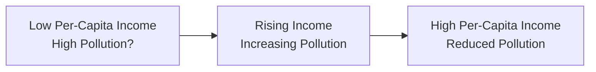

## Introduction and Context

I still remember when I was early in my career—working at a boutique investment firm—feeling super excited about large infrastructure projects that promised high returns. But, surprisingly, a local environmental group knocked on our door with questions about air pollution, water consumption, and waste management. At the time, I guess I thought: “Well, if it’s profitable, that’s the main point, right?” Over the years, you learn that profitability and sustainability aren’t mutually exclusive—they actually go hand in hand more often than you’d think. 

In the global context of macroeconomic growth, resource scarcity, and environmental challenges, analysts and portfolio managers must pay attention to the big picture: how the environment and economy interact. Throughout the CFA Level III curriculum, you’ve explored how real-world complexities—political, social, regulatory—can affect asset returns and portfolio performance. Environmental and sustainability considerations are just another, often overlooked, dimension that can materially impact valuations, risk assessments, and long-term portfolio policies.

Below, we’ll delve into several connected topics: externalities and their implications for growth, sustainable development concepts, the shape and significance of the Environmental Kuznets Curve, the looming risks and costs of climate change, and the financial markets’ responses through carbon pricing, green technology, and ESG integration. We’ll also discuss the portfolio-level impacts (like scenario analysis and hedging) and highlight advanced strategies that might surface on the CFA Level III exam, whether in essay format, item sets, or integrated case studies. 

## The Importance of Externalities

One key concept to keep in mind is the idea of externalities. Externalities refer to costs or benefits that bypass normal market transactions and fall on individuals or communities who did not directly choose to incur them. When we talk about environmental externalities, picture a chemical factory releasing toxic waste into a river: the factory might reduce its own production costs by disposing of waste this way, but local residents pay the price in terms of health or lost recreational fishing. 

Why does this matter for investments and portfolio decisions? If companies or industries do not internalize these costs, their apparent profitability may be overstated. Over the long run, as governments or regulators step in to limit harmful impacts, businesses that ignore environmental externalities may face hefty fines, forced technology upgrades, or other burdens that reduce their bottom line. That’s why so many top-down, macro-oriented valuation models now try to factor in future carbon costs or regulatory shifts. In advanced portfolio management, ignoring environmental externalities is a surefire way to get blindsided by longer-term risk exposures.

## Sustainable Development and Growth

Sustainable development, another major theme, involves meeting our current economic and social needs—like infrastructure, income, healthcare—without cannibalizing the ability of future generations to do the same. Here, the tension is that economic growth can drive a rising standard of living, but unbridled growth can lead to over-exploitation of natural resources and unsalvageable environmental degradation. 

Portfolio considerations often center on the “time horizon” dimension of sustainability: a short-term corporate strategy might degrade the natural capital upon which that enterprise depends, eroding future earnings potential. This is particularly visible in industries like agriculture, timber, or mining, where depletion of soil fertility or mineral reserves will ultimately reduce future cash flows. 

From a policy standpoint, sustainability calls for frameworks that incorporate resource conservation, renewable energy adoption, waste minimization, and social welfare. For investors, sustainability signals a stable, long-term source of returns. If you can fund projects that carefully balance resource usage with replenishment, you reduce the risk of sudden resource shortages, catastrophic environmental events, or severe regulatory clampdowns in the future.

## Environmental Kuznets Curve (EKC)

A central illustration in environmental economics is the Environmental Kuznets Curve (EKC). The general hypothesis is that pollution or environmental damage initially rises with early industrialization but eventually declines as per-capita income reaches higher thresholds. The typical shape is an inverted U-curve, suggesting that early-stage development features dirty industries, lax regulation, and minimal clean technology. Once societies become wealthier, they have the wherewithal (and the political willingness) to invest in environmental protection, adopt stricter regulations, and promote greener technologies.

In a stylized depiction of the EKC:



It’s not always guaranteed that this pattern will hold—some experts argue that there’s no inevitability about the “downward slope” at the high-income end. Nonetheless, the EKC framework is useful for forecasting potential pollution levels or the adoption rate of clean-tech solutions across economies at different stages of development. For a portfolio manager juggling cross-border investments, analyzing which stage on the EKC various client countries might be in could be critical for anticipating future environmental costs or regulatory shifts.

## Threat of Climate Change

Climate change can be thought of as the ultimate negative externality. Greenhouse gas emissions (notably carbon dioxide, methane, nitrous oxide) warm the planet, leading to extreme weather, rising sea levels, and shifts in agricultural yields—effects that often disproportionately harm lower-income countries. Regions highly dependent on agriculture or coastal tourism, for example, might be especially vulnerable, because if extreme weather events intensify, these areas can face severe disruptions in economic output and labor productivity.

Analysts must incorporate climate risk into macroeconomic forecasting. In scenario-based modeling, you might have a baseline scenario assuming moderate warming, and a stress scenario for severe climate impacts. If you’re practicing advanced portfolio management, you’ll weigh how climate volatility affects asset class correlations, bond default probabilities, insurance sector liabilities, as well as equity valuations in specific regions. The Intergovernmental Panel on Climate Change (IPCC, 2021) has lengthy reports quantifying potential temperature pathways and the associated macro-financial losses, which can serve as a research springboard when building your own climate scenario frameworks.

## Carbon Pricing and Green Technology

Economists and policymakers often propose carbon pricing as a means to internalize at least some portion of the negative externalities associated with greenhouse gas emissions. There are multiple ways to apply carbon pricing:

• Carbon Taxes: A direct tax on each unit of greenhouse gas emissions. Firms must pay more if they pollute more. This is straightforward but can be politically challenging.  
• Cap-and-Trade: Authorities fix a total emissions ‘cap,’ distributing or auctioning permits that allow firms to emit a certain amount of carbon. Firms can trade permits, providing an incentive for the cheapest pollution reducers to do so and then sell their unused permits to higher-cost polluters.  

As more countries adopt such schemes, portfolio managers have to stay alert. You might see advanced item-set questions in the CFA exam that revolve around a scenario where a hypothetical country proposes a cap-and-trade program and you must gauge its impact on corporations’ operating margins or the effect on the supply-demand structure for certain commodities. 

Meanwhile, green technology is rising in importance, including renewable energy (solar, wind, hydro), electric vehicles, energy-efficient manufacturing techniques, and advanced recycling or recapture methods. From a Level III vantage point, green tech can form part of sector rotation strategies, thematic investing, or factor-based approaches. If you see a scenario describing a global shift to renewable power, you might be tested on how to rebalance your portfolio between fossil-fuel-intensive sectors and green innovators.

## Integrating ESG Criteria

Environmental, Social, and Governance (ESG) investing has gained strong momentum. At its core, ESG investing means factoring in environmental performance, social implications (like labor conditions or community relations), and governance quality (like board independence, shareholder rights, executive compensation) into your investment screening and portfolio construction. On the environmental side, potential metrics include carbon intensity, resource use efficiency, and waste management. 

From a portfolio management perspective, implementing ESG can take several forms:

• Negative Screening: Excluding companies with poor environmental profiles from the universe altogether.  
• Positive Tilt or Best-in-Class: Overweighting businesses with strong ESG performance.  
• Engagement and Stewardship: Actively influencing corporate behavior through voting proxies or direct engagement with management on environmental issues.

While it’s tempting to think of ESG as a purely ethical or philanthropic angle, the key takeaway for advanced exam-level knowledge is materiality: some ESG factors can materially affect financial performance and risk exposures. In the context of climate change, for instance, heavy reliance on fossil fuels might become a stranded asset risk over the next decade if regulations tighten or technology improves. Incorporating an ESG lens can potentially mitigate these longer-term risks or unearth new sources of alpha.

## Portfolio Impact and Strategies

From a top-down perspective, environmental and sustainability considerations interplay with strategic asset allocation decisions. If you anticipate strong policy action on carbon emissions, you might adjust your strategic weights in carbon-intensive industries (e.g., utilities, energy) and shift capital to renewable energy or technology. At the same time, in fixed-income portfolios, climate transition risks can feed into a higher risk of default for heavily levered carbon-intensive companies or for emerging market sovereigns vulnerable to climate disruptions. 

Here are some advanced points relevant to the CFA Level III exam:

• Scenario Analysis: Evaluate potential portfolio outcomes under different climate policy pathways—such as a Paris Agreement compliance scenario (well-below 2°C warming) versus a business-as-usual scenario.  
• Factor Risk Management: If climate risk becomes a recognized systematic risk factor, you’ll need to manage it through factor-based hedging or selective asset reweighting.  
• Thematic Investments: Thematic funds focusing on water scarcity, waste management, or energy innovation can provide alpha opportunities, but also come with specialized risk exposures that must be carefully assessed.  
• Engagement Strategies: For large institutions, engaging with corporate boards on climate risk can reduce negative externalities while potentially preserving portfolio value over the long term.

## Practical Example: Python Scenario Framework

Below is a short Python snippet that showcases how analysts might simulate carbon cost impacts under various policy scenarios. Although the full detail might exceed the scope of the exam, you should understand how climate policy assumptions could affect corporate cash flows, discount rates, and valuations in your final portfolio.

```python
import numpy as np

# base_cash_flow: company's current cash flow
# emissions: company's annual CO2 emissions

def carbon_pricing_impact(base_cash_flow, carbon_price, emissions, elasticity_factor):
    # Some portion of emissions might be reduced
    reducible_emissions = emissions * elasticity_factor * carbon_price
    effective_emissions = emissions - reducible_emissions
    # Annual carbon cost
    carbon_cost = effective_emissions * carbon_price
    new_cash_flow = base_cash_flow - carbon_cost
    return new_cash_flow

base_cf = 1000000   # $1 million
co2_tons = 20000
price_scenario = [5, 30, 60]   # $5, $30, or $60 per ton
elasticity = 0.001

for p in price_scenario:
    result = carbon_pricing_impact(base_cf, p, co2_tons, elasticity)
    print(f"Carbon price: ${p}/ton, Adjusted Cash Flow: ${result:,.0f}")
```

In a more extensive investment model, you would link the “Adjusted Cash Flow” figure into a valuation approach, discount these flows at a relevant cost of capital, and then test how your portfolio’s total market value might shift under each scenario.

## Exam Tips and Pitfalls

• Make sure you can explain how externalities translate into investment risk—don’t just define them. The exam might require a short essay or item-set rating how a proposed environmental policy could affect the profitability of distinct industries.  
• Be ready to link the Environmental Kuznets Curve to a real-world scenario. They might hand you a country’s GDP data and pollution stats, then ask you to identify if the country is on the “rising” or “falling” segment of the curve.  
• Climate risk has multiple angles: direct physical risks (storms, floods) and transitional risks (carbon pricing, stranded assets). Possibly you’ll see a multi-part question that wants you to do both a fundamental analysis of an energy firm’s exposure and a scenario construction for a broader portfolio.  
• For carbon pricing, understand how cap-and-trade differs from a carbon tax in terms of cost certainty vs. emissions certainty. This difference can drastically alter the magnitude of risk for portfolio constituents.  
• On ESG investing, the exam might test your ability to differentiate negative screening, positive tilting, or active engagement. Or to weigh the pros and cons of each approach from a risk-return perspective. 
• Finally, remember that any strategy ignoring sustainability is vulnerable to regulatory shocks and reputational damage.

## References and Further Reading

- Stern, N. (2006). The Stern Review on the Economics of Climate Change. HM Treasury.  
- IPCC (2021). Climate Change 2021: The Physical Science Basis. [Link](https://www.ipcc.ch/report/ar6/wg1/)  
- Pearce, D., Markandya, A., & Barbier, E. (1989). Blueprint for a Green Economy. Earthscan.  
- CFA Institute. (Current Edition). CFA Institute Code of Ethics and Standards of Professional Conduct.  
- Task Force on Climate-related Financial Disclosures (TCFD) Guidelines.  
- World Bank Carbon Pricing Dashboard.  

  
## Test Your Knowledge: Environmental and Sustainability Factors in Portfolio Decisions



### How do externalities primarily impact investment analysis?

- [x] They cause certain costs to be excluded from a firm's direct financial statements, potentially skewing profit estimates.
- [ ] They primarily alter tax rates on low-income households.
- [ ] They affect marketing budgets for consumer goods companies only.
- [ ] They are only relevant when analyzing index-based investments.

> **Explanation:** Externalities often go unaccounted for in a firm’s expenses, which can distort profitability measures. Over time, these costs could be internalized through regulation or shifting social preferences, affecting long-term return projections.

### Which statement best reflects the Environmental Kuznets Curve (EKC)?

- [x] It describes an inverted U-shape relationship between pollution and per-capita income.
- [ ] It shows a consistent decrease in pollution as income rises.
- [x] It suggests that pollution levels may decrease once an economy has reached a certain maturity and invests in cleaner technology.
- [ ] It proves that low-income countries are automatically more polluting.

> **Explanation:** The EKC theory states that pollution rises in the early stages of economic growth but can decline in more advanced stages. However, this outcome is neither guaranteed nor linear across all contexts.

### A primary concern about climate change for portfolio managers involves:

- [x] Physical and transition risks that can increase volatility and reduce returns.
- [ ] A negligible impact on energy equities.
- [ ] Improved returns in highly levered, carbon-intensive industries.
- [ ] Guaranteed outperformance of government bonds.

> **Explanation:** Climate change can impose physical damage on assets, and transition risks like regulatory changes and technological shifts can severely affect carbon-intensive business models.

### Under a carbon taxation system:

- [x] Firms incur a direct cost per unit of emissions, which can squeeze their operating margins.
- [ ] Firms have unrestricted emissions at a predetermined cost level with no financial implications.
- [ ] High-polluting companies always thrive under carbon taxes.
- [ ] There is no difference from a cap-and-trade system.

> **Explanation:** Carbon taxes impose a fixed charge for every ton of emissions, which firms pay regardless of how much they emit. By contrast, in cap-and-trade, the government sets a cap on total emissions, and firms trade permits under that cap.

### Which approach to ESG integration focuses on identifying and investing only in companies with the best environmental practices within each sector?

- [x] Best-in-class or positive tilt
- [ ] Negative screening
- [x] Positive screening
- [ ] Broad-based market weighting

> **Explanation:** Best-in-class methods overweight companies with superior ESG performance relative to peers, whereas negative screening excludes certain industries or companies entirely.

### How can scenario analysis help portfolio managers address climate risk?

- [x] By showing how portfolio values shift under varied assumptions about climate policies and impacts.
- [ ] By eliminating all potential climate-related losses by investing in short-term government bonds.
- [ ] By guaranteeing higher equity returns if carbon taxation is introduced.
- [ ] By ignoring systematic climate risk factors.

> **Explanation:** Scenario analysis allows for “what-if” modeling of different climate pathways, evaluating how each scenario might shift asset values and correlations.

### If a regulatory authority imposes strict emissions caps, which of the following is most likely?

- [x] Certain sectors with high emissions intensity may face increased costs or production constraints.
- [ ] Carbon-intensive sectors will remain unaffected.
- [x] Companies with more efficient technologies could benefit from selling unused permits.
- [ ] The price of carbon allowances will trend to zero instantly.

> **Explanation:** A cap on total emissions incentivizes firms to reduce pollution or buy allowances; more efficient firms can profit from selling surplus permits to higher-cost polluters.

### A portfolio manager looking to invest in green technologies might focus on:

- [x] Industries developing renewable energy solutions and energy-efficient processes.
- [ ] Only blue-chip brands with static business models and no R&D spending.
- [ ] Stocks unrelated to energy or environmental sectors.
- [ ] Companies with high historical government subsidies but no current revenue.

> **Explanation:** Green tech investments revolve around firms innovating in renewables, efficient manufacturing, recycling, carbon captures, and related processes. R&D and future scalability are often crucial to their value proposition.

### In ESG terminology, an externality is best defined as:

- [x] A cost or benefit that affects a party who did not choose to incur it.
- [ ] A company’s direct material expense related to manufacturing.
- [ ] A cost that always shows up on the company’s income statement.
- [ ] A government-imposed tax rate.

> **Explanation:** An externality is an unintended consequence—cost or benefit— felt by third parties outside a direct transaction or decision, such as communities affected by industrial pollution.

### The statement “Pollution eventually declines after reaching a certain level of development” is:

- [x] True
- [ ] False

> **Explanation:** According to the Environmental Kuznets Curve hypothesis, once an economy matures, its pollution levels may diminish thanks to regulation, better technology, and public demand for a cleaner environment. However, this is not automatic nor guaranteed.


