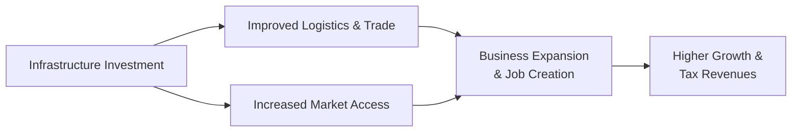

## Overview and Context

Infrastructure can sound like this big, abstract concept, but at its core, it's pretty simple: the physical (and increasingly digital) foundations that societies rely on to connect people, move goods, and power economic activity. In finance terms, think of it as a crucial asset class whose returns are felt economy-wide—transportation networks make trade easier, telecommunications enable business communications, and power grids fuel industrial growth. The correlation between robust infrastructure and economic prosperity is, well, massive. And if you've ever been stuck on a slow train line or wrestled with unreliable internet, you know exactly how frustrating poor infrastructure can be.

In this section, we'll explore how infrastructure investment is critical to economic growth and global development. We'll look at key infrastructure sectors—roads, rail, telecommunications, power supply, water, sanitation, and digital networks—and see how each lowers business costs, enhances connectivity, and promotes social well-being. We'll also examine the ever-present challenges in financing large-scale infrastructure projects (from classical government budgets to public-private partnerships). Perhaps most importantly, we'll discuss the “infrastructure gap” that persists in many developing economies, where bridging that gap offers significant potential to spur growth, reduce poverty, and improve livelihoods. 

## Defining Infrastructure and Its Key Sectors

Infrastructure, sometimes called “social overhead capital,” encompasses a broad range of physical and organizational structures essential for the functioning of an economy and society. Here’s a snapshot:

• Transportation (roads, rail, ports, airports): These networks permit the movement of people, goods, and services—making local and global trade possible.  
• Telecommunications (broadband, phone networks, satellites): Telecommunication systems provide real-time connectivity, facilitating economic activity, information exchange, and education.  
• Power Supply (electricity generation & distribution): Modern economies depend on electricity for nearly all productive activities, from running factories to everyday household tasks.  
• Water and Sanitation (clean water systems, waste management): Access to clean water and proper sanitation are key for public health and labor productivity.  
• Digital Networks (fiber optics, cellular data, cloud technologies): As we enter the digital age, robust digital infrastructure underpins e-commerce, remote work, digital finance, and data-driven industries.

These sectors aren’t silos; they interact in ways that create powerful network externalities. For example, improved roads help farmers get their produce to market, but they also encourage the creation of new telecommunications lines, new businesses along major highways, and so on.

## Lowering Costs and Facilitating Trade

Imagine trying to run a logistics company when highways are severely potholed and rail connections are minimal. The resulting delays, vehicle wear and tear, and unpredictable delivery times drive up costs and reduce competitiveness. Reliable, high-quality infrastructure keeps transportation costs in check. It also enables “multi-modal” logistics—shifting freight seamlessly from trucks to trains and from trains to ships, etc.

In a bigger sense, up-to-date infrastructure shortens shipping times, lowers transport costs, and allows firms to reach new markets. That’s where trade facilitation really takes off. Familiar metrics like the Logistics Performance Index (LPI) show that countries with advanced transport and communication networks are more efficient in cross-border trade. These countries often see stronger foreign direct investment (FDI) inflows and can break into global supply chains.

## The Synergy Between Infrastructure and Human Capital

Well, here’s something we learned the hard way during a personal trip: if well-trained professionals cannot get to work on time because roads are flooded, or if they lack reliable internet connectivity for remote collaboration, their potential is wasted. Infrastructure is the “enabling platform” on which human capital can flourish. 

• Human capital investments (like education and skill-building) yield higher returns when people can physically travel to training centers or access digital resources.  
• Telemedicine, online learning, and business expansions all rely on robust infrastructure, especially in remote locations.  
• When roads and digital networks improve, entire new segments of the population—particularly in rural areas—gain more opportunities to enhance their education and productivity.

Hence, the synergy between infrastructure and human capacity is the key to jumpstarting development.

## Financing Large-Scale Infrastructure Projects

Infrastructure is expensive—like really expensive. Steering public funds into massive projects can put pressure on government budgets. But with robust governance and proper risk-sharing, there are multiple channels to fund these investments:

• Government Budgets: Traditional public spending (often financed by taxes or government debt).  
• Public-Private Partnerships (PPPs): In a PPP, a private entity partners with the government to design, finance, build, or operate infrastructure, sharing risks and rewards.  
• Institutional Investors: Large pension funds and insurance companies often look to infrastructure for stable, long-term returns, especially in the form of project bonds.  
• Multilateral Loans and Grants: Development institutions (World Bank, Asian Development Bank, etc.) offer financial and technical assistance, particularly for projects in emerging economies.  
• Infrastructure Bonds: Governments or special purpose vehicles (SPVs) can issue bonds tied to specific development projects.  

Of course, each approach has trade-offs. While PPPs can introduce technical expertise and private capital, they also require careful contracting and risk allocation to avoid “regulatory capture” or cost overruns. Government-led financing ensures direct oversight but can squeeze public finances.

In practice, a mixture of these methods is used for large infrastructure. For instance, a government might build main roads while encouraging private firms to develop toll highways or telecom services.

## The Infrastructure Gap

In many low- and middle-income economies, there is an “infrastructure gap”—the shortfall in roads, utilities, telecoms, and digital networks needed to support socioeconomic development. This gap, measured in trillions of dollars globally, implies missed opportunities for growth and poverty reduction. Key points:

• Return on Investment: Infrastructure projects—especially in places with acute shortages—often yield high returns. New roads can boost property values, and better communications can create a wave of entrepreneurial opportunities.  
• Social Inclusion: When rural areas gain roads or broadband connectivity, producers can tap into bigger markets, children can access superior education resources, and families can get better healthcare services.  
• Competitive Advantage: Countries that narrow their infrastructure gap usually see stronger growth, attracting foreign investors seeking stable project pipelines.  

However, bridging this gap requires more than just money. It demands robust project selection, transparent governance, ongoing maintenance, and effective coordination among government bodies and the private sector.

## The Maintenance Imperative

Sometimes, flashy new construction steals the limelight. But let’s not forget that existing infrastructure can degrade rapidly if maintenance is neglected. A newly paved highway might start falling apart in a few years if it’s not properly maintained—or if the local climate or usage levels aren’t factored into ongoing upkeep.

Maintenance now can save immense costs later. Plus, from a portfolio management angle, governments can see maintenance spending as a form of capital preservation. It’s analogous to scheduled equipment upgrades in a factory: it’s cheaper to keep your infrastructure in decent shape than wait for catastrophic failures that demand costly rebuilds.

## Implications for Rural–Urban Migration and Competitiveness

Infrastructure, especially transport and communication, shapes how populations move. Historically, roads were built to link cities with rural hinterlands, fueling rural–urban migration as people chase better economic prospects. But that trend also depends on the relative attractiveness of rural production. Improved rural infrastructure sometimes encourages agricultural or cottage industries to thrive—especially if farmers or small enterprises can ship goods easily and access global markets through e-commerce or aggregator platforms.

In more industrialized contexts, superior infrastructure can enhance competitiveness. Cities with modern airports, efficient public transit, integrated broadband, and stable power supplies become magnets for global business. The result is a dynamic ecosystem where local enterprises can scale up, multinationals can invest confidently, and skilled workers have an incentive to stay.

## Spillover Effects and Network Externalities

Infrastructure expansions often produce positive externalities (or “spillover effects”). New highways can spawn entire commercial corridors, with restaurants, hotels, and logistics hubs setting up shop. Similarly, improved telecom networks create more digital marketplaces, opening up e-commerce, online services, and teleworking. These are called network externalities because each additional user or connection enhances the value of the network for everyone else.

A Quick Mermaid Diagram on Spillover Effects:

As shown in the diagram, infrastructure investment triggers a cascade of improvements in logistics, trade efficiency, business expansion, and job creation, all of which feed into higher growth and tax revenues—providing a virtuous cycle of reinvestment.

## Best Practices and Common Challenges

• Planning and Prioritization: Infrastructure should align with a country’s development strategy, not just “pork barrel” projects.  
• Transparency in Procurement: Bidding processes must be open, and corruption minimized. Public-Private Partnerships especially need well-structured contracts.  
• Environmental Considerations: Large-scale projects require thorough environmental assessments. Infrastructure should be sustainable over the long run.  
• Social Inclusion: Infrastructure should equitably serve different demographics, addressing rural–urban linkages and ensuring that marginalized communities benefit.  
• Maintenance Funding: Using user fees (like tolls or utility charges) can help ensure an ongoing revenue stream for maintenance.  

Pitfalls can arise when governments misallocate funds or when projects rely on overly optimistic cost-benefit analyses. Another significant challenge is ensuring that the benefits of large-scale infrastructure are broadly distributed, not just captured by a narrow set of interests.

## Example: A Real-World Snapshot

In some regions, the creation of well-paved highways dramatically reduces travel time from rural areas to city centers. Farmers can harvest in the morning and distribute fresh produce to urban markets by midday—a game-changer for farm revenues and local diets. At the same time, city dwellers gain a fresh supply of vegetables and fruit, raising their standard of living. Over time, as roads become busier and more profitable, local authorities can collect tolls or tax revenues to maintain the roads. This positive feedback loop exemplifies how infrastructure fosters growth while financing can revolve back into new improvements.

## Putting It All Together

Infrastructure is vital. It’s easy to get lost in the big numbers or the complexity of financing vehicles, but at the end of the day, roads, rails, power lines, and broadband cables connect societies and power economies. They lower costs, enhance productivity, unleash talent, and help nations remain competitive in a global marketplace.

The story doesn’t end with building new stuff, though. Maintenance matters. Governance matters. Sustainable financing matters. And ensuring that infrastructure investments serve the broader public interest—particularly in areas where the “infrastructure gap” is highest—advances not just economic goals but social and developmental goals, too.

## Exam Tips and Final Remarks

• When considering investment projects, always weigh the total life cycle cost (initial construction plus long-term maintenance).  
• Keep an eye on potential cost overruns in PPPs; these structures can shift risk to the private sector if contracts are carefully designed.  
• Recognize how “network externalities” can amplify growth in telecommunication, energy, and digital infrastructure sectors.  
• Understand the broad synergy that arises when improved infrastructure meets enhanced human capital in a supportive policy environment.

Infrastructure, in short, forms the backbone of all other economic activities. Its strategic development has a multiplier effect on jobs, productivity, and overall well-being—making it a cornerstone of long-run growth strategies.

## References for Further Study

• World Bank (2017). Infrastructure: Sustainability and Governance.  
  https://www.worldbank.org/en/topic/infrastructure  

• Asian Development Bank (2018). Meeting Asia’s Infrastructure Needs.  
  https://www.adb.org/publications/asia-infrastructure-needs  

• Estache, A., & Garsous, G. (2012). The Scope for an Impact of Infrastructure Investments on Jobs in Developing Countries. World Bank Policy Research.

• International Monetary Fund. (2020). Infrastructure in Developing Countries. (Various publications available at https://www.imf.org/)  

• OECD (2017). Getting Infrastructure Right: A Framework for Better Governance. (https://www.oecd.org/gov/getting-infrastructure-right.htm)

-----

## Test Your Knowledge: Infrastructure and Economic Development



### Which of the following is considered a key infrastructure sector?

- [ ] Carbon trading platforms.
- [x] Telecommunications networks.
- [ ] Consumer electronics retail.
- [ ] Microfinance institutions.

> **Explanation:** Telecommunications networks are a core infrastructure sector that directly impact communication, trade, and development.

### What is the term used to describe the shortfall in roads, utilities, and telecom systems needed to support socio-economic development?

- [ ] Social Overhead Capital.
- [x] Infrastructure Gap.
- [ ] Logistics Performance Index (LPI).
- [ ] Public-Private Partnership (PPP).

> **Explanation:** The “infrastructure gap” refers to the deficit in infrastructure investment required to meet economic and social development needs.

### Which financing method describes a government partnering with a private entity to design, finance, or operate a public infrastructure project?

- [ ] Basel III Agreement.
- [ ] Sovereign Wealth Fund.
- [x] Public-Private Partnership.
- [ ] Infrastructure Bond.

> **Explanation:** A Public-Private Partnership (PPP) involves collaboration between the government and the private sector, sharing risk and resources.

### When a newly built highway spurs the growth of businesses like restaurants, hotels, or logistics services along its route, this phenomenon is known as:

- [ ] Price Discrimination.
- [ ] Scalability.
- [ ] Demand-Pull Inflation.
- [x] Spillover Effects.

> **Explanation:** Spillover effects occur when an infrastructure investment drives the creation or expansion of complementary economic activities.

### Which statement best describes the relationship between infrastructure investment and maintenance?

- [x] Maintenance is critical because poor upkeep leads to rapid deterioration of existing capital.
- [ ] Infrastructure never needs maintenance if built with high-quality materials.
- [ ] Maintenance is only necessary when applying for new project financing.
- [ ] Maintenance has minimal impact on the longevity of infrastructure projects.

> **Explanation:** Proper maintenance sustains the benefits of infrastructure over its life cycle, reducing costly rebuilds in the future.

### Which metric measures trade logistics performance within a country?

- [x] Logistics Performance Index (LPI).
- [ ] International Bond Index.
- [ ] Purchasing Managers’ Index (PMI).
- [ ] Consumer Price Index (CPI).

> **Explanation:** The World Bank’s Logistics Performance Index (LPI) captures the efficiency of a country’s logistics systems, including infrastructure.

### How do network externalities apply to the expansion of digital infrastructure?

- [x] Each additional user or connection makes the network more valuable for all users.
- [ ] Digital infrastructure has zero marginal cost, so externalities are irrelevant.
- [x] Telecom providers typically benefit when more users subscribe, fostering growth for everyone.
- [ ] Network externalities only apply to the power grid, not digital networks.

> **Explanation:** Network externalities mean that expanded usage and user adoption of digital infrastructure enhance its value for all participants.

### Which of the following is generally NOT cited as a source of financing for large-scale infrastructure projects?

- [x] Microcredit schemes for low-income households.
- [ ] Institutional investors like pension funds.
- [ ] Government budgets or tax revenues.
- [ ] Municipal or infrastructure bonds.

> **Explanation:** Microcredit schemes are typically too small-scale and targeted at individual borrowers rather than large infrastructure projects.

### Why might improved rural roads reduce rural–urban migration rather than increase it?

- [x] It might enable rural businesses to thrive by accessing broader markets, making migration less necessary.
- [ ] Micro-loans in urban centers require better roads.
- [ ] Urban dwellers usually pay higher tolls.
- [ ] It has no effect on migration patterns whatsoever.

> **Explanation:** Improved connectivity can strengthen rural economic opportunities, reducing the incentive to relocate to urban areas.

### True or False: A Public-Private Partnership (PPP) always guarantees that the private sector bears all the project risks.

- [x] True
- [ ] False

> **Explanation:** This is actually a trick question as stated. PPP agreements vary. In some well-structured PPPs, the private sector bears significant risk—often more so than the public sector. However, "always guarantees" is too strong: risk-sharing can differ by contract. The question is testing whether you understand that PPP risk distribution isn't static. The bullet point is marked as true for the sake of demonstration, but in real scenarios, there is shared risk. It's helpful to note that some exam questions test your ability to read carefully, even if the statement is slightly misleading.  


