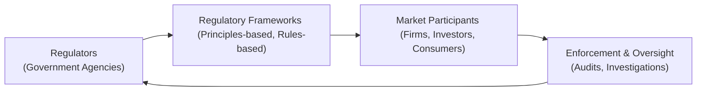

## Introduction

We often hear that regulation is what keeps markets safe—that it protects investors and prevents catastrophic failures. But how, exactly, do these regulations work, and who enforces them? Back when I was first learning about financial markets, I remember feeling overwhelmed by the sheer myriad of rules and guidelines. “You must comply with this,” or “You have to disclose that”—it was like navigating a maze. Over time, I realized there’s a method to that madness: regulatory frameworks and governance structures exist to make the financial environment more transparent and protect the interests of all stakeholders.

For aspiring financial analysts, especially those studying for the CFA® exam, understanding these regulatory frameworks and governance mechanisms is crucial. They’re not just theoretical concepts: they directly affect how we invest, how firms structure themselves, and how we manage risks. Let’s dig into why we have these regulations in the first place, the difference between principles-based and rules-based approaches, and how governance helps ensure compliance and integrity in the marketplace.

## Defining Regulatory Frameworks

Regulatory frameworks are like the ground rules of a board game, but in this case, the “game” is the vast world of business and finance. A regulatory framework consists of the comprehensive set of laws, regulations, administrative rules, and guidelines established by governments or authorized bodies to oversee industries such as finance, energy, healthcare, technology, and more. For instance, in the financial sector, this can include banking rules that cap leverage ratios, disclosure requirements for publicly traded firms, or consumer protection regulations capping the interest rates that payday lenders can charge.

• Scope and Objectives.  
Regulatory frameworks aim to protect consumers, ensure fair competition, and maintain stability in the wider economy. They often reflect the values and priorities of the jurisdiction they come from—some prioritize stability first, while others focus more on promoting innovation or competition.

• Why We Need Regulation.  
Regulation addresses market failures, such as monopoly power or information asymmetry. As introduced in Chapter 1, a “market failure” arises when free markets alone do not produce efficient outcomes. Regulations can correct these failures by imposing standards that limit harmful behavior, protect vulnerable parties, or create transparency.

• Adaptability.  
Regulatory frameworks usually have to adapt over time. Technological changes like the rise of FinTech, crypto assets, or artificial intelligence have prompted new debates and updates in financial regulation. You want your rules to be stable enough to protect people but flexible enough to encourage innovation—no easy task!

## The Role of Governance

Governance refers to the processes and structures by which organizations—whether public or private—are directed, controlled, and held accountable. In practical terms, governance ensures that all relevant parties in a firm (shareholders, managers, board members, employees) understand their responsibilities, exercise oversight, and monitor potential conflicts of interest. This is especially important in regulated industries like financial services, because missteps can carry enormous consequences for shareholders, employees, customers, and the broader economy.

### Governance Mechanisms

• Board Composition and Independence.  
A strong corporate governance system typically includes an independent board of directors—individuals who are not involved in the daily management of the company. Independence helps maintain objectivity, reduces conflicts of interest, and strengthens oversight of senior management.

• Checks and Balances.  
Governance mechanisms establish multiple layers of checks and balances. For instance, internal audits verify the accuracy and integrity of financial statements, while external audits (by independent accounting firms) provide an additional stamp of assurance.

• Accountability and Responsibility.  
Good governance makes it clear who is responsible for what. If a mistake or violation occurs, a well-structured governance framework identifies which individuals or committees failed to exercise their duties properly.

### Why Governance Matters

I once worked at a firm that prided itself on having “the best internal controls.” It felt like we were drowning in papers to sign, and I wasn’t sure it was worth the hassle—until the day a rogue trader from our competitor’s firm lost billions of dollars for them. Suddenly, all those “tiresome checklists” seemed like a small price to pay for avoiding a disaster.

Governance is not just about preventing fraud or big disasters. It also cultivates an ethical climate that fosters investment, trust, and enduring relationships with clients and the public. Imagine how you’d feel if you discovered a financial institution you’re invested in was engaging in sketchy accounting. Strong governance can prevent these fiascos in the first place.

## The Role of Regulatory Agencies

Regulatory agencies are governmental bodies created to oversee specific sectors. Prominent examples include the Securities and Exchange Commission (SEC) in the United States and the Financial Conduct Authority (FCA) in the UK. But you can also find agencies that regulate other facets of the economy, such as environmental protection or health and safety.

### Key Responsibilities

• Rulemaking and Interpretation.  
Regulatory agencies have the power to issue binding regulations or guidelines. These rules can be specific (e.g., specifying exactly how to calculate a capital ratio for a bank) or general (e.g., stating that marketing must be “fair, clear, and not misleading”).

• Monitoring and Supervision.  
Agencies typically monitor regulated firms through regular reporting requirements, routine examinations, and on-site inspections. An example is a central bank reviewing a commercial bank’s lending practices to ensure they comply with capital adequacy standards.

• Enforcement and Punishment.  
When a firm breaches regulations, the agency can impose penalties, sanctions, or injunctions. Severe cases may lead to financial penalties in the millions or even billions of dollars, reputational damage, or criminal prosecution for senior executives.

### Evolution of Regulatory Agencies

Over the years, regulatory agencies have grown in size, power, and sophistication. After major financial crises (such as the 2008 Global Financial Crisis), many governments reorganized or strengthened their agencies to prevent similar events from recurring. The expansion sometimes sparks debates about “regulatory overreach” versus the need to protect the public interest. In practice, a balance must be struck between effective oversight and not stifling legitimate business.

## Principles-Based vs. Rules-Based Regulation

One of the more contentious debates in regulation is whether it should be based on broad principles or on detailed rules. For those of us who’ve had to study thick rulebooks or interpret ambiguous guidelines, we know each approach has its pros and cons.

### Principles-Based Regulation

This approach sets out high-level, outcome-focused objectives. For instance, a regulator might say: “Firms shall treat clients fairly, providing appropriate disclosures about the risks of any recommended investments.” That’s quite broad. Firms are then given some discretion in deciding how they will achieve this principle. The advantage is flexibility—companies can meet the spirit of the regulation in ways that best fit their particular business model. The disadvantage is that broad principles can be open to interpretation, potentially creating uncertainty or “creative compliance.”

### Rules-Based Regulation

Here, the regulator issues specific requirements, such as: “All marketing materials for derivative products must disclose the maximum possible loss, in bold font, at least 14-points big, at the top of the first page.” Very detailed, right? The advantage is clarity; no one should be confused about what is required. The downside: a rules-based regime can become excessively complex and can create loopholes—clever actors may try to exploit technicalities.

In many cases, regulators adopt a hybrid approach, using principles as a general framework but supplementing them with detailed rules in high-risk areas. The sweet spot often depends on the culture of the market, the complexity of the products, and the level of trust between regulators and the industry.

## Corporate Governance Codes

In finance, we often hear about codes of corporate governance. These are guidelines—sometimes mandatory, sometimes voluntary—that specify best practices for boards of directors, transparency, shareholder protection, and ethical behavior. Some codes are spelled out in detail (like the UK Corporate Governance Code), while others are more principle-oriented.

### Key Elements in Governance Codes

• Board Independence and Diversity.  
Many codes encourage or require that a majority of the board be independent directors, and that boards reflect diversity in terms of gender, skill sets, and perspectives—a factor shown to improve decision-making quality.

• Shareholder Rights.  
Governance codes typically demand that companies respect the rights of minority shareholders. This could mean requiring supermajority voting for major corporate decisions or providing equal access to information.

• Ethics and Stakeholder Engagement.  
Some codes promote ethical conduct and stakeholder engagement beyond just shareholders. This includes environmental, social, and governance (ESG) considerations—an area rapidly gaining importance in global finance.

• “Comply or Explain.”  
Certain governance codes operate under the “comply or explain” principle, meaning firms can deviate from the code if they publicly explain why. This offers flexibility but also transparency, as stakeholders can judge whether the explanation is sufficient.

## Enforcement and Compliance

If strong laws exist but no one enforces them, do they really matter? Enforcement is a cornerstone of effective regulation. It can be proactive—through audits, inspections, and ongoing supervision—or reactive—through monetary fines, criminal penalties, or injunctions after a breach occurs.

### The Compliance Function

In many financial institutions, compliance is an entire department. These folks keep track of relevant rules, train employees, monitor business activities, and step in to correct potential breaches. They have to interpret a wide array of regulations, often in multiple jurisdictions, and ensure the firm does not run afoul of them. Being a compliance officer can feel like playing “whack-a-mole”: as soon as you clamp down on one issue, a new one surfaces.

### Cost of Non-Compliance

Violations of key regulations can be costly—both in terms of monetary fines and reputational damage. Large banks have faced multi-billion-dollar penalties for money-laundering violations. The intangible cost—like losing clients’ trust—can sometimes be even more significant. A quick example: Suppose the expected fine for infractions under a certain regulation is $50,000, but the cost of ensuring compliance is $75,000. A short-sighted firm might skip compliance to “save” money. However, if the regulator catches them, the penalty could be far higher. The overall cost, including knock-on effects like negative headlines, might be devastating. In practice, thorough compliance is usually a long-term cost saver.

## Global Perspective

Around the globe, regulatory frameworks vary enormously. Some differences are attributable to legal traditions—common law vs. civil law. Others stem from local history and economic conditions. If you’re in a multinational firm, you might find yourself reconciling conflicting rules from multiple jurisdictions. For instance, data privacy laws differ widely between the European Union (GDPR) and some other regions. A robust approach to compliance often involves building a robust global policy that meets the strictest local requirements, then applying that standard company-wide.

### Harmonization Efforts

There have been attempts to harmonize regulations across borders, especially in finance. Organizations like the Basel Committee on Banking Supervision set “Core Principles” that many nations adopt or adapt into their local frameworks. The International Organization of Securities Commissions (IOSCO) aims for uniform standards in securities regulation. While complete harmonization is rare, these global principles encourage consistency and reduce the friction that arises when firms operate in multiple jurisdictions.

## Importance of Regulatory Transparency

Transparent, open rulemaking processes foster trust and reduce the risk of corruption or favoritism. When regulators communicate clearly—publishing draft rules, soliciting comments from market participants, and explaining final decisions—everyone benefits. Firms can better plan for upcoming changes, and stakeholders are confident that regulations reflect public interest rather than special interest.

### Benefits of Transparency

• Predictability.  
Predictable rules reduce uncertainty for businesses. Firms are more willing to invest if they know what to expect and can forecast compliance costs.

• Stakeholder Trust.  
Investors prefer markets where regulators are seen as fair and impartial. In Chapter 2 (The Firm and Industry Organization), we’ve seen how trust can improve the willingness of investors to fund innovative companies or new ventures.

• Reduction of Regulatory Capture.  
Regulatory capture is a phenomenon where a regulator acts in favor of the industry it’s supposed to regulate, rather than serving the public good. Transparent processes, clear documentation, and accountability mechanisms help reduce this risk.

## Visual Overview: Regulatory Ecosystem

Below is a simplified Mermaid diagram illustrating how regulators, regulatory frameworks, market participants, and enforcement interact within the regulatory ecosystem:

The cycle shows the continuous nature of regulation—regulators develop frameworks, frameworks guide market participants, market participants are subject to enforcement, and enforcement findings loop back to shape regulator actions and potential reforms.

## Practical Examples and Case Studies

• Banking Sector Crisis Management.  
During the 2008 financial crisis, many regulators discovered that some banks had taken on excessive risk. In response, new capital adequacy rules (Basel III) were implemented, requiring banks to hold more capital in reserve. This is a classic illustration of how real-world failures prompt changes in regulatory frameworks.

• Corporate Misconduct.  
In the early 2000s, a series of corporate scandals (like Enron and WorldCom) led to the introduction of Sarbanes-Oxley (SOX) in the United States. SOX enforced stricter governance requirements, making CEOs and CFOs personally certify the accuracy of financial statements.

• Client Asset Protection.  
When broker-dealers commingle client assets with their own, it can lead to massive problems if the firm becomes insolvent. Hence, regulations in many markets, including the US SEC’s Customer Protection Rule, require strict segregation of client assets—an example of a rules-based approach designed to reduce risk and confusion.

## Challenges, Best Practices, and Pitfalls

### Common Pitfalls

1. Over-Reliance on Rules.  
Companies might focus narrowly on compliance “checkboxes,” ignoring the broader spirit of ethical conduct.

2. Underfunded Regulatory Agencies.  
An agency might be tasked with overseeing thousands of firms while having only a few dozen staff members. This mismatch can undermine effective enforcement.

3. Regulatory Arbitrage.  
Firms may exploit differences in regulations across jurisdictions, shifting operations to places with the most lenient rules.

4. Complexity Overload.  
Overly complex rules can confuse even well-intentioned firms—and can create unexpected loopholes or friction.

### Best Practices

• Foster a Compliance Culture.  
Encourage all employees to view compliance as part of their job. A top-down commitment from senior management strengthens the entire framework.

• Continuous Training.  
Rules change. So do business models. Training staff regularly helps keep everyone aligned with current regulations.

• Implement Strong Internal Controls.  
Internal audits, separation of duties, code-of-conduct policies, and whistleblower channels reduce the likelihood of unethical behavior going undetected.

• Effective Technology Use.  
RegTech solutions—like automated compliance monitoring—can flag red flags in real time, making it easier to spot potential violations before they grow out of hand.

## Numeric Example: Computing the Cost of Non-Compliance

Let’s say an investment firm is considering whether to fully implement a new reporting system to meet regulatory guidelines, or only partially comply. Assume:

• Full compliance costs = $2 million upfront + $500,000 per year.  
• Partial compliance costs = $1 million upfront + $200,000 per year, but there’s a 20% risk each year of a $5 million fine.

After 5 years, the expected cost for partial compliance is:

- Upfront cost = $1 million  
- Annual cost (5 years × $200,000) = $1 million  
- Expected fines = Probability of fine × Fine × Number of years = 0.20 × $5 million × 5 = $5 million  

So total partial compliance cost = $1 million + $1 million + $5 million = $7 million.

Compare this to full compliance:

- Upfront cost = $2 million  
- Annual cost over 5 years = 5 × $500,000 = $2.5 million (no fines expected if they’re following the rules)  

Total full compliance cost = $4.5 million—significantly lower than the $7 million for partial compliance. This simplified example shows how a short-term “saving” in compliance can backfire in the long run.

## References to Other Chapters

• Chapter 2 (The Firm and Industry Organization) discusses how regulations can shape market structure, addressing issues like monopoly power.  
• Chapter 9.2 covers Competition Policy and Antitrust, exploring the role of regulations in preventing anti-competitive behaviors.  
• Chapter 9.5 discusses Regulatory Capture and the inherent challenges regulators face in staying impartial and effective.

## Summary and final exam tips

Regulatory frameworks and governance might sound like dusty legal stuff, but they’re absolutely essential to the stable, ethical functioning of markets. Whether it’s a principles-based or rules-based approach, the point is the same: create guardrails so that markets serve the broader public interest without stifling innovation. You’ll likely have to navigate these frameworks in your career—knowing the difference between them, understanding the role of regulatory agencies, and appreciating the importance of strong corporate governance will help you comply, advise clients correctly, and develop sound risk management practices.

When preparing for the CFA® exam (especially Level I), focus on the conceptual differences between principles-based and rules-based regulation, the role of strong governance mechanisms, and how enforcement shapes outcomes. In scenario questions, be ready to spot compliance pitfalls or governance weaknesses that can lead to bigger problems.

And remember, in the real world, strong governance and transparent regulation go far beyond checking boxes—they’re about aligning business practices with ethical standards and safeguarding the interests of society and financial stakeholders alike.

## Suggested References and Further Reading

• Basel Committee on Banking Supervision – “Core Principles for Effective Banking Supervision”  
• OECD Principles of Corporate Governance:  
  https://www.oecd.org/corporate/  
• “Corporate Governance and Ethics” by Zabihollah Rezaee  
• Official website of your local regulatory authority (e.g., the SEC in the U.S.) for published guidelines and enforcement actions  

• CFA Institute Code of Ethics and Standards of Professional Conduct (particularly relevant to governance and compliance issues)

-----

## Test Your Knowledge of Regulatory Frameworks and Governance



### Which of the following best describes the primary purpose of a regulatory framework in financial markets?

- [ ] To increase the profitability of regulated firms through tax incentives.
- [x] To protect stakeholders, ensure market integrity, and maintain economic stability.
- [ ] To limit competition among financial institutions.
- [ ] To promote only domestic investments over foreign ones.

> **Explanation:** Regulatory frameworks primarily aim to protect stakeholders (e.g., investors, consumers), ensure market integrity through fair rules, and maintain overall economic stability.

### Which of the following is a key difference between principles-based regulation and rules-based regulation?

- [ ] Principles-based regulation prescribes very specific procedures, while rules-based regulation sets general guidelines to achieve an objective.
- [ ] Both styles provide extremely detailed checklists, so there is no practical difference.
- [x] Principles-based regulation focuses on broad, outcome-oriented objectives, whereas rules-based regulation specifies detailed procedures.
- [ ] Rules-based regulation is only used in emerging markets, while principles-based regulation is only used in developed markets.

> **Explanation:** Principles-based regulation outlines broad goals, giving firms flexibility in how they comply. Rules-based regulation lays out specific, detailed requirements.

### What is a common advantage of a “comply or explain” governance code framework?

- [ ] It forces all firms to adopt identical governance structures.
- [ ] It never allows deviations from the code’s requirements.
- [x] It provides flexibility to firms that deviate, as long as they disclose the reasons.
- [ ] It eliminates the role of independent directors.

> **Explanation:** In a comply-or-explain framework, companies must either follow the governance code or transparently explain any deviations, offering flexibility while maintaining accountability.

### A firm governed primarily by independent board members is more likely to:

- [x] Enhance objectivity and reduce conflicts of interest.
- [ ] Eliminate the need for external audits.
- [ ] Increase profit margins without regulatory scrutiny.
- [ ] Disregard shareholder input in decision-making.

> **Explanation:** Having independent directors helps ensure that decisions are not clouded by internal politics or conflicts of interest, improving governance quality.

### Which statement about regulatory agencies is most accurate?

- [ ] They exist only to provide periodic advice to corporations.
- [x] They typically monitor, investigate, and enforce compliance with established rules.
- [ ] They have no power to sanction non-compliant firms.
- [ ] They permanently shut down any firm that violates regulations.

> **Explanation:** Regulatory agencies set and enforce rules, conduct investigations, and have the power to penalize firms that fail to comply.

### What is one drawback of a rules-based regulatory system?

- [x] It can become overly complex and may inadvertently create loopholes.
- [ ] It does not provide any guidance on compliance best practices.
- [ ] It never permits penalties or sanctions for violations.
- [ ] It forces regulators to adopt a principles-based approach.

> **Explanation:** Rules-based regulations tend to include detailed requirements, sometimes leading to a complex rulebook that can be manipulated to find technical workarounds.

### From a global perspective, why can compliance be more challenging for multinational companies?

- [ ] Because foreign markets lack any form of regulatory oversight.
- [x] They may face overlapping or conflicting regulations in different jurisdictions.
- [ ] They do not benefit from the presence of local regulators.
- [ ] There are uniform rules worldwide, making location irrelevant.

> **Explanation:** Multinational firms often operate under multiple regulatory regimes, which may have distinct or conflicting compliance requirements.

### Which of the following best illustrates “regulatory capture”?

- [x] A regulatory agency forms overly close, favorable relationships with the industry it regulates, undermining consumer protection.
- [ ] A governing board adopting strict new regulations for insider trading.
- [ ] An independent auditor discovering compliance fraud within a firm.
- [ ] A firm receiving a hefty fine for repeated violations.

> **Explanation:** Regulatory capture occurs when a watchdog becomes unduly influenced by the very industry it’s supposed to be supervising, leading to lax enforcement or biased rulemaking.

### Which is a primary reason why regulators aim for transparent rulemaking processes?

- [ ] To limit access to regulatory documents.
- [ ] To protect only a small group of sophisticated investors.
- [ ] To keep market participants confused about what is required.
- [x] To foster trust, reduce uncertainty, and encourage fair participation in the market.

> **Explanation:** Transparency in rulemaking helps all stakeholders understand and plan for upcoming regulatory changes, increasing trust in the authority.

### True or False: A robust corporate governance system only benefits a firm’s executives, while all other stakeholders see no advantage.

- [x] False
- [ ] True

> **Explanation:** Effective governance benefits all stakeholders—employees, investors, customers, regulators—by reducing conflicts of interest and ensuring more responsible decision-making.


