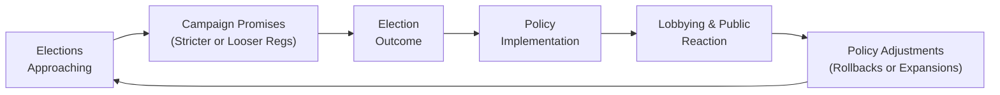

## Introduction
I still remember chatting with a close friend—he's a policy analyst—about why so many well-intentioned economic policies somehow end up so, um, twisted in practice. He shrugged and said, “Politics, my friend. Nothing is ever as simple as supply and demand.”

In many ways, that offhand remark captures the essence of political economy. From changes in trade regulations to new capital requirements for banks, everything is filtered through a political lens. And that’s where political economy and public choice theory step into the spotlight. These frameworks help us understand how political incentives, bureaucratic motives, and interest-group lobbying can supersede purely economic considerations, shaping the regulatory landscape in ways that—and let’s be honest—don’t always maximize societal welfare.

Below, we’ll walk through how political economy and public choice theory help us grasp the real-world complexities of regulations, with a particular focus on what it all means for investors and financial market participants. We’ll also sprinkle in a few personal observations and stories, because in my experience, it’s those real-life glimpses that make this material stick.

## Political Economy in Context
Political Economy is all about the interplay between economics and politics—the very reasons my friend gave that “politics” shrug. It’s an interdisciplinary field that brings together ideas from economics, political science, law, and even sociology.

• Economics side: We tend to think of rational maximizing agents, supply-and-demand curves, equilibrium, and efficiency.  
• Political side: We deal with government structures, legislative processes, power dynamics, and the role of institutions—all influenced by a range of actors like bureaucrats, elected officials, or interest groups.

In earlier chapters of this text—for instance, see Chapter 1.9 on Market Failures and Asymmetric Information—we explored how unregulated markets can fail to deliver socially optimal outcomes due to factors like externalities or mismatched incentives. Political Economy extends that analysis further by asking: How do policy solutions (like regulation) materialize, and are they necessarily designed to fix these errors in an optimal way? The short answer is “not always,” because the people shaping policy have their own motivations and constraints.

From an advanced CFA® perspective, Political Economy matters because structural changes in the legal or regulatory environment can drastically impact investment strategies and portfolio decisions. Whether it’s a pending legislative bill on carbon taxes, or new rules on short selling, an investor aware of political economy frameworks can better anticipate how these policies might evolve.

## Foundations of Public Choice Theory
Public Choice Theory essentially takes microeconomic tools—like utility maximization, preference structures, or cost-benefit analysis—and applies them to political actors. It views politicians, bureaucrats, and voters as self-interested, rational agents who respond to incentives much like firms and consumers in a marketplace.

### Key Insights
• Politicians might prioritize short-term gains (e.g., re-election) over long-term social welfare.  
• Bureaucrats might seek to expand their budgets or influence, sometimes referred to as empire building.  
• Voters aren’t perfectly informed; they might vote based on slogans or perceived personal benefit rather than fully analyzing policy details.  

If this sounds a bit cynical, well, perhaps. But it provides a useful theoretical lens for peeling back how certain regulations end up favoring specific industries or interest groups, or why short-lived economic policies might pop up right before elections. It’s not that politicians wake up each day hoping to sabotage the economy—more that they have strong incentives to respond to political pressures and, in many cases, the need to secure campaign contributions.

### Example: Self-Interested Behavior and Regulation
Imagine a regulation designed to limit greenhouse gas emissions. From a purely economic standpoint, if climate change is a big risk, you’d expect a robust policy that effectively reduces emissions. However, certain industries—like coal producers—might lobby heavily against strict targets, while environmental advocacy groups push from the other side.

• The final regulation may be watered down to appease the coal lobby, leading to fewer emission reductions than originally proposed (and maybe certain “exemptions” for politically important constituencies).  
• Politicians might reason that if they push too hard for stringent emissions targets, they risk losing jobs in key districts, which could be detrimental to re-election campaigns.

So, a policy that might have begun as a well-intentioned solution to reduce emissions ends up a compromise between various competing interests. Public choice theory sees this as predictable: each group is acting according to its self-interest.

## Role of Lobbying
If you’ve watched the news—or read a headline about a big corporation donating large sums to a candidate’s campaign—you’ve seen lobbying up close. Lobbying is the practice of influencing public officials to enact or shape regulations in a way that benefits an interest group.

### Lobbying Mechanisms
1. Direct Financial Contributions: Donors may support elected officials’ campaigns.  
2. Information Provision: Lobbyists offer “expertise” on certain issues, often framing the narrative to align with their agenda.  
3. Social Connections: Relationship-building at events, conferences, or private gatherings can further tilt decisions.

There’s nothing inherently nefarious about providing experts’ insights, but the line between “helpful facts” and “self-serving spin” can get blurry. Legislators often rely on industry specialists for technical knowledge. And let’s face it: who’s better at explaining the nuances of, say, energy policy than an energy company? On the other hand, that energy company might try to shape the conversation to protect market share or limit competition.

### Lobbying in Financial Regulation
In finance, lobbying is a powerful force. Consider major industry associations that weigh in on proposed rules for capital adequacy or derivatives trading. These groups may advocate for less burdensome regulations or longer transitional periods. They may also push back on consumer-protection measures they believe hamper business activity. Sometimes these efforts lead to more balanced regulations, but critics argue that the system may favor well-funded groups over the broader public interest.

## Budget Constraints and Voting
The democratic process gives voters the power to choose their representatives, but as public choice theory points out, voters are often only partially informed of complex regulations. Meanwhile, politicians face budget constraints—both in a literal fiscal sense and in terms of how they allocate limited political capital.

### Short-Term Policies
In a world of elections every few years, politicians might support policies that deliver immediate economic boosts—like a spending program or a tax cut—even if the best approach from a purely economic perspective would be to invest in long-term projects (like infrastructure) that might not pay off until after the next election cycle.

### Voter Behavior
Let’s be honest: you and I are busy, juggling jobs, family commitments, and the occasional Netflix binge. We’re not always diving into the details of every policy on the ballot. So voters might make decisions based on:

• Name recognition or party loyalty.  
• The immediate economic environment (e.g., inflation is high, so they “blame” the incumbent).  
• Media narratives that can oversimplify issues.

Politicians are keenly aware of these voting patterns, which can steer them to emphasize short-term, popular measures rather than tackling deeper structural reforms.

## Regulatory Policy Cycles
You might wonder why regulations seem to get passed, then rolled back, then passed again in a slightly different form—all in sync with election timelines. That’s the essence of regulatory policy cycles: the cyclical enactment, enforcement, and partial removal of regulations to align with political expediency.

1. Pre-Election Phase: Officials might promise stricter enforcement of certain rules if that resonates with voters or interest groups.  
2. Post-Election Consolidation: Once in office, they might introduce the promised policies or moderate them based on new lobbying pressures.  
3. Mid-Term Adjustments: If the implemented regulations prove unpopular or hamper business, officials pivot to appear flexible or “pro-growth.”  

The upshot for investors is that regulatory risk can fluctuate significantly around elections. Keeping an eye on political platforms, public sentiment, and poll results can provide early indicators of likely regulatory changes.

### Mermaid Diagram of a Simplified Regulatory Cycle
Below is a simple Mermaid.js diagram illustrating the cyclical nature of regulatory policy:

In many markets, you’ll see that once a regulation is introduced or repealed, a fresh wave of lobbying starts, leading to a new set of policy adjustments. This cyclical pattern can keep repeating over multiple election cycles.

## Implications for Investors
So how does all of this help you, as a CFA® candidate or practicing investment professional?

• Policy Risk Assessment: By analyzing the political landscape and understanding the motivations behind regulation, you can better evaluate how future policy shifts might affect industries or asset classes.  
• Scenario Analysis: Incorporate potential regulatory changes into scenario building. For instance, if you think an upcoming election might bring a government favoring higher capital requirements, you might reduce exposure to highly leveraged banks.  
• Strategic Positioning: Engaging in corporate governance or lobbying (on behalf of your firm) might be a strategic move—within ethical boundaries—to shape or anticipate regulatory changes before they occur.  

Awareness of political economy can give you a valuable edge. It’s not just about reading the macroeconomic indicators in Chapter 3 or the inflation outlook in Chapter 4—understanding how and why policies change is equally critical to building robust forecasts and capital market expectations.

## Glossary
• Political Economy: The study of how political structures, power dynamics, and economic incentives interact in setting policies and regulations.  
• Public Choice Theory: An approach that applies economic principles such as rational choice and utility maximization to the actions of voters, politicians, and bureaucrats.  
• Lobbying: Attempts by individuals or groups to influence public officials, usually via campaign contributions, advocacy, or technical expertise.  
• Policy Risk: The possibility that political or regulatory decisions will have negative (or positive) consequences for investments.  

## References & Further Reading
• Olson, Mancur. “The Logic of Collective Action.”  
• Tullock, Gordon. “Private Wants and Public Needs: An Introduction to Public Choice.”  
• Schlager, Edella and Cox, Michael. “The Political Economy of Regulation.”  

## Final Exam Tips
• Understand Key Definitions: Be clear on phrases like “public choice” and “lobbying.” They frequently appear in exam questions about regulatory influences.  
• Illustrate with Examples: When you see an essay question on policy or regulation, anchor your answers in concrete scenarios, possibly referencing stories or examples of legislative changes.  
• Link with Other Curriculum Areas: Political economy ties into chapters on market failures, corporate governance, and macroeconomic policy. On the exam, you might be asked to assess how a certain policy shift (like a carbon tax) would impact both the economy (aggregate supply and demand) and financial markets (sector rotation, valuation).  
• Time Management in Constructed Responses: If you get a question about how lobbying might alter the benefits of a proposed regulation, lay out the logic succinctly—discuss interest groups, short-term vs. long-term politician goals, and real-world implications. Avoid going off on tangents.  
• Practice Ethical Perspectives: In a broad sense, the CFA Institute Code and Standards emphasize ethical conduct. Policy risk and lobbying can raise questions of insider trading, conflicts of interest, or misuse of nonpublic information. Know your responsibilities as an investment professional.  

## Test Your Knowledge: Political Economy and Public Choice Theory



### Which of the following best describes the focus of Public Choice Theory?
- [ ] How governments can achieve maximum social welfare with no externalities.
- [ ] How purely rational voters make decisions based on full information.
- [x] How self-interested politicians, bureaucrats, and voters influence regulatory outcomes.
- [ ] How to minimize inequality through progressive taxation.

> **Explanation:** Public Choice Theory applies the concept of self-interested agents to political actors, explaining how regulation can be shaped by personal incentives rather than purely social welfare objectives.

### Which factor often motivates politicians to support short-term policies over long-term ones?
- [ ] A permanent commitment to sustainability.
- [x] The desire to win re-election and maintain political favor.
- [ ] The inherent stability of bureaucratic institutions.
- [ ] The constant threat of legal action from special-interest groups.

> **Explanation:** Politicians frequently focus on measures that garner immediate voter support, especially close to elections, rather than solutions with delayed benefits.

### In the context of lobbying, which of the following statements is most accurate?
- [ ] Only nonprofits can engage in lobbying, while corporations cannot.
- [x] Lobbying often involves providing specialized information to politicians, potentially with a self-interested slant.
- [ ] Lobbying is uniformly banned in global democracies.
- [ ] Lobbyists cannot have personal relationships with government officials.

> **Explanation:** Lobbyists frequently position themselves as “experts,” offering valuable data to policymakers while subtly steering regulations toward their own interests.

### Regulatory policy cycles are characterized by:
- [x] The enactment, enforcement, adjustment, and potential repeal of regulations in line with political and electoral incentives.
- [ ] A strictly economic focus on maximizing production efficiency.
- [ ] A purely legalistic process immune to voter sentiment.
- [ ] The permanent adoption of regulations once they are introduced.

> **Explanation:** Regulations are not static; they evolve with shifting political winds, illustrating the cyclical nature tied to elections, lobbying, and policy feedback.

### Budget constraints in political decision-making primarily refer to:
- [ ] The implicit restrictions politicians have in passing any type of legislation.
- [ ] The unlimited financial resources available to bureaucrats.
- [x] Fiscal and political capital limitations that force trade-offs in policy priorities.
- [ ] Voter expectations that governments should always run deficits.

> **Explanation:** Politicians have limited fiscal resources and political goodwill—using them for one priority means less available for others, influencing which policies get advanced.

### According to Public Choice Theory, a key reason for potentially suboptimal regulation is:
- [x] Self-interested behavior among politicians and bureaucrats.
- [ ] The inability of markets to price externalities.
- [ ] The complete lack of voter influence in elections.
- [ ] Perfect information across all stakeholders.

> **Explanation:** While mismatch in externalities is a market-failure explanation, Public Choice Theory highlights how regulators themselves might act in self-interested ways, leading to policies misaligned with welfare maximization.

### Lobbying in financial markets often involves:
- [ ] Attempts to reduce all regulation for financial institutions.
- [x] Influencing specific details of capital rules or consumer protections for competitive advantage.
- [ ] Exclusive partnerships between government officials and private banks.
- [ ] Only philanthropic donations and no policy input.

> **Explanation:** Financial lobbyists frequently seek to soften or tailor regulations (e.g., capital requirements, derivatives rules) to protect or enhance their sector’s competitiveness.

### One of the main risks for investors when regulators change policies around election cycles is:
- [ ] Guaranteed lock-in of favorable regulations for the next decade.
- [ ] No meaningful market impact at all.
- [ ] Instant transparency about the final outcome of regulations.
- [x] Uncertainty regarding whether stricter or more lenient rules will prevail post-election.

> **Explanation:** Political transitions create uncertainty and can dramatically affect industries favored or disfavored by incoming administrations.

### Which of these best captures the interplay between voters and politicians as per Public Choice Theory?
- [ ] Voters are always perfectly informed and rational, ensuring superior policy outcomes.
- [ ] Politicians automatically prioritize the common good due to oath-of-office obligations.
- [x] Voters may be uninformed on specifics, while politicians cater to re-election incentives, possibly leading to suboptimal policies.
- [ ] There is always unanimous agreement between voters and politicians on policy direction.

> **Explanation:** An essential Public Choice insight is that both voters and politicians follow individual incentives rather than maximizing collective welfare.

### Public Choice Theory generally holds which of the following to be true?
- [x] True
- [ ] False

> **Explanation:** True. Public Choice Theory posits that political agents and bureaucrats are self-interested, similar to firms or consumers in markets, which often shapes regulatory outcomes in ways that may not align with the overall social optimum.


