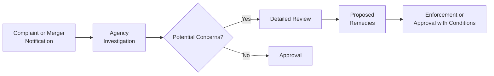

## Introduction

Let’s be honest: whenever we see one company swallowing up another, we get that nagging doubt: is this fair to consumers and to the market? Personally, I recall a friend fretting about how her favorite local coffee chain was acquired by a large multinational, and she worried prices would go up while quality went down. This story, while anecdotal, gets right to the essence of competition policy and antitrust: ensuring that companies don’t abuse their market power, and that consumers continue to benefit from innovation, fair prices, and free choice.

Competition policy—often interchangeable with the term “antitrust”—refers to the body of laws and regulations designed to encourage a competitive market structure. The overarching goal is to protect consumers, small businesses, and the market as a whole from anti-competitive conduct such as price fixing, cartel agreements, and monopolistic abuses. Think of it as the referee that ensures the ‘players’ of the economy follow the rules of fair play.

This article digs deep into competition policy, focusing on why it matters, how it operates, and the real-world measures regulators employ to keep the market from sinking into unfair or abusive practices. We’ll also investigate global cooperation, as competition issues increasingly cross borders, and we’ll highlight the complexities regulators face when lines between legitimate business success and market abuse become blurry.

## Purpose of Competition Policy

Competition policy exists to preserve the benefits of free and fair markets. In a truly competitive environment:
- Firms are incentivized to improve quality and innovate.  
- Prices tend to reflect the actual cost of production plus a fair profit.  
- Consumers benefit from choice, competitive prices, and access to new goods or services.

If left unchecked, huge corporations might snatch up smaller rivals left and right, fix prices among themselves, or use predatory practices to crush any potential competition. Such behavior can lead to:
- Artificially high prices.  
- Reduced product quality and innovation.  
- Lower consumer welfare and stifled economic growth.  

Another personal tidbit: I once saw a local sports league where one team had a habit of recruiting almost every star player. The coach used a variety of social tactics to ensure no other team got them. While that might seem harmless in a Sunday league, in real markets it can be devastating. Competition policy ensures that no single team (read: firm) can get so big that it rigs the game for everyone else.

## Antitrust Laws: Overview and Rationale

Antitrust laws, also referred to broadly as competition laws, aim to keep markets dynamic and fair. In many jurisdictions, these laws prohibit:
- Mergers that substantially reduce competition or create/strengthen a dominant position.  
- Agreements that unduly restrict competition, such as cartels or collusive behaviors.  
- Abuse of a dominant position (charging discriminatory prices, unjustified refusal to deal, tying arrangements, etc.).  

Although “antitrust” might sound inherently opposed to big businesses, that’s not quite accurate. Merely being large or successful isn’t illegal. Rather, the laws come into play if a firm’s market power is used in ways that damage competition or harm consumers.

Regulatory agencies—like the U.S. Federal Trade Commission (FTC) or the European Commission’s Directorate-General for Competition—typically oversee antitrust enforcement. They monitor merger deals, investigate complaints, and can impose penalties if businesses breach these laws.

## Key Concepts in Antitrust

### Monopolization

A monopoly, in the classic sense, is when a single firm dominates a market with no close substitutes. Now, having a monopoly in itself might not be illegal. Often monopolies arise from legitimate business successes—like being the first to market with a new technology. 

However, monopolization becomes a problem when the firm uses its power to deliberately undermine potential rivals. Here are a few ways this might happen:
- Exclusivity Contracts: Telling suppliers they can’t serve a competitor.  
- Predatory Pricing: Selling below cost to bankrupt a rival, then hiking prices once competition is gone.  
- Blocking Access to Key Inputs: Restricting essential distribution channels or raw materials.  

Though you might occasionally hear someone say, “Well, they’re a monopoly, so that’s illegal,” it’s not quite that simple. Antitrust regulators focus on the firm’s conduct (abuse of dominance) rather than simply on its size or market share.

### Abuse of Dominance

Abuse of dominance can manifest in several forms:
- Price Discrimination: Offering substantially different prices to different customers without a valid cost basis.  
- Predatory Pricing: As mentioned, setting prices below cost with the sole purpose of driving out competitors.  
- Tying Arrangements: Forcing customers of one product to also purchase an additional, often unrelated, product.  
- Exclusive Dealings: Arrangements with distributors or retailers that prevent them from buying competitor’s products.  

A well-known historical example is the U.S. Department of Justice’s case against Microsoft in the late 1990s, where it was alleged Microsoft tied its Internet Explorer browser to the Windows operating system to edge out browser competitors.

### Cartels and Collusion

Cartels are the ultimate behind-the-scenes alliances of competitors who decide to act as a single entity. They typically revolve around:
- Price-Fixing: Firms conspiring to charge the same (usually higher) price.  
- Output Restrictions: Coordinating production or sales volume across rivals.  
- Market Allocation: Dividing markets by region or customer type, so each cartel member faces no competition in its ‘slice’ of the market.  

Cartels can be extremely lucrative for participants, as they can collectively behave like a monopoly, raising prices above competitive levels. However, once discovered, they can prove very costly because regulators impose steep fines, and in some jurisdictions, individuals can face prison time.

## Regulatory Approaches

### Merger Review

One of the most high-profile aspects of competition policy is the review of proposed mergers and acquisitions. The idea is straightforward: if two large competitors in a concentrated market join forces, it could severely limit healthy competition. Therefore, competition authorities usually conduct a multi-step review:

1. Notification: Firms notify regulators of a planned merger or acquisition.  
2. Preliminary Assessment: Regulators assess if the deal threatens to reduce competition.  
3. Detailed Investigation (if needed): If initial findings raise concerns, the agency delves deeper into market definitions, potential synergies, consumer impact, etc.  
4. Remedies or Approval/Block: If found harmful, the deal might be blocked or approved on condition that certain changes—like divesting overlapping business lines—are made.  

Mergers can also present complex “efficiency” arguments. Firms often claim efficiencies such as cost savings or innovation synergy to justify the deal. Regulators must weigh those benefits against the loss of direct competition.

### Investigations and Enforcement

Regulatory authorities generally have far-reaching investigative powers:
- Subpoena documents and testimony.  
- Conduct "dawn raids" (surprise inspections).  
- Encourage whistleblowers to come forward with evidence of cartels or collusion.  

Punishments for violations vary. In severe cartel cases, authorities may impose massive fines—some have approached billions of dollars. In especially egregious cases, they might require structural remedies (e.g., breaking up sections of a firm).

Below is a simplified flowchart highlighting how a typical antitrust enforcement process might unfold:

## Economic Assessments

Regulators rely heavily on economic measures to determine whether a market is competitive. A prominent tool is the Herfindahl–Hirschman Index (HHI). The HHI is calculated as the sum of squared market shares for all firms in a market:

$$
\text{HHI} = \sum_{i=1}^{N} s_i^2
$$

where \\(s_i\\) is the market share of the \\(i\\)-th firm, expressed as a decimal (e.g., 30% = 0.30). The HHI ranges from near 0 (highly fragmented market) to 10,000 (one firm has a 100% monopoly).

- An HHI below 1,500 generally indicates a relatively unconcentrated market.  
- An HHI between 1,500 and 2,500 suggests moderate concentration.  
- An HHI above 2,500 signals a highly concentrated market, raising red flags if a merger significantly increases that index further.  

This index provides a quantitative benchmark, but it’s not the sole metric. Regulators also evaluate qualitative factors like barriers to entry, the likelihood of new competitors, or potential for collusion.

## Remedies and Penalties

### Structural Remedies

If a merger or business practice is deemed harmful, regulators often require structural changes to preserve competition. Common examples include:
- Divestitures: Selling off specific business units or product lines.  
- Spin-offs: Splitting the firm into separate, independently owned companies to reduce market power.  

### Conduct Remedies

Conduct remedies focus on constraining a firm’s future behavior rather than forcing it to reorganize. These might include:
- Pricing restrictions or commitments to maintain certain supply agreements.  
- Order to license technology or patents to third parties at fair terms.  
- Prohibiting exclusive dealing or tying arrangements.  

### Fines and Breakups

Serious antitrust violations—especially cartels—can prompt staggering monetary fines. In rare cases, authorities can break up a firm. U.S. antitrust history famously includes the breakup of Standard Oil (1911) into smaller entities when it was found to be abusing its monopoly power.

## Global Cooperation

In a globalized economy, competition issues rarely respect national borders. Picture an international merger between two firms operating across multiple continents. Different countries’ regulatory authorities will each have an interest—therefore, they collaborate through various channels and organizations. While each jurisdiction has its own laws, they often share protocols or best practices, ensuring consistent standards across major economies.

Such cooperation can extend to:
- Exchanging investigative findings.  
- Coordinating on remedies and enforcement actions.  
- Mutual legal assistance treaties.  

It can get tricky when national interests conflict—sometimes a country might be more lenient if a merger benefits its domestic companies. Nonetheless, strong international networks of competition agencies help keep the playing field relatively even.

## Challenges in Implementation

Playing referee in global markets isn’t easy. Here are some complexities:

- **Network Effects**: In digital markets, the value of a service grows as more users join (e.g., social media platforms). It’s often unclear where legitimate network advantages end and anti-competitive behavior begins.  
- **Rapid Technological Change**: Regulators can’t always keep pace with new forms of data-driven business models.  
- **Balancing Innovation and Competition**: Companies might argue that certain exclusive practices or big mergers are necessary to finance large-scale research and development. Regulators must decide if that rationale genuinely outweighs competition concerns.  
- **Political Pressures**: Governments might be reluctant to penalize a national champion. Conversely, they may use antitrust enforcement to pressure foreign multinationals.  

## Practical Observations and Best Practices

• **Market Definitions Matter**: Before analyzing concentration, regulators must define the product and geographic market. For instance, is a streaming music service competing directly with traditional radio, or is it a separate market? The results of that definition can drastically shift a firm’s market share analysis.  

• **Pitfalls for Firms**: Managers under pressure to secure bigger market shares might be tempted by questionable practices—like pushing exclusive deals or looking the other way when sales teams coordinate with competitors. The fines and reputation damage can be massive; so it’s crucial to maintain robust internal compliance.  

• **Investor Insight**: For equity analysts, understanding how competition policy might affect a firm’s growth strategy is vital when forecasting revenues and valuations. If a firm is too close to a 40% or 50% market share, major acquisitions might draw extra scrutiny, and the transaction might be blocked or scaled down.  

• **Continuous Monitoring**: Even after a merger is approved with remedies, regulators often monitor the firm to ensure compliance. Failing to follow through on promised behavioral changes can lead to renewed enforcement actions plus further fines.  

## Illustrative Example: A Hypothetical Merger

Consider a scenario where two consumer-packaged-goods companies, “AlphaFood” and “BetaBites,” announce a merger. Combined, they’d hold roughly 45% of the savory snack market. A few steps follow:

1. Notification: The companies submit a merger application to the relevant authority, detailing synergy claims and potential cost savings.  
2. Preliminary Review: Regulators examine the market. They determine the combined HHI would jump from 1,800 (moderately concentrated) to 2,500 (highly concentrated).  
3. Investigation: The authority examines whether smaller competitors—perhaps new artisanal brands—can effectively challenge the merged firm. They also look at whether cost savings actually translate into consumer benefits.  
4. Decision: If the authority deems the merger harmful, they might require AlphaFood or BetaBites to sell certain product lines or manufacturing plants. If that condition is met, the merger could proceed.  

This highlights the typical flow of how an antitrust framework steps in to prevent or mitigate market dominance.

## Conclusion

Competition policy and antitrust laws are pivotal in ensuring markets stay vibrant, consumers remain protected, and innovation flourishes. While large corporations often provide valuable products and cost-saving efficiencies, unchecked market power risks hurting us all. So, you know, it’s like that friend who’s always ready to stand up for fair play at the pick-up soccer match: it might not always make everyone happy in the short run, but in the long run, it keeps the game honest and fun for everyone.

For those of you studying this for the CFA exam, remember to connect the dots between competition policy and broader themes like industry organization (Chapter 2) and regulation (Chapter 9). We often see exam questions that combine these concepts in scenario-based form, testing your ability to interpret market data, identify regulation triggers, and discuss possible outcomes. In preparing, focus on how regulators measure competition, typical remedies, and the complex trade-offs between encouraging big corporate synergies vs. protecting smaller players and everyday consumers.

## Exam Tips

• Emphasize Key Indicators: Familiarize yourself with the HHI calculation and interpretation. CFA exams may ask you to compute changes in HHI pre- and post-merger.  
• Real-World Illustrations: Antitrust enforcement examples like Microsoft or recent big tech investigations are used to illustrate relevant points—be ready to tie them into theoretical frameworks.  
• Multi-Part Questions: An essay question might ask you to analyze a merger scenario and propose remedies to preserve competition. Practice explaining the rationale behind your suggestions, referencing metrics like HHI and examining intangible factors.  
• Don’t Ignore Global Aspects: The exam might present a cross-border merger case. You may have to address how multiple authorities coordinate.  

## References and Further Reading

- Gavil, Kovacic, and Baker. “Antitrust Law in Perspective.”  
- US Federal Trade Commission: https://www.ftc.gov/  
- European Commission Competition Policy: https://ec.europa.eu/competition/  
- Waldman, Don E., and Elizabeth J. Jensen. “Industrial Organization: Theory and Practice.”  
- Chapter 2 of this volume, “The Firm and Industry Organization” (for cross-reference to market structures).  

## Test Your Knowledge: Competition Policy and Antitrust Quiz



### A proposed merger is likely to face intense scrutiny from regulators if:
- [ ] The combined HHI is below 1,000.
- [ ] The combined HHI remains below 1,500.
- [x] The combined HHI exceeds 2,500.
- [ ] The merger does not affect the HHI at all.

> **Explanation:** A combined HHI above 2,500 suggests a highly concentrated market, prompting close scrutiny from antitrust authorities.

### Which of the following best describes “cartel”?
- [ ] Two separate small businesses that refuse to quote lower prices when a large competitor arrives.
- [x] A formal or informal agreement among competing firms to control prices or output.
- [ ] A merger between a large manufacturer and a small retailer.
- [ ] An example of a company that purely relies on network effects.

> **Explanation:** Cartels exist when competing firms openly or secretly work together to fix prices, restrict output, or divide markets.

### When a firm with a dominant market position sets prices below cost to eliminate competitors, it is known as:
- [ ] Price discrimination.
- [x] Predatory pricing.
- [ ] Price leadership.
- [ ] Economies of scale.

> **Explanation:** Predatory pricing is a strategy where a dominant firm accepts short-term losses to drive rivals out, intending to recoup those losses once competition has been reduced.

### Which of the following statements about abuse of dominance is correct?
- [ ] It only applies to firms holding less than 10% market share.
- [x] It can include tying arrangements that force consumers to purchase an unrelated product.
- [ ] It is generally legal if it involves predatory pricing for a short duration.
- [ ] It is only enforceable in regulated industries like utilities.

> **Explanation:** Abuse of dominance encompasses a range of practices, including tying arrangements that stifle competition or harm consumer choice.

### A structural remedy for an anti-competitive merger typically includes:
- [x] Divesting a significant business unit to reduce market concentration.
- [ ] Continuation of the merger without any conditions.
- [x] Selling major brands that overlap with the acquiring firm.
- [ ] A pledge not to raise prices for two years.

> **Explanation:** Structural remedies often involve selling off specific assets or business lines that contribute to a dominant position. Some questions may list multiple correct answers if they represent distinct but valid points.

### Which factor is most essential in distinguishing a legitimate monopoly from unlawful monopolization?
- [x] The intent or behavior of the dominant firm in leveraging its market power.
- [ ] The size of the company’s workforce.
- [ ] The uniqueness of the product technology.
- [ ] The length of time the firm existed before it became dominant.

> **Explanation:** Merely being large or holding a dominant position is not illegal; the critical factor is whether the firm is using that position to harm competitors and restrict market competition.

### If a regulator determines a merger will raise HHI significantly but also create clear efficiencies, which of the following might occur?
- [x] Approval with conditions (conduct or structural remedies).
- [ ] Automatic rejection without further analysis.
- [x] Divestiture orders to mitigate concentration concerns.
- [ ] Regulatory acceptance because big always equals efficient.

> **Explanation:** Regulators may allow a merger that yields demonstrable efficiencies if structural or behavioral remedies adequately preserve competition.

### Global cooperation among antitrust agencies usually involves:
- [x] Shared investigation data and coordinated decisions for international mergers.
- [ ] Forcing domestic laws to remain silent for foreign firms.
- [ ] Conducting only national-level reviews without collaboration.
- [ ] Issuing pre-approval for any cross-border deals to facilitate global trade.

> **Explanation:** International regulators cooperate by sharing information and occasionally coordinating remedies, especially for cross-border deals.

### Why is “exclusive dealing” sometimes seen as anti-competitive?
- [x] It can prevent rival firms from accessing essential distribution channels.
- [ ] It always leads to higher consumer satisfaction.
- [ ] It undermines the concept of network effects.
- [ ] It is necessary for predatory pricing.

> **Explanation:** Exclusive dealing can give one firm privileged access to customers or suppliers, effectively barring competitors from the market.

### In a hypothetical scenario, a country’s competition authority has decided to break up a corporation into separate divisions. This action is most likely:
- [x] True
- [ ] False

> **Explanation:** Breaking up a firm is an extreme but legal structural remedy when other solutions (like fines or partial divestitures) fail to resolve serious competitive harm.




