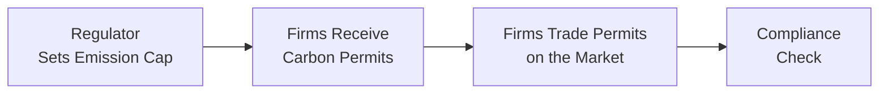

## Introduction

Some years ago—back when I was first becoming aware of the hidden costs buried in all sorts of products—I found myself shuffling through a cell phone contract that seemed intentionally vague. The monthly rate was clearly disclosed, but the “additional fees” felt like endless add-ons. You think you’re paying one price, but, well, you end up paying more. Such experiences stress the importance of consumer protection and remind us how essential transparency is to a well-functioning market.

Meanwhile, any local commute in a busy city might also reveal a second phenomenon: externalities. Perhaps you’re stuck behind a slow freight truck spewing exhaust fumes. Although neither you nor the driver of that truck set out to pollute your lungs, you’re bearing part of the cost, or “negative externality,” of that truck’s activity. Understanding these market spillovers and the role of regulation in addressing them becomes crucial in advanced financial and economic analysis.

Below, we will delve into the core elements of consumer protection and externalities, their impact on markets, and why regulation plays a vital role. We’ll also highlight practical examples, examine best practices, and, of course, offer suggestions to help you master these topics in an exam setting.

## Consumer Protection: Safeguarding Market Participants

Consumer protection includes a broad array of measures designed to shield buyers from unfair, deceptive, and exploitative practices. Whether you’re dealing with hidden credit card fees or an automobile warranty that conveniently excludes everything under the hood, consumer protection laws and regulations try to level the playing field. These measures are especially relevant in advanced financial systems, where the complexity of products—like mortgage-backed securities or insurance derivatives—can easily confuse even the most well-informed individuals.

### The Rationale for Consumer Protection

1. Promoting Transparency: Clear disclosures (e.g., nutritional labels, APR on loans, interest-rate disclaimers) empower consumers to make informed decisions.  
2. Reducing Information Asymmetry: Often, sellers know more about a product’s quality or risk than buyers. Regulatory oversight ensures this imbalance doesn’t lead to manipulation.  
3. Fostering Trust in Markets: If consumers consistently sense exploitation, they’ll pull back from transactions, hurting economic activity.  
4. Encouraging Fair Competition: When unscrupulous firms are penalized for deceptive practices, more ethical firms have a better opportunity to compete on a level playing field.

## Core Components of Consumer Protection Regulatory Frameworks

### Disclosure Requirements

Disclosure requirements are at the heart of consumer protection. In finance, these rules might include mandatory documentation of fees, interest rates, or product risks. When you purchase a mutual fund, for instance, you might receive a prospectus that—ideally—details the fund’s investment style, risks, and historical performance. This measure:

• Empowers consumers by standardizing information.  
• Helps sincere institutions compete, driving better products and more accurate pricing.  
• Minimizes “hidden fee” structures since they need to be reported.  

In the United States, the Truth in Lending Act (TILA) is a prime example. It mandates clear disclosure of credit terms, such as the Annual Percentage Rate (APR), to enhance transparency. Similarly, many jurisdictions around the globe have analogous legislation promoting clarity for mortgages, credit cards, and other loans.

### Warranty and Liability Laws

Warranty and liability laws ensure that if you buy a car and the transmission fails the second week, you might be protected under an express or implied warranty. Meanwhile, product liability laws hold manufacturers responsible if they sell dangerous goods. For instance, an appliance that fails UL safety standards could trigger legal claims for damages if it catches fire unexpectedly.

These laws serve as a deterrent, encouraging organizations to maintain high quality standards. When combined with transparent disclosures, warranty and liability frameworks reduce consumers’ uncertainty, leading to greater brand loyalty and robust market functioning.

### Role of Public vs. Private Enforcement

Consumer protection can be enforced through:

• Government Agencies: Entities such as the Consumer Financial Protection Bureau (CFPB) in the U.S. or consumer ombudsman offices worldwide often have broad investigative powers and can impose fines.  
• Private Lawsuits: In some cases, individuals or classes of consumers seek legal remedies if a product fails to meet advertised claims. You might see class action lawsuits about misleading health claims or manipulated interest rates.

For instance, suppose a large retail chain falsely advertises “organic produce” that contains pesticides. The government agency might impose penalties, while consumer interest groups or private litigants could simultaneously file suit to recover damages and draw attention to the malpractice.

## Understanding Externalities: Spillover Effects Beyond the Individual

An externality is a cost or benefit that affects parties who did not explicitly agree to incur that cost or receive that benefit. We usually divide externalities into two categories:

• Negative Externalities: Think pollution, traffic congestion, and secondhand smoke, all of which impose extra costs on people not involved in the original transaction.  
• Positive Externalities: Education and research produce knowledge spillovers that benefit society at large. Vaccinations reduce disease transmission for others who remain unvaccinated.

### Why Externalities Matter for Economic Efficiency

Under standard market equilibrium, we assume that all costs and benefits are reflected in the price of goods or services. However, when externalities exist, that assumption often breaks down. For negative externalities, the good or service is effectively underpriced because not all costs are borne by the producer or consumer. By contrast, activities generating positive externalities tend to be underproduced (less education than socially optimal, for instance) because some benefits spill over to others who do not pay.

In the presence of these inefficiencies, governments or regulatory bodies intervene to adjust market outcomes. That’s where tools like taxes, subsidies, and emission permit systems (e.g., cap-and-trade) come into play.

## Regulatory Tools for Addressing Externalities

### Taxes and Subsidies

Pigovian taxes and subsidies align private incentives with social welfare. A Pigovian tax adds a cost equal to the negative externality—such as taxing every ton of carbon emitted. Conversely, a subsidy might be offered for electric vehicles or solar power to stimulate a socially beneficial activity.

From an investment standpoint, it’s worth recognizing how taxes and subsidies change the risk-reward equation. Firms in heavily regulated industries (e.g., oil & gas) might face future carbon taxes or emissions regulations that significantly affect their valuations and cost structures.

### Cap-and-Trade Systems

Cap-and-trade places a cap on total emissions and issues permits that can be bought or sold. Companies that need to emit more can purchase permits from those who emit less, creating a market-driven approach to controlling pollution:

In the above diagram, the regulator sets an overall cap, and permits become tradable assets. This system encourages innovation. Firms with cost-effective ways to reduce emissions can sell permits for profit, while firms that find it expensive to lower emissions must buy extra permits at a premium.

### Command-and-Control Regulation

A more direct style of regulation mandates specific actions, such as requiring factories to install scrubbers or abide by unique design standards. While this approach can be effective in rapidly reducing pollutants, it may be less flexible and sometimes more costly because it doesn’t necessarily incentivize creative solutions. 

## Asymmetric Information and Its Link to Consumer Protection

Asymmetric information resonates both within consumer protection and externalities. In consumer protection, the problem emerges when sellers know more about the product’s flaws yet fail to disclose them. With negative externalities, producers might withhold the real cost of disposal or emissions. This gap in knowledge skews prices and leads to suboptimal market outcomes.

In finance, structured products can be highly opaque, making it difficult for average investors to understand risk exposures or hidden fees. Regulators address this asymmetry by enforcing additional disclosures, banning certain predatory sales tactics, and policing misleading advertisements.

## Integrating Consumer Protection and Externalities into Economic Analysis

When analyzing market structures—whether perfect competition or monopoly—factoring in consumer protection and externalities is essential for capital market expectations. For instance:

• Firms that exploit asymmetries might face class action lawsuits or regulatory fines, undermining investor confidence.  
• Stringent environmental regulations could influence capital expenditures in industries reliant on carbon-intensive processes.  
• Positive externality–generating sectors (e.g., renewables, educational services) might receive government support, shaping growth prospects.  

In equity analysis, these regulatory pressures affect future cash flows and risk profiles. Portfolio managers, analyzing large-cap industrials, might reduce exposure to companies that risk polluting or harming consumers if the regulators are likely to step in.

## Common Pitfalls and Best Practices

• Overlooking Consumer Distrust: Markets can unravel quickly if consumers no longer trust brand claims or product quality.  
• Failing to Assess Liability Risk: Investors and businesses sometimes forget that liability suits can be extremely costly.  
• Mispricing Externalities: Underestimating the likelihood or severity of environmental regulations can derail an investment thesis.  
• Not Factoring In Cross-Border Differences: Consumer protection laws and externality regulations differ widely across geographies. A global portfolio might benefit from factoring in regulatory disparities where consumer safety standards are more relaxed or where carbon taxes are steeper.  
• Transparency as a Competitive Advantage: Firms that go beyond minimal disclosure requirements often build long-term trust. Proactive approaches to externality reduction can help them avoid sudden compliance shocks.

## Conclusion

So, yes, it might seem like a tall order: ensuring that every consumer has straightforward, honest information while also making sure that every polluter pays for the harm they cause. But these systems—consumer protection and externality regulations—are fundamental for fair, efficient, and robust markets. They serve to align private incentives with wider social welfare, reduce exploitative behaviors, and foster an environment in which both consumers and responsible businesses thrive.

For investors and economists, ignoring these aspects can lead to misjudging risk or missing out on opportunities. By combining frameworks that protect consumers from deceptive practices and by managing externalities (through taxes, subsidies, or trading schemes), we pave the way toward stable growth and innovation. After all, a market that’s built on trust and sustainability often benefits everyone involved.

## Final Exam Tips

• Pay special attention to how consumer protection measures, such as disclosures and liability laws, fit into overarching regulatory frameworks. Supply short illustrations in your essay responses to show an understanding of real companies or real situations.  
• For negative externalities, know how to evaluate the magnitude of a Pigovian tax. Be ready to outline the pros and cons of command-and-control versus market-based approaches like cap-and-trade.  
• Practice explaining how asymmetric information can lead to market failure, tying it back to mandatory disclosures or product warranties.  
• In essay-type scenarios, consider how externalities could reshape a firm’s cost structure or affect its share price in the long run. Show that you can integrate “soft” concepts like trust and transparency into a coherent investment thesis.  
• If you encounter a question on consumer protection, watch for discussions of moral hazard, liability constraints, or the role of the judiciary (private litigation). Clarify how these aspects reinforce (or undermine) efficient capital allocation.

## References and Further Reading

- Consumer Protection Law by Geraint Howells and Stephen Weatherill  
- Economics of the Public Sector by Joseph E. Stiglitz  
- U.S. Consumer Financial Protection Bureau (CFPB): https://www.consumerfinance.gov/  
- European Consumer Centres Network: https://ec.europa.eu/info/live-work-travel-eu/consumer-rights-and-complaints_en  

## Test Your Knowledge: Consumer Protection and Externalities



### Which of the following best describes why consumer protection measures often include mandatory disclosures?

- [ ] They reduce government revenue through fewer penalties.  
- [x] They help balance information asymmetry by ensuring potential buyers are aware of important product details.  
- [ ] They encourage companies to raise product prices.  
- [ ] They eliminate all liability for sellers once disclosures are made.  

> **Explanation:** Mandatory disclosures reduce information asymmetry and empower buyers with the information they need to make an informed decision.

### A Pigovian tax is typically designed to:

- [ ] Increase consumer spending on subsidized goods.  
- [ ] Exempt companies from liability laws.  
- [x] Align private costs with the broader social costs of a negative externality.  
- [ ] Eliminate all pollution sources.  

> **Explanation:** Pigovian taxes put a monetary cost on the externality so that the private entity pays a total cost equal to the social cost. This encourages the producer to reduce negative externalities to avoid higher taxes.

### In a cap-and-trade system:

- [x] A regulatory authority sets an overall emissions limit and firms can buy or sell emissions permits.  
- [ ] Firms are required to pay a fixed tax per unit of pollution.  
- [ ] There are no enforcement mechanisms for firms that exceed their permits.  
- [ ] The system always leads to lower consumer protection standards.  

> **Explanation:** Cap-and-trade introduces a market for emissions permits, with an overarching limit (cap) on total pollution. Firms can trade permits, which incentivizes efficient reductions in emissions or purchase of additional permits.

### One important reason for government warranties or liability laws is to:

- [ ] Increase government revenue through fines.  
- [ ] Ensure firms can’t compete on quality.  
- [x] Hold producers responsible for deficient or harmful products.  
- [ ] Transfer liability from manufacturers to distributors.  

> **Explanation:** Liability laws and warranties place responsibility on producers or sellers to ensure product quality and/or compensate buyers for harm caused by defective goods.

### If negative externalities are not corrected by regulation, which outcome is most likely?

- [ ] The market produces the socially optimal quantity of the good.  
- [ ] The good is underproduced relative to its marginal social cost.  
- [x] The good is overproduced because part of the cost is borne by society, not just the producer or consumer.  
- [ ] Research funding drastically increases in that industry.  

> **Explanation:** With a negative externality, the private cost is less than the social cost, resulting in overproduction or consumption beyond the socially efficient level.

### How does consumer protection typically relate to asymmetric information?

- [ ] It eliminates the need for warranties.  
- [ ] It removes consumer litigation risk.  
- [x] It aims to reduce the knowledge gap between sellers and buyers, addressing market failures.  
- [ ] It discourages government oversight.  

> **Explanation:** Consumer protection reduces asymmetric information by requiring disclosures and penalizing deceptive practices, thereby helping consumers make more informed decisions.

### Command-and-control regulation for externalities is characterized by:

- [ ] Market-based incentives for polluters.  
- [ ] Sales taxes on consumer goods.  
- [x] Specific requirements on firms (e.g., equipment standards) to limit pollution.  
- [ ] Deregulation of environmental laws.  

> **Explanation:** Under command-and-control, law or regulation explicitly dictates how firms must address an externality (e.g., install emissions filters), rather than using a flexible market-based approach.

### A positive externality typically results in:

- [ ] Firms selling more units than the socially optimal level.  
- [ ] Guaranteed corporate liability for any harmful side effects.  
- [ ] No impact on resource allocation.  
- [x] Underproduction of the good because producers cannot capture all the benefits delivered to society.  

> **Explanation:** Positive externalities lead to underproduction relative to the socially optimal level because producers don’t recover all of the benefits that spill over to others.

### In consumer protection, a typical role played by government agencies (like the CFPB) is to:

- [x] Enforce regulations and impose penalties on deceptive or unfair practices.  
- [ ] Provide direct subsidies to all manufacturers.  
- [ ] Argue for minimal disclosure standards.  
- [ ] Set interest rates on consumer loans.  

> **Explanation:** Government agencies help protect consumers by setting regulations, conducting investigations, imposing sanctions, and generally acting as a watchdog against unfair or deceptive acts.

### True or False: Consumer protection efforts and regulatory measures on externalities only benefit consumers, not producers.

- [x] True  
- [ ] False

> **Explanation:** Though consumers are the primary beneficiaries of these protections and externality regulations, producers can also gain from stable, transparent markets that encourage trust and long-term demand. However, the statement says they only benefit consumers, which is not fully correct. Thus it's “True” if interpreted literally—though in reality, both parties can benefit. It’s a bit nuanced, but exam questions like this aim to see if you can spot oversimplification.  


