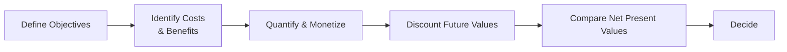

## Introduction

Sometimes folks ask me, "Does regulation really matter that much?" Well, my knee-jerk reaction—just from personal experience—is to say, "Yes!" because I once worked with a small investment advisory outfit that almost drowned in paperwork after a new set of rules came out. The firm’s costs skyrocketed, and we nearly lost a few clients who got anxious about delays in our service. But at the same time, industry-wide confidence soared when those same regulations curbed some of the shadier practices in the sector. This tension between increased compliance costs on the one hand and improved transparency on the other is precisely what we mean by “costs versus benefits of regulation.”

Here in this section, we’ll dig deep into how analysts evaluate and balance these two sides. And we’ll try to keep it slightly informal—so don’t be surprised if I toss in a “well, you know” every now and again to keep it real.

## The Rationale for Cost-Benefit Analysis

In the world of policy and finance, Cost-Benefit Analysis (CBA) is used to systematically compare the total expected costs of a regulation with its expected benefits. The idea is pretty simple: if the benefits outweigh the costs in a meaningful way, the policy is, at least in principle, worthwhile. If not, maybe we reconsider or refine it. Easy to say in theory—harder to do in practice.

When it comes to capital markets and financial regulations, a well-executed CBA helps to avoid imposing unnecessary burdens that could stifle innovation or hamper economic growth while simultaneously preventing costly market meltdowns or externalities. The challenge lies in capturing all relevant data, including those sneaky intangible factors like consumer confidence, brand reputation, or the future cost of a crisis that hasn’t happened yet. (Anyone remember the 2008 financial crisis? Talk about intangible factors coming to life—whew.)

Let’s illustrate the essence of a CBA in a simplified flowchart:



As you can see, a big chunk of the challenge is identifying and monetizing the intangible effects—like brand reputation or investor trust. It’s also crucial to discount future costs and benefits to present value (a topic you’ve probably seen in earlier quantitative methods sections).

## Direct Costs of Regulation

Direct costs are typically easier to calculate. These include:

• Compliance Costs: Expenses for firms to meet legal requirements (e.g., auditing, reporting, staff training).  
• Administrative Burden: Paperwork, licensing, and ongoing documentation that regulators require.  
• Monitoring & Enforcement Costs: Government agencies or self-regulatory organizations invest in staff, software, and processes to ensure compliance.

For example, a new rule might demand upgraded risk management systems. That’s a direct compliance cost for an asset management firm. Or if you’re an energy sector company, you might need to hire environment, health, and safety (EHS) experts to ensure compliance with emission standards. In each scenario, we can measure how many dollars (or labor hours) it takes to meet these requirements.

A small sample table might look like this (though yours in practice could be 50 rows long):

| Cost Category             | Example                                               | Approximate Monetary Impact |
|---------------------------|-------------------------------------------------------|-----------------------------|
| Compliance (Setup)       | Purchase of new compliance software                   | $200,000                    |
| Compliance (Ongoing)     | Additional staff for risk monitoring (annual)         | $150,000                    |
| Administrative Burden     | Filing fees and licensing renewal                    | $20,000                     |
| Enforcement-Related      | Regulatory audits, third-party inspections            | $10,000                     |

## Indirect Costs of Regulation

Indirect costs can be trickier. They often relate to how regulation shapes behavior in less obvious ways. These might include:

• Constraints on Innovation: Firms spending resources on compliance may have less capacity for product innovation or R&D.  
• Barriers to Market Entry: Stringent capital requirements or licensing rules can deter new entrants, potentially reducing competition.  
• Reduced Competitiveness: Firms facing heavy domestic regulations might find it harder to compete in global markets against rivals with looser regulatory environments.  
• Opportunity Costs: Management’s time and focus can shift away from strategic planning to administrative tasks.

From an investor’s standpoint, prudent risk management might justify some of these indirect costs, especially if they reduce the likelihood of a high-impact negative event (like a catastrophic portfolio meltdown). But if regulations become too heavy-handed, the capital markets might lose depth or liquidity. It’s all about balance.

## Quantifying Benefits

Now, let’s flip to the positive side. The benefits of well-designed regulations can be massive:

• Enhanced Market Stability: Lower systemic risk reduces the likelihood of severe downturns.  
• Consumer and Investor Protection: Reduced fraud, scams, and predatory lending. In essence, better trust in the financial system.  
• Health, Safety, and Environmental Gains: For sectors beyond finance, we see improved environmental quality or public health.  
• Reduced Information Asymmetry: Clear reporting requirements can level the playing field among investors.

The challenge is that these benefits are often somewhat intangible or realized over an extended period. For instance, how do you put a precise dollar value on a more stable banking system? Quite often, analysts turn to historical data (e.g., cost of past macroeconomic crises) or probability models (e.g., expected cost of default events) to approximate what might be “saved” through regulation.

## Trade-Offs: Balancing Growth and Protection

Let’s face it: no one regulation can make the whole world perfect. Overly restrictive regimes might hamper innovation or lead financial players to relocate to jurisdictions with lighter rules. Under-regulated markets can experience big swings, crises, or corporate misbehavior. The sweet spot is somewhere in between, where we protect the public interest but don’t suffocate growth.

This balancing act echoes earlier chapters. For instance, recall from Chapter 1.9 (Market Failures and Asymmetric Information) how governments often step in when externalities threaten economic efficiency. Effective regulations can correct these market failures, but they create a cost burden. Hence the fundamental question: Are we okay paying those costs to gain the stability, safety, and fairness that come with them?

## Dynamic Considerations

Economic systems evolve. Technology changes. Markets innovate. Therefore, whenever we do a CBA, we should keep in mind “dynamic considerations,” such as:

• Technological Innovations: Future breakthroughs might reduce compliance costs—for example, advanced blockchain-based solutions for regulatory reporting.  
• Changing Consumer Preferences: Over time, people might demand more transparency, so regulation that once seemed costly might become the new norm.  
• Global Context: If overseas markets tighten or loosen regulations, that shifts the competitive landscape.  
• Behavioral Changes: Some rules might alter how market participants act in subtle ways, possibly influencing long-term capital allocation decisions.

Always ask: “What happens if the industry’s structure or technology shifts dramatically?” That’s the key to a forward-looking RIA (Regulatory Impact Assessment).

## Regulatory Impact Assessment (RIA)

Regulatory Impact Assessments (RIAs) are formal procedures that governments or regulators use to evaluate potential effects of proposed (or existing) rules before they become law. The typical steps in an RIA include:

• Define the Issue or Problem: Identify the specific market failure or policy goal.  
• Outline Policy Options: Consider everything from a “do nothing” approach to various regulatory proposals.  
• Analyze Costs and Benefits: Gather data, run models, consult stakeholders.  
• Compare and Recommend: Often express results in monetary terms or through cost-effectiveness metrics.  
• Implementation and Monitoring Plan: Ensure ongoing data collection to refine regulations if needed.

RIAs help bring systematic discipline and transparency to the process, reducing the risk of “regulatory capture” (when agencies serve special interests) or hasty, ad-hoc policymaking.

## A Brief Python Example for Quantitative Discounting

Sometimes it helps to see a straightforward approach to discounting future benefits in code. Let’s say a regulation is expected to save $1 million in avoided crisis costs in 5 years. We might want to discount that future sum to present value:

```python
import math

r = 0.05
years = 5
future_benefit = 1_000_000

present_value = future_benefit / ((1 + r) ** years)
print(f"The present value of the expected benefit is: ${present_value:,.2f}")
```

This snippet (though a bit simplified) highlights the fundamental idea: money saved in the future isn’t as valuable as money saved right now, thanks to the time value of money. For real regulatory assessments, of course, you’d expand this approach to model probability distributions, scenario analyses, and maybe Monte Carlo simulations.

## Practical Example: Banking Regulation

Imagine a new capital adequacy rule that forces commercial banks to hold 2% more capital. Direct costs might be compliance (e.g., banks raising capital, adjusting their risk models). Indirect costs might be reduced lending if banks decide to curtail certain activities. On the benefit side, society may enjoy greater financial stability in bad economic times. If those benefits (like avoiding bailouts) exceed the cost to banks and the broader economy, people may consider it a worthwhile rule.

## Best Practices and Common Pitfalls

• Avoid Double Counting: It’s easy to inadvertently count the same benefit multiple times.  
• Consider Wider Economic Effects: Regulation in one sector might have spillover effects in another.  
• Stay Objective: Beware of lobbying or other pressures that can warp objective analysis.  
• Update Regularly: A regulation that looks sound today may become obsolete or unnecessarily strict if market conditions change drastically.  
• Keep It Transparent: Publish methodologies, assumptions, and data sources so that stakeholders can replicate or critique the analysis.

## Exam Tips and Strategies

From a CFA exam standpoint—especially at Level III, where you get scenario-based questions—remember these tips:

• Show your step-by-step logic when explaining the costs and benefits of any policy in essay-style answers.  
• Use discounting properly for multi-year costs or benefits.  
• Identify intangible benefits (such as reputational effects) but attempt to rationalize or estimate them.  
• Discuss both direct and indirect costs, and how they might shift over time.  
• Finally, link it to broader market concepts (like the risk-return trade-off or market efficiency).

The exam might give you a prompt about a new piece of regulation—say, stricter oversight of hedge funds—and ask whether the net benefit is positive or negative. Be prepared to analyze which pieces of data you’d use, how you’d discount multi-year costs, and what intangible factors you might consider (like investor confidence).

## Glossary

• Cost-Benefit Analysis (CBA): A method of comparing total expected costs versus benefits of a project or regulation to determine its net value.  
• Regulatory Impact Assessment (RIA): A systematic framework for assessing the potential effects—both positive and negative—of proposed or existing regulations.  
• Administrative Burden: The paperwork and procedural requirements imposed by regulations.  
• Compliance Cost: The organizational and financial resources needed by regulated entities to meet legal rules.

## References & Further Reading

• Stavins, R. N. (2010). “Smart Regulation: Designing Environmental Policy.”  
• OECD Regulatory Policy Outlook:  
  https://www.oecd.org/gov/regulatory-policy/  
• World Bank’s “Doing Business” Project (now archived for reference on regulatory burdens):  
  https://www.worldbank.org/en/programs/business-enabling-environment

---

## Test Your Knowledge of Regulation Costs and Benefits



### Which of the following represents a direct cost of regulation?

- [ ] Reduced market liquidity
- [ ] Delayed R&D investments
- [x] Licensing fees and paperwork costs
- [ ] Loss of global competitiveness

> **Explanation:** Licensing fees and paperwork costs fall under direct administrative or compliance expenses required by regulation, whereas delayed R&D investments or decreased competitiveness are examples of indirect costs.

### Which item is typically categorized as an indirect cost of regulation?

- [ ] Mandatory audit fees
- [x] Higher barriers to entry for startups
- [ ] Filing fees
- [ ] Ongoing monitoring system expenses

> **Explanation:** Barriers to entry are an indirect consequence, as new entrants face cumulative hurdles due to regulation. Audit fees and monitoring system expenses are directly measurable.

### In quantifying benefits for a Cost-Benefit Analysis, which factor is particularly challenging to measure?

- [ ] Annual filing costs
- [ ] Consultant fees for compliance
- [ ] Audit costs
- [x] Enhanced consumer/investor confidence

> **Explanation:** Enhanced confidence is intangible and not easily expressed in monetary terms, making it more challenging to capture in a CBA.

### A Regulatory Impact Assessment (RIA) helps:

- [x] Evaluate potential outcomes of a regulation before its implementation  
- [ ] Replace parliamentary decision-making regarding regulations  
- [ ] Eliminate all indirect costs of regulation  
- [ ] Determine which political party should propose the regulation  

> **Explanation:** An RIA is a systematic evaluation tool. It doesn’t supersede legislative processes, remove indirect costs, or align with political interests directly.

### When discounting future benefits in a regulation analysis, the key reason for discounting is:

- [x] The time value of money
- [ ] Compliance with IFRS
- [ ] Decreasing interest rates
- [ ] Market speculation

> **Explanation:** Future cash flows are worth less than present ones due to the time value of money. This concept is crucial in a Cost-Benefit Analysis.

### Overly stringent regulations can lead to:

- [ ] Zero compliance costs
- [ ] Unlimited market innovation
- [x] Stifled competition and innovation
- [ ] Elimination of externalities

> **Explanation:** Stringent regulations often raise costs and procedures, possibly reducing competition and hindering creative ventures.

### Which of the following is a dynamic consideration in a regulatory context?

- [ ] The exact budget for the regulator in the current fiscal year
- [x] Anticipation of future technological advancements that reduce compliance costs
- [ ] The final, unchanging outcome of microeconomic policies
- [ ] Immediate cost savings from a new software license

> **Explanation:** Future technological change is a critical dynamic factor; regulatory costs accounted for today may shift drastically with innovation.

### A regulation framework that primarily aims to correct externalities but inadvertently increases administrative burdens is exhibiting:

- [ ] Strategic synergy
- [ ] Zero-sum regulation
- [ ] No trade-offs
- [x] A trade-off between public good and compliance complexity

> **Explanation:** Sometimes addressing externalities (like pollution or excessive risk-taking) simultaneously increases compliance tasks, creating a recognizable trade-off scenario.

### Which best describes a “regulatory capture” situation?

- [ ] Regulators failing to impose any rules
- [ ] Regulations enforced equally across all firms
- [x] Regulators acting in favor of special interests rather than the public good
- [ ] Firms making large profits due to free-market efficiencies

> **Explanation:** Regulatory capture arises when agencies inadvertently serve private or special interests, straying from their public mandate.

### True or False: “A thorough Cost-Benefit Analysis always guarantees the perfect regulatory decision.”

- [x] True
- [ ] False

> **Explanation:** While “guarantees the perfect decision” might be overstated, the best practice in exam context is to recognize that a thorough CBA is widely considered the gold standard approach to making informed regulatory decisions. In reality, “perfect” is an ideal; in the exam context, they aim to highlight the critical importance of CBA.


