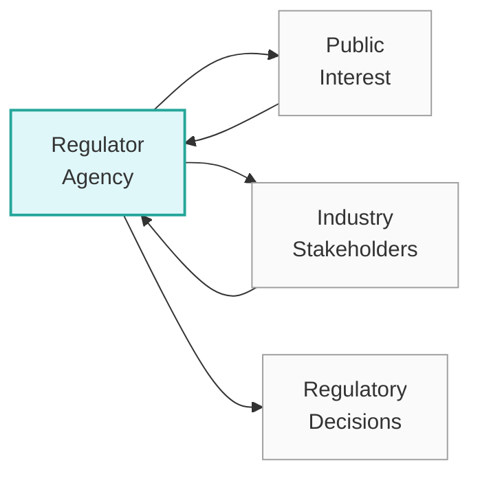

## Overview

Regulatory capture might sound like something out of a thriller novel—where the “heroic agencies” are gradually swayed by the dark side (the industries they’re supposed to oversee). But in truth, it’s a real and fairly common dynamic in the world of finance, economics, and beyond. I remember chatting with a friend who worked at a banking regulatory agency: she was super-excited to help keep markets safe, but after a couple of years, she admitted feeling that many of her colleagues had grown “too cozy” with the banks they supervised. That’s the core of regulatory capture—a phenomenon where the bureaucracies set up to protect the public interest end up catering more to the industries they regulate.

In the CFA program, understanding regulatory capture is crucial because it directly affects how industries are supervised, how financial products are structured, and how we as investment professionals align with or respond to regulatory frameworks. Below, we’ll explore the key aspects of regulatory capture, the forms it can take, and the broad challenges it poses to regulators, market participants, and investors at large. We’ll also tie these ideas back to how they can impact investment analysis and portfolio decisions, just as you’d expect in a Level III exam scenario discussing real-world regulatory constraints.

## Defining Regulatory Capture

Regulatory capture takes place when a regulatory agency (such as a securities commission, an environmental oversight body, or a banking authority) serves the interests of the industry it’s intended to oversee, rather than pursuing the public good. It can manifest in subtle ways—sometimes the regulator simply starts “thinking like” the industry, adopting its worldview. Other times, it’s more overt, with revolving doors, bribes, or industry-led lobbying that shifts agency priorities.

By design, regulators should be independent, knowledgeable, and free from conflicts of interest. But in reality, agencies are composed of individuals who may have relationships with the companies they monitor or scientific fields they are involved in. As a result, they face a tug-of-war between serving the greater good and enjoying the comfort, support, and influence that industry stakeholders might provide.

## Forms of Regulatory Capture

It helps to break down regulatory capture into a few main categories:

### Direct Capture

• Bribery and Corruption: In extreme cases, bribes are used to influence policy or enforcement decisions.  
• Revolving Door Employment: Individuals move from industry to regulator (or vice versa) in quick succession, creating significant conflicts of interest. For instance, a senior bank executive moves to a central bank’s supervisory department, or a top regulator leaves to join a bank’s compliance team at a hefty salary. This “revolving door” phenomenon can muddy decision-making and alignment of interests.  

### Indirect Capture

• Shared Worldview: Sometimes it’s not so dramatic. Regulators, over time, adopt the same assumptions, values, or policy preferences as the industry they oversee. They might see the industry’s perspective as “correct” because of repeated interactions or reliance on industry data or expertise.  
• Lobbying and Influence: CEOs, trade associations, or other interest groups can use persistent lobbying to shape the regulatory environment. Although not always illegal, it can lead regulators to softly align with these special interests.  

A quick analogy: imagine if referees in sports became overly friendly with one of the teams, eventually calling the game in that team’s favor—consciously or unconsciously. It’s playing out on a much bigger stage in our financial and professional world.  

Below is a simple diagram summarizing the interplay between regulators and industry under potential capture mechanisms:

In an ideal world, the agency (A) balances both the public interest (B) and legitimate industry concerns (C) to produce well-crafted, impartial rules and oversight (D). However, under regulatory capture, the connection to the public interest (B) weakens, and the agency gravitates too strongly toward the interests of (C).

## Public Choice Theory

Public choice theory offers a lens through which to understand regulatory capture. It posits that individuals are inherently self-interested, even if they’re part of government or regulatory bodies. This perspective challenges the classical assumption that officials are purely altruistic and always act in the public interest—rather, they face their own incentives, constraints, and personal ambitions.

Applied to regulatory capture, public choice theory suggests that a regulator might opt for decisions that:
• Enhance their career prospects (perhaps by seeking a job in the industry afterward).  
• Reduce political friction or reprisals.  
• Improve their personal network or social capital with influential lobbyists.  

In short, if the incentive structure within the regulatory agency aligns more with pleasing certain private interests rather than the broader public, capture is more likely to occur.

## Challenges in Enforcement

Even the best-intentioned regulations can falter when it comes to enforcement. Enforcement challenges typically center on:

1. Resource Constraints: Regulatory agencies might be chronically underfunded or understaffed, leaving them ill-equipped to handle complex oversight tasks.  
2. Expertise Gaps: Financial innovations can outpace an agency’s expertise—think about new derivatives or decentralized finance (DeFi) protocols. Regulators lacking advanced market knowledge may rely on industry “advice,” which can bias the regulatory approach.  
3. Political Pressures: Regulators sometimes face intense lobbying from powerful interest groups who exert political influence to weaken oversight, defund agencies, or champion lighter penalties for noncompliance.  

In my opinion, this is often where the biggest pitfalls arise. Without robust resources or consistent political support, regulatory bodies struggle to keep pace, let alone remain independent. For instance, after the 2008 financial crisis, many regulators realized they had insufficient knowledge of certain mortgage-backed securities and complex derivatives. Because they relied heavily on industry data, capture—whether conscious or unconscious—became easier.

## Transparency and Accountability

So, you might ask: “How do we fix this?” or “How do we at least mitigate capture?” Well, transparency and accountability practices are frequently touted solutions:

• Open Consultation Processes: By making regulatory rulemaking a transparent, participatory affair, you ensure that all stakeholders can comment. This can reduce the risk of a single interest group dominating the conversation behind closed doors.  
• Conflict-of-Interest Rules: Regulations that limit or supervise the revolving door (e.g., mandatory cooling-off periods before a regulator can join a firm they used to oversee) can help curb direct capture.  
• Whistleblower Protections: If insiders can safely report misconduct or undue influence without fear of retaliation, agencies can more readily identify and address capture.  
• Legislative/Judicial Oversight: External checks, such as independent audits, legislative scrutiny, or court challenges, can enforce accountability on regulators who might otherwise drift or become “comfortably” captured.  

## Ethical Considerations

Ethics cannot be overlooked in this discussion—regulators and finance professionals alike must uphold values of integrity and responsibility. The CFA Institute Code of Ethics and Standards of Professional Conduct provides a blueprint for how financial professionals should act, including not just abiding by the law but also placing client and market integrity above personal gain.

From an ethical standpoint, regulators:

• Should refuse gifts or lavish hospitality from industry players that create the appearance or reality of compromised judgment.  
• Must apply rules consistently, without playing favorites or bending under political or industry pressure.  
• Should encourage a culture of ethics within the agency, reminding staff that their duty is to the public interest first and foremost.  

## Implications for Financial Markets and Investments

Understanding regulatory capture is vital for portfolio managers who navigate these waters daily. If a particular sector is known to have captured its regulators (or if the regulatory environment is especially lax), that can dramatically change the risk-return profile for investments in that sector. Firms operating in a lightly enforced environment may take on more leverage or risk (i.e., moral hazard). But that may also leave them more vulnerable if a future scandal triggers swift regulatory backlash.

On the other side of the coin, an overly punitive or “captured” stance might hamper competition and market efficiency, limiting investor opportunities. For instance, if large, established industry players influence regulators to create high barriers to entry, smaller innovators might be kept out, undermining the competitive dynamics that typically benefit end consumers (and, quite often, agile investors).  

These conditions can feed directly into scenario analysis, factor investing frameworks, and sector allocation decisions. A savvy Level III candidate could incorporate potential regulatory changes or the risk of capture into a top-down macro analysis, adjusting expected returns or even rebalancing to reduce exposure to businesses where the regulatory environment is precarious.

## Real-World Example: Banking Regulation Pre-2008

Before the 2008 financial crisis, some argued that the relationship between major banks and regulators in the U.S. (and parts of Europe) was too close, enabling banks to engage in riskier behaviors. The industry’s perspective—that sophisticated models effectively managed risk—gained acceptance by regulators. This acceptance arguably contributed to lighter-touch oversight, insufficient capital requirements, and a run-up of systemic vulnerabilities.  
Knowing how that turned out, one might see this as a textbook case of partial regulatory capture. Specific examples include:

• Federal agencies allowing banks’ internal VaR (Value at Risk) models to determine capital requirements with minimal external scrutiny.  
• The soft enforcement stance toward mortgage originators, who packaged questionable loans into mortgage-backed securities.  

Now, from a portfolio management standpoint, it’s interesting that investors who spotted these regulatory weaknesses in advance—especially those who shorted mortgage-backed securities—profited significantly. Meanwhile, the broader market meltdown hammered unprepared portfolios. So ironically, an understanding of regulatory capture and its consequences could help you avoid some major losses.

## Strategies to Mitigate Regulatory Capture

Given the potentially damaging effects of capture, both governments and regulators have proposed various strategies:

• Enhanced Financial Remuneration of Regulators: Ensuring regulators are well-compensated might reduce the lure of bribes or the temptation to transition to a higher-paying industry role too quickly.  
• Rotational Policies: Allow staff to rotate periodically between different roles or departments to avoid forming tight-knit relationships with a specific set of industry players.  
• Technological Innovations and Data Transparency: Many agencies invest in sophisticated data analytics, AI-based inspection tools, and publicly accessible databases. This can lower reliance on industry-generated analysis.  

Some of these solutions are obviously more expensive or complicated to implement. But they share a goal: to ensure regulators work effectively for the public interest, remain well-informed, and don’t lose sight of that “greater good.”

## Potential Pitfalls for Portfolio Managers

From a Level III exam perspective, you might be asked to evaluate how different regulatory environments shape investment landscapes. Remember to watch out for:

• Overvaluations in heavily “captured” sectors. If an industry is indulged by regulations, short-term earnings might shoot up, but the underlying fundamentals could be shaky.  
• Rapid shifts in regulation. Eventually, wrongdoing can come to light, catalyzing abrupt legislative or regulatory responses. Portfolios not prepared for these shocks can suffer serious drawdowns.  
• Governance red flags. Companies that rely too heavily on favorable treatment rather than robust governance or competitive advantages might be extremely vulnerable in the long run.  

Identifying these pitfalls requires blending top-down macro-level regulatory analysis with fundamental analysis of individual securities or industries.

## Practical Tips for the CFA Exam

• A typical constructed-response question could involve a scenario describing a regulatory body “overlooking” certain risky industry practices, then ask how this might affect capital market expectations, risk premiums, or portfolio decisions.  
• Another question might integrate an ethics dimension: how an investment professional should react upon discovering signs of regulatory favoritism. Refer back to the Code and Standards, emphasizing integrity and duty to clients.  
• In scenario-based item sets, watch for “red flags” about underfunded regulatory agencies, high lobbying, or excessive reliance on industry data—these often hint that regulatory capture is lurking.

## Conclusion and Final Exam Tips

Ultimately, regulatory capture is more than just a theoretical concept—it’s a very real phenomenon that can shape entire markets, impacting both risk and returns. For those of us in the investment landscape, it’s crucial to:

• Develop an awareness of the incentives and structures that promote or mitigate capture.  
• Monitor how evolving regulations and potential capture scenarios affect industries you’re investing in.  
• Maintain ethical standards that place the public interest and client well-being above personal gain—an approach that the CFA Institute strongly emphasizes.  

When you’re gearing up for the exam, consider:

• Incorporating the concept of regulatory capture into your macro/regulatory frameworks—especially in essay questions about risk management, asset allocation, or scenario planning.  
• Knowing how to apply the CFA Institute Code of Ethics to hypothetical scenarios involving potential conflicts of interest.  
• Demonstrating awareness of how external factors, such as a captured or under-resourced regulator, could alter market prices and investor confidence.

Remember, the more you sharpen your perspective on these systemic vulnerabilities and ethical issues, the better prepared you’ll be to handle them on exam day—and in real life as a financial professional, too.

## References and Further Reading

• Stigler, George J. (1971). “The Theory of Economic Regulation.” Bell Journal of Economics and Management Science.  
• Carpenter, Daniel & Moss, David (2013). “Preventing Regulatory Capture: Special Interest Influence and How to Limit It.”  
• Transparency International. Accessible at: https://www.transparency.org/  

---

## Test Your Knowledge: Regulatory Capture and Its Impacts



### A regulator adopting the worldview of the industry it oversees might best be described as which form of capture?

- [ ] Direct capture involving bribes  
- [x] Indirect capture through shared assumptions  
- [ ] Political capture through legislative interference  
- [ ] Public choice capture  

> **Explanation:** Adopting the industry’s worldview without direct bribes or guaranteed future employment is an example of indirect capture.  

### Which scenario most closely illustrates a "revolving door" phenomenon leading to potential regulatory capture?

- [ ] A regulator uses third-party audit data to enforce penalties  
- [x] An official moving directly from a high-level position at a regulator to a senior role at a bank  
- [ ] A journalist reporting on potential regulatory failures  
- [ ] A regulator collaborating with international agencies  

> **Explanation:** The revolving door occurs when a person goes back and forth between regulator and industry roles, creating conflicts of interest.

### According to public choice theory, which factor might most motivate regulatory capture?

- [x] Self-interested behavior by regulators  
- [ ] Altruistic desire to protect consumers  
- [ ] Preserving public trust above all else  
- [ ] Enforcing standard conflict-of-interest policies  

> **Explanation:** Public choice theory emphasizes that regulators, like all individuals, are self-interested, which can drive capture if safeguards are weak.

### Which of the following measures most effectively addresses indirect forms of regulatory capture?

- [ ] Bribery detection programs  
- [x] Transparent rulemaking and open consultations  
- [ ] Large budget cuts to the regulatory agency  
- [ ] More frequent industry-sponsored events  

> **Explanation:** Transparent decision-making limits the impact of backroom deals and undue industry influence, helping mitigate indirect capture.

### In analyzing a sector potentially affected by regulatory capture, what might a portfolio manager consider?

- [x] The likelihood of abrupt policy reversals once capture is exposed  
- [ ] Strict exclusion of all heavily regulated industries  
- [x] Lobbying intensity and resource constraints of the regulators  
- [ ] None of the above  

> **Explanation:** A manager should consider both the possibility of sudden regulatory backlash and how well-resourced the regulator is.  

### Which of the following is an example of a conflict-of-interest rule reducing regulatory capture?

- [x] Imposing cooling-off periods before a former regulator can join the same industry  
- [ ] Dismissing any regulator seeking collaboration with private entities  
- [ ] Banning all forms of lobbying and advocacy  
- [ ] Encouraging all staff to move to the industry when opportunities arise  

> **Explanation:** Cooling-off periods inhibit direct capture by creating safeguards around the revolving door.  

### Why might whistleblower protection help counter regulatory capture?

- [x] It encourages staff or insiders to report misconduct  
- [ ] It decreases the bargaining power of trade associations  
- [x] It ensures regulators rely solely on industry data  
- [ ] It immediately solves underfunding issues  

> **Explanation:** Whistleblower protection lets individuals safely reveal undue influence or corrupt activities without fear of retaliation, thus helping regulators address capture.

### Which of the following was a contributing factor to possible regulatory capture in banking prior to the 2008 crisis?

- [x] Lighter enforcement on mortgage originators producing poor-quality loans  
- [ ] Excessive legislative oversight forcing stricter capital requirements  
- [ ] Overly demanding regulations on credit default swaps  
- [ ] Consistent refusal of banks’ internal Value at Risk models  

> **Explanation:** The lenient oversight of mortgage originators and reliance on bank internal risk models contributed to the crisis.

### Which best describes the role of public choice theory in the context of regulatory agencies?

- [x] It proposes that government officials act out of self-interest  
- [ ] It necessitates altruistic behavior by all industry lobbyists  
- [ ] It ignores the role of incentives in public service  
- [ ] It promotes a hierarchical regulatory structure  

> **Explanation:** Public choice theory contends government officials and regulators also respond to personal incentives, a key factor in understanding capture.

### Regulatory capture is:

- [x] True  
- [ ] False  

> **Explanation:** Regulatory capture is a real concept wherein regulators prioritize industry interests over the public interest.


