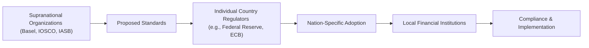

## Introduction

It’s wild how, sometimes, the same multinational bank has to juggle entirely different rulebooks in each country where it operates. Someone once told me about a compliance officer who used to fly back and forth between New York, London, and Hong Kong, deciphering all sorts of local regulations—like an archaeologist unearthing lengthy, arcane scrolls. That’s precisely where international regulatory harmonization steps in. Harmonization is about making these scrolls look and read similarly across borders so global firms don’t lose their minds trying to comply with conflicting—sometimes contradictory—rules. At the same time, regulators aim for worldwide financial stability, ensuring one region’s meltdown doesn’t instantly topple everything else.

In CFA parlance, understanding how regulations sync across markets is critical for analyzing cross-border investments and global risk exposures. After all, a portfolio is only as stable as the environment in which it operates. Our focus here is on how and why regulators around the world attempt to align rules, the difficulties they face, and the implications for people like us—analysts, investors, and finance enthusiasts.

## Defining Harmonization and Its Goals

Regulatory harmonization is the process of standardizing rules, laws, and oversight practices across different jurisdictions. The aim is straightforward: make sure that no matter where you do business internationally, you deal with consistent guidelines. This standardization is often described in the context of the “level playing field,” a hypothetical scenario in which any firm in any location faces comparable rules and compliance burdens.

Key motivations include:

• Minimizing regulatory arbitrage: When rules differ, companies may relocate or structure certain activities in places with looser oversight.  
• Facilitating cross-border investment: Investors avoid extra reporting or procedural hoops if rules look similar.  
• Enhancing global market stability: Uniform financial standards help mitigate systemic risks that could spill from one region to another.

## The Drivers Behind International Harmonization

There’s an ongoing joke among CFOs that if you want to watch your entire finance department sweat, ask them for consolidated accounts under multiple accounting regimes. The volume of duplication can be mind-boggling. But that’s only a microcosm of bigger trends—globalization, cross-border trade, and the unstoppable force of technology have made capital markets extremely interconnected.

When a local bank in Germany invests in an asset-backed security in the United States, or when a Japanese insurer underwrites a Brazilian infrastructure project, each new link adds another dimension to the web of global finance. Regulators see these linkages and realize that inconsistent rules can breed vulnerabilities. So, harmonizing regulations is a way to “contain the chaos” and address the following factors:

• Globalization of Financial Services: Banks, insurers, asset managers—everyone is crossing borders more freely than ever. Harmonized standards, like Basel III capital requirements, help integrate these global markets and keep them transparent.  
• Increasing Role of Multinational Corporations (MNCs): Large corporations, spanning dozens of countries and industries, benefit when their compliance teams don’t have to reinvent the wheel in every locale.  
• Digital Innovations: Fintech, digital currencies, and cross-border payment systems all push regulators to coordinate. If a digital payment rail is regulated differently in each location, cross-border transactions get awkward very fast.

## Role of Supranational Organizations

The quest for harmonization isn’t carried out by a single global super-regulator (though that’s sometimes the futuristic dream we read about in finance news). Instead, we have a variety of organizations setting standards, coordinating agreements, and encouraging nations to align. Some common actors include:

- Basel Committee on Banking Supervision (BCBS): Develops Basel Accords (e.g., Basel III, Basel IV proposals) that define minimum capital, liquidity, and leverage rules for banks.  
- International Organization of Securities Commissions (IOSCO): Works on standardizing securities regulation, aiming for stable and efficient capital markets.  
- International Accounting Standards Board (IASB): Issues International Financial Reporting Standards (IFRS) to unify how companies worldwide report financial performance.  
- Financial Stability Board (FSB): Coordinates national financial authorities and international bodies to promote global financial stability.

While these bodies propose frameworks, they typically can’t enforce them unilaterally. Each jurisdiction (U.S., EU, Japan, etc.) must codify the standards in domestic law before they become binding. This interplay between global standards and local adoption is where much of the complexity—and at times, friction—arises.

## Challenges to Implementation

Yet, for all the rosy talk about global unity, regulatory harmonization isn’t a walk in the park. Different countries have unique legal traditions, socio-political priorities, and economic structures. For example:

• Legal Systems: Civil-law countries (e.g., France) versus common-law countries (e.g., UK). It’s not always straightforward to map one set of rules onto the other.  
• Political Sovereignty: Countries often defend their right to write rules best suited for their citizens—especially if popular opinion demands protective measures against international competition.  
• Unequal Economic Conditions: Emerging markets might have different needs or resources to implement global standards than advanced economies.  
• Cultural Variations: Attitudes toward risk, disclosure, transparency, and consumer protection differ widely.  
• Fear of Losing Comparative Advantage: Certain financial hubs may fear that adopting some global standard puts them at a disadvantage, especially if their local market is known for specialized regulatory frameworks.

I remember talking to a compliance consultant who spent years in Southeast Asia, explaining to local regulators why adopting international money-laundering rules was essential. There was pushback because those rules came with costs, like staff training, system overhauls, and stricter client onboarding. It’s not that regulators “didn’t want to fight bad guys,” but the resource constraints were real.

## Benefits of Harmonized Regulations

Despite the hurdles, there’s no shortage of advantages when harmonization succeeds:

• Streamlined Cross-Border Transactions: Investors and businesses can scale across markets without dealing with a patchwork of different processes.  
• Easier Comparisons for Investors: Uniform financial statements (e.g., IFRS) or standardized capital ratios (Basel Accords) allow investors to evaluate firms more accurately.  
• Enhanced Global Financial Stability: Consistency in capital adequacy, liquidity requirements, and risk management fosters resilience against crises.  
• Cost Reduction for Firms: Compliance teams can rely on a single, or at least more consistent, rulebook. This reduces overhead and complexity, which theoretically can lead to better economic outcomes for businesses and their customers.  
• Increased Transparency: Harmonized disclosure requirements can enhance investor trust and diminish the possibility of critical information falling through the cracks.

## Potential Risks and Downsides

At times, the drive for uniform standards can produce unintended consequences. A single standard might prove ill-suited for every local environment. Consider the 2008 financial crisis: Some critics argued that uniform adoption of certain advanced but complex risk models (e.g., VaR, or Value at Risk, under Basel guidelines) led to a groupthink that underestimated tail risks. When one meltdown occurred, it quickly cascaded through similarly designed systems around the globe.

In addition, localized autonomy allows some regions to tailor regulations. If a global standard is too rigid, it may stifle local innovation—especially in developing markets where the constraints might outweigh the benefits. Another worry is that if every regulator is singing the same tune, a crisis in one big financial center could spread with unstoppable momentum because all markets are synchronized.

## Practical Examples and Case Studies

Let’s walk through a couple of real-world examples:

• Basel III Implementation Across Regions  
  Different countries adopted Basel III in varied ways. In the EU, CRD IV (Capital Requirements Directive IV) and CRR (Capital Requirements Regulation) were introduced to embed the Basel standards into their legal framework. The U.S. Federal Reserve also issued rules, but with additional requirements such as the leverage ratio for larger banks. That means, ironically, “harmonized” rules still look slightly different in each region, with “gold-plating” or region-specific add-ons.

• IFRS vs. US GAAP  
  When IFRS aimed to unify accounting standards globally, the hope was that the U.S. would converge US GAAP (Generally Accepted Accounting Principles) fully with IFRS. Progress was made, but full convergence remains incomplete. Companies listing in the U.S. with IFRS still face some unique disclosures and bridging statements. True global harmony here remains a work in progress.

• IOSCO Principles for Securities Regulation  
  IOSCO’s standards push for consistent financial market infrastructures and investor protection guidelines. While many countries adopt IOSCO’s frameworks, each has distinct local laws reflecting unique market dynamics. For instance, some emerging markets don’t have the same electronic trading infrastructure or sophisticated derivative markets, so adaptations are made.

## Diagram: Global Harmonization Pathway

Here’s a simplified diagram showing the major stakeholders in international regulatory harmonization:

Observe how the flow starts at the supranational level, then gets distilled and codified by country regulators before firms implement it. This flow ensures local nuances can be integrated, although that process might reduce the uniformity of the final outcome.

## Best Practices and Common Pitfalls

For practitioners, especially those working on compliance or risk management:

• Stay up to date on global standards proposals. A proposed IFRS or Basel update could, if adopted, reshape local regulations.  
• Remain aware of local overlays. Even if the global standard says one thing, your country’s regulator might add stricter provisions.  
• Document divergence. When operating in multiple jurisdictions, keep track of where requirements differ—particularly important for reporting and capital reserve calculations.  
• Build flexible systems. Whether it’s accounting software or risk dashboards, design them with expansions in mind because new jurisdictions might come with new rules.  
• Engage with industry groups. Industry associations often provide feedback to regulators, helping shape final harmonized rules.  

## Real-World Strategies to Overcome Implementation Challenges

Perhaps you’re a risk analyst in a global bank, or you’re supporting cross-border deals for a large asset manager. How do you deal with these complexities?

• Centralized Regulatory Intelligence: Create an internal “regulatory intelligence” unit that monitors changes across jurisdictions, ensuring you spot differences early.  
• Collaboration with Auditors and Consultants: Auditors, legal counsels, and consultants often have specialized knowledge of local legal intricacies.  
• Pilot Programs: Before rolling out new compliance techniques enterprise-wide, run pilot programs in smaller markets or business lines to understand the operational impacts.  
• Investing in Education: Train employees—from front-line staff to senior executives—on the fundamentals of major global standards. Lack of knowledge can lead to major compliance slip-ups.  

## Looking Ahead

Financial crises taught us the importance of robust, coordinated regulation. Harmonization efforts may intensify as capital markets become even more integrated—particularly with digital assets and decentralized finance (DeFi) on the rise. The next wave of IFRS might address crypto assets, or the Basel Committee might release specialized guidelines on stablecoins. In other words, the story of regulatory alignment never really ends.

For CFA candidates, an understanding of how these regulations converge is vital—especially in Level III’s portfolio management realm, where you deal with multi-asset strategies across borders. Keep an eye out for exam questions that test your understanding of how differences in regulatory frameworks influence portfolio design, risk management, and performance measurement.

## Conclusion

International regulatory harmonization is more than a bureaucratic exercise; it’s a backbone of modern global finance. By aligning rules and standards, regulators reduce friction for firms and investors, enhance stability, and strengthen confidence in cross-border transactions. However, uniform rules aren’t always a one-size-fits-all solution. Political realities, economic structures, and cultural values often require a delicate balance between local specificity and global cohesion.

In your role—whether as an analyst, portfolio manager, or CFO—it’s essential to keep a pulse on these developments. Harmonized or not, regulations shape the playing field on which capital moves and wealth is built.

## References and Further Reading

- Basel Committee on Banking Supervision:  
  https://www.bis.org/bcbs/  
- IOSCO (International Organization of Securities Commissions):  
  https://www.iosco.org/  
- “Global Governance and Financial Crises” by Meghnad Desai  
- IFRS Foundation:  
  https://www.ifrs.org/  
- CFA Institute Standards of Practice Handbook (for ethical guidance related to cross-border dealings)

## Final Exam Tips

• Watch for scenario-based questions where regulators in different countries adopt global standards with slight twists.  
• Know the high-level objectives and frameworks of Basel, IOSCO, and IASB—especially for item set or constructed-response questions.  
• Don’t overlook the political and economic factors behind regulatory choices.  
• Familiarize yourself with the “why” behind regulatory arbitrage and how to spot it in real case studies.

## Assessing Your Knowledge of International Regulatory Harmonization



### In the context of international regulatory harmonization, which of the following is the primary reason for reducing regulatory arbitrage?

- [ ] To increase competition among domestic banks.
- [ ] To prevent government interference in monetary policy.
- [x] To ensure that companies cannot exploit differing rules across jurisdictions.
- [ ] To limit access to foreign capital markets.

> **Explanation:** By aligning regulations across borders, regulators aim to minimize the chance that firms will move activities to jurisdictions with weaker standards or fewer constraints.

### Which supranational organization sets global banking standards, including capital adequacy requirements?

- [x] The Basel Committee on Banking Supervision (BCBS)
- [ ] The International Accounting Standards Board (IASB)
- [ ] The World Bank
- [ ] The International Monetary Fund (IMF)

> **Explanation:** The BCBS is known for formulating the Basel Accords, which set worldwide guidelines on bank capital, stress testing, and liquidity.

### Which regulatory principle ensures investors can more easily compare financial statements globally?

- [ ] Regulatory capture
- [ ] Regulatory compliance
- [x] Common accounting standards (e.g., IFRS)
- [ ] Endogenous growth theory

> **Explanation:** One of the key outcomes of IFRS or any globally accepted standard is that it facilitates comparability across markets, thereby improving the quality of investment decisions.

### What is one significant challenge faced by developing countries in adopting international regulatory standards?

- [x] Limited resources for implementation
- [ ] Excess liquidity in their financial systems
- [ ] Overabundance of political support
- [ ] Decreased reliance on foreign investment

> **Explanation:** Implementing new regulatory frameworks often requires advanced infrastructure, training, and resources that might be scarce in emerging markets.

### Why might harmonized regulations inadvertently accelerate the spread of global financial crises?

- [x] If all institutions follow similar rules, a shock could affect them in a similar way.
- [ ] Lack of correlation between markets
- [ ] Harmonized regulations eliminate all credit risk
- [ ] It increases the cost of rolling out new technology

> **Explanation:** With unified standards, there is a risk of “monoculture” in financial practices. If those standards have weaknesses, they can propagate system-wide.

### Which of the following best describes the term “regulatory arbitrage”?

- [x] Exploiting differences in rules between jurisdictions to gain an advantage
- [ ] Disclosing financial statements in more than one country
- [ ] Colluding with local regulators to avoid compliance
- [ ] Standardizing securities laws across multiple regions

> **Explanation:** Regulatory arbitrage involves shifting operations or transactions to regions where regulations are less strict or more advantageous.

### IOSCO primarily focuses on which area of financial regulation?

- [ ] Insurance solvency standards
- [ ] Banking capital requirements
- [x] Securities markets regulation
- [ ] Consumer credit lending rules

> **Explanation:** IOSCO seeks to promote consistent securities regulation, fostering closer cooperation among securities regulators around the world.

### In practice, international regulatory bodies rely on which of the following methods to make their standards effective?

- [x] Adoption by individual countries into their local regulations
- [ ] Direct global enforcement power
- [ ] Bypass of local laws
- [ ] Unanimous approval by all market participants

> **Explanation:** Supranational standards do not inherently have direct enforcement. They rely on member countries incorporating these guidelines into their own legal frameworks.

### Which best defines the primary advantage of unified accounting standards such as IFRS?

- [x] They allow investors to compare financial statements consistently across countries.
- [ ] They ensure every corporation pays the same tax rate.
- [ ] They eliminate the need for audits completely.
- [ ] They allow mixing IFRS and US GAAP in one report.

> **Explanation:** Comparability is the crucial benefit, letting analysts evaluate firms on a similar basis globally.

### True or False: The framework of Basel Accords is entirely enforced by the Financial Stability Board on a global scale.

- [x] False
- [ ] True

> **Explanation:** The Basel Accords are drafted by the Basel Committee, but enforcement depends on national regulators, not the Financial Stability Board itself. 


