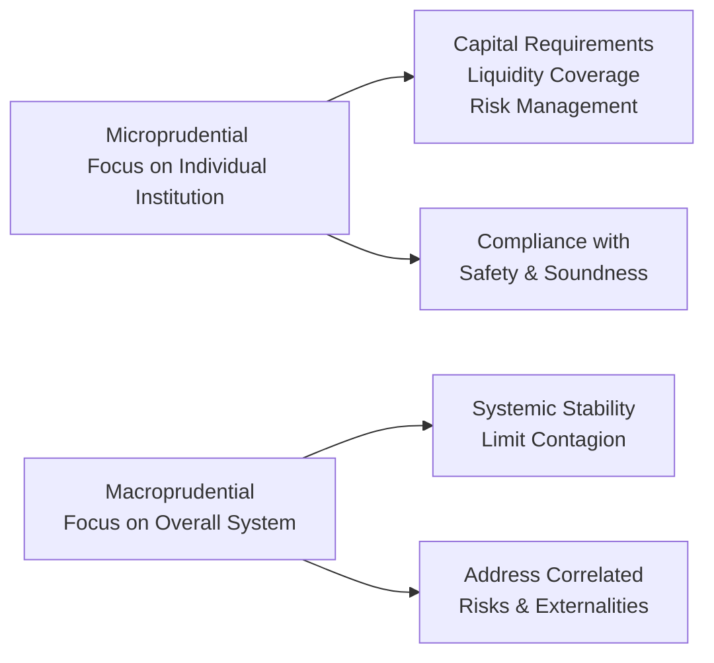
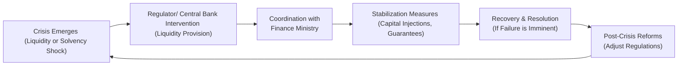

## Overview and Background

Systemic risk looms large in modern finance. Even small triggers—say, one major bank inching toward insolvency—can potentially topple the entire financial ecosystem if not properly contained. This threat of “too big to fail” or, more thoroughly, “too interlinked to fail,” has driven regulatory reforms worldwide. In this section, we will take a deep dive into the theories, practices, and frameworks regulators employ to stabilize our globally connected markets. We will also explore real-world examples and discuss how macroprudential supervision (versus traditional microprudential oversight) has evolved to manage these risks from a holistic perspective.

Systemic risk (often simplified as “system-wide meltdown risk”) is relevant at all levels of analysis—including the CFA exam. For advanced learners, it’s vital not only to grasp the definitions but also to understand how to evaluate policy actions and gauge the effectiveness of capital requirements, stress tests, living wills, and other macro-level tools that aim to mitigate financial instability.

## Defining Systemic Risk

Systemic risk refers to the possibility that the failure of a major financial player—or a severe shock in one sector—could lead to a cascading effect of defaults, illiquidity, and general market panic throughout the system. One reason it’s so pernicious is the interconnected web of obligations and exposures among financial institutions. Contagion can spread quickly, igniting a crisis of confidence that halts lending, dampens liquidity, and imperils the broader economy.

### Key Moments in History

• 2008 Global Financial Crisis: Turmoil originating in the U.S. subprime mortgage market quickly spread to nearly all major economies, in part because large banks were significantly exposed through mortgage-backed securities (MBS) and related derivatives.  
• LTCM Collapse (1998): Despite being a hedge fund, LTCM’s near-failure threatened global liquidity because it was heavily leveraged and had counterparties around the world.  
• European Debt Crisis (2010–2012): Sovereign debt concerns in certain Eurozone nations threatened the solvency of many European banks.

These episodes underscore that systemic risk does not always wait for a single type of institution or single region to mismanage risk. Often, the contagion path is broad and unpredictable, amplifying the need for robust oversight.

## Macroprudential Regulation vs. Microprudential Regulation

Traditional (microprudential) regulation focuses on individual institutions—ensuring each entity maintains sufficient capital, manages its own risks, and operates within prudent guidelines. Macroprudential regulation, on the other hand, looks at the health of the overall financial ecosystem:

• Microprudential: Concerned with institution-level solvency and liquidity.  
• Macroprudential: Concerned with aggregate or systemic outcomes, such as credit booms, asset inflation, or sector-wide leverage that might threaten the entire market.

### Why Macroprudential Regulation?

One big lesson from past crises is that even if individual firms appear “safe,” widespread correlated exposures can expose the system to tail events. For instance, multiple banks might hold the same type of illiquid assets. If asset prices plunge, or if liquidity needs spike, the entire system may face serious strains no matter how “safe” each bank originally appeared under its own micro-lens.

Below is a simple Mermaid diagram illustrating the interplay between microprudential and macroprudential goals:

## Systemically Important Financial Institutions (SIFIs)

Regulatory efforts often center on “Systemically Important Financial Institutions” (SIFIs). These entities are so large or so deeply interconnected that their failure could trigger chain reactions in global markets. To reduce these risks:

• Higher Capital Buffers: SIFIs are subject to elevated capital requirements, allowing them to absorb larger losses without failing.  
• Stricter Oversight: Regulators tend to conduct more frequent and more stringent inspections, stress tests, and scenario analyses.  
• Resolution or “Living Wills”: Large institutions must outline how they can be wound down in an orderly manner if they approach insolvency.

### Real-World Example: G-SIBs and D-SIBs

At the global level, the Financial Stability Board (FSB) publishes a list of Global Systemically Important Banks (G-SIBs) that must hold additional loss-absorbing capacity. Similarly, certain domestic regulators identify Domestic Systemically Important Banks (D-SIBs) in their local markets. The key idea is that the bigger and more complex (and thus the more systemically critical) the institution, the more capital and planning are required to stave off meltdown.

## Stress Testing and Capital Requirements

Stress testing has become a core pillar of macroprudential regulation. The goal is to see if banks can survive a series of hypothetical yet harsh economic conditions—for instance, a severe recession, a housing market collapse, or a spike in interest rates. 

### Basel III and Beyond

Basel III, a global regulatory framework introduced by the Basel Committee on Banking Supervision, aims to strengthen bank capital requirements by increasing minimum capital ratios and introducing new regulatory buffers (like the Capital Conservation Buffer and the Countercyclical Capital Buffer). It also adds liquidity standards such as the Liquidity Coverage Ratio (LCR) and the Net Stable Funding Ratio (NSFR).

The capital adequacy ratio (CAR) commonly takes the form:


\text{CAR} = \frac{\text{Tier 1 Capital} + \text{Tier 2 Capital}}{\text{Risk-Weighted Assets}}


Banks must maintain sufficient capital relative to the risk of their asset portfolios. Tier 1 Capital includes high-quality capital such as common equity, while Tier 2 may include subordinated debt or hybrid instruments.

### Case Study: U.S. Federal Reserve Stress Tests

• The U.S. Federal Reserve’s Comprehensive Capital Analysis and Review (CCAR) and Dodd-Frank Act Stress Tests (DFAST) subject large bank holding companies to hypothetical adverse economic scenarios.  
• Banks that fail to meet capital minimums are restricted from paying dividends or engaging in share buybacks until they shore up their capital base.

This cyclical testing approach encourages banks to continually re-evaluate and manage their risk exposures and capital levels.

## Living Wills (Recovery and Resolution Planning)

Even the best capital rules can’t eliminate all chance of failure. Large institutions therefore submit “living wills,” or resolution plans, explaining how they can be wound down quickly if they fall into distress. 

### Purpose and Benefits

• Minimize Market Disruption: By preplanning the shutdown or restructuring, living wills reduce the guesswork if regulators must intervene.  
• Clarity for Stakeholders: Shareholders, bondholders, and counterparties gain transparency about how losses might be allocated.  
• Reduce Moral Hazard: If institutions know they can’t rely on ad-hoc bailouts, they may operate more responsibly.

In practice, authorities can use these plans to propose rapid spin-offs or partial sales of business lines, guaranteeing that failing parts of the entity do not sink otherwise viable divisions.

## Contagion Effects and Interconnectedness

A financial system is a bit like a set of dominoes—one tipping over can set off many more. Contagion risk is especially acute in our era of global capital flows, cross-border exposures, and complex derivative instruments. When banks or insurers share large, similar exposures, or when institutions rely on short-term funding that can vanish overnight, the entire system stands on shaky ground.

### Regulatory Initiatives to Limit Interconnected Risks

• Restrictions on Proprietary Trading: Some jurisdictions impose rules (e.g., the Volcker Rule in the United States) limiting banks from trading on their own account and taking on excessive market risk.  
• Central Clearing for OTC Derivatives: Clearinghouses reduce bilateral counterparty risk by standing as the “hub” in derivatives transactions, demanding margin (or collateral) from each party.  
• Shadow Banking Oversight: Firms that function like banks but do not hold a banking license (e.g., certain money market funds, hedge funds) can be overlooked in microprudential regulation. Macroprudential frameworks often attempt to bring them under the regulatory umbrella.  

By tackling these “network externalities,” regulators aim to dampen contagion’s speed and severity.

## Importance of Crisis Management

While prevention is crucial, regulators and central banks also need robust crisis-management frameworks for when trouble strikes. Indeed, systemic events can unfold rapidly, and markets can become dislocated within hours. 

### Coordination among Authorities

• Central Banks: Provide liquidity through mechanisms such as the discount window or open-market operations. In extreme cases, they can act as lenders of last resort.  
• Finance Ministries/Treasuries: Inject capital into failing institutions or guarantee specific liabilities if systemic spillovers appear inevitable (although such moves are politically controversial).  
• International Cooperation: Bodies like the International Monetary Fund (IMF) and the Bank for International Settlements (BIS) act as international conduits for policy coordination. During the 2008 crisis, for instance, multiple central banks coordinated on interest-rates cuts to calm global markets.

Below is a mermaid diagram that illustrates a simplified crisis management cycle:

## Practical Insights and Exam Relevance

Understanding systemic risk and macroprudential regulation is crucial for finance professionals (and especially for those preparing for advanced CFA exams). The guidelines and frameworks on capital, liquidity, and resolution planning frequently appear in test questions, particularly in scenario-based item sets. When analyzing a bank or financial system:

• Check capital ratios, liquidity ratios, and diversification of exposures.  
• Understand how changes in monetary or fiscal policy catalyze systemic shifts in overall credit conditions.  
• Evaluate the role of SIFIs within a country’s financial sector and whether they are adequately scrutinized by regulators.  
• Incorporate macroeconomic stress scenarios into your valuation and risk modeling.  
• Keep an eye on cross-border exposures for global banks, especially in uncertain macro or geopolitical climates.

For essay-based exam questions, you might be asked to propose how a central bank, a supranational regulator, or a finance ministry should respond to hypothetical meltdown scenarios. Citing the relevant tools—stress tests, living wills, resolution mechanisms, liquidity lines, or bail-in instruments—will enhance your responses.

## Best Practices and Potential Pitfalls

• Overreliance on Model Outputs: If stress tests or risk models fail to capture correlated risks or fail to anticipate “black swan” events, regulators and institutions can be blindsided.  
• Moral Hazard: Institutions might take on higher risk if they believe they’ll be rescued due to their systemic importance.  
• Global “Regulatory Arbitrage”: Firms often move operations to less-regulated jurisdictions, complicating unified oversight.  
• Complexity Overload: The largest institutions may be so structurally complex that even well-intentioned living wills are difficult to execute effectively.  

To mitigate these pitfalls, continuous global coordination and frequent reevaluation of rules are necessary. Additionally, risk professionals and regulators alike must never underestimate markets’ ability to evolve around existing regulations, necessitating constant vigilance.

## Closing Thoughts and Final Exam Tips

Systemic risk is not new, but with global markets more connected than ever, it remains a central concern for policymakers and market participants. Understanding macroprudential tools such as stress testing, SIFI oversight, and living will requirements enables you to assess risk across portfolios and anticipate how regulatory changes could reshape market dynamics. 

For the exam, be prepared to:  
• Analyze how a shock at a large financial institution might spill over to the system.  
• Discuss capital adequacy in the context of macroprudential goals, not just microprudential ones.  
• Recommend regulatory or policy measures that can help stabilize markets in hypothetical scenarios.  
• Identify pitfalls—like moral hazard or regulatory arbitrage—that undermine well-intentioned frameworks.  

With these insights, you will be more equipped to tackle the multi-asset, cross-border, and scenario-based questions that often appear in higher-level CFA exams—and to bring valuable perspective to real-world risk management challenges.

## References

• Tucker, P. (Bank of England). “Macroprudential Policy: Protecting the Whole.”  
• Bank for International Settlements (BIS). Various research papers and guidance:  
  https://www.bis.org/  
• Gup, B. E. “The Federal Reserve and Financial Regulation.”  

--------------------------------------------------------------------------------

## Test Your Knowledge: Systemic Risk Regulation



### Which statement best describes systemic risk?

- [ ] It is the risk unique to a single asset class and unrelated to the broader financial system.  
- [x] It is the potential for a breakdown or collapse of the entire financial system due to the failure of one or more interconnected institutions.  
- [ ] It is a risk that arises exclusively from government policy changes, independent of the financial sector.  
- [ ] It is an isolated event with minimal contagion effects.  

> **Explanation:** Systemic risk refers to the possibility of a widespread financial system collapse precipitated by failures or shocks in one or more large, interconnected institutions.

---

### Macroprudential regulation primarily aims to:

- [ ] Maximize profitability of core institutions.  
- [ ] Eliminate competition among banks.  
- [x] Address system-wide vulnerabilities and correlated risks.  
- [ ] Oversee individual traders’ activities in isolation.  

> **Explanation:** While traditional microprudential regulation looks at individual institutions, macroprudential oversight focuses on the broader system, including vulnerabilities that arise from correlations, interconnectedness, and amplified feedback loops.

---

### SIFIs (Systemically Important Financial Institutions) typically face:

- [x] Stricter oversight and higher capital requirements than smaller institutions.  
- [ ] Less restriction because of their systemic importance.  
- [ ] No difference in regulatory standards, as all banks are treated equally.  
- [ ] Automatic government bailouts without additional supervisory measures.  

> **Explanation:** SIFIs are subject to enhanced regulatory measures due to their potential to impact the entire financial system. This typically means higher capital requirements, tighter scrutiny, and living will obligations.

---

### Stress testing is used to:

- [ ] Guarantee the profitability of every branch within a bank’s corporate structure.  
- [ ] Eliminate market risk entirely.  
- [x] Evaluate a bank’s resilience under extreme economic or market downturn scenarios.  
- [ ] Ensure that banks make equal returns across all business cycles.  

> **Explanation:** Stress tests simulate adverse economic conditions to check whether institutions can remain adequately capitalized and solvent under large, unexpected shocks.

---

### One goal of living wills (recovery and resolution plans) is:

- [ ] To allow unlimited expansion of systemically important banks.  
- [ ] To enable immediate liquidation of assets during normal business operations.  
- [x] To ensure an orderly wind-down if a large institution teeters on insolvency.  
- [ ] To guarantee that government funds are not used during crises.  

> **Explanation:** Living wills outline how a failing institution can be dismantled or restructured, aiming to reduce market disruption and moral hazard.

---

### Which action best helps prevent contagion effects?

- [x] Imposing capital buffers on large, interconnected institutions.  
- [ ] Advocating that every bank trade only with one preferred counterparty.  
- [ ] Prohibiting cross-border banking entirely.  
- [ ] Mandating that banks invest only in risky derivative products.  

> **Explanation:** Capital buffers and other macroprudential tools enhance resilience and reduce the likelihood that failures spread throughout the financial system.

---

### Central clearing of over-the-counter (OTC) derivatives:

- [ ] Increases counterparty risk by removing the need for margin.  
- [x] Reduces bilateral counterparty risk by placing a clearinghouse between the parties.  
- [ ] Is unnecessary, as OTC contracts rarely involve large exposures.  
- [ ] Eliminates all derivative-related risk.  

> **Explanation:** By acting as an intermediary and requiring margins/collateral, central clearinghouses mitigate the risk of cascading defaults between counterparties.

---

### During a financial crisis, central banks primarily:

- [ ] Aim to shrink the monetary base immediately.  
- [ ] Focus on maximizing consumer spending by raising taxes.  
- [x] Provide liquidity to stabilize markets (e.g., lender of last resort).  
- [ ] Shut down all large institutions to prevent moral hazard.  

> **Explanation:** Central banks typically act fast to inject liquidity during crises, aiming to prevent a credit freeze and broader market panic.

---

### A moral hazard issue arises when:

- [x] Institutions believe they will be bailed out and therefore take on excessive risks.  
- [ ] Regulators reward prudent lending practices with higher returns.  
- [ ] Markets overestimate the complexity of derivatives.  
- [ ] Capital requirements are set too high, deterring investment.  

> **Explanation:** Moral hazard is the risk that entities engage in reckless behavior because they assume they’ll be rescued if their bets go wrong.

---

### True or False: Macroprudential policy concentrates on the stability of each individual bank rather than the financial system as a whole.

- [ ] True  
- [x] False  

> **Explanation:** Macroprudential regulation focuses on systemic stability by targeting overall interconnectedness, common exposures, and feedback loops, not merely the soundness of individual banks.


