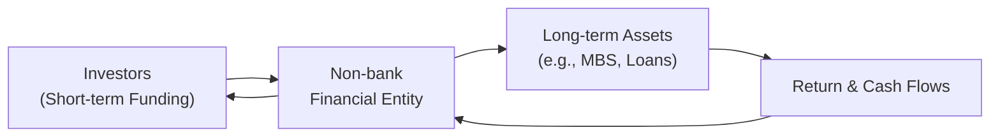

## Introduction and Context

I remember once chatting with a friend who worked at a hedge fund. He casually mentioned how they manage short-term funding from various counterparties, transform it into longer-term specialized instruments, and then pass it along to other investors who wanted a slice of exotic returns. At that time, I thought, “Huh, that’s kind of like a bank, only without deposit insurance or the usual capital requirements.” It was my first real peek behind the curtain of what’s now commonly called “shadow banking”—a term describing non-bank entities that engage in credit intermediation. And while these activities can be innovative and beneficial, they can also amplify risks that may ripple through global financial markets.

In this section, we’ll explore shadow banking in detail, focusing on how it operates, the unique risks it poses, and the evolving regulatory frameworks that aim to keep it in check. We’ll also look at how all of this might crop up in your CFA exam context—particularly when you’re dealing with stress testing, liquidity risk assessments, and advanced portfolio risk management scenarios.

## Definition of Shadow Banking

Shadow banking refers to credit intermediation activities performed by entities outside the traditional banking system. Among these entities, you’ll often see money market funds (MMFs), investment banks’ off-balance-sheet vehicles (like structured investment vehicles, or SIVs), peer-to-peer lending platforms, private equity firms, and hedge funds. Generally, these institutions are not subject to the same rigorous regulatory oversight that governs deposit-taking banks under frameworks like Basel III.

Despite the negative connotation the term “shadow” might convey, non-bank credit intermediation can play a significant and constructive role in financial markets. For instance, it provides additional sources of liquidity and credit to households and corporations—sometimes delivering more specialized or higher-yield products than a standard commercial bank would. However, because shadow banking activities typically occur outside traditional prudential regulations, they pose distinct systemic risks.

## Understanding Non-Bank Financial Institutions

Non-bank financial institutions (NBFIs) carry out many functions similar to banks—maturity transformation, liquidity creation, and leveraging—but without adhering to bank-specific regulations such as minimum capital ratios, reserve requirements, or deposit insurance constraints. Although we often lump them all together, it’s important to understand how diverse these organizations really are:

• Money Market Funds (MMFs): Offer high liquidity, short-maturity investments.  
• Hedge Funds: Seek absolute returns, often employ leverage, and can invest in complex products.  
• Peer-to-Peer (P2P) Lenders: Match borrowers and lenders without a traditional intermediary.  
• Structured Investment Vehicles (SIVs) and Asset-Backed Commercial Paper (ABCP) Conduits: Financial entities that issue short-term debt (like commercial paper) to fund longer-term assets (like mortgage-backed securities).

One might consider these firms essential competition to banks, particularly in the realm of credit intermediation. Sometimes, they can offer more attractive services because of looser regulations, reduced operating overhead, and an appetite for specialized or higher-risk investment strategies.

## Key Risks in Shadow Banking

### 1. Limited Oversight and Regulatory Arbitrage

Shadow banking entities often operate under lightweight or inconsistent regulations relative to traditional banks. Some countries may consider certain hedge fund operations entirely beyond the scope of mainstream supervision. Consequently, NBFIs may end up with risk profiles that remain largely invisible to regulators. This can create:

• Arbitrage: They might exploit gaps between regulations—intentionally or not—to engage in higher-leverage activities.  
• Pro-cyclical Behavior: In booming markets, they may accumulate leverage quickly, only to become distressed (or fail) when market sentiments shift.

### 2. Leverage and Maturity Mismatch

One of the hallmark vulnerabilities of shadow banking is the reliance on short-term funding for long-term or illiquid assets. When confidence erodes, or short-term investors or counterparties start pulling funds, these vehicles may be forced into a fire sale of assets. This event can cascade across markets, causing broader price declines and contagion.

From a portfolio management perspective, it might remind you of the phenomenon observed in classic bank runs—just in a different wrapper. While deposit insurance might mitigate a run in a retail bank, no such safety net (in most jurisdictions) exists for shadow banking entities.

### 3. Opacity and Complex Structures

Structured Investment Vehicles (SIVs), Special Purpose Entities (SPEs), and other complex vehicles can cloak the ultimate risk exposures. During the Global Financial Crisis (2007–2008), a key lesson was how the web of securitized products, collateralized debt obligations (CDOs), and credit default swaps (CDSs) contributed to systemic risk. Complexity made it challenging for even sophisticated investors to understand where the real vulnerabilities lay. In a crisis, uncertainty about counterparties’ exposures can lead to a widespread liquidity freeze.

### 4. Systemic Spillover

Although they may not hold deposits, large non-bank lenders can be deeply interconnected with the banking system through repo markets, derivatives, and prime brokerage relationships. If a major shadow banking entity fails, the ripple effects can be significant. This is especially true when leverage is high and concentrations of correlated assets are common—conditions that amplify shocks and can undermine confidence in the broader market.

## Regulatory Frameworks and Approaches

Regulators worldwide are well aware of these risks and have taken varied approaches to shadow banking oversight. Let’s talk about some major ones:

### Monitoring and Data Gathering

Many central banks and prudential regulators have begun requiring detailed reporting from systemically important non-bank entities. Data on leverage ratios, repos, derivatives exposures, and off-balance-sheet activities is especially crucial. This gives authorities a clearer picture of where potential trouble spots lie. For instance, the Financial Stability Board (FSB) convenes countries to share data and collectively monitor global trends in non-bank lending.

### Stress Testing

Similar to the stress testing requirements for banks, some jurisdictions now ask large NBFIs (e.g., big insurance companies or asset managers) to run or submit to scenario analyses. Regulators might look at hypothetical interest rate spikes or credit defaults to ensure that these entities hold sufficient liquidity or can orderly wind down without major disruptions.

### Capital or Liquidity Requirements

Systemically important NBFIs may be subject to capital surcharges or mandatory liquidity buffers. For example, certain large insurers designated as Global Systemically Important Insurers (G-SIIs) might face additional regulatory burdens akin to the banks labeled Global Systemically Important Banks (G-SIBs). The logic here is straightforward: if you can move markets by your sheer size or interconnectedness, you should be able to absorb potential losses without endangering everyone else.

### Activity Restrictions

Some agencies consider restricting particular high-risk activities—like proprietary trading or excessive maturity transformation—if carried out by institutions that are otherwise lightly regulated. While these restrictions can be politically contentious, they aim to keep riskier intermediation within regulated channels.

### Macroprudential Perspective

Additionally, regulators increasingly adopt a macroprudential view, considering how leverage, asset prices, and interconnectedness evolve over the entire financial system. Traditional micro-level supervision (focusing on each entity individually) often fails to capture dynamic feedback loops that can lead to systemic crises.

## International Coordination and Systemic Risk

Shadow banking doesn’t stop at national borders. Funds domiciled in one country may invest in assets located halfway across the globe, use additional financing channels in another country, and hold derivative exposures in yet another. As such, global standard-setting bodies like the FSB, International Monetary Fund (IMF), and the Basel Committee on Banking Supervision encourage cross-border cooperation. Regulators exchange data, coordinate stress tests, and sometimes propose uniform policies for managing systemic threats posed by the largest non-bank players.

This can be tricky, though. Different legal jurisdictions have different definitions of “investment fund” or “portfolio manager,” and the local appetite for imposing new regulations may differ widely across countries. Thus, there’s an ongoing debate around how best to balance financial innovation and competitiveness with systemic safety—especially when a large chunk of market liquidity now flows through the non-bank sector.

## A Visual Representation: How Shadow Banking Flows

Below is a simple Mermaid diagram illustrating the flow of funds and maturity mismatch typical in a shadow banking arrangement:



In this structure, investors (A) provide short-term funds to a non-bank financial entity (B), which invests in longer-term or potentially illiquid assets (C). The returns from the assets (D) flow back through the entity to meet short-term obligations—but if the investor sentiment changes, B might face a liquidity crunch at the worst possible time.

## Practical Example: Stress Testing a Money Market Fund in Python

Sometimes, you might want to run a quick simulation to see how a money market fund (MMF) would fare under stress—like if short-term interest rates jump unexpectedly or if certain assets in its portfolio sour. Below is a very simplified Python snippet illustrating a hypothetical scenario test:

```python
import numpy as np

rate_scenarios = [0.02, 0.05, 0.08, 0.10]

asset_values = {
    0.02: 100.0,
    0.05: 98.5,
    0.08: 95.0,
    0.10: 90.0
}

nav_threshold = 95.0

for rate in rate_scenarios:
    nav = asset_values[rate]
    if nav < nav_threshold:
        msg = f"Rate {rate*100:.2f}% scenario: NAV={nav} => BELOW threshold!"
    else:
        msg = f"Rate {rate*100:.2f}% scenario: NAV={nav} => Above threshold."
    print(msg)
```

In a real stress test, you’d incorporate multiple dimensions—such as redemption pressure, changes in credit spreads, and the correlation among assets. But even this simple snippet demonstrates how quickly an MMF might drop below a critical net asset value (NAV) threshold in a higher-rate environment.

## Market Discipline and Competition

One interesting aspect of shadow banking is that it can inject healthy competition into the financial sector. If you’re a large corporate borrower, you might appreciate a diversified set of funding sources—perhaps a private debt fund that offers specialized terms not easily found at your local bank. However, it’s also worth remembering that robust competition can lead to thinner lender margins, which may prompt excessive risk-taking down the line.

So, is it a net good or a net bad? Well, that depends on the regulatory environment, the business cycle, and the maturity structure of these products. It’s fair to say that shadow banking provides both solutions (innovative products, new funding channels) and problems (systemic risk, complex exposures) that can shake the entire market in a crisis.

## Challenges in Regulating the Shadow Banking Sector

• Defining Who’s “Systemically Important”: Regulators face questions about how large or interconnected a non-bank entity should be before it’s required to hold extra capital or submit regular data.  
• Heterogeneity of NBFIs: Hedge funds, private equity firms, P2P lenders, and insurance companies each have distinct risk profiles. A one-size-fits-all approach may not be effective.  
• Avoiding Regulatory Arbitrage: Tightening the rules on one segment can push activity into a less-regulated area, perpetuating a “race to the shadows.”  
• Balancing Innovation and Safety: Overly strict rules can stifle financial innovation and limit credit availability for smaller businesses. Too-loose rules can create unsustainable bubbles that later burst.  

## Best Practices and Policy Recommendations

• Transparency and Disclosure: Enhanced reporting on leverage, off-balance-sheet exposures, and asset quality to help regulators spot emerging risks.  
• Dynamic Macroprudential Tools: Countercyclical capital buffers or liquidity requirements that adjust with market conditions.  
• Coordinated Regulation: Greater harmonization across jurisdictions, especially for global NBFIs that operate in multiple countries.  
• Crisis Management and Resolution Plans: Clear guidelines for winding down large, troubled non-bank entities.

## Exam Relevance and Conclusion

From a CFA exam standpoint—especially at advanced levels—expect scenario-based questions that ask you to assess systemic risks in an environment featuring shadow banking entities. For instance, you might have to evaluate how rising rates or a market downturn could trigger a liquidity squeeze, and what that implies for your overall portfolio risk management. You might also be asked how capital market expectations shift in the presence of robust or constrained shadow banking channels.

If you’re analyzing a client’s portfolio that includes exposure to private debt funds, peer-to-peer platforms, or structured vehicles, you’ll need to consider how to measure and mitigate liquidity or credit risk. And if you’re asked to propose solutions for macro-level problems, you might have to discuss regulatory frameworks to ensure financial stability. Understanding the basics—and the complexities—of shadow banking is essential for any sophisticated financial analyst or portfolio manager.

Do I think shadow banking is here to stay? Absolutely. Financial markets and investors love innovation and higher returns, and there is an ongoing demand for alternative financing channels. The key is balancing that appetite for novelty with prudent oversight. With the knowledge in this section, you’re better equipped to identify potential pitfalls while harnessing the benefits that non-bank intermediaries offer.

## References and Further Reading

• Pozsar, Z., Adrian, T., Ashcraft, A., & Boesky, H. “Shadow Banking,” Federal Reserve Bank of New York Staff Reports.  
• Financial Stability Board (FSB) on Shadow Banking: https://www.fsb.org/  
• IMF Working Papers on Non-Bank Financial Institutions: https://www.imf.org  

-------------------------------

## Test Your Knowledge: Shadow Banking and Non-Bank Financial Regulations



### Which of the following best describes shadow banking?

- [ ] Depository institutions that accept insured deposits and are subject to traditional bank regulation.
- [ ] Only peer-to-peer lenders, as they do not hold a banking license.
- [x] Non-bank entities engaging in credit intermediation outside traditional regulatory frameworks.
- [ ] Entities that exclusively deal in credit default swaps.

> **Explanation:** Shadow banking includes a broad variety of non-bank financial intermediaries that engage in lending activities (credit intermediation) but operate outside the scope of standard banking regulations.

### What is a primary systemic risk posed by shadow banking activities?

- [ ] Reduced competition in financial markets.
- [x] Maturity mismatch funded by short-term liabilities.
- [ ] More transparent financial transactions.
- [ ] Decreased reliance on traditional capital markets.

> **Explanation:** Shadow banks rely heavily on short-term funding (such as repo or commercial paper) to finance longer-term assets, creating a significant maturity mismatch and liquidity risk.

### In many jurisdictions, money market funds (MMFs) are transitioning into stricter regimes. Why?

- [ ] They are now fully buying long-term illiquid assets.  
- [x] Regulators want to mitigate run risk and ensure fund stability under stress.  
- [ ] MMFs are being transformed into commercial banks with deposit insurance.  
- [ ] MMFs have no systemic importance and face no regulatory scrutiny.

> **Explanation:** Money market funds, historically perceived as safe, can experience investor “runs” during stress periods. Regulators have introduced reforms (like liquidity fees or redemption gates) to reduce run susceptibility.

### How does regulatory arbitrage exacerbate shadow banking growth?

- [ ] By ensuring all entities adhere to the same rules, thus reducing risk-taking.  
- [x] By allowing regulated institutions to transfer risky assets to less-regulated entities.  
- [ ] By prohibiting innovation in derivatives markets.  
- [ ] By placing higher capital requirements on traditional banks.

> **Explanation:** Regulatory arbitrage occurs when entities move or “park” riskier assets off regulated balance sheets into less-regulated vehicles, allowing them to circumvent capital or liquidity rules, causing shadow banking sectors to expand.

### Stress testing in the non-bank sector often:

- [ ] Only applies to banks with more than $50 billion in assets.  
- [ ] Focuses solely on reputational risk.  
- [x] Evaluates how adverse conditions impact large non-bank entities’ liquidity and solvency.  
- [ ] Is rarely a concern for regulators.

> **Explanation:** Regulators require certain large funds and insurers to undergo stress tests to determine potential vulnerabilities that could affect their liquidity and solvency, thus containing systemic risk.

### Which of the following is an example of a shadow banking entity?

- [ ] A central bank.  
- [x] A structured investment vehicle (SIV) issuing commercial paper to fund mortgages.  
- [ ] A national pension authority overseeing social security funds.  
- [ ] A community bank providing insured checking accounts.

> **Explanation:** SIVs are classic shadow banking vehicles, funding longer-term loans or securities with short-term commercial paper, operating outside traditional bank oversight.

### What is one common regulatory response to the expansion of shadow banking?

- [ ] Completely banning all off-balance-sheet activities.  
- [x] Implementing additional reporting requirements and stress tests for large NBFIs.  
- [ ] Lowering capital requirements for all banks.  
- [ ] Eliminating deposit insurance programs globally.

> **Explanation:** Regulators generally require greater transparency and stress testing for large non-bank financial institutions, helping authorities monitor potential buildup of systemic risk.

### Why is maturity mismatch a key vulnerability?

- [ ] It only affects well-capitalized banks.  
- [ ] Short-term funding is always guaranteed by the government.  
- [x] Longer-term assets funded by short-term liabilities can force fire sales or defaults if investors withdraw funds rapidly.  
- [ ] It is not relevant in today’s context due to low interest rates.

> **Explanation:** A mismatch between asset and liability maturities can create urgent liquidity crises if short-term providers withdraw funding, forcing rapid asset sales at potentially steep discounts.

### In global regulation, what role does the Financial Stability Board (FSB) play regarding shadow banking?

- [ ] The FSB writes national-level banking legislation for each country.  
- [x] It coordinates international efforts, monitors global exposures, and recommends standards.  
- [ ] It approves or denies bank charters.  
- [ ] It acts as a central bank for global shadow banking entities.

> **Explanation:** The FSB is an international body that tracks systemic risks, shares data, and offers policy recommendations to foster financial stability and coordinate regulatory approaches across jurisdictions.

### True or False: Shadow banking always reduces systemic risk by diversifying the financial system away from traditional institutions.

- [ ] True  
- [x] False  

> **Explanation:** While shadow banking can diversify funding sources and foster innovation, it can also concentrate risks in opaque structures, increasing systemic vulnerabilities.


