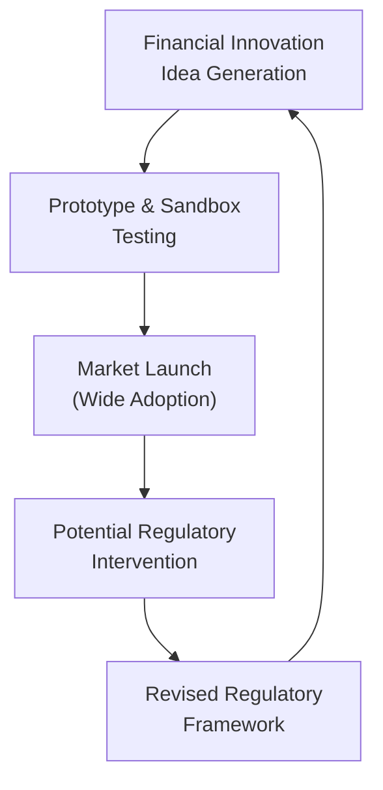

## Introduction and Overview

Have you ever found yourself amazed by the pace of change in finance? I remember once chatting with a friend about the sudden rise of peer-to-peer lending platforms. It felt like overnight these cool, new Fintech companies were upending the traditional banking model. But it also made me wonder: How on earth are these innovations regulated and supervised without stifling creativity?

“Financial Innovation” refers to the introduction of new products, services, and processes such as cloud-based peer-to-peer (P2P) lending, smartphone-based digital wallets, robo-advisory platforms, and even entire new asset classes like cryptocurrencies. These advancements can boost financial inclusion, reduce transaction costs, and streamline investing—but they also pose unique risks that regulators and market participants continue grappling with.

In this section, we’ll explore how financial innovation evolves, how regulators attempt to control potential systemic risks and consumer pitfalls, and why balancing innovation and stability is crucial for healthy economic growth. We’ll also highlight specific challenges like regulatory gaps, cross-border arbitrage, and the growing need for both robust RegTech and advanced compliance strategies.

## Importance of Financial Innovation

It’s probably no surprise that innovation is the lifeblood of any economic system. New products and services, if carefully regulated, can enhance market efficiency, support capital formation, and increase the variety of financial tools available to investors. From a portfolio management standpoint, financial innovation can:

• Expand diversification choices (e.g., through novel types of exchange-traded funds or tokenized assets).  
• Create alternative funding channels (like P2P lending for small businesses).  
• Reduce transaction costs and friction (e.g., mobile payment systems).  
• Encourage global connectivity (e.g., cross-border e-wallets).

Yet with these benefits come complexities. Regulators must safeguard financial stability and protect consumers, all while avoiding overly burdensome rules that might stifle the creativity fueling progress.

## Key Drivers of Financial Innovation

Innovation in finance doesn’t just show up out of nowhere. We see some consistent forces shaping new products:

• Technology Advances: Distributed ledger technology, artificial intelligence, and cloud computing have significantly simplified product development and data analysis.  
• Market Demand: Investors searching for higher yields or new diversification tools can spark innovation in areas like securitization, structured products, or exotic derivatives.  
• Competition and Cost Cutting: Established financial institutions constantly seek new ways to lower operating costs and build better relationships with clients.  
• Regulation: Sometimes, ironically, regulation itself drives innovation—either through incentives or by unintentionally creating loopholes that innovators exploit.

## Regulatory Gaps and Challenges

One of the biggest conundrums is that financial innovation often races ahead of existing rules. Traditional regulations were designed around known risks from well-understood products. But once new asset classes or services show up, regulators might be left trying to parse how best to classify and monitor them. This “regulatory gap” can have consequences:

• Uncertainty for Market Participants: Firms might hesitate to invest in certain innovations if they’re not sure how regulators will respond.  
• Opportunity for Unregulated Risks: Bad actors may try to exploit this gray area for fraud, money laundering, or other illicit activities.  
• Delayed Consumer Protections: Without an established framework, consumers can become victims of hidden or misunderstood risk.  

From an exam perspective, you can think of scenario-based questions that test your ability to weigh the trade-offs between encouraging a new financial technology in a region versus strengthening consumer protections. This interplay often hinges on whether (and how quickly) regulators adapt.

## Balancing Innovation and Systemic Stability

Regulators face the tricky job of maintaining systemic stability—protecting the entire financial system from collapses—while not quashing the potential benefits of new ideas. Too tight a grip, and innovation might be stifled. Too loose, and you might see the system overwhelmed by hidden risks.

To manage this balancing act, regulators may:

• Implement “sandbox” environments where startups and established firms can test products under controlled conditions.  
• Adopt a principles-based approach focusing on outcomes rather than rigid rules.  
• Require higher capital or collateral for novel products that exhibit risky characteristics.  
• Collaborate with international agencies to harmonize oversight and reduce cross-border loopholes.

## Fintech: A Catalyst for Change

Fintech (financial technology) is the poster child of financial innovation. It includes everything from mobile payments and robo-advisors, to decentralized finance (DeFi) tools. In many jurisdictions, regulators have adopted “sandbox” frameworks for Fintechs, letting them experiment with real customers but under strict limitations. By collecting data on product behavior and consumer experience early, regulators stay informed and can refine their approach to licensing, reporting, and consumer safeguards.

### Case Study: Robo-Advisors

Robo-advisors have automated portfolio construction and rebalancing for retail clients. This piece of Fintech can reduce costs, democratize access to investment tools, and streamline compliance with rules on giving financial advice. However, it brings new concerns, such as:

• Algorithm transparency: Are the underlying investment models understandable to regulators and investors?  
• Suitability: Do automated recommendations adequately account for unique client circumstances?  
• Data Privacy: Robo-advisors collect personal financial data that could be vulnerable to breaches.

## RegTech: Compliance and Oversight Reinvented

RegTech (Regulatory Technology) describes the use of advanced technology—machine learning, big data analytics, blockchain—for the purpose of compliance, risk management, and regulatory oversight. If you’ve ever used an app that automatically checks for compliance with anti–money laundering (AML) rules, that’s RegTech in action.

• Automated Reporting: Institutions can gather data in real time, drastically reducing the manual burden and error rates in regulatory filings.  
• Early Warning Systems: Machine learning can spot abnormal patterns in trading or lending, alerting regulators to suspicious behavior.  
• Reduced Costs: By deploying technology solutions, firms often cut the overhead associated with compliance, ideally freeing up resources for value-adding activities.

Some advanced institutions even integrate RegTech solutions into their enterprise risk management (ERM) frameworks, ensuring that compliance checks are built into day-to-day processes rather than left to a separate department fighting for resources.

## Cryptocurrencies and Initial Coin Offerings (ICOs)

Cryptocurrencies like Bitcoin or Ethereum, along with the wave of ICOs that peaked around 2017–2018, highlight how new technology can outpace regulatory structures. Many tokens launched as “utility tokens,” hoping to bypass securities regulation. Yet they initially faced minimal KYC (know-your-customer) or AML checks, fueling concerns that criminals could launder money or raise capital illegally.

Jurisdictions have landed on drastically different responses:

• Some impose outright bans (e.g., restricting ICOs or limiting cryptocurrency trading).  
• Others have introduced licensing frameworks—often requiring exchanges to register and comply with AML rules.  
• A few are testing central bank digital currencies (CBDCs) to see if they can harness the efficiency of blockchain while retaining control over monetary policy.

From a CFA exam standpoint, you might see item-set questions exploring how an institutional investor should evaluate cryptocurrency’s role in a portfolio given regulatory uncertainties. Or you might tackle an essay that weighs potential benefits (like fast cross-border payments) against the systemic risks (volatility, money laundering, or hacking).

## Regulatory Arbitrage in Innovation

If you’ve ever gone on vacation and tried to find the best currency exchange rates among different kiosks, you’ve seen a simple version of arbitrage. The same logic applies in financial innovation: Some companies relocate or structure operations in “light-touch” regulatory environments, seeking to skirt stricter oversight at home.

This phenomenon often leads to:

• A global patchwork of laws, with certain innovation hubs attracting major startup activity.  
• Difficulties for regulators to track cross-border flows, especially if the product is purely digital.  
• Pressures at the international level for more standardized or harmonized regulation.

In Chapter 5 (International Trade and Capital Flows) and Chapter 6 (Currency Exchange Rates), we discuss how differences in regulatory regimes can shape global investment decisions. The same principles of cross-border competition apply here.

## Visualization of the Innovation and Regulatory Cycle

Below is a simplified Mermaid diagram to illustrate how innovation, market adoption, and regulatory responses feed into each other. It’s a never-ending loop of idea generation, testing, wide adoption, then potential regulatory revisions—and back again:

## Practical Examples

1. Securitization of Loans: In the 2000s, mortgage-backed securities grew complex and outpaced existing regulations, contributing to the 2008 financial crisis. Post-crisis reforms introduced enhanced disclosure and capital requirements, but also spurred new variants of securitized products.  
2. Peer-to-Peer Lending: P2P platforms allow individuals to lend directly to borrowers at relatively attractive interest rates. However, inconsistent regulations in some jurisdictions have led to default spikes when platforms fail to screen borrowers effectively.  
3. Crowdfunding for Startups: Many countries introduced securities exemptions for small-amount capital raises. Yet scammers sometimes exploit these rules, pushing regulators to add disclaimers and caps on annual fundraising.  

## Best Practices in Managing Financial Innovation

For financial institutions:

• Adopt robust risk management frameworks incorporating well-tested stress tests for new products.  
• Maintain transparent disclosure around complex products.  
• Integrate compliance early in product development to minimize regulatory conflicts.  

For regulators:

• Employ a multidisciplinary approach: combine financial expertise with legal, technological, and behavioral insights.  
• Use data-driven oversight: real-time analytics to spot anomalies early.  
• Coordinate internationally to reduce regulatory arbitrage.  
• Maintain open dialogue with industry participants; consider “sandbox” or pilot-phase licensing.

For investors:

• Conduct thorough due diligence, especially with novel asset classes or structures.  
• Seek professional advice if uncertain about a product’s risk profile.  
• Stay updated on regulatory changes; compliance and capital adequacy can significantly affect the long-term viability of an innovative platform.

## Common Pitfalls and Potential Challenges

• Overconfidence in Innovation: Believing a new product’s hype without evaluating its underlying economics.  
• Misclassification: Treating certain tokens or structured products as if they’re outside regulatory scope.  
• Data Privacy Breaches: Fintech solutions often require large data sets, heightening cybersecurity risks.  
• Ethical Dilemmas: Some new tools might push ethical boundaries, for instance by using personal data to set credit terms. Remember that CFA charterholders are bound by strict codes of conduct requiring fair dealing and confidentiality.  

On the CFA Level I exam, you may see multiple-choice questions linking financial innovation to potential ethical violations under the CFA Institute Code and Standards. By Level III, it could appear as a scenario-based question exploring how a portfolio manager must navigate these new products ethically and in compliance with global regulations.

## Conclusion and Final Exam Tips

Financial innovation isn’t just a futuristic fad—it’s an ongoing phenomenon that transforms how we save, invest, lend, and oversee the financial system. Whether you’re analyzing structured products for your portfolio or exploring the risk-return trade-offs of decentralized finance, understanding the regulatory backdrop is crucial. 

Expect the CFA exam to test your ability to spot and mitigate the systemic and consumer risks arising from new financial products. Be prepared to address topics such as:

• How different regulatory frameworks treat emerging tech (e.g., comparing US GAAP vs. IFRS in classifying digital assets).  
• The interplay between policy instruments discussed in Chapter 7 (Monetary and Fiscal Policy) and how they might be challenged by unregulated digital currencies.  
• Ethical considerations from the CFA Institute Code and Standards, especially related to fair dealing, misrepresentation, and duty to clients.

When writing constructed-response answers, focus on applying regulatory principles to real or hypothetical situations. Show you can recognize the red flags of a new product, evaluate ethical responsibilities, and weigh costs and benefits from multiple perspectives.

---

## References and Further Reading

• “Innovations in Financial Services: Implications for Emerging Markets” by the World Bank  
• BIS Innovation Hub: https://www.bis.org/about/bisih/topics.htm  
• Various fintech regulatory sandbox guidelines (e.g., UK FCA Sandbox, Singapore MAS Sandbox)  
• CFA Institute Code of Ethics and Standards of Professional Conduct  

---

## Test Your Knowledge: Financial Innovation and Regulatory Challenges



### Which of the following statements best describes a “RegTech” solution?

- [ ] A platform for crowd-lending on a global scale.
- [x] A technology-driven approach to enhancing compliance and regulatory oversight.
- [ ] A cryptocurrency that automates all financial transactions without the need for intermediaries.
- [ ] A decentralized exchange that bypasses AML requirements entirely.

> **Explanation:** RegTech (Regulatory Technology) uses technological innovations (e.g., machine learning, blockchain, or real-time data analytics) to help financial institutions comply with regulations and monitor potential risks efficiently.

### An advantage of a regulatory sandbox approach is:

- [x] Startups can test innovative products in a controlled environment under regulatory supervision.
- [ ] Regulators guarantee that the technology will succeed in the marketplace.
- [ ] It removes all capital requirements for new Fintech ventures.
- [ ] It provides a complete exemption from AML and KYC regulations.

> **Explanation:** A sandbox environment allows early testing under controlled conditions, aiding both innovators and regulators in understanding risks, refining rules, and minimizing potential consumer harm.

### One key challenge posed by cryptocurrencies and ICOs to regulators is:

- [ ] Ensuring they are promoted effectively among retail investors.
- [x] Addressing cross-border money laundering and ensuring investor protection.
- [ ] Decreasing the central bank’s independence.
- [ ] Encouraging traditional banks to adopt digital wallets.

> **Explanation:** Cryptocurrencies and ICOs create unique challenges for AML, investor protection, and cross-border oversight, as these digital assets can easily move across jurisdictional boundaries with limited tracking.

### In balancing innovation and stability, regulators commonly:

- [ ] Enforce a zero-tolerance approach that completely halts new market entrants.
- [ ] Privatize all regulatory agencies to cut costs.
- [x] Aim to encourage new technologies while maintaining consumer protection and systemic integrity.
- [ ] Only focus on systemic risk to large institutions, ignoring retail investor concerns.

> **Explanation:** The delicate balance involves encouraging beneficial innovation but still safeguarding stability and ensuring investor protection—a key theme in modern regulatory frameworks.

### Which scenario best illustrates “regulatory arbitrage”?

- [ ] A firm picks the highest-yielding investments to maximize return.
- [x] A Fintech platform registers in a jurisdiction with more lenient rules to bypass stricter regulations at home.
- [ ] Investors buying undervalued international stocks due to currency depreciation.
- [ ] Banks merging with insurance companies to form universal financial conglomerates.

> **Explanation:** Regulatory arbitrage arises when firms exploit differences in regulations across regions to reduce compliance costs or oversight burdens, often by relocating operations.

### A key driver of financial innovation is:

- [x] Technological advancements such as big data analytics and blockchain.
- [ ] Increased capital gains tax rates.
- [ ] Absence of consumer demand for new products.
- [ ] Strict capital controls that deter foreign investments.

> **Explanation:** Technology fuels new product development, allowing financial firms to discover more efficient, data-driven solutions.

### Which of the following is a common pitfall of financial innovation?

- [x] Overlooking hidden risks in new products.
- [ ] Excessive understanding of operational risk.
- [x] Reducing overall compliance oversight unintentionally.
- [ ] Guaranteed zero market volatility due to advanced algorithms.

> **Explanation:** Overlooking hidden risks and accidentally reducing compliance are frequent pitfalls when new products outpace regulatory frameworks.

### Securitization’s role in the 2008 financial crisis demonstrates:

- [ ] Properly structured complex products always reduce risk.
- [ ] Central bank monetary policy is the only important factor during a crisis.
- [x] Financial innovations can contribute to systemic risk if transparency and disclosures are inadequate.
- [ ] Regulatory scrutiny almost always ensures a stable market.

> **Explanation:** Securitization allowed mortgage risks to be repackaged and spread across investors. Without adequate transparency and capital buffers, these complex instruments contributed to systemic vulnerability.

### A possible benefit of Fintech robo-advisors is:

- [x] Lower costs and streamlined investment processes for retail clients.
- [ ] Complete immunity to cybersecurity threats.
- [ ] The elimination of all regulatory due diligence.
- [ ] Guaranteed outperformance of actively managed mutual funds.

> **Explanation:** Robo-advisors often reduce overhead, making automated portfolio management accessible to smaller investors. However, they don’t eliminate compliance obligations nor do they guarantee any performance advantage.

### True or False: Regulatory frameworks for cryptocurrencies are uniform across all countries.

- [ ] True
- [x] False

> **Explanation:** Cryptocurrencies face diverse regulatory responses worldwide. Some nations embrace them with licensing regimes, others implement partial bans, and there is no universal regulatory standard.


