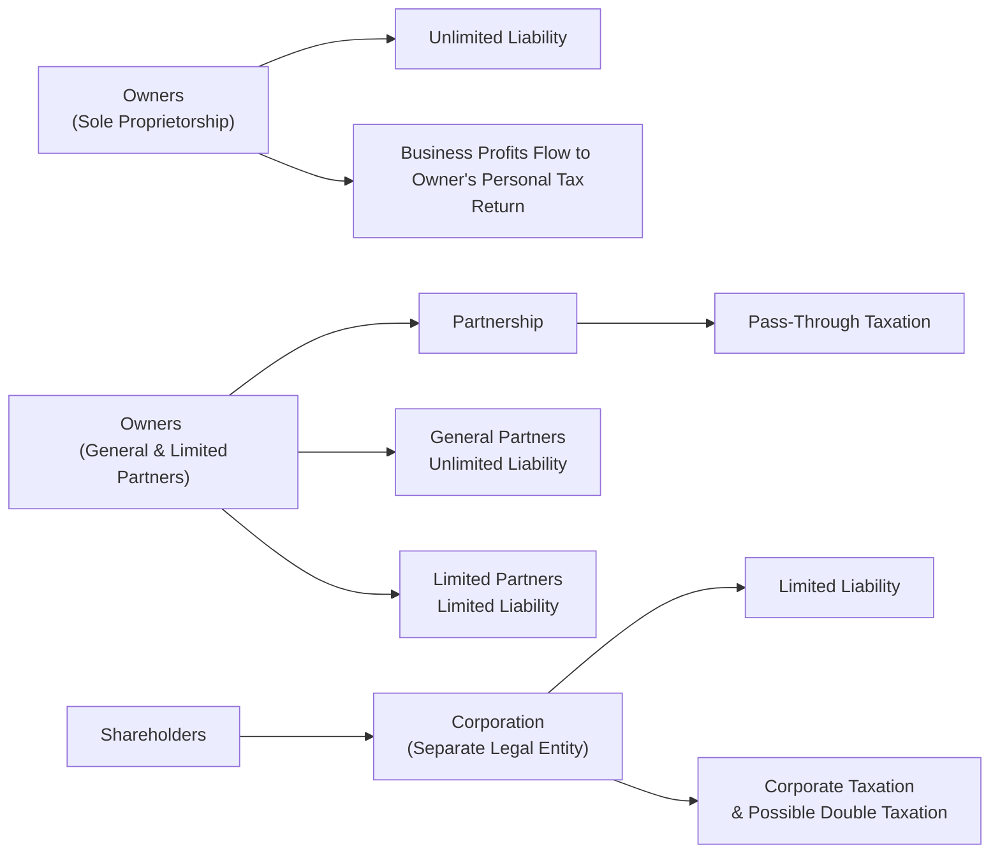

## Overview

So, let’s just say you’re planning to start a small online bookstore—selling secondhand finance books, ironically—and you want to decide on the right structure. Maybe you’re thinking, “Uh, do I just do this on my own, or do I bring in a partner, or do I incorporate?” Each path comes with a unique set of legal, tax, and operational implications. Understanding these is crucial not only for new entrepreneurs but also for finance professionals who must assess the risks, returns, and regulatory implications of different organizational setups.

Below, we’ll explore the three most common business structures: the sole proprietorship, the partnership (including its general and limited forms), and the corporation. We’ll dive into the liability distinctions, tax treatment, and capital-raising capacity. We’ll even bring in a few personal stories and examples from real life—like you, or your friend who started a side hustle or your colleague who co-founded a tech startup that eventually became a full-fledged corporation.

## Key Features of a Sole Proprietorship

A sole proprietorship is as simple as it gets. It’s essentially one individual owning and operating a business without any separate legal entity. Your craft jewelry business on Etsy? That could be a sole proprietorship. Let’s touch on the key characteristics:

• Simplicity of Formation: Setting up a sole proprietorship is generally fast and inexpensive—often there’s little beyond registering a “doing business as” name, if required.  
• Decision-Making Power: Because there’s only one owner, all strategic and operational decisions rest on that individual’s shoulders.  
• Unlimited Liability: Now, here’s the biggie. The owner is personally responsible for every debt or lawsuit the business faces. If your bookstore runs up a ton of debt, your personal assets can be at risk.  
• Taxation: Profits effectively “flow through” to the owner’s personal income tax return. You might see this referred to as “pass-through” taxation. In a lot of jurisdictions, you just add your business income and expenses to your personal tax forms.  

In my own experience, I once ran a small financial-consulting side gig as a sole proprietor. It took about an hour or two to register, but boy did the liability issues keep me awake at night—any contract breach or lawsuit would put my personal savings on the line. So you’ve got to weigh that convenience carefully against the potential risk.

## Partnerships

Partnerships are all about collaboration—two or more individuals pooling resources, sharing expertise, and splitting the profits. They’re popular for professional services (law firms, accounting partnerships, etc.) but can come in different flavors.

### General Partnerships

A general partnership is basically a group version of a sole proprietorship. Each partner has unlimited liability for the partnership’s obligations. This means if your partner makes an unwise decision—like ordering a lifetime supply of expensive paper—both of you (and all your personal assets) might be on the hook. In addition:

• Pass-Through Taxation: The partnership itself typically does not pay corporate taxes. Instead, income and losses “pass through” to each partner, who reports them on personal tax returns.  
• Shared Management: All partners generally have a say in the business strategy. It can be wonderful when everyone’s on the same page and a nightmare when you’re not. That’s why partnership agreements should be crystal clear on roles, responsibilities, and dispute-resolution methods.

### Limited Partnerships

Sometimes you want to bring in investors who share in the profits but do not want the day-to-day managerial headaches or the unlimited liability. That’s where a limited partnership structure comes in:

• Dual Classes of Partners: You have at least one general partner who manages the business and faces unlimited liability, and one or more limited partners whose risk is capped at their investment amount.  
• Tax Treatment: Similar pass-through arrangement as general partnerships. Limited partners receive their share of income on personal returns, but they typically can’t lose more than what they invested.  
• Advantages for Fundraising: The possibility of limiting liability can attract more investors. This structure is often used in private equity or real estate funds where limited partners prefer to just invest and let general partners handle day-to-day operations.

## Corporations

Corporations represent a substantial leap in legal sophistication. Picture behemoths like Apple or small privately held corporations. By forming a corporation, you create a legal entity separate from its owners (the shareholders). Let’s unpack the highlights:

• Separate Legal Entity: The corporation itself can own assets, enter into contracts, borrow money, and sue or be sued—independent of its shareholders.  
• Limited Liability: Shareholders’ personal risk is limited to the amount they invest in the company’s shares. This structure is a game-changer, especially in industries with higher litigation or credit risk.  
• Governance: Typically run by a board of directors representing shareholders, with managers handling day-to-day operations. This separation of ownership and control can lead to principal-agent issues but also enables companies to scale effectively by tapping professional managers.  
• Taxation: Most corporations pay corporate taxes. If they distribute dividends, those dividends get taxed again at the shareholder level. That’s the so-called “double taxation” scenario. This can make corporations less attractive for small business owners primarily motivated by tax efficiency, although many jurisdictions have specialized rules or “S-corporations” to mitigate double taxation.  
• Capital Raising: Because the corporation can sell equity shares or issue debt securities to a broad investor base, it is generally the best structure for larger ventures needing robust financing.

## Taxation Considerations

Although tax laws vary around the world, we can broadly summarize:

• Sole Proprietorships: Income is taxed once at the owner’s personal tax rate.  
• Partnerships: Generally “pass-through” (i.e., taxed once at the partners’ personal rates).  
• Corporations: The entity itself usually pays corporate tax, and dividends to shareholders may trigger a second layer of taxation at the personal level.

You might see some variations—like the “S-corporation” election in the U.S. that avoids double taxation or the possibility that publicly listed partnerships (MLPs) have specialized taxation rules. For non-U.S. jurisdictions, you’d look at local frameworks, such as Canada’s rules for business corporations or the UK’s limited companies. Regardless, from a financial analyst’s perspective, weigh how these regulations affect the net after-tax cash flows to equity holders.

To illustrate double taxation, let’s suppose a corporation earns a net income of 1,000 currency units and pays 20% corporate tax. That leaves 800 currency units. If the corporation distributes all 800 as dividends and shareholders face a 25% personal tax on dividends, then the final after-tax amount to shareholders is 600 currency units (i.e., 800 – 200). So from the original 1,000, a combined 40% effective rate is paid in total taxes.

In a simplified KaTeX format:


\text{Net to Shareholders} = \text{Income} \times (1 - t_\text{corporate}) \times (1 - t_\text{dividend})


## Liability Considerations

• Sole Proprietorships and General Partnerships: If your business fails or faces a liability lawsuit, your personal assets—bank accounts, house, you name it—could be at risk.  
• Limited Partnerships: Limited partners are shielded, but general partners remain fully exposed.  
• Corporations: Liability is generally limited to each shareholder’s investment.  

For large-scale operations, limited liability is a huge plus. This is one reason (among many) that the corporate form dominates in capital-intensive industries like mining, pharmaceuticals, or automotive manufacturing.

## Capital Raising and Ownership

• Sole Proprietorships: Typically rely on personal funds or bank loans. It’s tough to scale quickly.  
• Partnerships: Can pool finances from multiple partners. Easy to add resources from new partners—if they’re willing to mesh with the existing owners’ goals.  
• Corporations: Can issue equity or debt to a broad investor base—often across multiple jurisdictions. They might list shares on public stock exchanges, raising hundreds of millions or billions in capital.

If you dream about going public, the corporate route is pretty much inevitable. Of course, with that route comes added regulations (like IFRS or US GAAP reporting) and compliance requirements (think Sarbanes-Oxley in the U.S.). 

## Managerial Control and Governance

• Sole Proprietorship: Total freedom, but also total responsibility. If the owner falls sick, the entire business might grind to a halt.  
• Partnerships: The partnership agreement typically spells out day-to-day management responsibilities. Disagreements might arise, so you need that document to handle disputes and define decision thresholds.  
• Corporations: Shareholders elect a board of directors. The board hires executive management (often the CEO, CFO, COO, etc.). This separation can be efficient but may also lead to classic “principal-agent” conflicts if management actions diverge from shareholder interests.

If you recall from corporate finance theory, agency costs can be mitigated through corporate governance mechanisms—like performance-based compensation, board oversight, and external audits.

## Practical Examples and Case Studies

To really drive this home, let’s see some real-world illustrations.

• Sole Proprietorship Story: A friend of mine decided to start a small café in her hometown. She financed it with her personal savings and a little loan from her parents. Legally, she was the business, and in some ways, that’s nice—no complex reporting. But a few years in, when the café expanded, she did worry about personal assets, especially when the business took on bigger obligations like equipment leases and commercial contracts.

• Partnership in a Consulting Firm: Two longtime colleagues left their corporate jobs to form a marketing consultancy. They set it up as a general partnership because it was quick and they trusted each other immensely. They autographed a partnership agreement defining each partner’s “sweat equity.” With plenty of synergy, business soared. But a year later, they realized the unlimited liability aspect was nerve-racking—so they considered converting it to a limited liability partnership.  

• The Corporate Path of a Tech Startup: Another acquaintance developed a promising software application for global supply chains. He pitched to venture capital firms, who insisted on a corporate structure for the sake of limited liability and the possibility of future stock offerings. Converting from an LLC (a hybrid form in some jurisdictions) to a C-corporation was part of the deal. Once they raised capital, they eventually had a board, external audits, and the entire corporate governance apparatus. The limited liability aspect made it easier to attract bigger investors who otherwise might be reluctant to invest in a personal or partnership-based entity.

## Diagram of Basic Structures

Here’s a simple Mermaid diagram illustrating how these entities and their relationships to owners might look:

## Best Practices and Pitfalls

• Conduct thorough legal review. The choice of structure can have long-lasting ramifications on liability, taxation, and governance.  
• Draft robust partnership agreements. If you choose a partnership route, it’s best to spell out everything, from profit splits to dispute resolution, in writing.  
• Monitor capital requirements. Certain businesses can get away with fewer capital resources, but if your strategy demands large capital injections, a partnership or corporation might be more suitable.  
• Watch out for double taxation. Especially for corporations, be mindful of combined corporate and dividend taxes. Some jurisdictions offer partial relief, so consult with tax professionals.  
• Stay updated on regulatory changes. Legal definitions or filing requirements can shift, so it’s wise to remain vigilant (or keep specialized counsel on retainer).

## Exam Relevance and Final Thoughts

On the CFA® exam (particularly at advanced levels, but even at Level I), you’ll often see questions requiring you to assess how a firm’s structure impacts its risk, its tax profile, and its access to capital. They might present a scenario involving a startup that’s trying to raise money but is worried about potential legal claims or double taxation—expect to evaluate whether a corporation is more appropriate than a partnership.

In real life, these considerations are more than academic: they shape the day-to-day operations, the management’s risk appetite, and the strategic decisions on capital structure. I think a big takeaway is that the corporate form tends to dominate in capital-intensive or high-growth industries because it allows for wide ownership, easier capital raising, and limited liability. But for smaller, closely held firms or professional alliances, a partnership or a sole proprietorship can be not only simpler but also more flexible.

## References and Further Reading

• “Business Structures” by Internal Revenue Service (IRS):  
  https://www.irs.gov/businesses/small-businesses-self-employed/business-structures  

• O’Kelley Jr., C. R. T. & Thompson, R. B. (2021). “Corporations and Other Business Organizations.” A classic source on U.S. business law.

• Roberts, J. (2007). “The Modern Firm: Organizational Design for Performance and Growth.” Oxford University Press.

• For additional insights on how legal structures intersect with IFRS or US GAAP reporting, see the official websites of the IASB (https://www.ifrs.org) and FASB (https://www.fasb.org).

• Local partnership and corporation laws vary by jurisdiction; consult national regulations (e.g., Companies House for the UK, Corporations Canada for Canada, etc.) for specifics.

## Test Your Knowledge: Business Structures Quiz



### A partnership with several general partners and multiple limited partners typically has:

- [ ] Unlimited liability for both general and limited partners.
- [x] Unlimited liability for general partners and limited liability for limited partners.
- [ ] Limited liability for all partners.
- [ ] No liability for any partners.

> **Explanation:** In a limited partnership, general partners retain unlimited liability, whereas limited partners risk only their upfront investment.

### Which key feature best describes a sole proprietorship?

- [x] All profits and liabilities flow directly to the individual owner.
- [ ] It is a legally separate entity from the owner.
- [ ] It always elects subchapter “S” tax treatment.
- [ ] Dividends are taxed at the corporate and personal level.

> **Explanation:** A sole proprietorship is not a separate legal entity. The owner has unlimited liability and files business income on a personal tax return.

### One potential disadvantage of the corporate form is:

- [ ] Strict limits on raising capital.
- [x] Double taxation on earnings distributed as dividends.
- [ ] Unlimited liability for shareholders.
- [ ] Prohibition on foreign investment.

> **Explanation:** While corporations excel at raising capital and limiting liability, double taxation of corporate income and dividends can be a disadvantage.

### In a general partnership, how are business losses typically handled for tax purposes?

- [x] Passed through to partners to be reported on their personal returns.
- [ ] Retained by the partnership for corporate-level taxation.
- [ ] Electronically deferred until partnership liquidation.
- [ ] Subject only to capital gains tax rates.

> **Explanation:** General partnerships usually have pass-through taxation, meaning profits and losses flow through to the partners’ personal returns.

### Under which arrangement would an entrepreneur generally have the highest amount of personal liability?

- [x] Sole proprietorship.
- [ ] Limited partnership (as a limited partner).
- [ ] Corporation.
- [x] Limited partnership (as a general partner).

> **Explanation:** Both a sole proprietor and a general partner face unlimited personal liability, whereas corporate shareholders and limited partners generally have limited liability.

### To reduce the risk of personal asset seizure in a lawsuit, which structure is most ideal for an expanding retail operation?

- [ ] Sole proprietorship
- [ ] General partnership
- [x] Corporation
- [ ] Joint venture with unlimited liability

> **Explanation:** Forming a corporation protects the owner’s personal assets by limiting liability to invested funds and corporate assets.

### What is one common advantage of a limited partnership over a general partnership?

- [ ] Greater personal liability for all partners
- [x] Ability for some partners to limit their liability
- [ ] Mandatory double taxation
- [ ] Prohibition of pass-through taxation

> **Explanation:** A limited partnership creates a layer of protection for limited partners, allowing them to limit liability to their capital contribution.

### From a corporate governance perspective, a corporation’s board of directors:

- [x] Oversees major decisions and hires executive managers.
- [ ] Serves purely as an advisory with no decision-making power.
- [ ] Is legally responsible for all personal debts of shareholders.
- [ ] Exists only in sole proprietorships.

> **Explanation:** In a corporation, the board is crucial for governance and strategic oversight, whereas day-to-day management is handled by executives.

### Which of the following is indicative of pass-through taxation?

- [x] The entity itself pays no income tax; instead, owners report income on their individual returns.
- [ ] Dividends are taxed separately from corporate earnings.
- [ ] The entity and owners both pay income tax on the same earnings.
- [ ] Earnings are never taxed at any level.

> **Explanation:** Pass-through taxation means no tax is paid at the entity level; owners pay income tax directly, reflecting the entity’s profits or losses on personal filings.

### True or False: In most jurisdictions, corporations cannot issue bonds or stocks to raise additional funds.

- [ ] True
- [x] False

> **Explanation:** Corporations generally have broader options to raise capital, including issuing equity (stocks) or debt (bonds).


