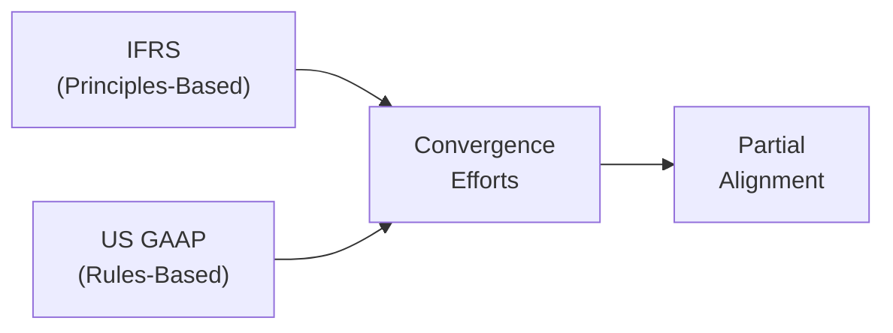

## Overview

If you’ve ever compared two companies—one using IFRS (International Financial Reporting Standards) and another using US GAAP (Generally Accepted Accounting Principles)—you might have thought: “Um, how can they look so different yet be reporting seemingly the same basic financial info?” That was precisely how I felt when I started out, you know, scanning annual reports and trying to reconcile them in my mind. I realized quickly: corporate reporting frameworks can shift how key numbers are displayed, and that shift can be quite significant.

In practice, IFRS vs. US GAAP considerations go beyond mere technicalities. They influence everything from a company’s reported earnings to the impression it makes on potential investors. In this section, let’s unpack that step by step—sometimes with short personal anecdotes—to understand why the choice of reporting framework can have strategic implications for corporate issuers and their stakeholders.

## Key Concepts: IFRS vs. US GAAP

### Principles-Based vs. Rules-Based Approaches

IFRS is often described as “principles-based,” meaning it aims to provide overarching guidelines and seeks to capture the economic substance of transactions. US GAAP, on the other hand, is traditionally considered “rules-based.” It lays out more prescriptive rules and industry-specific guidance. In practice, you’ll find IFRS expects management to rely more upon judgment, whereas US GAAP can provide detail down to step-by-step instructions.

Below is a simple diagram illustrating the ongoing convergence efforts between IFRS and US GAAP:



Although the Financial Accounting Standards Board (FASB) and the International Accounting Standards Board (IASB) have made efforts to bring these frameworks closer, they’re not perfectly aligned; so you still see notable differences.

## Main Areas of Difference

Let’s take a deeper plunge into some of the most talked-about differences between IFRS and US GAAP. I remember once getting stuck in a heated debate about intangible assets between two CFOs—each from a different reporting background. And that’s just one difference among many!

### 1. Revenue Recognition

• IFRS (under IFRS 15) and US GAAP (under ASC 606) have adopted very similar five-step models for revenue recognition since recent convergence efforts.  
• However, certain industry-specific guidance in US GAAP remains more prescriptive. IFRS, while based on the same core model, can be more flexible, which may still yield some interpretational differences for complex contracts.

### 2. Inventory Valuation (LIFO vs. FIFO)

• Under IFRS, the Last-In, First-Out (LIFO) method isn’t allowed. Companies using IFRS typically opt for First-In, First-Out (FIFO) or Weighted-Average Cost.  
• US GAAP allows for LIFO, which can sometimes reduce taxable income in times of rising prices (because it reports higher cost of goods sold). Of course, the downside is that your inventory on the balance sheet may look slightly outdated—an important consideration for anyone analyzing a competitor.

### 3. Treatment of Intangible Assets

• Under IFRS, intangible assets can be either capitalized or expensed based on whether they meet specific “probability of future economic benefit” criteria. Research costs, for instance, are typically expensed, whereas development costs might be capitalized under rigorous conditions.  
• US GAAP tends to favor consistent expensing of many development-related outlays, unless very particular criteria are met (for instance, in certain software development contexts). So sometimes an IFRS reporter might end up capitalizing intangible assets that a US GAAP reporter would expense.

### 4. Classification of Certain Financial Statement Items

• IFRS places more emphasis on the substance of transactions, so certain leases, for example, might be treated slightly differently.  
• US GAAP can sometimes have multiple, more detailed classification rules. For instance, the definition of discontinued operations or extraordinary items used to differ more significantly, though some recent pronouncements have narrowed those differences.

### 5. Disclosures and Estimates

• IFRS demands extensive qualitative and quantitative disclosures, particularly around management’s significant judgments.  
• US GAAP also requires disclosures, but it can include more prescriptive disclosure checklists, especially for specialized industries (e.g., banks or insurance).

## Strategic Considerations for Corporate Issuers

Now, let’s talk about why it matters to corporate issuers. It’s not just about compliance or being on the right side of legal requirements—though that’s important, obviously. It’s also about stakeholder perceptions, cost of capital, and potential cross-listings. Maybe you’ve heard stories about companies that needed to restate their financials just to meet a new listing requirement and found themselves in hot water with shareholders. That’s exactly why it’s critical to understand the strategic dimension of your chosen reporting framework.

### 1. Impact on Reported Earnings and Financial Ratios

• The chosen framework can influence the amount and timing of recognized revenue and expenses. For instance, capitalizing development costs under IFRS can create higher assets and smaller immediate expenses, whereas a US GAAP approach might reduce net income volatility but keep intangible assets lower.  
• Differences in inventory methods (like LIFO) directly affect reported cost of goods sold and inventory balances. This can alter gross profit margins, current ratios, and other performance metrics.

### 2. Investor Perception and Market Confidence

• Analysts and investors often compare performance across peers. If you’re a technology firm listing in multiple markets, IFRS might be perceived as more globally “neutral,” though US-based investors may still prefer the familiarity of US GAAP.  
• Some stakeholders might question the reliability of principle-based judgments if they’re used to a more rules-based system. Others might find IFRS more transparent since it focuses on reflecting the underlying economic reality of a transaction.

### 3. Cross-Listing and Reconciliation Requirements

• If a company (especially a “Foreign Private Issuer”) decides to list on a U.S. exchange but is headquartered abroad, it may be permitted to file IFRS statements without full US GAAP reconciliation—or might still need partial reconciliation, depending on the regulatory environment.  
• Likewise, U.S. companies seeking to list internationally might need IFRS statements or bridging calculations. This dual reporting can be expensive and complex, but it expands the investor base.

### 4. Strategic Stakeholder Demands

• Shareholders, lenders, and even activist investors may demand a switch to IFRS if they believe it’s more globally comparable. Or they might insist on US GAAP if they value the prescriptive clarity and historical comparability with U.S. industry peers.  
• Management should also consider how marketing a share offering to certain institutional investors might require bridging adjustments or highlight differences in intangible asset valuation methods.

## Convergence: Where Do We Stand?

Over the past couple of decades, the IASB and FASB have collaborated intensely to bridge the gap between IFRS and US GAAP. While many standards—like revenue recognition and leasing—have converged significantly, complete alignment is still elusive. This partial alignment helps reduce confusion, but corporate issuers remain responsible for carefully disclosing any material differences. 

Of course, I remember once thinking, “Surely, they’ll just converge everything eventually.” Well, maybe. But the reality is that local political environments, historical practices, and stakeholder preferences create barriers. So the best practice? Understand both frameworks well enough to anticipate their impact on your firm.

## Practical Example and Python Snippet

Let’s do a quick hypothetical scenario to see how different inventory methods might alter your financial ratios:

Imagine a company that has the following inventory through the year:

• Units purchased: 1,000  
• Cost per unit at the beginning of the period: $10  
• Cost per unit at the end of the period: $12  
• Sold 800 units during the period.

Under FIFO, the cost of the first units sold is at $10, while under LIFO (if allowed), the cost is at $12 (assuming the last units in were the ones sold first). Let’s do a quick Python snippet to compare cost of goods sold (COGS) under both methods:

```python
units_purchased = 1000
cost_begin = 10   # cost at start
cost_end = 12     # cost at end
units_sold = 800

fifo_cogs = units_sold * cost_begin  # because the first 800 came in at $10
print("FIFO COGS:", fifo_cogs)

lifo_cogs = units_sold * cost_end
print("LIFO COGS:", lifo_cogs)
```

• Under FIFO, COGS = 800 × $10 = $8,000.  
• Under LIFO, COGS = 800 × $12 = $9,600.  

With LIFO, you’d see higher cost of goods sold and hence a lower gross margin if prices are rising. This can alter your profitability ratios, your inventory balance, and even your tax expense within the US GAAP environment.

## Best Practices and Common Pitfalls

1. Be consistent in applying whichever framework your entity is committed to—random changes in judgments under IFRS or accidental misapplication of US GAAP rules can undermine credibility.  
2. Don’t ignore significant disclosures; whether IFRS or US GAAP, providing robust footnotes about assumptions, especially around intangible asset valuations or revenue recognition, fosters investor trust.  
3. When cross-listing, plan in advance for reconciling differences or implementing dual reporting processes. Budget not just for accounting staff, but also for external auditors who may request additional detail.  
4. Keep an eye on convergence projects. Even small updates can alter how you book revenue, measure liabilities, or present financial statements.

## Exam Tips

• When you spot an exam question contrasting IFRS with US GAAP, watch for references to specific items like LIFO or intangible assets—these are classic testing areas.  
• In essay-style “constructed response” questions, be ready to articulate how differences in accounting assumptions can lead to diverging financial outcomes. For instance, you might have to discuss how capitalizing vs. expensing an intangible asset influences net income, return on equity, or even the debt-to-equity ratio.  
• In item set ( vignette ) questions, check the footnotes: the exam can drop hints about how the company is handling intangible costs or inventory, which can lead you to select the correct ratio or interpret the right net income figure.  
• Understand the conceptual frameworks behind IFRS and US GAAP. Don’t just memorize the rules—especially IFRS, which calls for more judgment.  
• Time management: if you see lots of detailed US GAAP references, they might be testing your ability to parse specific accounting requirements. Keep calm, use the info systematically, and don’t panic if you see IFRS jargon like “economic substance.”

## References for Further Exploration

• IASB website: [https://www.ifrs.org/](https://www.ifrs.org/)  
• FASB website: [https://www.fasb.org/](https://www.fasb.org/)  
• Wiley IFRS 2023: Interpretation and Application of IFRS Standards  
• GAAP Guide by Joseph Nick Foster  
• CPA Journal, Corporate Reporting Sections for latest updates  
• Remember to review the official CFA Curriculum for the most recent guidance on IFRS and US GAAP.

-----------------

## Test Your Understanding: IFRS vs. US GAAP Reporting for Corporate Issuers



### 1. Which of the following best describes IFRS compared to US GAAP?

- [x] IFRS is generally more principles-based.
- [ ] IFRS is generally more rules-based.
- [ ] IFRS disallows management judgment in financial reporting.
- [ ] IFRS permits LIFO as an inventory method.

> **Explanation:** IFRS is considered more principles-based, focusing on the substance of transactions rather than rigid rules. LIFO is not permitted under IFRS.

### 2. Under IFRS rules, which method of accounting for research and development costs is most likely permitted?

- [x] Research costs expensed and development costs capitalized if criteria are met
- [ ] Both research and development costs are fully capitalized
- [ ] Both research and development costs are fully expensed
- [ ] Development costs are recognized only upon product sale

> **Explanation:** IFRS typically requires the expensing of research costs but allows capitalization of development costs if specific criteria relating to future economic benefits are satisfied.

### 3. How might using LIFO under US GAAP affect a company’s financials during a period of rising prices?

- [x] It reports higher cost of goods sold, reducing taxable income.
- [ ] It reports lower cost of goods sold, increasing taxable income.
- [ ] It has no impact on inventory valuations or income taxes.
- [ ] It reduces cost flow assumptions for large global companies.

> **Explanation:** Under LIFO in rising price environments, the most recent (more expensive) inventory is assumed to be sold first, raising COGS and reducing taxable income relative to FIFO.

### 4. Which of the following statements about intangible assets is correct?

- [ ] Under US GAAP, intangible assets can never be capitalized.
- [x] Under IFRS, development costs may be capitalized if certain conditions are met.
- [ ] Under IFRS, all intangible asset costs must be expensed immediately.
- [ ] Under US GAAP, software development costs are always capitalized.

> **Explanation:** IFRS allows capitalization of development costs when specific conditions (technical feasibility, future economic benefits, etc.) are met. US GAAP and IFRS differ on how intangible assets are treated, but neither standard outright forbids all capitalization in every scenario.

### 5. Which of the following is a key strategic reason a company might adopt IFRS?

- [x] Enhanced global comparability for investors
- [ ] Eliminates the need for financial disclosures
- [x] Facilitates cross-listing in non-U.S. capital markets
- [ ] Minimizes managerial judgment in reporting

> **Explanation:** IFRS can enhance credibility with non-U.S. investors and often eases cross-listing barriers. However, IFRS generally requires more (not less) managerial judgment in many areas.

### 6. How do IFRS and US GAAP converge in their revenue recognition standards?

- [x] Both have adopted a five-step revenue recognition model.
- [ ] Both mandate LIFO for revenue allocation.
- [ ] IFRS has discontinued revenue recognition altogether.
- [ ] US GAAP relies entirely on IFRS to define revenue recognition.

> **Explanation:** Thanks to a joint effort between FASB and IASB, ASC 606 and IFRS 15 provide similar five-step models for revenue recognition, though certain industry details still differ.

### 7. Which of the following is true regarding cross-listing requirements?

- [x] Foreign Private Issuers may file financial statements under IFRS without full US GAAP reconciliation in certain cases.
- [ ] Cross-listing always mandates dual reporting in IFRS and US GAAP for at least three years.
- [x] Some jurisdictions require bridging adjustments to local GAAP.
- [ ] Cross-listing is disallowed if companies use IFRS.

> **Explanation:** Regulatory bodies may permit foreign private issuers to use IFRS with minimal U.S. GAAP reconciliation. Some jurisdictions, though, require bridging adjustments to ensure comparability to local GAAP.

### 8. Which accounting framework typically involves more detailed industry-specific guidance?

- [ ] IFRS
- [x] US GAAP
- [ ] Both IFRS and US GAAP rely on minimal industry guidance
- [ ] No framework includes prescriptive guidance

> **Explanation:** US GAAP has more industry-specific guidelines, whereas IFRS is often focused on high-level principles and broad applications.

### 9. Why might a manager choose to adopt LIFO over FIFO for inventory accounting if permitted?

- [x] To reduce taxable income in a rising cost environment
- [ ] To increase taxable income for strategic reasons
- [ ] To eliminate the need for footnotes
- [ ] To match IFRS disclosure requirements

> **Explanation:** In periods of rising prices, using LIFO increases COGS, thus lowering taxable income. However, IFRS does not permit LIFO.

### 10. True or False: IFRS and US GAAP have fully converged, resulting in identical standards.

- [ ] True
- [x] False

> **Explanation:** Although efforts to converge IFRS and US GAAP have aligned certain key areas, complete convergence has not been achieved, and significant differences still exist.


