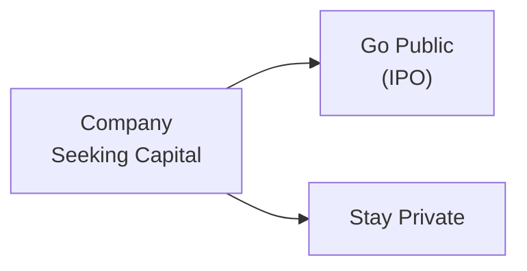

## Introduction and Context

In the landscape of corporate issuers, one of the biggest decisions companies face is whether to remain private or go public. This choice affects just about everything—from management style and governance structures to fundraising capabilities, valuation techniques, and how widely ownership is dispersed. And let me tell you, I remember chatting with a CFO friend who struggled with balancing the excitement of raising enormous capital on the public markets with the hassle of quarterly reporting demands, investor scrutiny, and compliance complexities. It’s a real balancing act!

Public companies, also known as listed companies, trade their shares on public stock exchanges. In contrast, private companies (sometimes called unlisted companies) are owned by a relatively small group of investors, such as founders, families, private equity firms, or venture capital funds. Both structures have unique advantages, challenges, and regulatory frameworks that can shape a firm’s trajectory. 

Below, we’ll dig into the core differences between public and private companies, outline the considerations when choosing whether to list on a public exchange, and offer real-world perspectives. As you advance in your knowledge of corporate finance (especially if you’re working toward the CFA designation), you’ll likely see how these questions play out in day-to-day financial analysis, valuation, and overall corporate strategy.

## Key Comparisons

### Public (Listed) Companies

Public companies offer their shares to the general investing public on an exchange—think New York Stock Exchange (NYSE) in the United States or the London Stock Exchange (LSE) in the U.K. Going public typically involves an Initial Public Offering (IPO), a process that includes preparing extensive financial disclosures, filing documentation (like the Form S-1 in the U.S.), and meeting strict listing requirements.

• Regulatory Compliance and Disclosure  
Public firms must adhere to stringent rules set by securities regulators. In the United States, for instance, the Securities and Exchange Commission (SEC) mandates quarterly financial reports (10-Q), annual reports (10-K), and ongoing event-driven disclosures (8-K). There’s also auditing by independent accounting firms to ensure accurate and reliable financial statements. In other jurisdictions, analogous requirements exist, often guided by IFRS or local GAAP rules.

• Broader Shareholder Base  
Once a company goes public, ownership typically becomes distributed among a large group of shareholders—from retail investors to institutional entities such as mutual funds, pension funds, or hedge funds. While this broader ownership base can provide liquidity and help ensure a robust secondary market, it can also lead to greater scrutiny from activist investors or governance watchdogs.

• Liquidity  
Shares of a listed company are generally easier to buy and sell, resulting in higher liquidity. Investors can exit their positions quickly, typically without steep discounts—assuming the stock has healthy trading volume. Liquidity can be a great advantage for both the company and its investors, but day-to-day stock price fluctuations may also increase market pressure.

• Corporate Governance Requirements  
With more shareholders come more robust governance structures. Boards of Directors often have a higher proportion of independent directors, there are formal board committees (e.g., audit, compensation, and nominating committees), and regulatory bodies or stock exchanges impose specific governance guidelines. This can ensure increased transparency and accountability but can also create administrative complexities.

• Cost of Being Public  
Listing on an exchange is not cheap. Companies pay for underwriting fees, legal counsel, investor relations, financial reporting, and compliance costs. The intangible cost is managerial time spent dealing with these regulatory and investor requirements—time that might otherwise be spent on strategic decisions or day-to-day operations.

### Private (Unlisted) Companies

By contrast, private companies typically limit share ownership to relatively few investors: founders, families, venture capital firms, private equity funds, or angel investors. There’s no active public market for these shares (although limited secondary transactions might occur privately). 

• Less Regulatory Scrutiny (Though Not Zero)  
Private firms avoid a lot of the high-profile public filings and disclosures, but they still must respect local laws, tax regulations, and certain financial reporting standards if required by lenders or private investors. The key difference is these disclosures usually remain confidential within a closed group rather than being publicly disseminated.

• Ownership Control  
One of the biggest attractions of staying private is the ability to maintain tight ownership control. If you’re running a small- to mid-sized family firm, for example, you’re unlikely to want outside shareholders telling you how to run the business. That said, private equity or venture capital investors may still impose significant influence through board seats or contractual rights. However, the group of decision-makers remains smaller and more cohesive overall.

• Capital Access Limitations  
Private companies can raise money from private sources—like private equity, venture capital, or bank loans—but the universe of potential investors is relatively smaller than the public equity markets. This constraint can limit the speed at which you can scale, especially if large capital infusions are needed.  

• Valuation and Liquidity Difficulties  
Determining the “true” fair value of a private company can be trickier because there’s no publicly quoted share price. Liquidity is also an issue: if you, as a private investor, want to exit your stake, finding a buyer may be difficult. This often results in a discounted valuation relative to a comparable public company, particularly for minority stakes.

## Choosing a Path: Public or Private

Companies weigh multiple factors before deciding whether to go public or remain private. The choice can hinge on strategic growth objectives, capital requirements, the founders’ and management team’s comfort with public disclosures, and the chain reactions of governance changes.

### Capital Access

Access to capital is often the driving force behind public listings. If your company anticipates large-scale growth—say you need $500 million to expand globally—the public market may be the shortest route to that capital. Public listings also open the door for issuing additional shares down the line (secondary offerings), potentially at more favorable terms.

For private businesses, especially smaller ones, the capital raises are smaller in scope but can be more personalized. Venture capitalists or private equity investors can bring not just funds but also strategic guidance, industry relationships, and managerial know-how.

### Ownership Control

Founders often feel protective about the company culture or strategic vision. By staying private, it’s easier to keep control in the hands of a few, ensuring decisions remain with the founding team (unless a private equity sponsor or large investor imposes its own demands). When you’re public, major shareholders (pension funds, hedge funds) might push the company in directions you wouldn’t otherwise pursue. Some founders mitigate this by creating dual-class share structures with different voting rights.

### Regulatory Burden

Public companies face significantly heavier compliance burdens—meetings with shareholders, proxy filings, constant oversight, potential scrutiny from activists, among others. All of this can be expensive, time-consuming, and can sometimes create short-term thinking (focusing on quarterly results at the expense of long-term strategy). Private companies face fewer burdens in that sense but may also give up the “brand credibility” that comes with listing on a well-recognized exchange.

### Corporate Governance and Reporting

In deciding which path to take, boards and management reflect on how much transparency they’re willing to provide. Public markets expect up-to-date financial disclosures, robust investor relations, and a well-structured board with committees. Private ownership structures can have simpler governance, but that sometimes leads to less oversight and more potential risk if there’s no external accountability.

### Valuation and Liquidity

Valuation in the public markets can be both an upside and a downside. During bullish markets, public company valuations can skyrocket, giving founders and early investors hefty returns. In downturns, you can lose billions of market cap if the sentiment turns sour. For private firms, absent a public market, liquidity can be limited—but on the upside, you may avoid daily price fluctuations and the associated stress.

## Typical IPO Process Example

If a private company does decide to “go public,” the steps often look like this:

• Planning Stage: The company organizes its financials, reviews corporate governance structure, and hires investment bankers, lawyers, and auditors to guide the process.  
• Filing a Prospectus (e.g., Form S-1 in the U.S.): This document discloses financial statements, risk factors, and business strategies, giving potential investors what they need to evaluate the offering.  
• Roadshow: Management speaks with institutional investors to drum up interest and eventually determine the offering price and share quantity.  
• Listing on an Exchange: Once approved by regulators and after the shares are priced, trading commences on the chosen exchange, such as NASDAQ or the NYSE in the U.S.  

## Real-World Anecdote: A Friendly Take

I once consulted for a mid-sized tech startup that was deciding between raising a large Series D private round versus going public. The CEO was thrilled at the idea of seeing the company’s name on the ticker board, but also worried about regulatory overhead and meeting quarterly earnings expectations. A private injection from a well-known venture capital firm gave them enough cash to scale globally, but the cost was giving up more equity with certain board seats for the VC. Ultimately, they stayed private a bit longer to refine their product. A few years later, they launched a successful IPO at a stronger valuation. The lesson? Timing and readiness matter. Rushing onto public markets can sometimes do more harm than good.

## Best Practices and Common Pitfalls

• Best Practices  
– Conduct thorough cost-benefit analyses before deciding to go public.  
– Establish transparent governance from the start, whether public or private.  
– Maintain robust internal controls and financial reporting practices.  
– Align with investors who share your vision—particularly important for private companies.  

• Common Pitfalls  
– Failing to understand the real costs involved in public listing (underwriting fees, compliance, etc.).  
– Underestimating the reduced agility that can come with a broader shareholder base.  
– Missing out on the intangible “signal” a successful IPO or known VC backing can provide in certain industries.  

## Exam Relevance and Application

From a CFA Level I standpoint, it’s crucial to understand how public versus private structures influence corporate governance, capital structure choices, and stakeholder considerations. In an exam context, be prepared to analyze scenario-based items—perhaps you’re given a company’s capital needs, ownership preferences, or cost constraints, and you must evaluate whether an IPO or continued private funding is more appropriate. You might also see questions about the impact of investor activism on a public company’s strategy, or the trade-offs between liquidity and regulatory burden.

## Glossary

• Initial Public Offering (IPO): The first time a private company offers its shares to the public.  
• Secondary Market: A marketplace (often a stock exchange) where existing shareholders trade among themselves.  
• Liquidity: The ease and speed with which an asset can be sold at or near its intrinsic value.  
• Exchange Listing: The status achieved by meeting and maintaining the listing requirements of a stock exchange (e.g., minimum share price, market capitalization, investor relations processes).

## Additional References

• SEC’s “Fast Answers: Form S-1”  
  → https://www.sec.gov/fast-answers/answersforms1htm.html  
• Gilligan, John, and Mike Wright. “Private Equity Demystified.” (Excellent for learning deeper about the private investment landscape.)  
• Feld, Brad, and Jason Mendelson. “Venture Deals.” (A standard guide for navigating venture capital rounds and private investments.)  
• IFRS Foundation Website  
  → https://www.ifrs.org/ for global accounting standards  
• “Corporate Governance Codes of Best Practice” published by official regulators in various jurisdictions.

## Final Thoughts for the Exam

Understanding the nuances between public and private companies is fundamental for dissecting corporate issuer strategies. When you read a case vignette, always ask: How might being privately or publicly held affect capital structure, governance, investor relations, and growth? Tying these considerations back to the principal–agent conflicts, working capital nuances, or capital budgeting criteria you’ve learned elsewhere in the curriculum can earn top marks in both item-set and constructed-response questions.  

Remember: Mind the big picture. Weigh the pros and cons of public vs. private structures in light of growth objectives, cost of capital, and management’s risk tolerance. And maybe channel a bit of that CFO friend’s cautious optimism—sometimes a carefully timed private strategy outperforms rushing into a public listing.

---

## Test Your Knowledge: Public vs Private Companies Quiz



### Which of the following best describes one advantage of going public?

- [ ] Reduced reliance on external parties, like underwriters.  
- [ ] Increased flexibility to keep internal financial information confidential.  
- [x] Enhanced ability to raise large-scale capital through equity offerings.  
- [ ] Reduced need for corporate governance structures.  

> **Explanation:** One of the key advantages of becoming a public company is the ability to raise larger sums of money from a wide investor base through equity issuances. However, this comes with increased disclosure, governance, and compliance requirements.

### Regarding liquidity, what is a major difference between public and private company shares?

- [ ] Private shares are typically more liquid than public shares.  
- [ ] Public companies often have shares with no voting rights, while private companies don’t.  
- [x] Public companies usually experience higher liquidity, allowing investors to buy and sell more easily.  
- [ ] Private companies cannot transfer shares under any circumstances.  

> **Explanation:** Public companies benefit from established stock exchanges, thus facilitating relatively easy transfer of shares. By contrast, private company shares are less liquid, and finding a buyer can be more difficult.

### A company that wishes to avoid the rigorous disclosure and compliance requirements of securities regulators might prefer to:

- [ ] File additional forms with regulators.  
- [x] Remain private and seek capital from venture capital or private equity sources.  
- [ ] Create dual-class shares when it goes public.  
- [ ] Adopt IFRS for public reporting.  

> **Explanation:** One of the main reasons companies remain private is to avoid the high regulatory burden and continuous disclosures required of public companies. Instead, they rely on private funding sources.

### In the context of public markets, which statement is correct?

- [ ] Market volatility does not affect the valuation of public companies.  
- [x] Public firms are subject to frequent stock price fluctuations driven by investor sentiment.  
- [ ] Public companies rarely raise secondary offerings once they are listed.  
- [ ] Public companies have fewer corporate governance requirements than private companies.  

> **Explanation:** Public companies often experience day-to-day valuation changes due to market sentiment, macroeconomic news, and other factors. This volatility can benefit or disadvantage them, depending on circumstances.

### A private equity investor is typically more involved in strategic decisions than a public market investor because:

- [x] They often have significant ownership and contractual rights in a private company.  
- [ ] They cannot access the Board of Directors of the company.  
- [x] Private firms typically have fewer shareholders, giving large investors substantial influence.  
- [ ] They focus exclusively on philanthropic goals.  

> **Explanation:** Private equity investors usually negotiate direct influence—board seats, veto powers, or specific covenants—because of their large ownership stakes and direct capital infusions. This level of involvement is less common for smaller public shareholders.

### Which factor commonly motivates a private company to go public?

- [x] Access to a broader source of funding.  
- [ ] The desire to minimize corporate governance structure.  
- [ ] A strong need to protect strategic information.  
- [ ] Reducing overall regulatory costs.  

> **Explanation:** By going public, a firm gains easier access to capital markets, potentially at a higher valuation and lower overall cost of capital compared to consistently seeking private rounds of funding.

### How does a public listing typically affect a company’s corporate governance?

- [ ] It decreases the emphasis on independent directors.  
- [x] It usually leads to more formalized governance structures, including independent board committees.  
- [x] Regulators and shareholders demand higher transparency and accountability.  
- [ ] It removes the requirement for annual general meetings.  

> **Explanation:** Publicly listed firms must maintain boards with greater independence and specialized committees (audit, compensation, etc.). They also face more stringent disclosure rules and accountability measures.

### Which point is true about private companies?

- [ ] They face no regulations whatsoever.  
- [x] Their valuations can be more challenging to determine due to limited market data.  
- [ ] They are often more liquid than public companies.  
- [ ] They have the same disclosure requirements as public companies.  

> **Explanation:** Because private companies often do not have an active trading market, their shares can be harder to value. The absence of constant market quotes introduces valuation complexity.

### If a private startup wants to become publicly listed, it generally must:

- [ ] Close all existing bank loans to avoid conflicts of interest.  
- [x] File and register an IPO (or similar offering) with a regulatory body.  
- [ ] Stop issuing any further shares.  
- [ ] Eliminate its Board of Directors.  

> **Explanation:** Pursuing an IPO means filing regulatory documentation (e.g., Form S-1 in the U.S.) and meeting exchange listing requirements. Existing loans or the board structure do not necessarily need to be eliminated.

### True or False: A public company’s ownership is typically concentrated in a small group of investors.

- [x] True  
- [ ] False  

> **Explanation:** This might seem counterintuitive, but some public companies can indeed have ownership that is highly concentrated among large institutional investors, founders, or controlling families—especially if they have dual-class shares or if a few major institutions hold large blocks of shares. While shares are available to the public, it is not guaranteed that ownership is widely dispersed.


