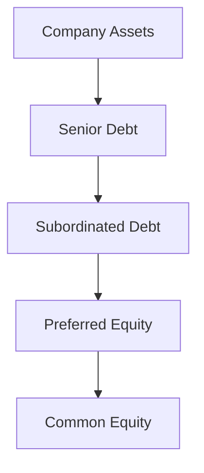

## Introduction and Context

Sometimes, when I'm chatting with friends about investing, I hear comments like, “Yeah, I own Apple,” or “I have Tesla bonds.” And, you know, it took me a while to realize how differently those two statements position an investor in the eyes of the company. One friend owns equity—that essential sliver of ownership—while the other holds a debt instrument that entitles him to regular interest but not the same voting rights or upside potential. 

Understanding the difference between equity and debt claims is a fundamental aspect of corporate finance. In practice, it’s about recognizing who has claims on the firm’s assets, in what order they get paid, and the level of risk and return they can expect. Equity holders can enjoy the fruits if the company thrives, but they also shoulder the largest losses when times get tough. Debt holders, meanwhile, may sleep more soundly with the knowledge that they have a higher priority during liquidation, though that security often comes with a capped (or at least pre-specified) return in the form of interest.

In this reading, we’ll delve into three major themes:

• The nature of equity claims, focusing on common stock and preferred stock.  
• The structure of debt claims, including seniority, interest obligations, and default risk.  
• How these claims slot into a company’s capital structure, affecting risk-return trade-offs.

We’ll also link these ideas to other sections of the curriculum. If you’ve glimpsed the previous section on business structures (see “Business Structures” in this same chapter), you’ll recall that corporations issue both equity and debt to fund operations and growth. You’ll see that in contrast to partnerships or sole proprietorships, the corporate setup allows for a more diverse, and sometimes more complex, capital structure.

Anyway, let’s dive in.

## Understanding Equity Claims

Equity represents ownership in a company. If you own shares in a public company like Apple or a private start-up, you’re an equity investor—commonly referred to as a shareholder. Let’s break down the main forms of equity.

### Common Stock

Common stock is the most prevalent form of equity. Common stockholders typically have:

• Voting rights: They can vote on important corporate matters such as board member elections or major strategic decisions (e.g., mergers, acquisitions, changes to bylaws).  
• Residual claim to income and assets: In good times, they get dividends (if declared) and benefit from capital gains if share prices rise. In liquidation, though, common shareholders are last in line. This makes common stock inherently riskier than some other instruments.  
• Potential for high returns: Since there is no upper limit on a company’s long-term growth (in theory), common shareholders can sometimes enjoy substantial gains.

I’ll never forget the excitement of receiving my first common stock dividend—though small, it was a tangible reminder of the upside potential. Of course, the flip side is that if the company goes bankrupt, your common stock can become, well…worth nothing.

### Preferred Stock

Preferred stock often sits between debt and common equity on the risk-return spectrum. While it’s still technically equity, it carries certain characteristics that can feel bond-like:

• Priority in dividends: Preferred shareholders are paid dividends before common holders. If you see a company that has “Series A preferred,” it usually means the shares have a contractual dividend benefit that must be satisfied before common shares get anything.  
• Priority in liquidation: They stand behind bondholders but ahead of common shareholders in a bankruptcy scenario.  
• Limited or no voting rights: In most cases, preferred stock doesn’t offer the same voting rights as common stock.  
• Fixed dividend pattern: Unlike common shares, preferred dividends are often set at a fixed rate, providing holders with predictable income—though this can be suspended if the business gets into trouble, depending on whether the preferred stock is cumulative or non-cumulative.

Because of these features, preferred stock is often popular with certain kinds of institutional investors and can be particularly attractive for companies looking to raise capital without significantly diluting the voting power of existing common shareholders.

### Real-World Example: Convertible Preferred Shares

In the world of venture capital, early-stage companies frequently issue “convertible preferred shares.” Suppose you invest in a small technology start-up. You might get a certain number of convertible preferred shares that provide a fixed dividend and a liquidation preference, plus the right to convert your shares into common stock if the company goes public (or hits some valuation milestone). This structure offers an added layer of protection if the company underperforms (at least relative to common stock) while letting you convert to common stock should the firm take off. It’s kinda like a bit of best-of-both-worlds scenario.

## The Nature of Debt Claims

Debt represents an obligation that a company must repay to its lenders. If I lend a friend $1,000 for a new business, I’m effectively a debtholder. I’m not an owner; I don’t get to vote on how to run the business. But I do expect the money back, typically with some agreed-upon interest.

### Key Features of Debt

• Fixed obligations: Debt often comes with a scheduled interest payment and a maturity date, by which the principal must be repaid.  
• Legal enforceability: The terms are usually specified in a bond indenture or loan agreement. Failure to meet these obligations can trigger default, which can lead to bankruptcy proceedings if not cured.  
• Seniority: Debtholders almost always receive priority in liquidation over equity holders.  
• No (or minimal) voting rights: Except in specific circumstances (e.g., covenant violations that give debtholders additional rights), debt typically doesn’t carry the ability to vote on corporate governance issues.

### Classes of Debt

A company might issue senior debt, mezzanine debt, or subordinated debt, each with different claims on the business’s assets in liquidation. 

• Senior debt: Usually has top priority when it comes to repayment (after certain government claims and employee wages in some jurisdictions).  
• Subordinated debt: Paid only after the more senior debt claims have been satisfied. The interest rates on subordinated debt are often higher to compensate for the additional risk.  
• Secured vs. unsecured: Secured debt is backed by specific collateral. If the company defaults, secured debtholders can claim the collateral assets. Unsecured debt is not backed by specific collateral, so it inherently carries more risk.

### Example of Bond Terms

Say you purchase a corporate bond with a 5% annual coupon, paid semiannually, and a maturity of 10 years. The legal contract (bond indenture) outlines the payment schedule, interest rate, and details about the company’s obligations. If the firm fails to meet an interest payment, bondholders might force the issuer into default unless it’s cured within a grace period.

Here’s a quick snippet of Python-style pseudocode that calculates the price of a bond under a simplified assumption:

```python
def bond_price(face_value, coupon_rate, semiannual_periods, market_yield):
    """
    face_value: the par (or maturity) value of the bond
    coupon_rate: the annual coupon rate (e.g., 0.05 for 5%)
    semiannual_periods: total number of semiannual periods until maturity (e.g., 20 for 10 years)
    market_yield: the current market yield per semiannual period (e.g., 0.025 for 5% annual yield)
    """
    coupon_payment = face_value * coupon_rate / 2
    pv_coupons = sum([coupon_payment / ((1 + market_yield) ** t) for t in range(1, semiannual_periods + 1)])
    pv_face_value = face_value / ((1 + market_yield) ** semiannual_periods)
    return pv_coupons + pv_face_value

bond_val = bond_price(face_value=1000, coupon_rate=0.05, semiannual_periods=20, market_yield=0.025)
print(bond_val)
```

If the market yield equals the coupon rate, this bond might price at (or near) par ($1,000). If the company’s credit quality worsens, the market might demand a higher yield, which would lower the bond’s price.

## Capital Structure and Priority Hierarchy

A firm’s capital structure is essentially the combination of equity and debt it uses to finance operations. The hierarchy is critical because it dictates who gets paid first if the business can’t meet all its obligations.

### Visual Representation of Priority

Let’s illustrate the priority hierarchy in a simple mermaid diagram:



In a bankruptcy or liquidation scenario, senior debt (B) must be fully satisfied before subordinated debt (C) sees any recovery. Only after subordinated debt is paid does the firm pay claims to preferred shareholders (D). Finally—and often last in the queue—are the common shareholders (E).

### Voting Power vs. Legal Priority

As we noted, debt holders generally lack direct voting rights (outside of covenant breach events), but they have a powerful legal claim to the firm’s assets. Equity holders, by contrast, often have formal voting control over the firm’s direction but must stand at the end of the line if the firm dissolves. That classic trade-off—higher upside potential for equity, lower risk for debt—pops up again and again.

## Risk-Return Profiles

So how do investors choose between equity and debt claims? Typically, it depends on their risk tolerance and return objectives.

### Equity: No Cap on Upside, But High Risk

Equity holders can see the value of their investment skyrocket if the firm performs well. Many “unicorn” start-ups minted aggressive returns for early common (and preferred) shareholders. But, if the business fails, equity investors might be left with nothing. The often-cited “residual claimant” concept means that they only get paid after all other obligations are satisfied. 

In practice, from an investment standpoint, equities can deliver returns via:

• Capital appreciation (stock price increases)  
• Dividends (if declared)  

### Debt: Fixed Income, But Lower Risk

Debtholders are primarily concerned with receiving interest and, eventually, their principal back. While the return potential generally tops out at receiving those promised payments, the likelihood of total loss is typically lower than for equity, thanks to their more senior claim.

This risk-return distinction shapes not only corporate finance decisions but also how investors build their portfolios. Some will emphasize capital preservation, favoring safer bonds, while others will lean toward growth opportunities, investing in equities to capture potential high returns.

## Relationship to the Firm’s Cost of Capital

From a corporation’s perspective, the mix of equity and debt financing influences the weighted average cost of capital (WACC). A higher proportion of debt can reduce WACC up to a point (because interest payments might be tax-deductible in some jurisdictions, plus debt is generally cheaper than equity). However, too much debt raises the probability of financial distress. We’ll cover WACC in detail in the Capital Structure chapter (see Chapter 6: “Weighted-Average Cost of Capital (WACC)”), but for now, just remember that the interplay between equity and debt shapes a firm’s risk profile and ultimately influences shareholder value.

## Best Practices and Common Pitfalls

• Balance is key: While debt can be a cheaper source of capital, too much leverage raises the risk of default.  
• Mind the covenants: Issuing debt often subjects the firm to restrictive covenants (e.g., maintaining certain leverage ratios), limiting managerial flexibility.  
• Preferred stock intricacies: When layering in preferred shares, be mindful of the specific terms. Cumulative preferred dividends can become a real burden if business conditions deteriorate.  
• Communication matters: Equity investors, particularly large shareholders (see “Activist Investors” in Chapter 2), can exert pressure on management. Meanwhile, bondholders can impose financial covenants. Navigating these relationships is a crucial aspect of corporate governance.

## Personal Anecdote

I remember back in the day when a friend’s small company was about to go under. He owned common shares, and I held convertible debt. I wasn’t actively steering the company’s decisions, but I sure had strong contractual protections if they defaulted. Sadly, the business did fail, but I was able to recover a portion of my investment thanks to my senior claim as a debtholder—whereas my friend lost his entire equity stake. Tough lessons were learned, but it really hammered home the priority concept in real life.

## Deeper Connections to Other Curriculum Topics

• Agency Problems: We’ll explore in Chapter 3 how debtholders and equity holders can have misaligned incentives, and how corporate governance mechanisms monitor and manage these conflicts.  
• Working Capital Management (Chapter 4): Another angle to consider is how short-term financing (a form of debt) or share issuances can shape a firm’s day-to-day liquidity strategies.  
• Dividend Policy (Chapter 8, ironically labeled “Chapter 1” in the provided outline, but titled “Dividends and Share Repurchases”): The decision to pay dividends to common shareholders, or the preference amounts payable to preferred shareholders, ties in closely with how a company balances debt obligations and growth.  
• Mergers and Acquisitions (Chapter 9): The capital structure (equity vs. debt) can be reshaped significantly during M&A transactions. Synergies, leveraged buyouts, and anti-takeover provisions all hinge on the rights and claims of various security holders.

## Final Exam Tips

• Practice scenario-based questions: On the CFA exam, you’ll often see cases where you must figure out which stakeholders have priority in certain situations and how changes in the capital structure might affect WACC or earnings per share.  
• Memorize the liquidation order: Be comfortable identifying who’s paid first between senior secured debt, unsecured debt, preferred stock, and common equity.  
• Know your bond indentures: Details like covenants or call provisions can transform the risk profile. You should be ready to interpret them and assess how they protect or expose lenders.  
• Identify red flags: Watch for signals of financial distress—like when a firm’s interest coverage ratio plunges. This can appear in item sets where you’re asked to evaluate potential credit risk.

## References and Further Reading

• Brealey, R. A., Myers, S. C., & Allen, F. (latest edition). Principles of Corporate Finance. New York: McGraw-Hill.  
• Fabozzi, F. J. (latest edition). Handbook of Fixed Income Securities. New York: McGraw-Hill.  
• Official Company Prospectuses and Bond Indentures (available in public regulatory filings like EDGAR in the US or SEDAR in Canada) for practical examples of the legal terms around debt and equity.

## Test Your Knowledge: Equity and Debt Claims Fundamentals



### Which of the following best describes the residual claimant in a corporation?

- [ ] Preferred shareholders who receive fixed dividends and liquidation priority.
- [ ] Bondholders who receive coupon payments first.
- [x] Common shareholders who receive what remains after all obligations are met.
- [ ] Senior debtholders who are protected by collateral.

> **Explanation:** Common shareholders are the residual claimants, meaning they only receive payment after all other claims, including those of debtholders and preferred shareholders, are satisfied.

### Preferred shareholders:

- [ ] Generally have unlimited voting rights and the same liquidation claims as common shareholders.
- [x] Typically receive dividends before common shareholders and have a higher claim in liquidation than common shareholders.
- [ ] Have no rights to dividends under any circumstance.
- [ ] Must convert their shares to common stock at maturity.

> **Explanation:** Preferred shareholders are paid before common shareholders in terms of dividends and liquidation proceeds. However, their voting rights are often limited or non-existent, and although some preferred shares are convertible, it differs by issue.

### A bond indenture:

- [ ] Is irrelevant to the terms and conditions of a bond offering.
- [x] Functions as a legal contract that outlines the obligations and restrictions of the bond issuer.
- [ ] Refers to a bond’s market price at issuance.
- [ ] Is a type of subordinated debt.

> **Explanation:** The bond indenture is the official legal document governing the bond’s parameters, including coupon rate, maturity, covenants, and issuer obligations.

### Which of the following is generally true regarding the hierarchy of claims?

- [ ] Common stock ranks above preferred stock in liquidation.
- [x] Senior debtholders are paid before subordinated debtholders, who are paid before preferred shareholders, followed by common shareholders.
- [ ] Preferred shareholders receive liquidation proceeds before debtholders.
- [ ] Common stock ranks above senior debt in liquidation but below subordinated debt.

> **Explanation:** In liquidation, senior debt is repaid first, followed by subordinated debt. Preferred shareholders are next in line, and common shareholders are last.

### When considering risk-return profiles:

- [x] Equity holders face higher risk (potential total loss of principal) but enjoy potential upside if the firm performs well.
- [ ] Debtholders typically have higher returns and face more risk compared to equity holders.
- [ ] Equity holders have priority in liquidation over debtholders.
- [x] Debtholders often accept limited returns (fixed interest), but they have higher seniority.

> **Explanation:** Equity offers higher upside but is riskier, as equity holders are at the bottom of the priority ladder. Debtholders receive specified interest payments and have priority claims, which reduces their risk.

### Which best describes subordinated debt?

- [ ] Debt with claim priority ahead of all other debts.
- [ ] Debt that automatically converts into equity upon issuance.
- [ ] Preferred stock with higher dividend rates.
- [x] Debt that is repaid only after more senior classes of debt are satisfied.

> **Explanation:** Subordinated debt receives payment after senior and secured debts are satisfied.

### In a scenario where the firm fails to meet its interest obligations:

- [ ] The equity holders can claim the firm’s assets first.
- [ ] The preferred shareholders must surrender their shares immediately.
- [x] The bondholders can initiate default proceedings, depending on the specific indenture provisions.
- [ ] The firm automatically issues new shares to bondholders to compensate for missed payments.

> **Explanation:** If interest obligations aren’t met, bondholders generally have the right to trigger default processes, often leading to potential bankruptcy filings unless the firm cures the missed payments.

### A feature of preferred shares that resembles bonds is:

- [ ] Unlimited upside potential in share price appreciation.
- [x] A fixed dividend payment similar to coupon interest.
- [ ] Voting rights comparable to common shares.
- [ ] Being the residual claimant after bondholders are paid.

> **Explanation:** Preferred shares often have a fixed dividend payment. This makes them resemble debt securities in certain respects.

### Which of the following statements is correct?

- [x] Common shareholders typically have voting rights, while debtholders do not, except under specific covenant breach conditions.
- [ ] Debtholders usually control the board of directors in a well-functioning firm.
- [ ] Preferred shareholders generally monitor management closely, acting as the principal governance mechanism.
- [ ] Debtholders and equity holders share the same risk profiles.

> **Explanation:** Common shareholders generally hold voting rights, whereas debtholders do not unless covenant terms have been violated, triggering special protections or negotiating rights. 

### True or False: In a bankruptcy scenario, common shareholders must be fully compensated before bondholders receive anything.

- [ ] True
- [x] False

> **Explanation:** In bankruptcy, bondholders (debtholders) receive payments before common shareholders. Equity investors are last in line.


