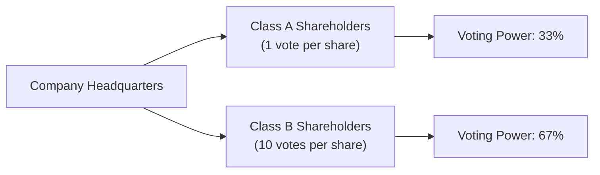

## Introduction
Share classes might seem a little unexciting at first glance—some might think a "share is a share is a share," right? But the reality is that not all shares are created equal. Corporate issuers can design share classes to shape dividends, maintain voting control, or even allow early investors to preserve leadership influence long after going public. In this section, we’ll discuss common stock classes such as Class A and Class B, examine the intricacies of voting rights (statutory versus cumulative voting), and explore how special or non-voting shares can affect a company’s governance structure.

I remember the first time I dug into an annual report with multiple share classes. I was a bit overwhelmed—like, "Wait, so I own shares but can’t really vote?" Understanding these nuances is crucial for CFA candidates and practitioners alike, since share structure influences corporate control, potential conflicts between shareholders, and, ultimately, shareholder value.

## Common Stock Classes
It’s common to see companies issue multiple classes of common stock to meet specific goals: keeping control with a founding team, offering different dividend rights, or maintaining some balance between strategic investors and retail shareholders. Let’s explore the key features.

### Class A vs. Class B Shares
Many companies issue multiple share classes labeled "Class A" and "Class B" (and sometimes Class C, etc.). The primary difference? Voting power. For example, Class A might carry one vote per share, while Class B might have limited or no voting rights. Alternatively, Class B might also be the "high-vote" share—like in some tech companies—where the founders hold Class B shares with 10 votes per share. This dual-class structure can keep corporate control within a small group.

Real-life example: Alphabet Inc. (Google’s parent) has Class A shares (GOOGL) that carry one vote per share, Class B shares that are privately held by founders and early investors with 10 votes per share, and Class C shares (GOOG) with zero votes. This structure helps founders retain significant control over strategic decisions.

### Founder or Family Control
In certain jurisdictions or legacy companies, founders or a family might hold a class of shares that guarantees them a controlling stake without needing majority equity ownership. This approach can be beneficial if the leadership’s vision aligns with long-term shareholder interests. But it may also raise corporate governance concerns, as a small group might override the preferences of the majority of equity holders.

## Voting Mechanisms
Voting rights determine the balance of power in key corporate decisions—like electing directors and approving major strategic moves (mergers, acquisitions, or selling big chunks of the business). There are two primary voting systems to keep on your radar.

### Statutory (Straight) Voting
In a statutory voting framework, each share corresponds to one vote for each director seat. Suppose there are 100 shares outstanding, and the company is electing three board members. A shareholder owning 10 shares can cast 10 votes for each of the three seats. That’s 10 votes per seat. Let’s do a quick numeric illustration:

• Total seats: 3  
• Your shares: 10  
• Votes per seat: 10  
• You have 10 × 3 = 30 total votes (but you cannot lump them all onto a single candidate; you must allocate 10 per seat).

### Cumulative Voting
Cumulative voting was designed to protect minority shareholders by allowing them to concentrate all their votes on fewer candidates. Under this system, each shareholder multiplies the number of shares owned by the number of board seats up for election—and may distribute those votes across candidates in any proportion.

Using the same example (3 seats, 10 shares), you’re entitled to 10 × 3 = 30 votes in total, but you’re free to split them across the three seats however you choose. You could even place all 30 votes behind a single director candidate. That’s particularly powerful for smaller investors who want to ensure at least one "voice" on the board.

## Non-Voting Shares
Non-voting shares are often introduced when companies want to raise equity capital—maybe to fund expansion or acquisitions—but don’t want to dilute the control of existing shareholders or leadership. Sometimes these shares come with dividend preferences or other perks to attract investors.

However, regulatory bodies in some regions are increasingly cautious about allowing large floats of non-voting shares. Stock exchanges also have listing requirements that limit how many non-voting or low-voting shares can be issued.

## Impact on Corporate Governance
It always amazes me how share classes, especially ones with special voting rights, can shape a company’s governance dynamics:

• Dual-Class Structures: Allow a small group—often founders, families, or key executives—to maintain outsized voting control relative to their economic stake in the firm.  
• Investor Scrutiny: Dual-class structures and non-voting shares can attract regulatory and investor skepticism. Many institutional shareholders demand "one share, one vote" for fairness.  
• Proxy Voting and Engagement: Minority shareholders may rely heavily on proxy statements to stay informed and try to influence governance. The effectiveness of their votes can be reduced if there’s a high-vote class in the mix.

Major index providers, such as S&P Dow Jones Indices, have evolved rules excluding companies with certain dual-class or no-voting structures from select indices. Governance standards such as those from Institutional Shareholder Services (ISS) often emphasize preserving equitable voting rights.

## Dual-Class Structures
You’ll often see the term "dual-class" used interchangeably with "multi-class." The idea is you have at least two classes of shares with different voting weights. Some global exchanges (e.g., in Hong Kong, the U.S., Canada) allow these structures, albeit with certain restrictions, while others discourage them. Companies argue it preserves the founding vision; opponents worry about entrenchment and lack of accountability.

It’s possible, in rare instances, that controlling shareholders might abuse their power—approving compensation packages or related-party transactions that benefit insiders. For professional CFA charterholders, this raises both ethical and analytical questions: you have to assess whether the benefits of stable leadership might offset the risks of potential abuse.

## A Quick Example: High-Vote vs. Low-Vote
Imagine a company with two classes of shares:
• Class A: 10 million shares, 1 vote per share  
• Class B: 2 million shares, 10 votes per share  

Class B owners hold only 17% of total equity (2 million / 12 million = ~17%). However, they control a much bigger voting slice:
• Total votes = (10 million × 1) + (2 million × 10) = 10 million + 20 million = 30 million  
• Class B shareholders = 20 million / 30 million = ~67% of total votes  

In this scenario, the minority stake (Class B) effectively controls the company. As an investor or portfolio manager, you’d ask: "Does that mismatch pose a long-term risk for my investment?" Those are the real-world tradeoffs we weigh in advanced portfolio management.

## Using Mermaid to Visualize Ownership Structure
Below is a simple Mermaid diagram to illustrate how share classes connect to overall ownership and voting control.

In this stylized example, Class B represents founders or a concentrated group, whereas Class A represents a broad base of everyday investors. Even though Class A might represent more total shares outstanding, Class B wields more voting power.

## Exam Relevance and Best Practices
Analyzing share classes and voting rights is especially relevant in:
• Equity valuation—understanding the potential risk of minority shareholder expropriation.  
• Mergers and acquisitions—where voting control can determine whether a deal gets approved.  
• Corporate governance signals—investors often gauge management’s willingness to align with shareholder interests based on share structures.  

From an exam perspective, you may see item sets that describe a company with multiple share classes, ask you to evaluate governance implications, or test your understanding of how cumulative vs. statutory voting could influence the outcome of a director election. Make sure you’re comfortable distinguishing between these voting systems.

## Potential Pitfalls and Strategies
• Ignoring Governance Red Flags: Don’t dismiss the significance of dual-class or non-voting structures. They may signal entrenchment risk.  
• Overlooking Cumulative Voting Nuances: In practice, cumulative voting can boost minority shareholder influence. Many analysts skip this detail, but it’s tested often.  
• Failing to Scrutinize Proxy Statements: They’re a goldmine of data on share class structures, especially in special meeting contexts or M&A transactions.

## Personal Thoughts—and a Little Humor
I once got super excited—yes, "excited"—digging through a proxy statement from a media conglomerate with four share classes. My friend said, "That’s not normal." Well, maybe not, but to me, it revealed how a founding family had locked down control with less than 10% economic ownership. Always keep an open mind about governance quirks; they’re often more important to valuations and risk assessments than you’d initially expect.

## Conclusion
Share classes and voting rights can dramatically shift the balance of power within a company. Whether it’s a straightforward single-class setup or a multi-tier structure weighted in favor of founders, each model has governance and valuation implications. As future CFA charterholders, you should approach share class arrangements with a blend of healthy skepticism and analytical curiosity. They matter—not just for academic tests, but for real-world company health, minority shareholder protection, and investor returns.

## Final Exam Tips
• When facing an essay or item set question on share classes, carefully note the differences in voting rights and dividends.  
• Distinguish between statutory and cumulative voting—especially how minority shareholders might leverage cumulative voting to elect at least one board seat.  
• Evaluate governance consequences of dual-class shares. Ask: Which group maintains control? Does it align with the best interests of all shareholders?  
• Use real-world references and stated corporate structures from the question to ensure your analysis fits the scenario.  

## References
• ISS (Institutional Shareholder Services) Guidelines on Dual-Class Share Structures:  
  https://www.issgovernance.com/  
• “Corporate Governance Matters” by David Larcker and Brian Tayan  
• Proxy Statements (EDGAR Database, U.S. Securities and Exchange Commission)  

## Evaluate Your Understanding: Share Classes and Voting Rights Quiz



### In a dual-class structure, certain shares typically have:
- [ ] No economic value.
- [ ] Fewer dividend rights but more liquidation preference.
- [x] Enhanced or reduced voting rights compared with other classes.
- [ ] The same voting rights as any other share.

> **Explanation:** Dual-class structures usually grant one class of shares superior (or inferior) voting power relative to another class.

### Under statutory (straight) voting, a shareholder with 50 shares and 3 available board seats can allocate:
- [x] 50 votes to each board seat, totaling 150 votes cast in the election.
- [ ] 150 votes to one seat only.
- [ ] 50 votes in total.
- [ ] 25 votes to each of two seats and none to the third seat.

> **Explanation:** In statutory voting, each share grants one vote per seat, so with 50 shares and 3 seats, the shareholder casts 50 votes per seat, totaling 150. But they cannot pool all 150 into a single seat.

### The main advantage of cumulative voting for minority shareholders is:
- [x] The ability to concentrate votes on fewer candidates, increasing the likelihood of electing a preferred candidate.
- [ ] It gives management veto power over the board election.
- [ ] It eliminates the need for annual general meetings.
- [ ] It prevents the issuance of non-voting shares.

> **Explanation:** By allowing multiple votes to be allocated to one candidate, minority shareholders can increase their influence in board elections.

### Which of the following is an example of a dual-class voting arrangement?
- [ ] All shares grant equal voting and dividend rights.
- [x] Class B shares have 10 votes per share, while Class A shares have 1 vote per share.
- [ ] Class A shares donate profits to charity automatically.
- [ ] Preferred shares have redemption privileges while common shares do not.

> **Explanation:** A classic dual-class arrangement involves at least two classes with different voting rights; for example, Class A has 1 vote, Class B has 10 votes.

### What is one key criticism often cited against dual-class share structures?
- [x] They can entrench management or founder control at the expense of other shareholders.
- [ ] They completely eliminate minority interest in the company.
- [ ] They violate every global stock exchange rule.
- [ ] They always produce suboptimal corporate decisions.

> **Explanation:** Dual-class structures can enable a small group of insiders to hold disproportionate influence, potentially creating governance risks for other shareholders.

### Which statement about non-voting shares is most accurate?
- [x] They allow companies to raise equity capital without diluting voting control.
- [ ] Any issuance of non-voting shares is illegal in most jurisdictions.
- [ ] Non-voting shares typically command higher market prices than voting shares.
- [ ] They automatically convert into preferred shares after a certain time period.

> **Explanation:** Non-voting shares help companies raise funds while preserving existing controlling shareholders’ voting majority.

### From a corporate governance perspective, how might cumulative voting influence board member diversity?
- [x] Cumulative voting can increase diversity by letting minority groups pool votes for a favored candidate.
- [ ] Cumulative voting ensures that every seat is filled by the controlling family.
- [ ] It reduces the chances of minority representation on the board.
- [ ] It eliminates the need for a board’s nominating committee.

> **Explanation:** By allowing minorities to concentrate votes, cumulative voting can promote more diverse viewpoints on a board.

### When analyzing share classes for a potential equity investment, a CFA charterholder should:
- [x] Evaluate how a controlling block might exercise power and whether that aligns with minority shareholders’ interests.
- [ ] Ignore any mention of voting rights, as it has no valuation implications.
- [ ] Assume a single-class share structure in all markets.
- [ ] Automatically reject any firm with Class B shares.

> **Explanation:** You must assess whether differing voting rights may lead to governance risks or benefits that could affect valuation and shareholder outcomes.

### A dual-class structure that grants superior voting rights to one class and no voting rights to another will:
- [x] Potentially limit the influence of shareholders holding the no-vote shares.
- [ ] Give all shareholders equal representation on the board.
- [ ] Never be allowed in any jurisdiction.
- [ ] Guarantee minority shareholders at least one board seat.

> **Explanation:** When one class has no votes, those shareholders have reduced influence over major corporate decisions, which can raise governance concerns.

### "One share, one vote" is considered:
- [x] True
- [ ] False

> **Explanation:** "One share, one vote" is a standard approach to equity ownership and voting power, though many companies do diverge from this model using dual-class or non-voting shares.


