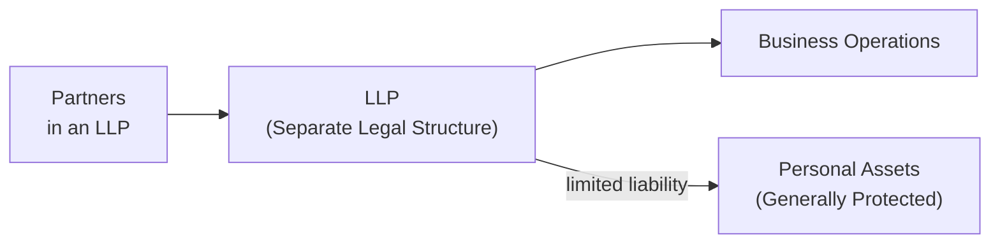
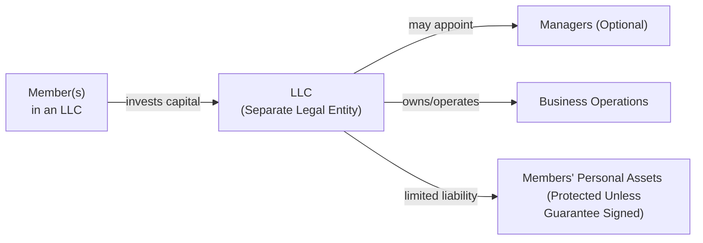

## Overview
When you think about forming a business—whether it's a small advisory practice, a startup, or maybe a professional services firm—your choice of structure will have big implications for control, taxes, and liability. Many folks start with something like a sole proprietorship or general partnership because they're straightforward (as introduced in 1.1 Business Structures). But if you want limited liability, some interesting tax benefits, and a flexible management style, hybrid legal structures such as the Limited Liability Company (LLC) and the Limited Liability Partnership (LLP) deserve close attention.

In many jurisdictions, LLCs and LLPs are the darlings of small to medium-sized firms. They blend the limited liability that corporations enjoy (i.e., personal asset protection) with the pass-through taxation typical of partnerships. So you (and any co-founders or partners) can structure the firm to avoid “double taxation” at the corporate and individual levels, while staying shielded from business debts—assuming you've set everything up properly.

In this section, we’ll dig deeper into some key features of LLCs and LLPs, including their formation, tax implications, management flexibility, and potential pitfalls. We’ll also link back to earlier discussions of business structures and ownership (1.1, 1.2, and 1.3) to show how these hybrids fit into the broader corporate issuer landscape.

## Key Characteristics
One of the cooler things about hybrid entities is that they can be configured to suit a variety of business situations. LLCs, for example, are often used by technology startups or real estate investors, while LLPs are quite common among professional service outfits such as accounting or law firms. Let’s start by outlining some shared benefits:

• Limited Liability: Both structures shield owners’ (or partners’) personal assets from most business-related liabilities. If the firm gets sued, or if some project goes south and the business owes money to lenders or vendors, personal homes and personal savings generally aren’t on the line.  
• Pass-Through Tax Treatment: LLCs and LLPs often (though not always) circumvent corporate-level taxation, meaning profits and losses “pass through” to individual owners/partners. Each owner or partner then pays income tax on their share at individual rates.  
• Flexible Management Structure: LLCs can be member-managed or manager-managed. Similarly, in an LLP, partners can typically participate in day-to-day management without forfeiting limited liability (important back in the day when, in a limited partnership, only general partners who actively managed had unlimited liability).  
• Easier Compliance, Up to a Point: Relative to big corporations with elaborate formalities, these hybrid structures have fewer administrative burdens. And for many business owners, that’s appealing—less overhead, fewer official meetings, fewer layers of management.

## LLCs in Focus
An LLC is best thought of as a composite of partnership and corporate features. You can file a certificate of formation (or articles of organization, depending on the jurisdiction) with the relevant state or national authority, and—voilà—you have a standalone legal entity. This entity can hold assets, enter contracts, and, importantly, limit the liability of its owners (known as members).  

### Pass-Through Taxation (LLCs)
In many jurisdictions, an LLC is a “disregarded entity” by default if it has a single member—meaning the business activity is taxed in the same way as a sole proprietorship. For multi-member LLCs, there’s often a default partnership tax regime. That said, an LLC can choose to be taxed as a corporation if that’s more advantageous (maybe for certain tax deductions or if it plans to raise more traditional equity). The choice depends on your specific operational and strategic goals.

### Management Styles: Member-Managed vs. Manager-Managed
• In a member-managed LLC, every member has a voice in daily operations and strategic choices, which can be great for small teams that want to stay hands-on.  
• In a manager-managed LLC, members designate one or more managers—who might be members or might be external hires—to handle the day-to-day tasks. This approach is popular for larger LLCs or in scenarios where passive investors want in but prefer not to get into the operational weeds.

### Asset Protection
Frankly, one of the biggest draws to the LLC is personal asset protection. You might recall (from 1.1 Business Structures) that a core benefit of corporate forms is shielding owners from business liabilities. LLCs replicate that benefit. Somebody sues your LLC? Barring personal guarantees, your personal bank account generally isn’t in play. 

However, local laws vary, and courts can “pierce the corporate veil” if members fail to respect corporate formalities. For example, mixing personal and business funds or misrepresenting the business can destroy that protection. So it’s wise to keep the business and personal finances truly separate (think separate bank accounts, separate finances, meticulous record-keeping).

## LLPs in Focus
An LLP shares many similarities with an LLC, but there are a few distinctions worth calling out:

• Primarily for Certain Professions: LLP usage is often restricted to specific professional groups such as lawyers, accountants, doctors, or consultants. In many jurisdictions, only licensed professionals can form LLPs.  
• Liability Shield Among Partners: Each partner remains protected from debts and liabilities arising from the malpractice or negligence of other partners. This aspect is a major draw for professional firms—no one wants to lose everything because of another partner’s mistakes.  
• Pass-Through Taxation: Just like an LLC, an LLP typically allows profits to flow directly to the partners without corporate-level tax. This compensation arrangement can simplify partner distributions, but it can also raise interesting operational issues.  
• Joint vs. Several Liability: In a traditional partnership, any partner can be held personally liable for the wrongdoing of another partner. But in many LLPs, the wrongdoing of Partner A largely remains Partner A’s problem, not Partner B’s. This structure fosters an environment that can encourage collaboration without fear of a total meltdown if something goes wrong with one partner’s client.

Here’s a quick diagram to illustrate a typical LLP arrangement:

In the above diagram, the LLP stands as a buffer between potential business liabilities and the partners’ individual assets.

## Tax Implications for Both Structures
The big draw for many business owners is the potential for pass-through taxation. In other words, “We want to avoid that big corporate tax bill on top of the individual tax we’d pay on any dividends.” If you recall from 1.2 Public versus Private Companies, double taxation can be a real drag for corporations, especially in jurisdictions that heavily tax corporate profits.

Hybrid entities typically skip that first layer of taxation. Each member or partner gets their share of net profits (or losses) and reports it on their personal tax return. That said, partners or members often need to make estimated tax payments throughout the year—just like sole proprietors. This can simplify or complicate tax planning, depending on each individual’s financial situation.

Keep in mind, too, that local laws and regulations sometimes impose special taxes or fees on LLCs and LLPs. In certain U.S. states, for example, there’s a franchise tax or LLC fee that might offset some of the savings. Also, if the owners plan to raise external capital (e.g., from venture capitalists), the single layer of tax might be overshadowed by other considerations—like the ease of issuing different share classes (1.4 Share Classes and Voting Rights) or the regulatory environment for corporations (1.10 Regulatory Reporting Requirements).

## Formation Requirements
No matter where you incorporate or establish your LLC or LLP, you typically must:

• File a formation document (Certificate of Formation for an LLC, or a similar registration for LLPs) with the state or governmental authority.  
• Pay a filing fee (it might be nominal, or it might be significant in some places).  
• Potentially designate a “registered agent” or official contact for receiving legal documents.  
• Create an operating agreement (for LLCs) or partnership agreement (for LLPs) that lays out ownership percentages, profit-sharing arrangements, governance rules, etc.

Those formation documents—especially the operating or partnership agreement—are critical. They define how decisions are made, how conflicts get resolved, and how ownership interests can be transferred. For instance, do you need unanimous consent of members to bring in a new investor? Or just a majority vote? These details loom large when you’re trying to keep the peace among multiple owners.

## Suitability: Which Businesses Should Consider It?
• Small and Medium Enterprises (SMEs): If you’re launching, say, a real estate investment firm with a couple of friends or colleagues, an LLC can shield each of you from personal liability if a deal goes sour. Meanwhile, pass-through taxation might suit your overall financial strategy.  
• Professional Services: Many accounting, consulting, and legal practices form LLPs to prevent one partner’s malpractice from imperiling the personal assets of the entire team. In an environment that demands personal accountability for client deliverables, this protection fosters trust among partners.  
• Ventures with External Investors: If you plan to scale and bring in outside capital, certain investors (VCs, private equity) may prefer a corporate structure. But others might be keen on the simplicity of an LLC. Always check prospective investors’ criteria: some institutional investors have mandates that restrict them from investing in pass-through entities.  

## Comparing LLCs and LLPs
Um, so how do you pick between them? It often comes down to:

| Feature                    | LLC                                          | LLP                                               |
|---------------------------|----------------------------------------------|---------------------------------------------------|
| Liability Protection      | Member liability limited to contributions    | Partners have limited liability for others' acts  |
| Management Structure      | Member-managed or manager-managed            | Typically all partners can participate            |
| Who Can Form It           | Generally any group of members               | Often restricted to licensed professionals        |
| Tax Treatment             | Pass-through or corporate (by election)      | Pass-through in most cases                        |
| Typical Use Case          | SMEs, real estate, tech startups, etc.       | Law firms, accounting firms, medical practices    |

The tricky part is that each jurisdiction has its own nuances. In some places, the difference between an LLC and an LLP is negligible; in others, it’s night and day. Always confirm the local rules if you’re exploring these structures.

## Illustrative Diagram for LLC Setup
Here’s a simplified diagram for an LLC, showing how members, the LLC, and business operations are interconnected:

The LLC sits in the middle as a distinct legal entity. Personal assets remain shielded, and the LLC can employ managers if the members don’t want direct operational oversight.

## Real-World Cases
• Case 1: A small architecture firm with four partners. They decide to form an LLP because each partner wants to manage clients. If one partner commits professional negligence, they don’t want the personal assets of the other partners at risk.  
• Case 2: A boutique investment advisory with three co-founders. They form an LLC so they can share profits proportionally to capital contributions and manage the business together. The pass-through taxation suits them better than establishing a corporation and paying double taxes on dividends.  
• Case 3: A marketing consultancy with 20 owners. They choose an LLC but adopt a manager-managed structure, designating a management committee for day-to-day decisions. This arrangement helps reduce confusion when so many members are involved.

## Potential Pitfalls to Avoid
1. Piercing the Veil: If you fail to maintain proper boundaries between personal funds and business funds, you risk losing your liability protection. Courts can rule that your LLC or LLP was just a facade, leaving you personally responsible for business debts.  
2. Inadequate Operating or Partnership Agreement: Without a well-crafted agreement, members or partners can end up in messy disputes about the direction of the business, distribution of profits, or admission of new members.  
3. Tax Complications: While pass-through taxation can be a boon, it also means each owner must handle self-employment taxes, quarterly estimated payments, and so on. Additionally, you might forgo certain tax credits or deferral strategies available to corporations.  
4. Compliance Overlook: Even though LLCs and LLPs are simpler to maintain than corporations, you can’t just file once and forget. Some jurisdictions require annual filings, updated operating agreements, or fees. If you skip these, you could lose good standing.  
5. Limited Ability to Raise Capital: Some large institutional investors might hesitate to invest in pass-through structures because of tax complexities or governing constraints. A corporation might be better suited for major capital raises or public listings.

## Best Practices for Effective Implementation
• Draft a comprehensive operating agreement that addresses governance, dispute resolution, and capital contributions. 
• Keep your financial records squeaky clean: separate bank accounts, separate credit cards, all that. 
• Plan for the unexpected: Key person insurance, buy-sell agreements, and a plan for adding or removing members. 
• Revisit your structure periodically. Laws and business needs change, so an LLC today might become a corporation tomorrow. 
• Seek specialized advice from an accountant or attorney familiar with local rules, especially if you’re crossing borders.  

## Exam Relevance
Hybrid structures like LLCs and LLPs can appear in CFA Level III questions focused on corporate governance, capital allocation, or business formation scenarios. In an exam context, you might see:

• A case vignette describing a professional services firm. You’re asked how forming an LLP, rather than a regular partnership, affects liability and taxes.  
• A scenario about a start-up choosing between an LLC and a C-corporation. You might need to evaluate the trade-offs regarding pass-through taxation, liability protection, and potential for raising external capital.  
• Questions that link capital structure decisions (Chapter 6) to the type of legal entity, or how the cost of capital might differ when a company is structured as an LLC with pass-through tax benefits.

You’ll want to be ready to discuss the pros and cons of each structure and how they relate to owners’ risk appetite, the business’s funding plan, and overall strategic goals. Watch out for potential trick questions about taxes and liability. Also be prepared to address how IFRS or US GAAP might treat the entity’s statements if certain consolidation or control triggers come into play.

## References and Further Reading
• Reuting, Jennifer. “Limited Liability Companies For Dummies.” 2nd ed. Wiley, 2022.  
• Beatty, Jeffrey and Susan Samuelson. “Business Law and the Legal Environment.” Cengage Learning, latest edition.  
• Delaware Division of Corporations (https://corp.delaware.gov/) – an example of a state-specific guide for LLC/LLP formation.  
• CFA Institute Level I & II Curriculum – for foundational corporate finance and business structure concepts that feed into Level III’s advanced applications.  

-----

## Test Your Knowledge: Hybrid Legal Structures for Corporate Issuers



### Logically, which primary feature distinguishes LLCs from traditional partnerships?
- [x] Limited liability protection for all members.
- [ ] Profits passing through to members’ personal returns.
- [ ] The requirement to have at least one general partner.
- [ ] The elimination of formal registration documents.

> **Explanation:** While pass-through taxation is also a typical feature, many partnerships have it as well. What truly distinguishes an LLC from a traditional partnership is the shield of limited liability for all owners.

### In what way does an LLP typically benefit partners in professional service firms?
- [x] It protects each partner from liabilities related to other partners’ misconduct.
- [ ] It forces all partners to remain silent in daily operations.
- [ ] It avoids the need for a formal partnership agreement.
- [ ] It prohibits partners from engaging in external business activities.

> **Explanation:** An LLP structure allows partners to participate in management while limiting liability for other partners’ negligence.

### What is the main drawback of having pass-through taxation in an LLC?
- [x] Owners may have to make quarterly estimated tax payments and handle self-employment taxes.
- [ ] The LLC will be subject to higher corporate tax rates.
- [ ] Profits in an LLC are taxed twice before distribution.
- [ ] The owner cannot deduct any business expenses.

> **Explanation:** Pass-through taxation means earnings are taxed at the owners’ individual rates, leading to possible self-employment taxes and the need for quarterly estimates.

### In a manager-managed LLC, who typically holds voting rights on high-level strategic decisions?
- [x] Members, with less direct involvement in daily management tasks.
- [ ] Third-party consultants hired by the members.
- [ ] The general public who invests in the LLC.
- [ ] Only the appointed managers, with no member input.

> **Explanation:** In a manager-managed LLC, the manager oversees operational duties, but members generally retain voting power on major decisions unless otherwise specified by the operating agreement.

### What is one scenario that might cause a member’s personal assets to lose protection in an LLC?
- [x] Mixing personal and business finances continually without proper record-keeping.
- [ ] Issuing new classes of membership units to raise capital.
- [ ] Having multiple members invest in the entity.
- [ ] Choosing an aggressive growth strategy and incurring large debts.

> **Explanation:** Courts can “pierce the corporate veil” if the entity isn’t treated as distinct from the owners. Commingling personal and business funds is a classic example.

### Assume a newly formed consultancy with three equal partners is debating between an LLP and an LLC. Which factor is most likely to tilt them toward forming an LLP?
- [x] They are all licensed attorneys working on multiple client cases.
- [ ] They want to be taxed as a corporation.
- [ ] They aim to raise equity from multiple venture capital firms.
- [ ] They require a single-member structure for total control.

> **Explanation:** LLPs are often preferred by licensed professionals (like lawyers or accountants) to ensure each is personally protected from another’s malpractice.

### Which of the following is a potential disadvantage of an LLC regarding fundraising?
- [x] Some institutional investors avoid pass-through entities due to complex tax filing requirements.
- [ ] LLCs cannot issue any equity interests to investors.
- [ ] LLCs automatically convert to C-corporations when raising capital.
- [ ] The LLC business model is not recognized in any jurisdiction for raising capital.

> **Explanation:** Although LLCs can issue membership interests, some institutional investors prefer simpler corporate structures from a tax and compliance standpoint.

### What is typically required to legally form an LLC in many jurisdictions?
- [x] Filing a certificate of formation and paying the applicable fees.
- [ ] Obtaining permanent office space and local residential status for all members.
- [ ] Verbal agreement among members noted in personal diaries.
- [ ] Registering on a public stock exchange before starting operations.

> **Explanation:** LLCs must file formation documents with government offices, pay fees, and often designate a registered agent.  

### One reason to elect corporate taxation for an LLC is:
- [x] To simplify the distribution of earnings for owners who don’t want pass-through reporting.
- [ ] To reduce all state filing fees to zero.
- [ ] To eliminate the need for audited financial statements.
- [ ] To allow partners to commingle personal finances more freely.

> **Explanation:** An LLC may elect corporate taxation (under Subchapter C or S in the U.S., for instance) if it suits the owners’ broader tax or investment strategies, simplifying certain aspects of operating in a corporate-like environment.

### Limited Liability Partnerships are generally:
- [x] Formed by professionals like lawyers, accountants, or physicians to limit personal liability for malpractice.
- [ ] Limited to a maximum of 10 partners.
- [ ] Only recognized in offshore tax havens.
- [ ] Identical to general partnerships, with no difference in liability protections.

> **Explanation:** LLPs are typically used by licensed professionals working in fields where malpractice can occur. This structure protects each partner from liabilities stemming from another’s negligence.


