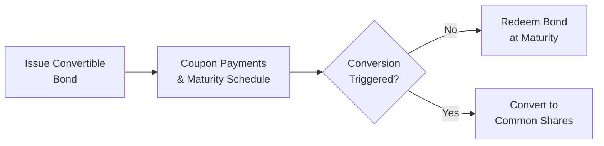

## Introduction and Overview

Convertible debt and other hybrid securities can sometimes feel like the Swiss Army knives of corporate finance. They combine features from both debt and equity, giving issuers and investors multiple angles to manage risk, return, and ownership structure. I remember the first time I discovered convertible bonds when I was analyzing a tech startup that wanted the best of both worlds—access to capital with a relatively low coupon and the possibility of turning that debt into equity if the stock price rose. Of course, that made me go, “Huh, so you’re telling me I don’t have to pick strictly between debt and equity?” Precisely.

Below, we’ll explore the mechanics, advantages, and challenges of these hybrid instruments. We’ll also highlight how they’re relevant under different financial standards and why a thorough understanding of them is crucial in today’s corporate landscape.

## Convertible Bonds

### Structure and Basic Features
A convertible bond is a debt instrument that grants bondholders the right (but not the obligation) to convert their bonds into a predetermined number of common shares. Essentially, you get the coupon payments and principal repayment of a standard bond. But if the issuer’s equity starts soaring, you can convert and share in the growth. It’s a bit like having a plane ticket you can swap for a cruise ticket at any time, if cruises become more appealing.

• Coupon Payments: Just like typical corporate bonds, convertible bonds usually pay periodic coupons.  
• Maturity Value: They have a face (par) value repayable at maturity if not converted.  
• Conversion Ratio: One of the most important details. This ratio indicates the number of shares you receive in exchange for each unit (often $1,000 par value) of the bond.

In KaTeX, we might represent the conversion ratio as:


\text{Conversion Ratio} = \frac{\text{Par Value of the Bond}}{\text{Conversion Price}}


Where the conversion price is the cost per share at which a bond can be converted.

### Conversion Dynamics and Bond Pricing
When a company’s market price rises above the conversion price, it becomes more attractive for investors to convert. The holder can forgo receiving interest and principal repayment in favor of common equity upside and potential capital gains.  

This payoff profile creates an interesting valuation for convertibles:
• They trade like bonds when the share price is well below the conversion price.  
• They trade like stock options (plus some bond-like downside protection) when the share price is above the conversion price.

Here’s a quick informal example: Suppose you hold a convertible bond with a $1,000 face value and a 5% coupon. The conversion ratio is 20 shares per bond. If the stock is trading at $40, your conversion value (20 × $40 = $800) is below par, so you’d likely keep the bond for its scheduled coupon and maturity. If the stock jumps to $60, that same ratio yields a conversion value of $1,200, which now exceeds the $1,000 par. In that case, you might happily convert and ride the equity wave.

### Call Features and Early Redemption
Some convertible bonds are callable, meaning the issuer can redeem them before maturity. If the issuing company thinks its share price is going up and it wants to avoid more dilution, it might call the bonds early to encourage conversion or to refinance under more favorable terms. However, bondholders might feel nudged into converting sooner than they’d like. This interplay between issuer goals and investor incentives is part of the complexity that makes convertible bonds both fascinating and tricky.

### Accounting and Regulatory Considerations
Under IFRS, convertibles are often “bifurcated” into debt and equity components. The portion representing the bond’s liability is recognized separately from the embedded equity option. Under US GAAP, there are nuances—particularly with the beneficial conversion features that might require special accounting adjustments. Whenever you see a convertible issuance, it’s typically wise to check how the prospectus outlines the accounting treatment and any relevant local regulations.

### Visualizing the Convertible Bond Lifecycle
Below is a simple Mermaid diagram illustrating a convertible bond’s path from issuance to conversion or maturity:



## Warrants

### What Are Warrants?
Warrants are long-term options—separate from the pure bond or equity instrument—that give holders the right to purchase a company’s shares at a fixed exercise price until the warrant’s expiration date. They’re often attached to bonds or preferred shares as a “sweetener” to entice investors.

For instance, you might see a bond advertised as “Bond + Warrant.” The warrant coverage might be something like “x number of warrants per $1,000 par value.” This allows investors to receive standard coupon payments from the bond plus a potential upside kicker from the warrants if the stock performs well. The sweetener can help issuers offer a lower coupon compared to a straight bond with no equity feature.

### Warrant vs. Call Option
Ever get them confused? They are similar, but a key difference is that a company typically issues new shares when a warrant is exercised—leading to share dilution for existing shareholders. Meanwhile, an exchange-traded equity call option usually involves existing shares, so the transaction is between two market participants (rather than the issuing company).

## Preferred Shares with Conversion Options

### Structure and Protective Provisions
Preferred shares (often called preference shares) occupy a senior standing over common shares in the event of liquidation, while possibly paying out a stated dividend. When these can be converted into common shares, we get “convertible preferred” shares.  

They may include protective provisions such as:
• Cumulative Dividends: Missed dividends accumulate and must be paid before any common dividend.  
• Redemption Rights: The issuer can (or must) redeem the shares under certain conditions or after a certain period.  

When converted, preferred shareholders might lose some preferential rights but gain common shareholder voting rights and price appreciation potential.

### Example: A Startup’s Perspective
It’s not uncommon to see young companies or startups raising funds via convertible preferred shares. This approach entices venture capitalists with protective rights—like guaranteed dividends or liquidation preferences—yet preserves upside potential if the company’s equity value takes off. Several prominent tech firms began with multiple classes of convertible preferred shares, allowing early backers to reduce risk while still enjoying the excitement when the firm eventually goes public.

## Advantages for Issuers

1. Lower Financing Cost: Because of the embedded equity option or warrant coverage, investors accept a lower coupon (or dividend) than they would on straight debt with equivalent risk.  
2. Delayed (or Conditional) Equity Dilution: The actual issuance of new shares doesn’t occur unless conversion happens, giving the company time before ownership is further diluted.  
3. Attractiveness to Different Investor Segments: Adding a warrant or conversion feature can draw in investors with varied risk/return profiles, widening the capital pool.  
4. Flexible Capital Structure: These instruments add nuance to the capital stack, offering multiple levers (like calls, puts, or conversion triggers) that the issuer can pull to manage future financing decisions.

## Considerations for Investors

1. Balanced Exposure: Investors enjoy fixed-income qualities—like coupon payments or preferred dividends—and equity-like upside if the share price soars.  
2. Complexity: Investing in a convertible bond or convertible preferred share is more involved than buying a straightforward bond or stock. You need to understand conversion ratios, anti-dilution clauses, call features, and more.  
3. Market Conditions: If markets are volatile, the embedded option aspects can become even more valuable. In bullish conditions, convertibles can experience rapid price appreciation. In bearish times, the bond floor can limit downside (though it’s never entirely risk-free).  
4. Dilution Considerations: Conversion typically creates new shares, diluting existing common shareholders. While beneficial to the convertible holder, it may reduce per-share metrics for all shareholders.

## Anti-Dilution and Other Protective Clauses
Hybrid securities often include anti-dilution provisions to protect investors’ conversion ratio if the company issues equity at lower prices in the future. These can take forms like:
• Full Ratchet: The conversion price adjusts to the new, lower issue price in a dilutive equity raise.  
• Weighted-Average: The conversion price is adjusted based on the weighted average of the prices and amounts of new equity issued.  

The key is that such provisions can heavily influence the shareholder structure over time. For people analyzing these deals, it’s crucial to read the fine print.

## Practical Example

Let’s consider a simplified illustration using Python-style pseudocode to calculate the potential conversion value of a convertible bond:

```python
par_value = 1000
conversion_ratio = 25  # 25 shares per bond
current_stock_price = 42.00

conversion_value = conversion_ratio * current_stock_price
bond_value = par_value  # ignoring market price shifts for simplicity

if conversion_value > bond_value:
    decision = "Convert"
else:
    decision = "Hold bond"

print("Conversion Value: ", conversion_value)
print("Decision: ", decision)
```

If the decision is “Convert,” that means the potential equity value from holding the stock now exceeds just keeping the bond for redemption at par.

## Best Practices and Pitfalls

• Always check the “bond indenture” or “preferred share term sheet.” The devil is in the details, especially with conversion triggers, vesting schedules, call/redemption features, and anti-dilution clauses.  
• Look at interest coverage requirements. Adding hybrid securities can still increase financial leverage or complicate the firm’s capital structure.  
• Timing matters. Issuers may call or force conversion at a time potentially beneficial to them but unfavorable to investors.

## Exam Tips and Key Takeaways

• Know your definitions: conversion ratio, conversion price, warrants, anti-dilution—these are bedrock terms for exam questions.  
• Understand the dual nature of convertible securities: They carry debt-like downside protection plus equity upside.  
• Be prepared to handle scenario-based questions involving changes in stock price or interest rates.  
• Practice explaining to a friend how these instruments shift in value when the issuer’s stock price changes—this helps clarify the payoff profile.  
• Check IFRS vs. US GAAP segments for potential differences in how the hybrid components are valued on the balance sheet and in the income statement.

## References and Suggested Reading
• Maitland, T. V. (2021). “Convertible Securities: A Complete Guide to Investment and Corporate Financing Strategies.”  
• Graham, B., & Dodd, D. (1934). “Security Analysis.” (Updated editions available.)  
• Company prospectuses and term sheets (for example, EDGAR filings in the U.S.).  
• CFA Institute Fact Sheets on Hybrid Securities for additional practice questions and case studies.

## Test Your Knowledge: Convertible Debt and Hybrid Securities



### Which statement best describes a convertible bond?

- [x] A debt instrument that can be exchanged for common shares at a predetermined ratio.
- [ ] A short-term note with guaranteed principal repayment.
- [ ] A preferred share that guarantees voting rights.
- [ ] A long-term call option on the issuer’s stock, with no coupon payments.

> **Explanation:** A convertible bond is essentially a bond that includes the right to be converted into common shares, combining features of both debt and equity.

### What typically happens if the stock price remains well below the conversion price of a convertible bond?

- [x] The bond behaves mostly like a fixed-income security.
- [ ] The bond’s holder automatically converts into equity.
- [ ] The issuer must redeem the bond earlier than maturity.
- [ ] The coupon rate decreases automatically.

> **Explanation:** With the stock price staying below conversion value, the conversion feature is “out of the money,” so it’s unlikely to be exercised, and the security behaves more like a traditional bond.

### One advantage for the issuer of using convertible bonds rather than straight bonds is:

- [x] Lower coupon rates due to the embedded equity upside offered to investors.
- [ ] Immediate dilution of the ownership base.
- [ ] Freedom from any coupon or interest obligations.
- [ ] Exemption from regulatory disclosures.

> **Explanation:** Convertible bonds typically allow issuers to offer a lower coupon than a comparable non-convertible bond. The potential for future equity conversion compensates investors.

### What is a warrant in the context of hybrid securities?

- [x] A long-term option granted by the issuer that allows the holder to buy shares at a specified price.
- [ ] A legal document for forced company liquidation.
- [ ] A type of bond with a floating rate coupon.
- [ ] A derivative designed solely to hedge interest rate risk.

> **Explanation:** Warrants provide an option (often attached to another security) to purchase shares from the issuing company at a predetermined price.

### Which of the following anti-dilution provisions adjusts an investor’s conversion price based on the weighted average of new share prices and amounts issued?

- [x] Weighted-average anti-dilution.
- [ ] Full ratchet anti-dilution.
- [ ] Participating preferred.
- [ ] Forced conversion clause.

> **Explanation:** Weighted-average anti-dilution recalculates the conversion price proportionally based on both the number of new shares issued and their issue price.

### A defining characteristic of convertible preferred shares is:

- [x] They can be exchanged for common shares at a predetermined ratio.
- [ ] They automatically convert after each common dividend.
- [ ] They carry no liquidation preference.
- [ ] They cannot pay dividends.

> **Explanation:** Convertible preferred shares give the holder the option to convert to common stock, while retaining typical preferred share features, like dividends and liquidation preference before conversion.

### Under IFRS, convertible bonds may be split into:

- [x] A debt component and an equity component.
- [ ] An intangible asset and a free cash flow item.
- [ ] A deferred tax asset and a derivative liability only.
- [ ] A single equity instrument on the balance sheet.

> **Explanation:** IFRS requires separate accounting for the liability and the embedded equity option within a convertible bond.

### Call features in a convertible bond primarily allow the issuer to:

- [x] Redeem the bond before maturity, often prompting investors to convert.
- [ ] Force the bondholder to accept a lower coupon rate.
- [ ] Issue additional common shares through the bond contract.
- [ ] Avoid paying coupons for as long as the issuer wants.

> **Explanation:** A call feature lets the issuer redeem the bond prior to maturity, which can effectively force conversion if the issuer believes the share price will likely rise further or if it wants to control dilution timing.

### Which is true of warrant coverage?

- [x] It describes how many warrants are included per bond or preferred share issued.
- [ ] It guarantees a minimum dividend.
- [ ] It caps the upside potential for warrant holders.
- [ ] It automatically resets the coupon rate.

> **Explanation:** Warrant coverage indicates the ratio or number of warrants attached per security issued, giving holders the right to purchase additional shares down the road.

### Converting a convertible bond to equity generally leads to which of the following?

- [x] Dilution of existing shareholders’ ownership percentage.
- [ ] Cancellation of all the issuer’s debt.
- [ ] Increase in the bond’s yield.
- [ ] Elimination of the equity portion of the firm.

> **Explanation:** When bondholders convert to equity, new shares are created, thus diluting existing shareholders’ stakes.


