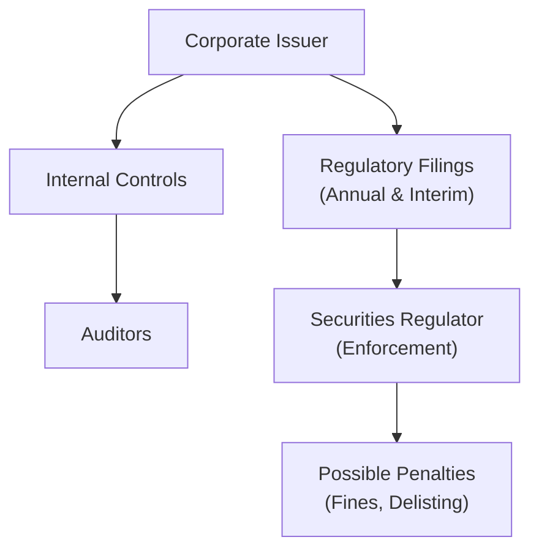

## Introduction
Have you ever been caught off-guard when your favorite public company shares some massive news—like a big acquisition—out of nowhere? Well, chances are they didn’t just casually decide to reveal it. Corporate issuers must comply with numerous legal requirements that govern how and when these announcements are made. In fact, staying on the right side of compliance often shapes the very cadence of corporate disclosures and corporate governance practices. Even if it sounds like the driest aspect of running a company, trust me, ignoring it can land executives—and the company—in a world of trouble. For those preparing for the CFA exams, especially if you’re new to these topics, keep reading. You’ll see how statutory filings, securities laws, and best practices all seamlessly weave into the tapestry of modern corporate finance and governance.

## Why Legal and Compliance Requirements Matter
I like to think of legal compliance as that well-worn umbrella that companies carry around: you may not always need it in clear weather, but once the storm of regulatory scrutiny arrives, you’ll be so glad it’s right there in your hand. For corporate issuers, compliance:

• Protects investors by ensuring the availability of accurate, complete, and timely information.  
• Reduces the cost of capital by building trust and reducing perceived risk.  
• Helps maintain market integrity, so you’re not left guessing if a stock price moved due to hush-hush inside information.  

Companies ignoring these rules might face painful fines or watch their stock get delisted. Worse still, offending executives can even land themselves in prison. Let’s dig into what corporate issuers actually have to do to avoid these worst-case scenarios.

## Key Regulations and Filings
One of the primary frameworks that companies rely on for structuring disclosures is securities law. In the United States, the marquee laws are the Securities Act of 1933 and the Securities Exchange Act of 1934. Meanwhile, other jurisdictions—from the UK’s FCA (Financial Conduct Authority) rules to the European Union’s Market Abuse Regulation (MAR)—offer parallel guidelines.

• Statutory Requirements: Most countries require companies to file annual (often called “10-K” in the US) and interim (e.g., “10-Q” in the US) reports, as well as immediate disclosures of material events. Material events are those that a reasonable investor would consider important for making investment decisions.  
• Securities Act of 1933: Focuses primarily on the issuance of new securities, ensuring that investors receive essential financial and other key information about securities being offered.  
• Securities Exchange Act of 1934: Governs the secondary trading of securities (think stock exchanges) and establishes the SEC (Securities and Exchange Commission) in the US. Listed companies must register under this act, making them subject to continuous reporting obligations.  

If you’re more of an IFRS-wizard or a US GAAP-champion, note that these frameworks are crucial for how financial statements get prepared and disclosed. But the securities laws stand on top of these accounting frameworks to ensure you’re not only following recognized standards but also ensuring timely filings and disclosures.

## Timely Disclosure Requirements
So what does “timely” disclosure even mean? Ah, that’s the million-dollar question. Or, well, potentially more if you procrastinate on your news releases.

Companies are usually required to make prompt disclosures of events such as:  
• Public offerings of stock or bonds.  
• Major acquisitions or divestitures.  
• Changes in top executive leadership.  
• Material impairments, legal proceedings, or major product launches/failures.  

I remember once hearing an executive half-joke that you need a stopwatch for these announcements—it can feel that intense. In reality, the practice is driven by “materiality”—if a fact might sway an investor’s decision, you must promptly notify the market, ensuring equal access to information for all.

## Corporate Governance and Internal Controls
Now, let’s talk about life post-Sarbanes-Oxley (SOX). SOX introduced more stringent internal controls and personal accountability for executives, particularly in the US. Section 404 requires management and auditors to assess and report on the effectiveness of a company’s internal controls over financial reporting. For instance, CFOs and CEOs have to personally certify the accuracy of financial statements, which suggests, “Hey, if the statements are intentionally misleading, we might be personally liable.” That’s enough to give any CFO a bit of insomnia.

Good internal controls go beyond ticking compliance boxes. Effective checks and balances will help a company mitigate fraud risk, ensure accurate financials, and maintain investor confidence. All these tie neatly into overall corporate governance, which typically includes the board of directors overseeing management’s actions, compensation practices, and the code of ethics guiding day-to-day operations. In Chapter 3 (Corporate Governance: Conflicts, Mechanisms, and Risks), you’ll see how boards, committees, and compensation structures integrate with these compliance responsibilities.

## The Role of Regulators
In many jurisdictions, a national securities commission (like the SEC in the US or the FCA in the UK) is charged with enforcing rules and protecting investors. These regulators:

• Review corporate filings and can issue comment letters requesting clarifications.  
• Investigate suspicious trading activity, especially around major announcements.  
• Impose penalties or other enforcement actions for non-compliance, such as fines or even an outright trading suspension.  

Stock exchanges also maintain their own listing requirements. For example, the New York Stock Exchange (NYSE) might mandate certain board composition standards (like having a majority of independent directors) and timely disclosure of corporate events. While these listing rules might not carry the force of law in the same sense as legislation, a company ignoring them can be delisted—an outcome that can be devastating for investor access and the firm’s reputation.

Below is a simple diagram showing how regulators, corporate issuers, and external auditors interact within the compliance process:

## Penalties for Non-Compliance
So what happens if a corporate issuer decides to play fast and loose with disclosure rules or internal controls? Penalties can range from mild to catastrophic:

• Fines or Penalties: Regulators can levy large monetary fines.  
• Private Lawsuits: Investors often file lawsuits alleging misleading disclosures or accounting fraud.  
• Delisting: Exchanges can delist a company, removing its access to public capital markets.  
• Criminal Prosecution: In egregious cases—think willful fraud—executives can face criminal charges.  

Not only does this damage the company’s access to capital, but it also slaps a big question mark on its reputation. And in finance, once your credibility is shot, just about everything else can unravel quickly.

## Examples and Practical Perspectives
Sometimes it helps to see how these requirements play out in real life:

• Enron Scandal (2001): Famously led to SOX legislation. Their use of off-balance sheet special purpose entities and misleading disclosures triggered massive investor fallout.  
• Tesco Accounting Scandal (2014): The UK supermarket giant overstated its profits. Regulatory bodies imposed fines, and the reputational damage lingered for years.  
• Volkswagen Diesel Emissions (2015): While it initially appeared more like a product compliance issue, the scandal’s effect on financial disclosures was significant. Ultimately, VW had to restate costs and face multiple investigations.

In each case, you see how ignoring or concealing material facts eventually blew up in the companies’ faces. And boy was it painful—both financially and reputationally.

## Best Practices and Pitfalls
• Maintain Clear Internal Reporting Lines: Encourage employees to speak up about suspicious transactions or odd balance-sheet maneuvers.  
• Implement Robust Controls: Even if it feels like a headache, strong internal controls reduce the chance of “accidental” compliance failures.  
• Train Often: Make sure everyone from top executives to junior staff understands materiality thresholds and the importance of prompt disclosure.  
• Avoid Overconfidence: Sometimes executives believe their brand immunity is enough to stave off regulators. It usually isn’t.

## Personal Anecdote
I once worked with a public company’s finance division—this was back when I was fresh out of school. They were acquiring a smaller technology startup, and everything seemed straightforward. Suddenly, the day before the acquisition was to be announced, a few engineers discovered some major patent issues that could kill the deal’s entire value proposition. We scrambled, going from “Let’s finalize the deal tomorrow” to “We must file an 8-K stating we’ll be delaying the transaction to complete additional due diligence.” It wasn’t exactly a fun day in the finance team, but we did the right thing by being transparent. The market reacted with a slight dip in our share price, sure, but because we complied quickly and openly, we avoided regulatory wrath and gained the trust of the investor community.

## Touchpoints with Other Chapters
• Chapter 1.2 (Public vs. Private Companies): Public companies have more rigorous and frequent disclosure requirements compared to private ones.  
• Chapter 3 (Corporate Governance Mechanisms): Effective governance structures, such as well-constituted boards and independent audit committees, anchor compliance.  
• Chapter 9 (Restructuring and M&A): Major changes in corporate structure—especially acquisitions—trigger mandatory filings and disclosures.

## Glossary
• Materiality: The significance of information’s impact on an investor’s decision-making process.  
• Internal Controls: Processes to ensure accuracy and reliability in financial reporting, compliance, and operations.  
• Sarbanes-Oxley (SOX): U.S. legislation enacted to improve corporate governance and strengthen audit oversight.  
• Listing Requirements: Rules and standards companies must follow to maintain a listing on a securities exchange.

## References and Further Reading
• “Sarbanes-Oxley For Dummies” by Jill Gilbert Welytok is a surprisingly digestible overview of SOX.  
• The SEC’s Official Site: [https://www.sec.gov/](https://www.sec.gov/) for current rule proposals and enforcement actions.  
• “Corporate Governance: Principles, Policies, and Practices” by A. C. Fernando—great for an international perspective on regulations and compliance.  

## Final Exam Tips
• Know the Key Filings: Distinguish between the roles of annual vs. interim vs. event-driven disclosures.  
• Understand Enforcement Mechanisms: Connect the dots between what a regulatory body does (like the SEC) and how that influences a company’s day-to-day compliance.  
• Remember Materiality: Expect a question or scenario about whether or not something is “material.” If it’s likely to impact investment decisions, it’s material.  
• Tie Corporate Governance to Compliance: Board oversight and internal controls show up across multiple areas of the CFA curriculum, from risk management to ethics.  
• Keep Real Cases in Mind: On the exam, you might see a scenario mimicking a real-world scandal (though disguised). If a major restatement or undisclosed event is hinted at, figure out the compliance breach.

And always remember: timely, accurate, and complete reporting is at the heart of a well-functioning market. That same principle underpins everything you’ll study in corporate finance, from capital structure to working capital policy. Now let’s see how prepared you are—give the following questions a whirl.

## Test Your Knowledge: Legal and Compliance Essentials Quiz



### A company has just discovered a major error in its most recent financial statements. Under standard regulatory requirements, which of the following actions is most appropriate?

- [ ] Re-file only if the error is material to creditors.  
- [x] Promptly correct and re-disclose if the error is material to investors.  
- [ ] Wait until next year’s filing to address it.  
- [ ] Report to regulators but not to shareholders.  

> **Explanation:** The key consideration is materiality to investors. If the error is material, a prompt correction and re-disclosure are required by most regulatory bodies.

### Which of the following best describes the role of national securities commissions (e.g., the SEC in the U.S.)?

- [x] They oversee compliance, enforce securities laws, and protect investors.  
- [ ] They set accounting standards like IFRS and US GAAP.  
- [ ] They write financial statements for corporations.  
- [ ] They only prosecute criminal cases of insider trading.  

> **Explanation:** National securities commissions enforce laws, ensure disclosures are adequate, and protect investors. They do not develop accounting standards but rather enforce the proper application of existing standards.

### Under Sarbanes-Oxley (SOX), which of the following is required?

- [x] CEOs and CFOs must certify the accuracy of financial statements.  
- [ ] Employees must hold company stock for at least one year.  
- [ ] Annual revenue must exceed $10 million to comply.  
- [ ] Corporate boards must be composed entirely of outsiders.  

> **Explanation:** SOX places accountability on top executives who must certify that financial statements are fair and not misleading. Other options provided here are not SOX requirements.

### A firm is planning a merger that will significantly affect its capital structure. Which of the following statements about disclosure is most accurate?

- [ ] The firm can publicly disclose the merger plans only after the deal closes.  
- [x] The firm should disclose material developments of the merger as they emerge.  
- [ ] No disclosure is required for mergers.  
- [ ] Disclosure should wait until an official press conference.  

> **Explanation:** Material transactions like mergers typically require timely updates to investors as key facts become available.

### What is a possible outcome if a public company fails to meet stock exchange listing requirements?

- [x] Delisting from the exchange.  
- [ ] Criminal convictions for all board members.  
- [x] Increased cost of capital.  
- [ ] Automatic reorganization under bankruptcy laws.  

> **Explanation:** The primary enforcement mechanism for an exchange is delisting. Companies that are delisted may also face higher financing costs due to damaged reputation.

### Which of the following statements regarding “materiality” is correct?

- [x] Information is material if it significantly impacts an investor’s decision.  
- [ ] Materiality is only determined by the auditor.  
- [ ] Materiality is determined solely by company management.  
- [ ] Materiality pertains only to stock options and incentive plans.  

> **Explanation:** Materiality centers on whether the information would affect the decision-making process of a reasonable investor.

### Which of the following best describes internal controls in a corporate issuer setting?

- [x] Procedures designed to ensure accurate financial reporting, legal compliance, and operational efficiency.  
- [ ] Processes implemented by regulators to enforce compliance.  
- [x] Mechanisms for identifying and reporting fraudulent activities before they appear in filings.  
- [ ] Only applicable to large-cap organizations.  

> **Explanation:** Internal controls are company-led processes. They help maintain reliable financial reporting and compliance. Although typically more robust in larger organizations, the principles apply to all issuers.

### Under U.S. securities law, which statement is true regarding interim filings (e.g., 10-Q)?

- [x] Companies must disclose key financials and developments on a quarterly basis.  
- [ ] These filings are voluntary and left to the discretion of management.  
- [ ] They only need to be prepared at the fiscal year-end.  
- [ ] They are not subject to review by auditors.  

> **Explanation:** U.S. publicly traded companies generally must file quarterly reports (10-Q) with updated financial results, allowing investors to track performance throughout the year.

### When a new security is offered publicly, which legislation primarily governs the issuance process in the United States?

- [x] The Securities Act of 1933.  
- [ ] The Securities Exchange Act of 1934.  
- [ ] The Sarbanes-Oxley Act of 2002.  
- [ ] The Investment Company Act of 1940.  

> **Explanation:** The Securities Act of 1933 regulates the initial issuance of new securities to ensure investors receive adequate disclosure before purchasing newly issued securities.

### In many jurisdictions, timely disclosure of material events is critical. Which of the following statements is true?

- [x] True  
- [ ] False  

> **Explanation:** Regulators mandate prompt market disclosure for material events to maintain a fair and orderly market and to protect investors from information asymmetry.


