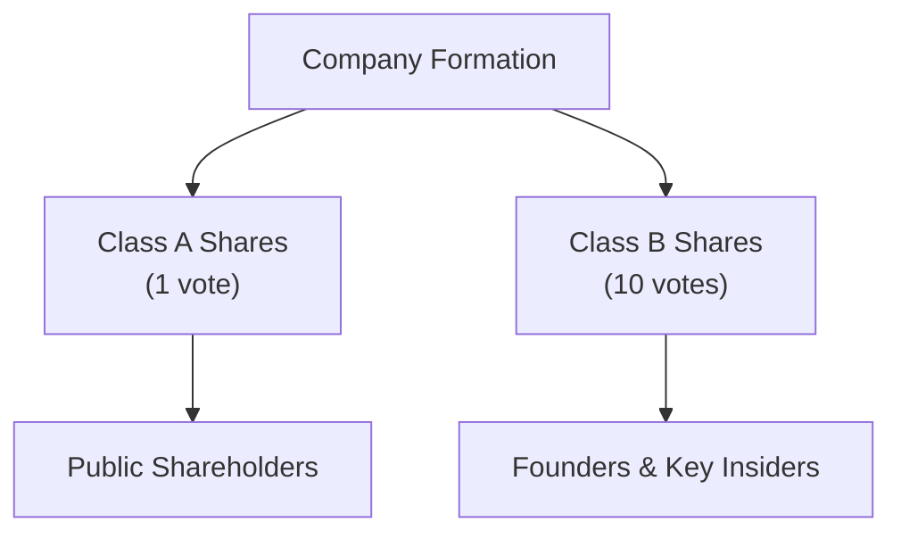

## Introduction
Dual-class share structures can sometimes feel like an intimidating topic—especially the first time you see that a single share might carry 10 votes while another class carries just 1. You might wonder: “Is that fair?” or “How does that even happen?” But dual-class share structures are actually a pretty common feature in modern capital markets. They allow founders or major stakeholders to maintain strategic control, even while issuing shares to the public. Some companies, especially tech giants, rely on this structure to preserve their vision even when external shareholders own a large slice of the economic interest.

At its core, a dual-class share setup means there are at least two different share classes with distinct voting rights. One class often wields “high-vote” shares (commonly 10 votes per share), and the other class consists of “low-vote” or “limited-vote” shares. For our Corporate Issuers curriculum, dual-class shares tie in closely with corporate governance, investor protection, and the overall control environment of an organization. Let’s explore the rationale, concerns, regulatory context, and typical design of these structures with a slightly personal and informal lens.

## Definition and Key Characteristics
When we say “dual-class share,” we’re talking about a setup in which a single company issues more than one class of common stock, each with differing rights. Typically, founders or top executives hold a class with higher voting power, while the broader investor base holds a class with lower voting power.

• High-Vote Shares – Sometimes also called super-voting shares. They might carry 5, 10, or even 20 votes per share. Founders or insiders usually keep these to ensure decisive control over key corporate decisions.  
• Low-Vote Shares – Held by retail or institutional investors that can trade these shares more freely on public exchanges. These shares usually carry fewer votes (often just 1 vote or even fractions of a vote).  

For better or worse, this arrangement means the real muscle behind corporate decisions, like electing directors or approving strategic transactions, stays in the hands of those holding the high-vote shares. This concept intersects with “Share Classes and Voting Rights” (see Chapter 1.4) and can bring about unique agency issues and conflicts with minority shareholders (discussed further in Chapter 2).

## Rationale and Motivations
You might be wondering, “Why would a company even want to give such a big advantage to a certain class of shareholders?” The short answer is that companies—especially founder-driven ones—often want to raise capital without ceding total control to outsiders.

• Founder Control: Founders or early visionaries may believe they have a long-term perspective that short-term market participants lack. By structuring shares so that the founders keep disproportionate voting rights, the founding team retains a clear voice in corporate direction.  
• Strategic Vision: Some leaders argue that dual-class shares let them maintain consistent strategies even under intense short-term profit pressures. Tech companies, in particular, often rely on big R&D spending with slower payoffs.  
• Corporate Culture Preservation: For some organizations, the culture is everything—think of mission-driven firms. Maintaining concentrated voting power at the top can help keep the original mission intact.  

I once analyzed a mid-sized software company that launched an IPO with a dual-class structure because its CEO was convinced that outsider shareholders would push for quarterly performance over crucial five- to ten-year innovation cycles. While critics found that stance a bit paternalistic, the CEO believed deeply in it, and he didn’t want near-term profit chasing to derail the brand’s big dreams.

## Concerns and Criticisms
Although dual-class share structures have legitimate strategic advantages, they do not come without controversy:

• Entrenchment Risk: This might be the biggest concern. Management or founder groups with high-vote stock can remain in power even if performance lags. In extreme cases, a poorly performing CEO could keep controlling votes and thus remain immune to shareholder revolts.  
• Reduced Accountability: If most shareholders only have low-vote stock, boards may be less responsive to their concerns. This can result in a weaker governance environment, potentially hurting minority shareholder protections.  
• Corporate Governance Ratings: Governance rating agencies typically penalize companies with dual-class shares, citing heightened risk of conflict and fewer checks on executive authority.  

Market participants worry that the two-tier system undermines the principle of “one share, one vote” by giving some individuals substantial voting rights disproportionate to their economic interests. Sections in Chapter 2 (“Minority Shareholder Rights and Protections”) and Chapter 3 (“Corporate Governance: Conflicts, Mechanisms, and Risks”) delve deeper into these governance issues, especially the effect on minority shareholders and potential agency costs.

## Regulatory Landscape
Securities regulators worldwide have debated for years whether to permit, discourage, or partially restrict dual-class share structures. You’ll find a variety of approaches:

• Stock Exchange Restrictions: Some markets, like certain European exchanges, restrict or heavily regulate the listing of dual-class shares. Meanwhile, the Hong Kong Stock Exchange introduced a structure allowing “Weighted Voting Rights,” partly to encourage big tech listings.  
• Disclosure Requirements: While dual-class shares aren’t universally banned in the United States, the Securities and Exchange Commission (SEC) mandates a high level of disclosure regarding the voting structure so that potential investors are fully aware before buying.  
• Sunset Provisions: In many jurisdictions—especially those that want to strike a balance—dual-class structures must contain “sunset clauses” that automatically convert high-vote shares into ordinary shares once certain conditions are met (like the departure of a founder or the passage of a fixed period).  

Interestingly, IFRS vs. US GAAP differences typically don’t revolve around share class voting rights per se, but the classification of shares as equity or liabilities might come into play (see Chapter 1.10 for more on regulatory and strategic reporting considerations). The broader debate is how to protect investors while fostering entrepreneurial freedom.

## Real-World Examples
Some large and well-known companies illustrate the spectrum of dual-class share structures:

• Meta (formerly Facebook): Mark Zuckerberg’s super-voting Class B shares allow him to exercise significant control over strategic direction, acquisitions, and board composition.  
• Alphabet (Google): Co-founders Larry Page and Sergey Brin have historically held super-voting shares, ensuring they maintained decision-making power even as Google expanded globally.  
• Snap Inc.: Snap famously debuted with non-voting shares for public shareholders, which was a particularly extreme version, sparking widespread debates on investor protection.  

I remember reading Snap’s IPO prospectus and thinking, “Wow, they basically took away the standard notion of shareholder voting.” And sure enough, many institutional investors criticized the setup. However, from Snap’s perspective, the structure let the founders focus on innovation without worrying about a sudden activist investor movement.

## Sunset Provisions and Evolving Best Practices
To address criticisms, some companies and regulatory bodies have introduced or encouraged the use of sunset provisions. These provisions work like a timer. After a fixed period—for example, seven years after the IPO—high-vote stock may automatically convert into normal voting stock. Alternatively, a sunset can be triggered when the founder steps down as CEO or if total ownership by insiders dips below a certain threshold.

Proponents argue that sunsets strike a balance: they give founders breathing room to execute a long-term vision, but eventually, accountability reverts closer to a conventional shareholder democracy. Opponents say that even a short or moderate window can do real damage if management acts poorly or if the initial business plan fails yet the insiders remain at the helm.

## Glossary
High-Vote Shares  
Shares with multiple votes per share, often retained by founders or key insiders, allowing them to exert greater control despite holding a smaller portion of the total shares outstanding.

Low-Vote Shares  
Shares afforded fewer voting rights. Typically held by the general public or institutional investors, they represent the more tradable class in the marketplace.

Entrenchment  
A phenomenon where existing management or founders stay in control due to superior voting power, even if operational or financial performance is weak.

Sunset Provision  
A clause that ends dual-class voting structures after a predetermined timeframe or upon a specific event, such as a founder’s departure.

## Best Practices and Pitfalls
Whether you’re analyzing a company for potential investment or advising a client on corporate governance standards, keep these considerations in mind:

• Thorough Disclosure: Dual-class structures require transparent and complete disclosure so investors can properly evaluate the governance risks.  
• Shareholder Engagement: Even if the founders hold super-voting rights, investor relations can’t be overlooked. Sustained communication helps mitigate tension that might arise from skewed voting power.  
• Alignment with Long-Term Goals: Sometimes dual-class shares really do enhance stability and vision, but they can also breed complacency if there’s little accountability. Monitoring board independence and committees (see Chapter 3.8 on Board Committees) remains crucial.  
• Watch for Triggers: If there is a sunset provision, investors should keep an eye on any triggers (time-based or event-based) that might shift the power structure unexpectedly.

## Conclusion and Exam Tips
Dual-class share structures are a prime example of how corporate issuers balance capital-raising needs with control considerations. While undeniably beneficial for preserving a founder’s vision or maintaining corporate culture, they pose serious risks related to entrenchment, governance oversight, and minority shareholder protection.

From the perspective of the CFA exam and your future roles in capital markets, focus on how these structures can affect valuation, corporate performance, and shareholder rights. You may see scenario-based questions that ask you to identify potential agency conflicts, evaluate the governance ramifications, or judge how the market likely views a new issuance of super-voting shares.

A few exam tips:
• Be prepared to analyze how dual-class shares impact cost of capital, since governance quality can influence a firm’s risk profile.  
• Understand how to weigh the trade-offs between preserving entrepreneurial leadership and safeguarding minority investors.  
• Be mindful of the role of the board and whether external directors can rebalance potential power imbalances.

## References
• OECD Corporate Governance Factbook (https://www.oecd.org/corporate/) – for an in-depth international perspective.  
• “The Uprising of Dual-Class Shares: A Global Review” – CFA Institute Research Foundation.  
• Filings from tech companies such as Alphabet (Google) and Meta (Facebook), which are often cited as pioneering adopters of dual-class structures.  

## Visual Overview of Dual-Class Shares

Below is a simple Mermaid diagram showing how two share classes might be structured. Founders or insiders keep super-voting (Class B), while the public holds Class A with fewer votes:

The result: Founders with Class B can make strategic decisions, while the public invests with lesser voting power but retains economic interest in the firm’s success.

---

## Test Your Knowledge: Dual-Class Share Structures Quiz



### Which of the following best describes the core rationale behind adopting a dual-class share structure?

- [ ] To reduce the cost of capital by distributing voting rights evenly among shareholders.
- [x] To retain concentrated voting control by founders or key insiders while raising equity capital.
- [ ] To eliminate board-level oversight in favor of management authority.
- [ ] To automatically allocate dividends to high-vote shares at a higher rate.

> **Explanation:** The primary motivation is to ensure founders or senior executives maintain voting control (strategic direction) while still accessing public capital markets.  

### A key concern about dual-class share structures is:

- [ ] Enhanced minority shareholder rights.
- [x] Potential entrenchment of management and reduced accountability.
- [ ] Shortened time horizon for managers.
- [ ] Accelerated compliance with corporate governance codes.

> **Explanation:** Dual-class structures can allow founders or insiders to remain in control, even if performance is suboptimal, risking weaker accountability.  

### Which of the following is an important mechanism to mitigate negative effects of a dual-class structure?

- [x] Sunset provisions that convert high-vote shares into normal voting shares after a period.
- [ ] Mandatory share buybacks at a premium price.
- [ ] Granting no voting rights to any shareholders.
- [ ] Abolishing the board of directors in favor of direct management oversight.

> **Explanation:** Sunset clauses prevent indefinite imbalances in voting power and help ensure accountability in the longer term.  

### How do high-vote shares typically affect corporate governance?

- [x] They can concentrate decision-making power in the hands of founders or insiders.
- [ ] They distribute power equally among all shareholders.
- [ ] They automatically create an activist investor base.
- [ ] They focus the board’s power on external directors.

> **Explanation:** High-vote shares give certain parties disproportionate control, shaping governance in favor of insiders.  

### An institutional investor analyzing a dual-class company would likely pay extra attention to:

- [x] The company’s track record of aligning founder interests with minority shareholders.
- [ ] The established Federal Reserve interest rate levels.
- [x] The presence of any sunset provisions.
- [ ] The daily closing price for gold futures.

> **Explanation:** Institutional investors focus on governance alignment (are minority shareholders protected?) and whether or when high-vote shares expire.  

### Which of the following statements is FALSE regarding dual-class share structures?

- [x] Dual-class shares always remain in effect indefinitely with no possibility of change.
- [ ] Regulatory bodies in some jurisdictions impose limits or special disclosure around dual-class offerings.
- [ ] Dual-class shares typically grant founders or insiders super voting power.
- [ ] Some exchanges restrict listing for firms with dual-class share structures.

> **Explanation:** Many dual-class frameworks incorporate sunset provisions or conversions, so it’s incorrect to say they “always remain in effect indefinitely.”  

### A dual-class share setup might attract criticism primarily because:

- [x] It may shield management from active shareholder oversight.
- [ ] It prevents any debt issuance by the company.
- [x] It can reduce minority shareholder influence.
- [ ] It always increases stock volatility.

> **Explanation:** Critics argue that entrenchment and limited minority shareholder rights are central issues.  

### Why might tech firms in particular prefer dual-class shares?

- [x] They can protect founders’ long-term innovation strategies from short-term market pressure.
- [ ] They want to align short-term management compensation with short-term investor returns.
- [ ] They plan to delist in the next three months.
- [ ] They want to avoid any regulation.

> **Explanation:** Tech companies often plan for extended R&D cycles, so dual-class shares prevent stakeholders focused on quarterly performance from forcing policy shifts.  

### In capital structure analysis, how might dual-class shares influence WACC?

- [x] If governance risk is perceived to be high, the cost of equity may rise, thereby increasing WACC.
- [ ] Dual-class shares have no impact on investor perceptions or required returns.
- [ ] They reduce the cost of debt to zero.
- [ ] They eliminate equity from the WACC calculation altogether.

> **Explanation:** Investors may view poor governance oversight as risky, raising the firm’s cost of equity. That can lead to an overall higher weighted-average cost of capital.  

### True or False: In some cases, dual-class share structures automatically convert to a single class if a founder steps down as CEO.

- [x] True
- [ ] False

> **Explanation:** So-called “sunset” provisions often specify an event—like a founder’s departure—that triggers conversion of high-vote shares to standard voting shares.


