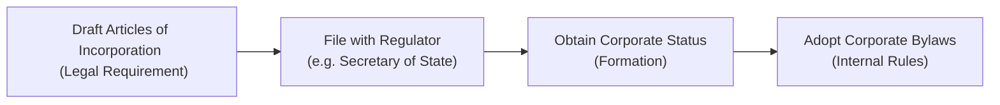

## Introduction

Whether you’re preparing to start a new corporation or just curious about how companies keep themselves organized, corporate bylaws and articles of incorporation lie at the heart of this discussion. They’re the legal pillars that define a firm’s existence, establishing everything from how many shares of stock it can issue to how the board of directors is supposed to vote. If you’re aiming to understand a company’s identity and operations, you have to look at these documents. They’re like a company’s DNA—one part is recorded as a public, foundational blueprint (the articles of incorporation), and the other part sets out the finer details, like day-to-day operating rules (the bylaws).

Anyway, let’s jump right in and see what these documents are all about, how they intertwine with each other, and why paying attention to them is essential for strong corporate governance. You’ll see references to concepts explained throughout this Volume, like share classes (Section 1.4), voting rights (Section 1.4), or stakeholder conflicts (Chapter 2), and how they show up in these foundational documents.

## Corporate Bylaws

Bylaws are basically the internal operating manual of a corporation. I recall once helping a friend draft bylaws for a small startup, and it was eye-opening to see how explicit (and sometimes tedious) everything needed to be. These rules describe how the company will be governed on a regular basis and typically address questions like:

• How often does the board of directors meet, and what is the process for calling these meetings?  
• Who are the corporate officers (e.g., CEO, CFO), and what do they do?  
• What is the quorum required for a corporate meeting?  
• How are directors elected—or removed?  
• What are the voting procedures for shareholders and directors?  

In other words, if the articles of incorporation define the corporation’s broader legal identity (like an architect’s blueprint for a building), then bylaws are the building’s internal policies, such as what time the doors lock at night, who cleans the offices, and how you handle disputes between tenants.

Most jurisdictions do not require bylaws to be filed publicly, so they’re often more flexible to amend. The corporation’s board of directors generally has more immediate power to update them—something that can be crucial for addressing evolving regulatory requirements or business strategies. Some corporations grant the power to amend bylaws to the shareholders alone; in many cases, both the board and shareholders can do it. The specifics usually appear in the bylaws themselves or in local corporate statutes.

### Key Features of Bylaws

• Decision-Making Protocols: Bylaws specify majorities or supermajorities needed to pass ordinary or extraordinary resolutions.  
• Meeting Logistics: How to call a meeting, notice periods, required quorum, and voting mechanisms.  
• Officer Roles: Defines which corporate officers exist (e.g., President, VP, Secretary, Treasurer) and outlines each person’s responsibilities.  
• Dispute Resolution: Particularly in smaller corporations, the bylaws can outline how to handle a board stalemate or a disagreement among shareholders.  

Bylaws should align with the articles of incorporation, obviously, but they typically offer far more detail. For example, if your articles mention that you have two classes of common stock, your bylaws might specify *how* each class participates in shareholder meetings or what special voting rights they have.

## Articles of Incorporation

Articles of incorporation (sometimes called a “charter” or “certificate of incorporation”) are the corporation’s formal, foundational paperwork—like the official birth certificate of the company. In many jurisdictions (for instance, under Delaware General Corporation Law in the United States), you file these with a state authority or similar regulatory body. Upon acceptance, your corporation is legally recognized. This is the document that typically includes:

• Official Corporate Name: Uniquely identifying the company.  
• Business Purpose: Usually broadly stated, giving the corporation wide latitude.  
• Registered Agent: The individual or service authorized to receive official legal and tax documents on the company’s behalf.  
• Share Structure: How many shares the corporation can issue in total and how many of each class or series.  
• Incorporators or Initial Board of Directors: Tends to state who is forming the corporation and sometimes names the initial directors.  

Where bylaws are an internal set of policies, articles of incorporation are externally facing. They form the bedrock of your corporate identity. They also serve as the reference for many statutory obligations: for instance, if you fail to maintain a registered agent, the state might revoke or dissolve your corporation.

### Typical Contents

• Name and Principal Place of Business: Must often comply with naming conventions (e.g., including “Inc.” or “Corp.”).  
• Duration of the Corporation: Some jurisdictions require you to state whether the corporation is perpetual or limited in time.  
• Capitalization: The classes of stock, par value (if any), and total authorized shares.  
• Purpose Clause: Often just states “To engage in any lawful activity,” though some older charters specify a narrower scope of business.  

While the articles of incorporation or charter might look straightforward, it’s a big deal to change them. Usually, you need shareholder approval—often a supermajority—and sometimes additional regulatory processes. This means it’s important to think carefully about these details from the get-go because they aren’t as easily altered as the bylaws.

## Relationship between Articles and Bylaws

It might help to visualize the relationship between these two documents:

• The articles of incorporation define the corporation’s existence.  
• The bylaws refine how the corporation is managed day to day.  

Think of it like: no bylaws can override anything in the articles of incorporation. If there’s a conflict between the two, typically the articles take precedence because they’re the higher-level, legally recognized framework.

Meanwhile, the articles also anchor the corporation to certain statutory requirements. Let’s say you want to create special voting rights for a particular series of shares—like giving them 10 votes per share. That often must be stated in the articles of incorporation. Your bylaws wouldn’t be enough, because if your articles say all shares have only one vote each, the bylaws can’t just say otherwise. In the context of dual-class share structures (Section 1.8), the articles will typically lay out how many votes each class of shares has, while the bylaws might spell out the procedural rules for those classes’ specific election processes.

Below is a short mermaid diagram summarizing the typical sequence of forming a corporation, from drafting the articles to adopting the bylaws:

## Amendments and Revisions

### Amending Bylaws

In many jurisdictions, bylaws are seen as flexible venture documents. The board of directors often holds the power to revise these rules (subject to local laws and to the articles of incorporation). Sometimes the shareholders have exclusive authority, or a combination of both. The impetus behind flexible bylaws is that corporate boards need the ability to adapt quickly—especially in dynamic markets or under shifting regulatory conditions—without waiting for a formal, large-scale shareholder meeting, if that’s not required.

### Amending Articles of Incorporation

Articles of incorporation, on the other hand, typically require a formal special resolution by the shareholders, sometimes by a supermajority (e.g., two-thirds or three-fourths). If you’re going to do something like increase authorized share capital or create a whole new class of shares, you’d have to bring all the relevant stakeholders on board. Depending on your jurisdiction, you may also need to re-file with the governmental authority or pay additional filing fees, culminating in updated articles that must be officially recorded.

Some corporate governance frameworks (such as those in the UK or Canada) have additional layers of regulatory oversight that can require a shareholder vote plus a court order for certain significant changes. For large, publicly traded organizations, any major revision is typically reported to regulators (like the Securities and Exchange Commission in the U.S.) to keep investors informed.

## Practical Considerations

### Drafting with Care

The interplay between the bylaws and articles is absolutely critical to get right from the start. If your articles are drafted too narrowly, you might need to seek a supermajority vote from shareholders just to fix a minor oversight in the future. If your bylaws are too vague, you might not have adequate guidance for day-to-day decision-making. Plus, you risk internal conflicts about who has authority to do what.

### Aligning with Strategic Goals

These documents should align with the company’s strategic goals. If you’re a closely held corporation planning to remain fairly small, you might want your ownership structure to be simple, focusing on easy internal governance. Big multinational corporations often adopt extensive bylaws to govern scenarios around international expansions, board expansions, or stakeholder activism.

### Compliance Requirements

In many markets around the world, listing on a major stock exchange means you must meet certain governance standards. If you plan an initial public offering (IPO), your bylaws might need disclaimers or provisions around board committees (see Chapter 3.8 for details on board committees). This is also where references to IFRS vs. US GAAP can come in—while that’s typically about financial reporting, any references to accounting or auditing committees in your bylaws must comply with the relevant local regulations and listing requirements.

## Glossary

• **Quorum**: The minimum number of individuals (shareholders or directors) required to be present at a meeting for that meeting to be valid and its decisions binding.  
• **Supermajority**: A voting threshold adopted by many corporations for critical decisions, typically more than a simple majority (e.g., two-thirds or 75% approval).  
• **Registered Agent**: The individual or entity designated to receive official documents, such as service of legal process, on behalf of the corporation.  
• **Articles of Incorporation**: Also known as a “certificate of incorporation” or “charter” in certain jurisdictions. Serves as the corporation’s foundational legal document, filed with a regulating authority.

## References and Further Readings

• Relevant State or Provincial Government Websites: For instance, the [Delaware General Corporation Law](https://delcode.delaware.gov/title8/c1/index.html) if you’re forming a corporation in Delaware.  
• Banks, T. L., & Banks, F. Z. (Eds.). (2020). “Corporate Legal Compliance Handbook.” A comprehensive resource for drafting, filing, and maintaining corporate documents.  
• Listed Companies’ Investor Relations Webpages: Public corporations often host their bylaws and articles of incorporation so you can see real, in-depth examples.  
• CFA Institute Code of Ethics and Standards of Professional Conduct: While not specifically about corporate bylaws, the Code and Standards emphasize disclosure, transparency, and integrity—values that should inform the drafting and amending of fundamental corporate documents.

## Exam Relevance and Best Practices

When dealing with corporate bylaws and articles of incorporation in a CFA Level I context, you primarily want to connect them to overall corporate governance. Understand how these documents define ownership rights, decision-making processes, and the potential conflicts between shareholders and management. Envision exam questions that might focus on how changes in the bylaws vs. articles of incorporation require different levels of approval, or that highlight how a dual-class share structure is spelled out legally. If you’re tackling a question on capital structure or corporate actions (see Chapter 6), knowledge of these foundational documents helps you analyze how or why a corporation might amend its authorized share capital.

• Keep track of the distinction between internal and external governance documents.  
• Recognize the threshold needed for amending each.  
• Be aware of how they shape the rights and responsibilities of shareholders, directors, and officers.

In short, it’s all part of the puzzle in ensuring effective governance, mitigating risk, and aligning interests among the various stakeholders.

## Test Your Knowledge: Corporate Bylaws and Articles of Incorporation



### Which document is typically filed with a state or regulatory authority and serves as the legally recognized birth certificate of a corporation?

- [ ] Corporate Bylaws
- [ ] Board Resolutions
- [x] Articles of Incorporation
- [ ] Memorandum of Understanding

> **Explanation:** The Articles of Incorporation are filed with a relevant government agency (e.g., Secretary of State in the U.S.) to create the corporation and formally establish its existence.

### What is the primary purpose of bylaws within a corporation?

- [x] To provide detailed internal governance rules and procedures
- [ ] To grant limited liability to shareholders
- [ ] To set the official name of the corporation
- [ ] To comply with federal securities regulations exclusively

> **Explanation:** While the articles set out the company name, share structure, and legal identity, the bylaws describe how the corporation is run day-to-day, including meeting procedures, director elections, and so forth.

### In many jurisdictions, how can bylaws typically be amended?

- [ ] Only by a unanimous vote of all shareholders
- [ ] By filing an amendment with the Secretary of State
- [x] Through approval by the board of directors or shareholders, depending on the bylaws
- [ ] Automatic renewal every fiscal year if not rejected by the CFO

> **Explanation:** The exact process varies by jurisdiction, but most allow corporate boards or shareholders to amend bylaws without requiring an external filing. The details depend on the corporation’s existing bylaws and local laws.

### If there is a direct conflict between the bylaws and the articles of incorporation, which document usually prevails?

- [x] Articles of Incorporation
- [ ] Whichever was drafted most recently
- [ ] Board-approved bylaws
- [ ] Shareholder-approved bylaws

> **Explanation:** The articles of incorporation have the higher legal standing, as they are the fundamental charter filed with regulatory authorities.

### Which of the following is most likely to require a supermajority vote of shareholders for approval?

- [ ] Adopting new committee rules in the bylaws
- [x] Amending the articles of incorporation to increase authorized capital
- [ ] Hiring a new Chief Operating Officer
- [ ] Revising guidelines for the next board meeting’s agenda

> **Explanation:** Articles of incorporation amendments generally demand significant shareholder approval, often a supermajority, to effect fundamental corporate changes.

### What does the term “quorum” refer to?

- [ ] The minimum number of shares that must be issued to form a corporation
- [x] The minimum number of members required at a meeting for decisions to be valid
- [ ] A supermajority threshold for director elections
- [ ] The legally required time for notice of a special meeting

> **Explanation:** A quorum is the lowest number of participants—be it directors or shareholders—needed to make any meeting’s decisions legally binding.

### Which of the following would most likely be filed publicly?

- [ ] Corporate bylaws
- [ ] Board of directors’ meeting minutes
- [x] Articles of incorporation
- [ ] Internal dispute resolution protocol

> **Explanation:** The articles of incorporation must be filed with the regulatory authority and are generally public documents; bylaws typically remain internal (though sometimes accessible upon request for publicly traded firms).

### A corporation’s bylaws typically contain which of the following?

- [x] The procedure for electing and removing directors
- [ ] The maximum market value of the company
- [ ] The identity of the top five largest shareholders
- [ ] The official name of the corporation

> **Explanation:** Details such as how to elect and remove directors, as well as meeting procedures, typically appear in the corporate bylaws, whereas the official corporation name appears in the articles of incorporation.

### Which document commonly describes the par value and total authorized shares?

- [ ] The company’s annual report
- [ ] The board of directors’ policies
- [x] The articles of incorporation
- [ ] The corporate bylaws

> **Explanation:** The articles set forth the share structure (authorized shares, par value, classes) as part of the corporation’s legal formation.

### True or False: Bylaws can override articles of incorporation if approved by a unanimous director vote.

- [x] False
- [ ] True

> **Explanation:** Even a unanimous board vote cannot override the articles, which carry higher legal authority as the fundamental charter of the corporation.


