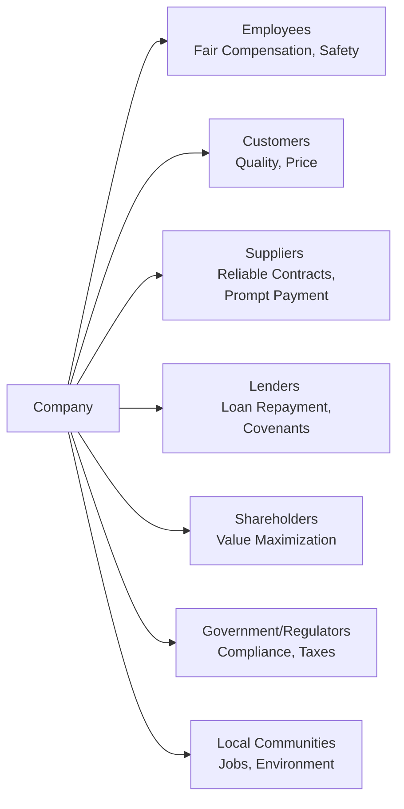

## Overview

Imagine I’m having coffee with a friend who’s just starting out in corporate finance, and they lean over the table and whisper, “So, who exactly are these ‘stakeholders’ everyone keeps talking about?” You know, sometimes we toss around that word as if it’s a universal constant—like gravity or something—but let’s nail it down. Stakeholder groups can include employees, customers, suppliers, lenders, shareholders, local communities, and government or regulatory bodies. Each group has its own set of priorities, sometimes pulling a company in multiple directions at once. Knowing how to balance those priorities is at the heart of stakeholder management, which is what we’re about to explore.

## Stakeholder Theory and Why It Matters

The basic idea behind stakeholder theory is that businesses should pay attention not only to shareholders but also to anyone who can affect or be affected by the company’s actions. In other words, it’s an acknowledgment that a company’s success doesn’t just hinge on profits—it also depends on maintaining healthy relationships with the people and organizations in its orbit.

If this seems too abstract, think about a pizza shop owner in a small town. Sure, the owner wants to turn a profit, but they also need reliable suppliers of ingredients, they want customers to be happy enough to return, and they want the local community to feel that the business is a positive part of the neighborhood. If people start complaining about poor service, or if the local regulator finds health code violations, there’s a big risk to the business—even if the shop is still making some money right now. That’s stakeholder management in a nutshell: balancing these interwoven interests to keep the company thriving in the long run.

## Key Stakeholder Groups

Below is a closer look at the major stakeholder groups and their primary concerns. Of course, these concerns can vary from one industry to another, but the broad brushstrokes remain relevant across many types of organizations.

### Employees

Employees typically focus on job security, fair compensation, opportunities for professional growth, and safe working conditions. In today’s environment, they may also care deeply about work–life balance, mental health support, and the company’s stance on social issues.

• Job Security and Growth: Employees want to feel stable in their roles. High turnover can hurt morale and productivity, so companies that invest in professional development and clear career paths often see stronger employee loyalty.

• Compensation and Benefits: Fair wages and robust benefits (like healthcare, retirement plans, and paid leave) factor into employee satisfaction. If a firm underpays its workers, it might save short-term costs but risks higher turnover and low morale—ultimately affecting productivity and reputation.

• Health and Safety: Particularly in industries such as manufacturing or construction, employees prioritize safe work environments. Neglecting safety can lead to expensive lawsuits, brand damage, and public mistrust.

### Customers

Let me tell you a quick story: I once used an app-based ride-sharing service that had stellar customer reviews—until it went viral that the app’s data security wasn’t up to par. In about a month, they saw a wave of cancellations. This highlights how deeply customers care about quality, price, privacy, and reliability.

• Quality and Price: Customers want products or services that meet their expectations at a fair price. Companies that fail to meet this standard risk losing market share.

• Customer Service: Providing fast, helpful responses to issues can go a long way toward building customer loyalty. Delays and unfriendly service can quickly tarnish a brand’s image.

• Ethical and Social Values: Increasingly, customers also expect companies to uphold ethical and social standards—be it supporting sustainability or rejecting unfair labor practices.

### Suppliers

Suppliers aim for stable, long-term relationships that ensure predictable demand and timely payments. They also want to work with companies that honor contractual obligations. Let’s say a supplier invests in specialized machinery to meet a large firm’s needs. If the firm abruptly changes suppliers or negotiates unrealistic payment terms, the supplier can end up holding the bag.

• Reliability and Timely Payment: Suppliers expect that invoices will be paid on schedule. Late payments can strain a supplier’s cash flow and lead to a breakdown in trust.

• Long-Term Contracts: Predictable order volumes and stable relationships help suppliers plan capacity, labor, and capital spending effectively.

• Fair Negotiation: Overly aggressive price negotiations could yield near-term savings for the company but risk damaging the relationship in the long run.

### Government/Regulators

Yes, paying taxes and meeting health, safety, or environmental requirements isn’t exactly the most glamorous part of corporate life. But failing to comply with regulations can lead to fines, legal battles, or forced shutdowns.

• Compliance with Law: Regulators want companies to follow local, regional, and national regulations. From environmental standards to consumer protection, noncompliance can be costly.

• Tax Revenue: Governments rely on tax revenue to fund public services such as infrastructure and education, so a company’s tax compliance matters to the broader community.

• Alignment with Public Policy: In some cases, governments support or incentivize certain business activities (e.g., green energy) and thus may have a vested interest in company practices.

### Lenders

Lenders (such as banks, bondholders, or other creditors) generally are concerned with a company’s capacity to pay interest and principal on time, and they closely monitor default risk.

• Credit Risk: Lenders often look at coverage ratios, leverage, and interest coverage to gauge a company’s financial stability. If they sense too much risk, they might raise interest rates or refuse additional credit.

• Covenants: Lenders often require covenant provisions—like limitations on issuing more debt, or minimum levels of liquidity or other ratios—to protect their interests.

• Stability: Lenders also keep tabs on a firm’s operational and strategic decisions that might affect its financial health. A sudden pivot into a risky venture could raise red flags.

### Shareholders

Shareholders want the company’s market value to rise, whether through capital gains or dividends. They’re basically the owners of the company, so their interest aligns closely with profitability and sustainable growth. However, they’re not a monolithic group. Some want quick dividends, others focus on long-term share price growth, and still others prioritize environmental or social objectives.

• Maximizing Share Value: Shareholders generally want improved share price and dividend payouts. In the short term, this might translate into cost-cutting or other efficiency measures. In the long term, it should be tied to sustainability.

• Transparency and Good Governance: Shareholders also emphasize strong corporate governance, requiring accurate financial statements and ethical leadership. Poor governance can send a company’s stock plummeting if scandal arises.

• Influence Through Voting: Shareholders get to vote on key corporate matters (e.g., board appointments, major strategic shifts). This fosters some checks and balances within the corporate structure.

### Local Communities

Communities might be smaller towns or entire regions where a company operates. If you’ve ever lived in a town that relied on one big manufacturer for most of its jobs, you probably know how important that business can be to a local area.

• Economic Development: Communities benefit when companies provide jobs, support community programs, and enhance infrastructure.

• Environmental Impact: Communities care about pollution, noise, and resource usage. Overlooking these can lead to protests, regulatory scrutiny, and reputational damage.

• Corporate Social Responsibility: Engaging in local projects or charitable endeavors can boost community goodwill—helping companies build stronger local ties and a positive brand image.

## Balancing Stakeholder Interests

So, how does a firm juggle these diverse interests? Well, it’s basically a question of strategy. Some conflicts are bound to arise—for instance, employees may want higher wages while shareholders push for cost efficiency. Aligning these competing demands may require trade-offs and negotiations (formal or informal). Effective stakeholder management often involves:

• Regular Engagement: Hosting community forums or employee town halls to gather feedback.  
• Transparency: Disclosing corporate actions in a straightforward manner to build trust.  
• Clear Policy Frameworks: Developing codes of conduct and corporate guidelines that outline how stakeholder concerns should be addressed.

If you want to visualize how these dynamics might intersect, consider this diagram:

Each arrow represents an ongoing, two-way flow of obligations, expectations, and outcomes.

## Stakeholder Conflicts and Resolution Strategies

It’s not all sunshine and harmony. A local factory might pollute a nearby river (hurting the local community) but also employing thousands of workers (benefiting employees). Or consider a scenario where shareholders want maximum short-term profits, potentially clashing with employees’ demands for better benefits. Companies can use these strategies:

• Mediation and Dialogue: Active listening sessions or third-party mediation to reconcile differences.  
• Cross-Functional Committees: Internal teams that bring together finance, HR, legal, and sales to weigh business decisions from multiple angles.  
• Performance Incentives: Aligning employee compensation with broader company success can mitigate conflicts between employees and shareholders.

## Real-World Example: The Tech Manufacturer Conundrum

Some years back, a major electronics manufacturer faced headlines when worker protests erupted over poor conditions at overseas assembly plants. Shareholders worried that negative PR would affect share price, while employees demanded improvements in health and safety. Eventually, the firm increased wages, invested in new safety measures, and allocated time off. On the surface, these actions boosted labor costs. But in parallel, the firm improved its public image, leading to a stronger brand and eventually higher sales. Balancing those stakeholder interests—while painful in the short term—contributed to a more sustainable business model in the long run.

## Why Managing Stakeholder Relationships Is Important

• Loyalty and Trust: Treating stakeholders fairly increases loyalty. Employees, customers, suppliers—everyone is more willing to go the extra mile for a company they believe in.  
• Reputation Management: A positive social image can translate into brand equity. On the flip side, ignoring stakeholder interests can quickly erode trust.  
• Operational Stability: Building strong ties with regulators, lenders, and suppliers provides greater flexibility and long-term stability.  
• Risk Reduction: By openly engaging stakeholders, a company can identify and mitigate concerns before they become crises.

## Measuring and Disclosing Stakeholder Engagement

Many companies now provide sustainability or CSR reports as a supplement to financial statements. These might detail how the firm engages with stakeholders—a concept sometimes labeled “stakeholder engagement.” Such disclosures can include metrics like:

• Employee turnover or satisfaction scores  
• Supplier payment times  
• Community investment or philanthropic spending  
• Environmental impact reports

Analysts, investors, and regulators increasingly use these disclosures to gauge a company’s business ethics, resilience, and long-term societal impact. While these initiatives can require resources, they may also yield tangible financial benefits, such as greater brand loyalty or lower regulatory fines.

## Common Pitfalls in Stakeholder Management

• Overemphasis on One Group: Focusing too much on shareholders (or any other group) can generate friction and deteriorate trust with other stakeholders.  
• Lack of Transparency: Withholding key information can result in legal issues, mistrust, and reputational damage.  
• Short-Term Mindset: Prioritizing short-term gains at the expense of long-term relationships can lead to instability and bigger problems down the road.  
• Inconsistent Action: Saying you value employees while cutting benefits or ignoring safety issues destroys credibility.

## Exam Relevance and Practical Tips

Candidates for the CFA exam and everyday analysts need to recognize that stakeholder analysis is essential—not just for philanthropic reasons but for stable, long-term value creation. The exam might include scenario-based questions testing your ability to identify stakeholder conflicts and propose meaningfully balanced solutions. Time management is crucial: in an item set, for instance, you might need to read a scenario about a dispute between shareholders and employees, then quickly assess the root causes and potential resolutions.

• Keep an eye out for the interplay between financial metrics and stakeholder satisfaction.  
• Use frameworks (like a stakeholder map) to illustrate the connections and conflicts.  
• Suggest balanced solutions that consider cost-benefit trade-offs and alignment with corporate strategy.

## Further Exploration

• R. Edward Freeman: “Strategic Management: A Stakeholder Approach”  
• CFA Institute’s “Environmental, Social, and Governance (ESG) Issues in Investing”  
• World Economic Forum: Stakeholder Capitalism Metrics Discussion (https://www.weforum.org/)  

---

## Test Your Knowledge: Stakeholder Groups and Their Interests



### Which stakeholder group primarily focuses on job security, fair compensation, and career growth opportunities?

- [ ] Customers
- [ ] Shareholders
- [x] Employees
- [ ] Government/Regulators

> **Explanation:** Employees care about issues like wages, safety, and professional development. These factors directly impact their personal well-being and job satisfaction.

### Which of the following best describes a key interest of lenders?

- [ ] Purchasing products at competitive prices
- [x] Ensuring principal repayment plus interest
- [ ] Saving on manufacturing costs
- [ ] Supporting new government initiatives

> **Explanation:** Lenders expect timely interest and principal payments. Their primary concern is safeguarding their capital and minimizing default risk.

### Which stakeholder is usually most concerned with product quality, fair pricing, and customer service?

- [ ] Employees
- [ ] Shareholders
- [x] Customers
- [ ] Lenders

> **Explanation:** Customers want to receive high-quality goods or services at a reasonable price and expect good customer support.

### Why do suppliers typically value long-term contracts?

- [x] They allow for predictable demand and stable planning
- [ ] They reduce product quality requirements
- [ ] They eliminate the need for regulatory compliance
- [ ] They reduce the supplier’s labor costs significantly

> **Explanation:** Suppliers often invest resources to meet ongoing demand. Predictable demand and stable relationships help them manage inventory, labor, and finances more effectively.

### Which of the following is typically a key focus for government regulators?

- [x] Compliance with laws and regulations
- [ ] Short-term equity returns
- [ ] Minimizing employee turnover
- [ ] Maximizing market share

> **Explanation:** Government agencies oversee compliance with applicable laws, such as environmental regulations, consumer protections, and tax requirements.

### A local community that depends on a company for jobs is most likely to be concerned with:

- [ ] Retirement benefits
- [ ] Product innovation
- [x] Economic development and environmental impact
- [ ] Dividend payouts

> **Explanation:** Communities benefit from stable employment and environmental responsibility. They may also worry about pollution, noise, or other local impacts.

### Shareholders typically prioritize:

- [x] Increasing company value
- [ ] Expanding government influence
- [x] Earning dividends
- [ ] Reducing local community involvement

> **Explanation:** Shareholders usually want stock price appreciation and returns via dividends. They benefit from sound governance and fiscal discipline.

### Which of the following strategies best aligns employees’ interests with shareholder interests?

- [ ] Ignoring employee feedback entirely
- [x] Offering stock-based compensation or profit-sharing plans
- [ ] Raising labor costs indefinitely
- [ ] Blocking employees from direct communication with management

> **Explanation:** Stock-based compensation or profit-sharing encourages employees to focus on achievements that boost overall company performance, thereby aligning employee incentives with shareholder value.

### Which of the following can be a downside of prioritizing shareholder interests above all else?

- [x] High employee turnover and reduced morale
- [ ] Increased profits for the company
- [ ] Better compliance with government regulations
- [ ] Stronger relationships with suppliers

> **Explanation:** Over-focusing on shareholder returns can lead to cost-cutting measures or reduced investment in employee welfare, potentially causing decreased morale and higher turnover.

### True or False: A company’s local community is unaffected by its financial and strategic decisions.

- [ ] True
- [x] False

> **Explanation:** Local communities can be significantly affected. Businesses create jobs, affect local infrastructure, and can have environmental impacts.


