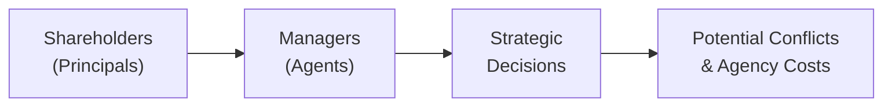

## Introduction and Overview

Stakeholder conflicts and agency issues often sneak up on organizations—like those subtle household leaks that you don’t notice until you see the damage. In the corporate world, the damage can be a dip in share price, reputational harm, or even a full-blown collapse if problems go unchecked. At the heart of these troubles usually lies a disconnect between ownership and control. Shareholders own the company, but managers run it. Lenders, employees, customers, and suppliers are also impacted by every decision. So, in this section, we’ll talk about what these agency problems look like, who’s involved, how they come about, and what companies do to keep them under control.

## The Agency Relationship and Its Challenges

### Separation of Ownership and Control
Most corporations have a neat little arrangement: shareholders (the principals) provide capital but entrust managers (the agents) with day-to-day decision-making. This separation of ownership and control is often considered a pillar of modern corporate structures—it allows for professional management of businesses, while a broad group of investors can collectively finance large projects. But with that convenience comes a bundle of potential conflicts.

Managers might be motivated by personal goals—fat bonuses, job security, prestige, or even an office with a better view. Meanwhile, shareholders want growth in long-term value and, in many cases, dividends. When those motives collide, we get agency issues.

### Agency Problem
Formally, the “agency problem” refers to the conflict arising when one party (the agent) is supposed to act in the best interest of another party (the principal) but might place their own self-interest first. This can lead to decisions that benefit managers yet erode shareholder value or harm other stakeholders like employees and lenders.

It’s similar to trusting a hired caretaker for your home while you’re away on vacation. Ideally, you want them to water your plants, feed your goldfish, and handle your mail. But if they binge on your premium ice cream, invite friends for a movie marathon, or neglect the plants, you’ve got yourself an agency conflict—one where the caretaker’s priorities misalign with yours.

### Moral Hazard
Moral hazard appears when someone can take more risks because part (or all) of the negative outcomes will be borne by someone else. In corporate settings, managers might be willing to take on risky expansions or lavish corporate spending if they think the downside is mostly on the shareholders. After all, if the strategy fails, their personal risk is often limited to losing a job or a bonus—whereas shareholders might see their entire investment’s value evaporate.

### Information Asymmetry
Agency problems are magnified by information asymmetry—a scenario where managers typically know more about the company’s operations and financial health than shareholders (and other stakeholders). If management chooses not to disclose critical information or sugarcoats the truth, decision-making from the outside can become guesswork.

#### Diagram: The Agency Conflict Flow

Below is a simple Mermaid diagram illustrating how agency conflict can flow from shareholders to managers, ultimately leading to strategic decisions and potential costs.

It’s a straightforward representation: principals hire agents to make strategic decisions, which can create conflicts—and thus agency costs—if not overseen properly.

## Conflicts Among Different Stakeholder Groups

When we talk about stakeholder conflicts, it’s not all about managers and shareholders. Stakeholders range from employees, suppliers, and customers to lenders and regulatory bodies—each group bringing its own set of interests.

• Shareholders vs. Managers: This is the classic agency battle. Shareholders want profit maximization, sustainable growth, and returns on capital. Managers might prefer job security, personal perks, or short-term goals that boost their immediate bonuses.  

• Shareholders vs. Lenders: Shareholders often love seeing profits distributed as dividends or share buybacks. Lenders might prefer to see those earnings retained, improving the balance sheet and ensuring obligations get met without excessive risk.  

• Managers vs. Employees: Managers may push employees for higher productivity and lower labor costs. Meanwhile, employees want competitive pay, job security, and benefits.  

• Majority vs. Minority Shareholders: In some companies—especially family-owned or dual-class share structures—controlling shareholders can push through decisions that benefit themselves but disadvantage minority shareholders.

A quick personal anecdote: I once had a friend who invested a small stake in a company that was controlled by a family that owned the majority. When the firm decided to sell an essential division to a related party at a low price, my friend felt completely left out. It was a textbook majority vs. minority conflict. The frustration was real, and ironically, the minority shareholders’ recourse wasn’t strong enough to block the move.

## Agency Costs

Because of all these potential conflicts, organizations spend resources to reduce or manage them. These expenses—or losses—are called agency costs, which typically come in three flavors:

1. Monitoring Costs: Funds spent monitoring and reporting managerial behavior (auditing fees, compliance checks, board oversight, etc.).  
2. Bonding Costs: Arrangements like performance-linked compensation or manager equity ownership designed to align manager and shareholder interests (it’s an indirect cost but can get pricey in the form of stock options or performance bonuses).  
3. Residual Loss: Even after we throw money at the problem (monitoring, bonding, etc.), some conflicts slip through. This leftover effect is known as the residual loss.

At first, these costs may seem like a burden. But ironically, investing in good governance can preserve—and even boost—shareholder value in the long run. It’s like paying for home renovations before the property value dips or a bigger problem emerges.

## Mechanisms for Mitigating Conflicts

### Performance-Based Compensation
Tying executive pay to measurable performance targets is a direct strategy to align incentives. This can be accomplished through annual bonuses, restricted stock units (RSUs), or stock option grants. The idea is simple: managers care more about the stock price if their personal wealth is tied to it. In practice, though, linking pay to share price can also create an incentive for managers to focus on short-term gains or manipulate short-term earnings. That’s why, nowadays, you’ll often see more nuanced performance metrics, like “economic value added” (EVA) or multi-year total shareholder return.

### Corporate Boards and Committees
Boards of directors exist partly to ensure that management acts in the best interest of shareholders. Functions like audit committees, compensation committees, and nominating committees can scrutinize decisions and keep everything in check. An engaged and independent board serves as a powerful counterbalance against self-serving behavior by management. For more ideas on how boards operate in practice, see Chapter 3 on Corporate Governance.  

### Transparent Financial Reporting
One surefire way to reduce information asymmetry is by ramping up transparency—through robust disclosures, timely financial statements, and clear communication. IFRS and US GAAP provide frameworks for standardizing reports, making it easier for investors and lenders to evaluate performance. Consistency in these reporting standards ensures that managers can’t simply hide unfavorable details.

### Covenants in Lending Agreements
Lenders worry that management might increase risk after loans are issued—perhaps by taking on more debt or engaging in highly speculative ventures. Covenants serve as guardrails embedded in loan agreements that prevent the borrower (the company) from doing certain things without lender approval, such as exceeding a particular debt-to-equity ratio or paying out large dividends. These legal constraints can reduce moral hazard by limiting excessive risk-taking.

### External Market Forces
Beyond internal controls, external forces can also keep managerial behavior in line. Activist investors, for instance, can buy enough shares to influence company policy. Market competition checks managerial complacency—uncompetitive firms risk losing market share or getting acquired by more efficient competitors. Additionally, threat of takeover (the market for corporate control) can motivate managers to keep the business on track, lest they be replaced by new owners.

## Practical Examples and Real-World Scenarios

• Enron and Financial Reporting: Enron engaged in complex and opaque transactions to inflate earnings while concealing liabilities. This fiasco exposed huge agency problems—management pursued personal gain (through stock options and off-balance-sheet activities) at the expense of shareholders and employees. Ultimately, the company went bankrupt, and employees lost their pensions.  

• Volkswagen Emissions Scandal: Some employees manipulated emissions tests, possibly motivated by internal pressure to demonstrate certain performance metrics. This highlights how moral hazard and short-term targets can undermine ethical standards and inflict damage on the brand and stakeholders.  

• Family-Owned Businesses: In a scenario where a family owns a large chunk of a publicly traded firm, there could be conflicts between the family’s desire to maintain control and minority shareholders’ interest in liquidity or higher dividends. Such control structures can set off classic agency issues, especially if the controlling family wants to protect or advance certain private benefits.

## Glossary of Key Terms

• Agency Problem: Conflicts arising when an agent has incentives that don’t align with the principal’s interests.  
• Moral Hazard: The tendency to take additional risks because the negative consequences are shared or absorbed by others.  
• Information Asymmetry: A situation where one party in a transaction has more or better information than the other.  
• Conflict of Interest: Circumstances where a decision-maker, such as a manager, might be influenced by competing incentives or personal gain.

## Best Practices and Common Pitfalls

• Align Incentives Carefully: Stock options can encourage managers to chase short-term share price bumps instead of sustainable growth. Balance is key—mix short-term and long-term performance goals.  
• Maintain a Truly Independent Board: A rubber-stamp board, filled with the CEO’s friends, doesn’t do much to stop poor decision-making. Independence and diversity of skills matter.  
• Improve Transparency: Frequent, honest reporting fosters trust and reduces misinformation. Underreporting, even when done with good intentions, can breed suspicion.  
• Beware Overly Restrictive Covenants: Yes, they protect lenders, but they can also constrain a company’s growth if too rigid, leading to missed opportunities.

## Encouraging Critical Thinking

The interplay between managers, shareholders, and other stakeholders can be nuanced. While it’s tempting to think that every conflict is about management greed, real-world decisions are often colored by multiple influences—market competition, economic policies, regulatory constraints, and cultural values. Keep asking: is there a better way to align stakeholder interests? Are the costs of controlling behavior worth the benefits? How does the broader organizational culture impact managers’ moral hazard?

## Conclusion

If you think about it, stakeholder conflicts and agency issues are an ever-present reality in corporate life. No matter how sophisticated controls become, there’s always a need to adapt to new challenges—like changing regulations, evolving market conditions, or breakthroughs in corporate finance structures (think about the rise of special purpose acquisition companies, or SPACs, in Chapter 9). Being proactive in managing these conflicts is vital to safeguarding shareholder value, preserving trust with creditors and employees, and ensuring the corporation remains true to its mission.

## References and Further Reading

• Jensen, Michael C., and William H. Meckling. “Theory of the Firm: Managerial Behavior, Agency Costs and Ownership Structure.” Journal of Financial Economics, 1976.  
• Monks, Robert, and Nell Minow. Corporate Governance. Malden, MA: Blackwell Publishing.  
• OECD Principles of Corporate Governance. http://www.oecd.org/corporate/principles-corporate-governance/  
• Enron Case Studies: University archives on corporate scandals and reforms.  
• U.S. Securities and Exchange Commission (SEC) filings for real-company examples of covenant disclosures.

--------------------------------------------------------------------------------

## Test Your Knowledge: Stakeholder Conflicts and Agency Issues



### Which of the following factors is likeliest to increase the severity of agency conflicts between managers and shareholders?

- [ ] Transparent financial reporting
- [ ] An independent board of directors
- [ ] Long-term incentive compensation
- [x] Lack of performance-based compensation

> **Explanation:** Without performance-based compensation, managers have weaker incentives to align decisions with shareholders’ interests, increasing the severity of agency conflicts.

### The moral hazard problem in a corporation is best described by:

- [ ] Stakeholders having the same set of information as managers
- [x] Managers taking more risks because shareholders (not managers) bear the brunt of negative consequences
- [ ] Ownership and management converging in the same person
- [ ] Lenders preferring dividend payouts over retained earnings

> **Explanation:** Moral hazard occurs when a party is more likely to take risks because the negative outcomes are absorbed or shared by others, which is common when management is not fully exposed to downside risks.

### A strong board of directors can mitigate agency problems by:

- [x] Reviewing and vetoing managerial policies that do not serve shareholders’ interests
- [ ] Eliminating the need for any covenants in debt agreements
- [ ] Granting managers unlimited freedom to ensure innovation
- [ ] Overseeing daily operational decisions

> **Explanation:** Boards oversee strategic decisions and hold management accountable. They don’t usually manage day-to-day affairs, nor can they eliminate the need for covenants entirely.

### When lenders impose covenants in a lending agreement, their primary objective is to:

- [ ] Force the company into insolvency
- [ ] Promote agency conflicts among shareholders
- [ ] Seek greater compensation for the board of directors
- [x] Limit excessive risk-taking and protect the lender’s interests

> **Explanation:** Covenants exist to curtail risky or value-destroying actions that might endanger the lender’s position, thereby protecting the lender’s interests.

### Which of the following situations best illustrates an agency conflict among stakeholders?

- [x] A CEO who expands the company through risky acquisitions to boost personal reputation
- [ ] A company that meets disclosure requirements consistently 
- [ ] A board that replaces the CEO for poor performance
- [x] A family-dominated board that sells major assets to a related party

> **Explanation:** Risky acquisitions for personal prestige and selling assets to related parties are classic agency conflicts. These examples highlight how managerial or majority-owner motivations might conflict with the broader stakeholder base.

### Agency costs are likely to increase under which condition?

- [x] An absence of monitoring costs and strict reporting standards
- [ ] Frequent and transparent auditing
- [ ] Properly aligned managerial incentives
- [ ] An active and engaged board of directors

> **Explanation:** If a firm neglects monitoring and disclosure, managers have fewer checks on their decisions—leading to higher agency costs.

### One advantage of performance-linked compensation is that:

- [x] It helps reduce moral hazard by aligning managerial incentives with those of shareholders
- [ ] It guarantees zero conflict of interest
- [x] It can motivate managers to prioritize short-term share price manipulation
- [ ] It ensures all lenders get paid back on time

> **Explanation:** Performance-based pay is a tool to align manager-shareholder incentives. However, it can also push managers to prioritize short-term performance. It doesn’t guarantee all conflicts or lender repayment issues will disappear.

### An example of residual agency cost would be:

- [ ] Payment for financial audits
- [ ] Cost of hiring external consultants to assess management performance
- [x] Value lost due to managers’ decisions that still deviate from shareholder interests after all monitoring
- [ ] Cost of issuing stocks to employees

> **Explanation:** Even after spending money on oversight and incentive structures, some discrepancies in decision-making remain—this leftover harm or value loss is the residual agency cost.

### An investor who fears majority shareholder expropriation would be most concerned about:

- [x] Dual-class share structures
- [ ] Transparent IFRS reporting
- [ ] Strict board oversight
- [ ] Long-term financing arrangements

> **Explanation:** Dual-class share structures can give controlling shareholders disproportionate voting power, paving the way for decisions that may harm minority investors (expropriation of value).

### The separation of ownership and control in corporations is typically considered to be:

- [x] True
- [ ] False

> **Explanation:** It is indeed true that ownership (shareholders) is separated from control (managers) in most publicly traded corporations, leading to potential agency conflicts.


