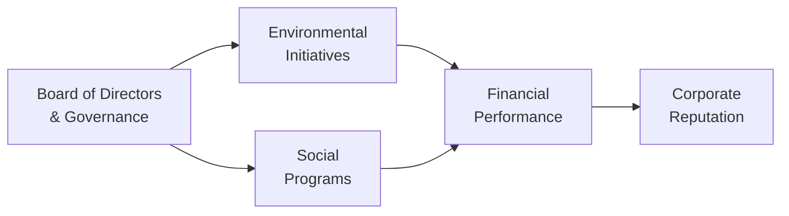

## Introduction and Context

Environmental, Social, and Governance (ESG) factors are becoming an integral part of the modern corporate landscape. It's funny—just a decade ago, ESG was often seen as a “nice to have,” right? But nowadays, the conversation has shifted from “Why bother with ESG?” to “How do we best integrate it?” And let’s be real: ignoring ESG can be a major reputation killer, not to mention a financial risk. In this section, we’ll look at how E, S, and G link to corporate performance, how stakeholders factor them into decisions, and how best-practice reporting frameworks shape investor and lender expectations.

## Why ESG Matters

• Growing Investor Demand: Large institutional investors, such as pension funds and endowments, are increasingly applying ESG criteria to their portfolios, aiming to mitigate risk and capture long-term value.  
• Regulatory Pressures: Many jurisdictions and stock exchanges are moving toward mandatory ESG disclosures. This shift encourages transparency and consistent reporting.  
• Cost of Capital: A track record of good ESG performance can reduce risk premiums. On the flip side, if an organization has shaky environmental or social practices, it might face higher financing costs.  
• Brand Reputation: A strong ESG profile can enhance brand value and foster consumer loyalty. But, oh boy, if your brand is saddled with allegations of environmental harm or poor working conditions, the damage can linger for years.  

## Key ESG Factors

### Environmental Factors

Environmental factors revolve around how a company interacts with the physical environment and natural resources. You might recall reading about carbon footprints and emissions scandals in the news. It only takes one big mishap—like a major oil spill—for a company's reputation (and share price) to get hammered. Important environmental considerations include:

- Resource Usage: Responsible use of energy, water, raw materials, and other natural resources.  
- Carbon Emissions: Managing greenhouse gas (GHG) emissions and implementing climate change strategies.  
- Waste Management: Minimizing solid, liquid, and hazardous waste; adopting proper disposal or recycling practices.  
- Pollution Control: Reducing air, water, and soil pollution from operations.  
- Biodiversity Conservation: Protecting habitats and ecosystems affected by corporate activities.

Companies with robust environmental practices have fewer regulatory burdens and can gain a big edge with customers who are environmentally conscious. Sometimes I think back to a friend who used to joke that only tree-huggers cared about emissions. Well, nowadays every CFO is a partial tree-hugger—because it’s good for the bottom line (and the planet).

### Social Factors

Social factors consider how a company interacts with its workforce, customers, suppliers, and the wider community. Don’t underestimate their impact. The moment a firm is seen mistreating its employees or ignoring community concerns, it risks losing its “social license to operate” (SLO). Key social factors include:

- Labor Practices: Fair wages, safe working conditions, and diversity and inclusion efforts.  
- Human Rights: Ensuring no forced or child labor in supply chains, creating equitable workplaces, and championing equity initiatives.  
- Community Relations: Supporting local development, charitable contributions, and transparent communication with local stakeholders.  
- Customer Welfare: Ethical marketing, product safety, and data privacy—think of the many data breaches we read about.  
- Data Protection: Ensuring that customers’ personal data is securely stored and used responsibly.

A strong social track record fosters employee loyalty and can improve brand awareness in the broader community. It also helps dampen risk of labor strikes, lawsuits, and boycotts.

### Governance Factors

Governance is the “G” that lays the extensive framework for processes, policies, and leadership structures. Believe me, it’s more than just “who sits on the board.” It shapes how an organization is managed, who’s accountable, and how stakeholders’ interests are balanced. Common governance considerations:

- Board Structure and Diversity: Independent directors, varying professional backgrounds, and female representation can strengthen decision-making.  
- Executive Compensation: Aligning management incentives with shareholder interests.  
- Shareholder Rights: Open communication, voting rights, and equitable treatment of minority shareholders.  
- Internal Controls and Risk Management: Transparent policies that reduce agency costs and ensure robust oversight of financial practices.  
- Ethical Standards: A strong code of ethics, anti-corruption policies, and whistleblower protections.

I remember once how a CFO confided in me, “Our processes may look good on paper, but if our board doesn’t do real oversight, it’s all for show.” Indeed, robust governance buttresses investor confidence and, in turn, can yield smoother operations and a healthier valuation.

## ESG Impact on Corporate Value

ESG integration can offer several benefits:

• Lower Regulatory and Legal Risks: Organizations that proactively address environmental and social issues are less likely to face fines, lawsuits, and reputational crises.  
• Cost Savings: Efficient resource usage often translates to lower operating costs and improved profitability.  
• Enhanced Access to Capital: There’s been a surge in ESG-themed funds and lending programs that boost the flow of capital toward companies with reputable ESG scores.  
• Improved Employee Retention: An inclusive, diverse culture can drive employee loyalty and reduce costly turnover.  

On the flip side, poor ESG performance can result in a higher cost of capital, negative press, and losing out on major institutional investors who have socially responsible investing mandates. 

## ESG Frameworks and Reporting

Companies often use internationally recognized reporting frameworks to enhance comparability and manage best practices. These include:

1. Global Reporting Initiative (GRI) Standards  
2. Sustainability Accounting Standards Board (SASB)  
3. Task Force on Climate-related Financial Disclosures (TCFD)  
4. Integrated Reporting Framework (IIRC)

### Sustainability Reporting

Sustainability reporting is the practice of disclosing ESG initiatives, metrics, and challenges. It provides stakeholders with a transparent view of how the company is managing environmental and social risks. Some jurisdictions are moving toward mandated disclosure, so it’s no longer optional. Besides, disclosure fosters accountability and a culture of continuous improvement—nobody wants a “greenwashing” scandal.

## Case Example

Imagine a multinational apparel company that invests in water-saving technology at its textile plants. It also partners with local communities to promote education and invests in fair labor practices. The direct benefits might include reduced operational costs, a more skilled and engaged workforce, and a strong brand that resonates with ethical consumers. Investors might reward this leading ESG stance with a lower risk premium, thereby reducing the company’s weighted-average cost of capital (WACC).  

## The Dangers of Greenwashing

Greenwashing is a practice in which companies inflate or fabricate their environmental benefits to appear more eco-friendly than they really are. Ironically, this can blow up in the company’s face if stakeholders discover the truth. The brand damage can be devastating, and the financial ramifications can include fines and lost investment. Being authentic—and transparent—in ESG communications is crucial. 

## Social License to Operate (SLO)

When we talk about the “social license to operate,” we’re essentially referring to a community’s acceptance of a company’s activities. Without it, operations can be disrupted by protests, strikes, or local government interventions. Companies that proactively create community benefits—like building vital infrastructure or offering vocational training—tend to maintain a positive relationship with local stakeholders. From an investor’s perspective, strong community relations reduce social risk, ensuring uninterrupted production.

## Carbon Footprint and Climate Goals

Reducing carbon footprints has moved beyond a marketing tagline and straight into mainstream corporate strategy. This can include shifting to renewable energy sources, optimizing logistics to reduce fuel usage, and adopting greener manufacturing processes. Many companies now set Science-Based Targets to align themselves with the Paris Agreement’s climate goals. These reductions in carbon emissions are often associated with direct savings in energy costs, as well as intangible gains in brand image and investor confidence.

## Governance in Action

Even the best environmental or social initiatives can be undermined by weak governance structures. A strong board that demands real-time updates on ESG initiatives and invests in data analytics tools can effectively monitor progress, ensuring accountability. Governance also affects who has the final say in strategic decisions, making it a vital element in aligning day-to-day business actions with long-term corporate responsibility goals.

Below is a simple Mermaid diagram illustrating how ESG factors interplay within a corporation’s overall strategy:

• The Board of Directors provides governance and strategic oversight.  
• Environmental and social initiatives feed into financial performance.  
• Financial performance influences corporate reputation, which in turn can feed back into the board’s strategic approaches and future initiatives.

## Best Practices and Pitfalls

• Align ESG with Strategy: Integrate ESG metrics into overall organizational goals; don’t treat them as standalone checkboxes.  
• Engage Stakeholders: Seek feedback from employees, local communities, NGOs, and regulators to build trust and credibility.  
• Avoid Box-Ticking: True value from ESG emerges when it’s woven into the company culture, not when you’re just ticking boxes.  
• Transparency is Key: Provide clear, candid disclosures to reduce suspicion of greenwashing.  
• Monitor and Update: ESG risks evolve. Regularly update your ESG policies and metrics in response to new regulations or technologies.

## Looking Ahead

ESG isn’t going anywhere, and many analysts predict that companies failing to adopt robust ESG strategies will struggle to access cost-effective capital. Banks, insurers, and investors are turning down financing to high-risk environmental offenders or to businesses with large social controversies. On the brighter side, organizations that excel in sustainability, community relations, and strong governance can reduce their risk profile, attract top-tier talent, and stay ahead of regulatory changes.

## Glossary

• Sustainability Reporting: Voluntary or mandated reports outlining a company’s ESG practices, goals, and performance.  
• Carbon Footprint: A measure of a company’s total greenhouse gas emissions, often expressed in carbon dioxide equivalents (CO₂e).  
• Social License to Operate (SLO): Ongoing acceptance or approval from local communities and stakeholders that allows a company to conduct its operations smoothly.  
• Greenwashing: Presenting misleading information about a company’s environmental or social responsibility to appear more sustainable than reality.

## References and Further Reading

• “ESG Integration in Corporate Finance” by CFA Institute.  
• Global Reporting Initiative (GRI) Standards (https://www.globalreporting.org/)  
• SynTao Green Finance (https://en.syntao.com/) for case studies on ESG in emerging markets.  

## Final Exam Tips

1. Show interconnections among environmental, social, and governance elements rather than treating them as separate themes.  
2. Identify how ESG factors can influence financial analysis and risk assessment.  
3. Pay special attention to international reporting standards—expect exam questions on the pros and cons of various frameworks (e.g., GRI, SASB).  
4. Focus on real-life applications, including how ESG issues affect valuations, capital structure, and stakeholder relations.  
5. Practice scenario-based questions where a company’s ESG shortcomings or successes impact corporate strategies or investor decisions.

## Test Your Knowledge: ESG Considerations in Corporate Finance



### Which of the following is an example of an environmental factor that companies might track under ESG criteria?

- [ ] Board diversity
- [x] Carbon emissions
- [ ] Employee turnover rates
- [ ] Shareholder voting rights

> **Explanation:** Environmental criteria focus on how a firm uses resources and limits its carbon footprint. Carbon emissions directly relate to environmental impact.

### Which statement best describes “social license to operate”?

- [x] Local communities’ acceptance or approval of an organization’s activities
- [ ] Official governmental approval for heavy manufacturing
- [ ] Licensure granted by NGOs to companies with strong ESG programs
- [ ] Regulatory permit for carbon emissions

> **Explanation:** Social license to operate refers to ongoing acceptance from a range of stakeholders, especially the local community.

### What is a key risk associated with “greenwashing”?

- [ ] Increase in environmental disclosure requirements
- [x] Reputational damage if stakeholders discover misleading claims
- [ ] Higher operational costs for recycling programs
- [ ] More complicated board structures

> **Explanation:** Greenwashing involves overstating (or outright fabricating) a company’s sustainability credentials, which can lead to severe reputational harm if uncovered.

### Which of the following is an example of a strong governance factor within a company?

- [ ] Unrestricted carbon emissions
- [ ] A single controlling shareholder with no minority representation
- [x] Separating the roles of CEO and board chair for oversight
- [ ] Excessively opaque financial reporting

> **Explanation:** Separating CEO and board chair roles strengthens checks and balances, improving governance practices.

### Which scenario best reflects effective social factor management?

- [ ] Implementing a share buyback program to reduce equity
- [ ] Reducing board size to minimize conflicts
- [x] Ensuring safe working conditions and fair wages for employees
- [ ] Outsourcing all manufacturing to regions without labor regulations

> **Explanation:** Social factor management includes protecting employee rights, providing fair wages, and promoting workplace safety.

### Under which recognized framework might companies disclose the impact of climate change on their operations and finances?

- [ ] Generally Accepted Accounting Principles (GAAP)
- [x] Task Force on Climate-related Financial Disclosures (TCFD)
- [ ] Basel III
- [ ] GIPS (Global Investment Performance Standards)

> **Explanation:** TCFD provides a widely accepted framework for disclosing how climate change could affect a firm’s finances.

### Which of the following is an intangible benefit of a robust ESG program?

- [x] Brand enhancement and customer goodwill
- [x] Greater appeal to socially responsible investors
- [ ] Reduced interest expense on commercial paper
- [ ] None of the above

> **Explanation:** A strong ESG profile can boost brand image, drive customer loyalty, and appeal to specialized investor groups.

### What best describes the relevance of ESG in capital allocation decisions?

- [x] Companies with unfavorable ESG profiles may face higher financing costs
- [ ] ESG is irrelevant for capital allocation
- [ ] Only environmental factors matter for credit analysis
- [ ] Social factors are more important than governance factors

> **Explanation:** Lenders and investors often demand higher risk premiums from firms with weak ESG practices, increasing the cost of capital.

### Which of the following is a key reason for sustainability reporting?

- [ ] Minimizing taxes regardless of transparency
- [ ] Meeting quarterly earnings expectations
- [ ] Facilitating board entrenchment
- [x] Enhancing transparency and accountability on ESG performance

> **Explanation:** Sustainability reporting demonstrates how a firm’s operations affect society and the environment, fostering accountability and trust.

### True or False: Strong ESG performance is generally associated with reduced legal and reputational risks, potentially leading to better access to capital.

- [x] True
- [ ] False

> **Explanation:** Firms with robust ESG credentials often enjoy smoother relationships with regulators, investors, and communities, helping to reduce their risk profiles and improve financing conditions.


