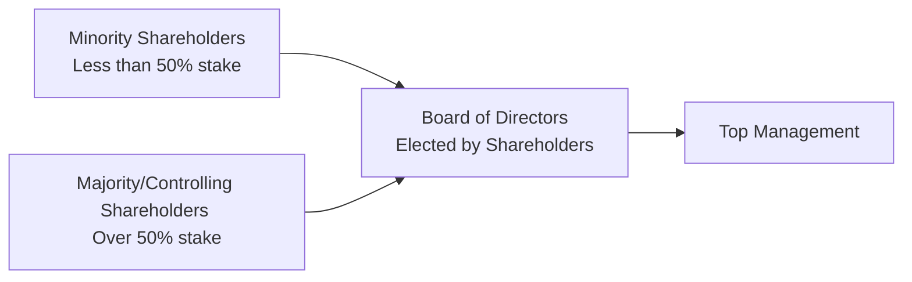

## Introduction 
Minority shareholders—those who hold a relatively small percentage of a company’s shares—often lack the voting control to shape corporate policies or influence significant strategic moves on their own. This imbalance in power can expose minority investors to various risks, including the possibility that majority shareholders or the controlling management team might prioritize their own interests over the welfare of non-controlling holders.

From a practical standpoint, understanding minority shareholder rights is front and center for anyone investing in corporate issuers, whether those issuers are private firms, public multinationals, or closely held partnerships. For CFA Level I candidates and finance professionals, these concepts fit neatly into broader discussions on corporate governance (see Chapter 3), stakeholder interests (earlier sections within this Chapter 2), and legal structures (Chapter 1). 

Below, we examine key legal protections that seek to defend minority shareholders. We also discuss broader governance frameworks, real-world examples, and exam-relevant insights. Along the way, we highlight certain best practices and common pitfalls investors ought to consider when evaluating the strength of minority protections.

## The Importance of Minority Shareholder Protections
No investor wants to feel powerless or vulnerable after making an equity investment. Without adequate checks and balances, majority shareholders or a controlling block have multiple ways to undermine minority participants. For instance, corporate actions such as dilution from new share issuances or related-party transactions can effectively transfer wealth away from smaller investors. 

Moreover, in some markets or during certain corporate actions—including mergers and acquisitions—minority shareholders might discover their dissents strongly overshadowed by controlling interests. This dynamic can create a “minority discount,” reflecting the reduced value often placed on a less-than-controlling stake in a company.

In well-regulated markets, laws and governance codes offer mechanisms designed to uphold transparency, fairness, and accountability. However, the degree to which these protections are enforced can vary widely across jurisdictions. Thus, being conversant with core legal rights is essential when assessing potential investments or advising clients on corporate governance.

## Core Challenges for Minority Shareholders
Minority shareholders routinely face hurdles tied to their limited voting power. Some common challenges include:

• Limited Access to Information: In some environments, controlling boards or management teams withhold critical corporate disclosures.  
• Dilution: Without preemptive rights, new share offerings can reduce a minority shareholder’s proportionate ownership.  
• Oppressive Practices: Decisions such as paying outsize executive compensation or authorizing self-dealing related-party transactions can disproportionately favor insiders.  
• Lack of Board Representation: Standard voting procedures may prevent minority holders from having a seat at the table to advocate for their interests.  

These issues can erode minority shareholders’ confidence and lead to pricing inefficiencies in markets where minority stakes are undervalued due to perceived higher risk.

## Key Legal Protections

### Cumulative Voting 
Cumulative voting allows shareholders to allocate their votes in favor of a smaller number of board candidates, improving the odds that minority holders can secure board representation. For example, if a company has five board seats up for election, and you own 100 shares, you receive 500 total votes (100 shares × 5 seats). You could direct all 500 votes to a single nominee, potentially outvoting majority shareholders on at least one seat.

In formula terms, the minimum number of shares needed under cumulative voting to ensure election of one board seat is often expressed as:


\text{Shares Required} = 
\left\lfloor \frac{\text{Total Shares Outstanding}}{\text{Number of Seats} + 1} \right\rfloor + 1


For instance, if there are 1,000 shares total and five board seats, the shares required to guarantee a seat would be:


\left\lfloor \frac{1,000}{5 + 1} \right\rfloor + 1 = 
\left\lfloor 166.67 \right\rfloor + 1 = 167


If an investor holds at least 167 shares, they can effectively secure representation.

### Preemptive Rights 
Preemptive rights afford existing shareholders the priority to buy a proportional number of any new shares issued before those shares are offered to outside buyers. This protection helps maintain a shareholder’s ownership percentage and prevents the dilution of economic and voting power. Preemptive rights can be particularly critical in early-stage or private companies, where frequent capital raises might otherwise whittle down minority stakes.

### Tag-Along (and Drag-Along) Rights
Tag-along rights protect minority shareholders if a controlling shareholder decides to sell. Tag-along provisions require that any offer the majority receives be extended to minority shareholders at the same price and terms, allowing them to “tag along” in the sale. By contrast, drag-along rights allow majority shareholders to force minority holders to join a sale, ensuring a clean exit for all. While drag-along rights primarily benefit the majority block, they can provide liquidity for minority stakeholders who might otherwise be left in an illiquid position.

### Class Action Lawsuits
Class actions can allow a group of minority shareholders with similar grievances to unite and file a single legal action against a company’s officers, board members, or controlling shareholders. This is often more efficient and cost-effective than individual lawsuits, especially in large-scale securities disputes. In some jurisdictions, class action lawsuits give small investors an important enforcement tool to seek compensation or injunctive relief against oppressive or deceptive practices.

### Oppression Remedies
Under various corporate statutes and legal systems, an oppression remedy or unfair prejudice claim enables minority shareholders to seek relief in court if a controlling party’s actions are oppressive, unfairly prejudicial, or disregard the interests of the minority. Courts can order a range of remedies, from compensatory damages to forced share buybacks, to correct an injustice. Familiarity with local corporate codes is vital when evaluating the likelihood of successfully pursuing an oppression remedy.

## Governance Frameworks and Regulatory Standards 
Corporate governance frameworks (see Chapter 3 for a broader discussion) lay out structures meant to uphold transparency, accountability, and equitable treatment of all shareholders. Regulators worldwide often mandate:

• Disclosure Requirements: Under IFRS or US GAAP, companies must disclose material information, including details of related-party transactions, equity issuances, stock compensation, and potential conflicts of interest.  
• Board Independence: In many developed markets, regulations or best-practice guidelines stipulate independent board members to diminish the stranglehold of controlling shareholders.  
• Shareholder Approval for Major Transactions: Significant changes to corporate structure—like mergers, asset sales, or reverse stock splits—frequently require shareholder votes. Minority interests usually have the right to weigh in, or sometimes even demand appraisal rights if they dissent.  

When these frameworks are well-designed and effectively enforced, they reduce the risk of misconduct and encourage confidence among both large and small investors.

## Diagram: Minority Versus Majority Control
Below is a simplified mermaid diagram illustrating the high-level governance relationships that impact minority shareholders:

In many jurisdictions, the majority shareholders have a decisive influence on the board, which supervises management. Minority shareholders often rely on legal protections (like cumulative voting or class action rights) to safeguard their interests within this structure.

## Real-World Considerations 
• Emerging Markets: In developing economies, regulatory bodies may be less robust, and enforcement can be inconsistent. Thorough due diligence is essential; reading local securities laws and paying close attention to corporate governance ratings can yield insights into real (versus nominal) protections.  
• Closely Held Corporations: In a private or family-run environment, minority shareholders may have fewer exit options, making protective rights—such as tag-along clauses—all the more crucial.  
• Investor Activism: Minority shareholders sometimes act collectively to instantiate changes. Shareholder coalitions or activist hedge funds frequently leverage media attention, proxy fights, or legal channels to push for board seats or strategic shifts.  

## Example: A Hypothetical Corporate Dispute
Imagine Oakfield Inc., a mid-sized family-owned company in which the Smith family owns 60% of the shares, while outside investors collectively hold 40%. After Oakfield declares a large special dividend paid only to a newly issued class of preferred shares owned by the Smith family, minority holders cry foul. By reviewing Oakfield’s articles of incorporation, they find that they have the right to bring a class action lawsuit, alleging oppression and seeking remedy in the form of forced redemption of those preferred shares. 

This scenario underscores how legal claims—coupled with robust minority protections—can empower smaller investors to challenge unfair treatment and protect their share of the firm’s economic returns.

## Enforcement and Shareholder Activism 
As the saying goes, “Rights without remedies are meaningless.” Enforcement is where corporate governance rubber hits the road. Even if a country’s statutes and listing standards incorporate minority protections on paper, the real question is whether local courts, regulatory commissions, or arbitration channels effectively handle disputes. 

Meanwhile, for exam considerations, keep in mind that minority shareholder activism can appear as a scenario-based question: for instance, determining the likely outcomes if a minority coalition tries to replace board members via cumulative voting or analyzing the effect of a new share issuance on equity valuations for small investors.

## Best Practices and Common Pitfalls
• Best Practices for Protection  
  – Leverage Cumulative Voting: If available, concentrate votes on a few board seats to secure representation.  
  – Negotiate Preemptive Rights: In private deals or new share issuances, ensure you can maintain ownership percentage.  
  – Seek Transparent Management: Evaluate the firm’s history of disclosures and related-party transactions.  

• Common Pitfalls  
  – Overlooking Jurisdiction-Specific Nuances: Laws differ significantly by region; an investor who is unaware of local norms might inadvertently forfeit rights.  
  – Failing to Perform Due Diligence: Relying on headline numbers without scrutinizing corporate bylaws or articles of incorporation can expose shareholders to nasty surprises.  
  – Underestimating Board Dynamics: Even with comprehensive legal protections, a board dominated by aligned majority holders may find ways to circumvent minority interests unless other governance checks exist.  

## Exam Tips
• Practice scenario-based questions that involve evaluating a company’s charter or bylaws to see if it grants preemptive rights or cumulative voting.  
• Understand how IFRS and US GAAP disclosures can reveal potential conflicts of interest relevant to minority shareholder protection.  
• Review the interplay of corporate governance codes (Chapter 3) with minority shareholder rights. You may see exam questions linking these two areas together, requiring you to propose solutions to mitigate agency costs.  
• Keep in mind how controlling shareholders can influence decisions on dividends, share buybacks (Chapter 8), and M&A activities (Chapter 9).  

## References and Further Reading
• Berle, A.A. & Means, G.C. (1932). The Modern Corporation and Private Property.  
• IFC Corporate Governance Toolkits: https://www.ifc.org/  
• Various corporate governance codes and securities regulations (e.g., U.S. SEC, UK Companies Act, local laws).  

---

## Test Your Knowledge: Minority Shareholder Rights and Protections



### Which voting mechanism boosts the likelihood that minority shareholders can secure at least one board seat?

- [ ] Straight voting
- [x] Cumulative voting
- [ ] Proxy voting only by majority shareholders
- [ ] Preferred share voting

> **Explanation:** Under cumulative voting, shareholders can direct all their votes to a single or smaller number of candidates, thereby increasing the odds of electing a board member favorable to minority interests.

### Preemptive rights primarily aim to protect minority shareholders from:

- [ ] Excessive dividend payouts
- [x] Ownership dilution
- [ ] Hostile takeover attempts
- [ ] Regulatory penalties

> **Explanation:** Preemptive rights enable shareholders to maintain their proportional ownership by purchasing new shares before they are offered to the public, mitigating the risk of dilution.

### Which of the following best describes “tag-along rights”?

- [ ] A clause that forces minority shareholders to sell shares
- [ ] A provision allowing controlling shareholders to add new board seats
- [x] A provision requiring the same sale terms for minority shareholders as the controlling block
- [ ] A contractual agreement to bar minority shareholders from voting

> **Explanation:** Tag-along rights require the majority shareholder to extend a potential share-sale offer to minority holders on the same terms, preventing them from being left behind in a liquidity event.

### An oppression remedy allows minority shareholders to:

- [ ] Issue preferred shares to themselves
- [ ] Convert common shares into debt
- [ ] Waive all disclosure requirements
- [x] Seek legal action against unfair or prejudicial behavior by the majority

> **Explanation:** Oppression remedies enable minority shareholders to challenge behavior that is oppressive or disregards their interests, potentially leading to court-ordered buybacks or damages.

### In a class action suit for securities fraud, the advantage for minority shareholders is:

- [x] Shared legal costs spread across multiple plaintiffs
- [ ] Guaranteed success against the firm’s board
- [ ] Exemption from standard court procedures
- [ ] Immediate restraining orders against the firm

> **Explanation:** By grouping many small shareholders into one case, class action suits reduce legal expenses per person and increase overall leverage against the defendant.

### If a company decides on a share issuance without offering preemptive rights, minority shareholders risk:

- [x] A lower percentage of ownership
- [ ] Increased voting power
- [ ] Priority in dividend payments
- [ ] Automatic shares in a subsidiary

> **Explanation:** New shares offered without preemptive rights can dilute existing shareholders’ stake, leaving minority holders with a smaller proportion of total equity.

### Which framework encourages independent board composition and transparent disclosures to protect minority shareholders?

- [x] Corporate governance codes
- [ ] Venture capital contracts only
- [ ] Bankruptcy proceedings
- [ ] Informal shareholder agreements

> **Explanation:** Corporate governance codes often require a certain number of independent directors, heightened disclosure, and equitable treatment, benefiting minority holders.

### When analyzing a firm's minority protections, which document often contains explicit details about preemptive rights, voting mechanisms, and share classes?

- [ ] Employee handbook
- [ ] Marketing brochure
- [x] Articles of incorporation or bylaws
- [ ] Management press releases

> **Explanation:** The firm’s founding documents (e.g., articles of incorporation) typically define the rules on share classes, voting mechanisms, and rights offerings.

### Tag-along rights can be especially relevant:

- [x] In private or closely held firms
- [ ] For companies with multiple public listings
- [ ] When a firm has no significant stakeholders
- [ ] In purely partnership structures without shares

> **Explanation:** Tag-along rights are particularly important in private companies, as minority investors concentrated in such structures may face limited liquidity; these rights ensure parallel sale opportunities.

### A statement reading, “Minority shareholders always have the authority to veto board decisions,” is:

- [x] False
- [ ] True

> **Explanation:** Minority shareholders typically do not have veto power unless specific governance provisions exist; in most standard corporate structures, a simple majority vote can carry decisions, leaving minority shareholders with limited direct influence.


