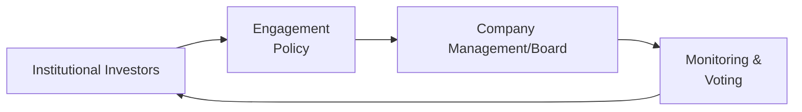

## Overview
Institutional investors—like pension funds, insurance companies, mutual funds, and sovereign wealth funds—are heavyweights in the financial markets. They manage money on behalf of others, known as beneficiaries, and typically have vast capital under management. Their size and influence mean they often wield considerable power in shaping corporate policies, governance practices, and market trends. You might be amazed at just how much these institutions can move the needle on everything from executive pay packages to long-term sustainability goals.

In my early days of studying finance, I remember being blown away by the sheer scale of institutional holdings. I had this notion that large companies were mostly owned by lots of small shareholders. Then I discovered that sometimes 60%, 70%, or even more of a company’s publicly traded shares can be held collectively by a handful of huge institutions. That realization gave me a whole new perspective on the leverage these big players have in corporate decision-making.

Below, we’ll explore the key types of institutional investors, their typical objectives and constraints, and how their fiduciary responsibilities and stewardship efforts affect the companies they invest in. We’ll also dive into how they might collaborate—or clash—with company management to drive strategy, adopt rigorous governance practices, and focus on environmental, social, and governance (ESG) targets.

## Key Types of Institutional Investors
The term “institutional investor” refers to any specialized, professional organization that invests large sums of money on behalf of others. While each type has unique objectives and risk tolerances, all share a fiduciary duty to safeguard the interests of their stakeholders.

### Pension Funds
Pension funds pool contributions from employers and employees to provide retirement benefits. Because retirement liabilities often stretch decades into the future, pension funds typically focus on long-term investments. They are highly sensitive to asset-liability matching: ensuring that the returns earned meet or exceed the future payments promised to retirees.

• Primary Goal: Secure stable returns to meet retirement obligations.  
• Investment Horizon: Usually long-term (20–30 years or more).  
• Regulatory Environment: Subject to specific licensing and governance rules, including restrictions on certain assets.  
• Influence: Pension funds often engage deeply in governance because they aim to protect beneficiaries’ long-term interests.

### Insurance Companies
Insurance companies hold assets to meet their future claims obligations—think of life insurers, property-casualty insurers, and so on. Due to the nature of insurance liabilities, these companies maintain investment portfolios aligned with their risk profiles, focusing on predictable cash flows and capital preservation. That said, some insurance companies also hold equity positions in firms and can vote on corporate matters.

• Primary Goal: Match investment returns with policyholder claims while staying solvent across market cycles.  
• Investment Horizon: Varies, but often medium-to-long-term.  
• Regulatory Environment: Strict capital and risk-based solvency requirements.  
• Influence: Engage with companies primarily to ensure stable operations and mitigate tail risks.

### Mutual Funds
Mutual funds pool money from retail and institutional investors and invest in diversified portfolios of stocks, bonds, or other securities. They can range from actively managed funds (where managers select investments attempting to outperform the market) to passive index funds (where the fund mirrors a specific market index).

• Primary Goal: Deliver returns aligned with the fund’s stated investment objective (e.g., growth, value, sector-specific).  
• Investment Horizon: Ranges from short-term to long-term, depending on the fund’s strategy.  
• Regulatory Environment: In most jurisdictions, subject to securities regulations that protect retail investors.  
• Influence: Large mutual fund providers hold significant stakes across many companies and can be influential via proxy voting.

### Hedge Funds
Hedge funds employ a wide variety of strategies—long-short equity, global macro, event-driven, and more—and often seek absolute returns uncorrelated with the broader market. These vehicles can be more opportunistic and agile, potentially aiming for quick results.

• Primary Goal: Achieve high absolute returns, often with a higher risk tolerance.  
• Investment Horizon: Frequently shorter-term, though some have longer lock-up periods and investment durations.  
• Regulatory Environment: Usually less regulated and only open to accredited or qualified investors.  
• Influence: Hedge funds can take activist positions, pressuring companies to change strategy, spin off divisions, or adjust capital structure.

### Sovereign Wealth Funds
Sovereign wealth funds (SWFs) are state-owned investment vehicles created to manage a nation’s excess reserves (frequently derived from commodities like oil or from foreign exchange surpluses). They invest across various asset classes, including equities, fixed income, real estate, and infrastructure.

• Primary Goal: Preserve and grow national wealth for present and future generations, stabilize government spending.  
• Investment Horizon: Often very long-term, reflecting national objectives and intergenerational equity.  
• Regulatory Environment: Governed by sovereign mandates; compliance with local and international norms can vary.  
• Influence: Can direct large investments into strategic sectors, occasionally with geopolitical considerations.

### Endowments and Foundations
University endowments and philanthropic foundations receive donations and invest those funds to support their missions indefinitely. Typically, they pursue long-term returns to ensure stable funding for scholarships, research, or charitable programs.

• Primary Goal: Maintain purchasing power across generations while funding specific missions.  
• Investment Horizon: Extremely long, often perpetual.  
• Regulatory Environment: Subject to oversight by trustees and philanthropic regulations.  
• Influence: Less likely to be activist but may engage on ESG issues that align with institutional values.

## Investment Horizons and Objectives
One of the biggest differences among these investor groups is their time horizon for investing:

• Long-term players (pension funds, SWFs, endowments) generally push for stability and sustainable business practices.  
• Medium-term or flexible investors (most mutual funds and insurers) modestly balance growth potential and risk.  
• Shorter-term or opportunistic investors (hedge funds, event-driven strategies) may push for corporate actions that generate quick returns, such as spin-offs or asset sales.

This variation in time horizon can create interesting dynamics in corporate governance. For instance, a pension fund might oppose radical cost-cutting that yields immediate cash at the expense of long-term competitiveness, whereas a hedge fund might view that same move as a catalyst to boost the firm’s valuation quickly.

## Fiduciary Responsibilities and Stewardship
Institutional investors typically have a fiduciary duty to act in the best interests of their beneficiaries. This legal obligation ensures prudent decision-making and demands careful monitoring of investee companies. Fiduciaries must evaluate how each investment aligns with objectives and risk tolerances, and also how corporate decisions—like major acquisitions or capital spending—might affect share value.

Many institutions adhere to stewardship codes, which set out principles like demonstrating transparency, managing conflicts of interest, and guiding constructive dialogue with investee companies. In practice, this might mean:

• Establishing a formal engagement policy.  
• Conducting periodic meetings with senior management.  
• Evaluating and voting on shareholder resolutions.  
• Working collaboratively with other investors on governance concerns.

## Influence on Corporate Governance
Given their substantial holdings, institutional investors can significantly influence a company’s governance structure, executive compensation, and ESG strategy. This can materialize in several ways:

• Voting Power: Large share blocks give institutions a strong voice in shareholder voting, particularly on critical agenda items such as director elections or merger approvals.  
• Engagement and Dialogue: Institutions can directly communicate with company boards and management teams to share concerns or strategic perspectives.  
• Public Pressure: In more contentious situations, institutional investors may issue public statements or press for new board members.  
• Coalition Building: Investors sometimes form coalitions (both formal and informal) to amplify their influence on specific issues, such as climate-change risks or board diversity.

When used responsibly, this influence can improve accountability, transparency, and long-term performance. However, it can also be a hassle for companies if the investors are at odds with management’s strategy.

## Case Study: Coordinated Engagement for ESG
Imagine a global asset manager that invests on behalf of pension plans across multiple regions. This manager might notice that several of its largest holdings have subpar environmental disclosures, which conflict with its stated commitment to long-term sustainable returns. If management doesn’t respond to private outreach, the asset manager could:

• File shareholder proposals urging enhanced ESG reporting.  
• Collaborate with other institutional investors who share the same concern, creating a larger voting bloc.  
• Escalate the issue at annual general meetings, potentially voting against board members who neglect sustainability oversight.

Over time, these efforts can prompt changes like formalizing sustainability committees, adopting stricter environmental targets, or integrating ESG performance metrics into executive pay structures.

## Short Python Snippet for Simple Allocation Analysis
For a fun illustration—nothing too fancy—here’s a brief Python snippet that simulates weighting allocations for different institutional investors in a hypothetical company’s shareholder base. This is just a playful example of analyzing the cumulative influence of each:

```python
investor_stakes = {
    "Global Pension Fund": 15.0,
    "Life Insurance Co": 8.5,
    "Sunrise Mutual": 12.5,
    "Activist Hedge Fund": 5.0,
    "Sovereign Wealth": 10.0,
    "Retail Investors": 49.0
}

threshold = 20  # Any single investor or group exceeding this might be a major influencer

total_control_block = 0
major_investors = []

for name, stake in investor_stakes.items():
    if stake >= threshold:
        major_investors.append(name)
    total_control_block += stake
    
print("Total Ownership = ", total_control_block, "%")    
print("Major investors who individually exceed", threshold, "%:", major_investors)

block_influence = investor_stakes["Global Pension Fund"] + investor_stakes["Sunrise Mutual"]
print("Combined Pension + Mutual holding:", block_influence, "%")
if block_influence > threshold:
    print("They have a significant voting block.")
```

## Common Pitfalls and Challenges
• Short-Term vs. Long-Term Tensions: Different investors may push management in conflicting directions. Reconciling these demands can distract from the firm’s strategy.  
• Conflicts of Interest: Some institutions have business ties that could color their judgment—for example, an insurer with cross-holdings in its clients.  
• Overreliance on Proxy Advisers: Big investors may rely on proxy advisory firms to handle the logistics of voting. However, potential mistakes in voting recommendations can skew outcomes.  
• Public Relations Fallout: High-profile conflicts between institutional shareholders and management can lead to negative media coverage and brand damage.

## Diagram: Institutional Investors’ Engagement Flow
Below is a simple Mermaid diagram laying out a high-level flow of how institutional investors engage with companies:



• A represents the institutional investors initiating or updating their engagement policy.  
• B is the policy framework guiding how they engage with companies.  
• C is the company’s management and board receiving input from these investors.  
• D indicates the outcome of engagement: monitoring improvements, voting on proposals, or continuing the dialogue.

## Best Practices and Strategies
• Develop Clear Engagement Policies: Investors should be transparent about their governance priorities, so companies can better anticipate concerns.  
• Communicate Early and Often: Institutional investors benefit from open channels of communication with management to address red flags before proxy season.  
• Collaborate Where Possible: Coordination among institutional investors amplifies their message and prevents contradictory agendas.  
• Monitor Outcomes: Following up on agreed-upon changes is crucial. Post-engagement reviews help ensure accountability and continuous improvement.

## Final Thoughts for Learners
Perhaps the biggest takeaway is recognizing that institutional investors are not monolithic. They come in many shapes and sizes, with different strategies, time horizons, and degrees of involvement in governance. As a CFA candidate—or a finance professional building your skills—understanding these dynamics is crucial, whether you end up working for a corporate issuer or within an institutional investment firm.

On the exam (and in real-life practice), you’ll typically want to assess how an investor’s objectives align with the strategic direction of a company. Think carefully about each investor’s risk appetite, required returns, and broader stewardship responsibilities. Also, watch for ways in which large-scale investor engagement influences a firm’s capital structure, payout policies, and approach to ESG.

Putting it all together: Focus on the interplay between organizational objectives and the realm of corporate governance. Institutional investors can be a force for positive change and long-term value creation, but they can also spark tension. Navigating these nuances will hone your ability to make informed, ethically grounded decisions in the world of corporate finance.

## References and Further Exploration
• Pension Fund Investment Management by Frank J. Fabozzi.  
• UN Principles for Responsible Investment (https://www.unpri.org/).  
• International Corporate Governance Network (ICGN) (https://www.icgn.org/) for governance best practices.  

## Test Your Knowledge: Institutional Investors Quiz



### Institutional investors often have fiduciary responsibilities to act in the best interests of which group?

- [ ] Corporate boards
- [x] Beneficiaries or clients
- [ ] Chief executives
- [ ] Competitors in the same sector

> **Explanation:** Fiduciary duty compels institutional investors to prioritize the interests of those who entrust them with capital, such as pensioners or policyholders.


### Which type of institutional investor usually has the longest investment horizon?

- [ ] Hedge funds
- [ ] Mutual funds
- [x] Pension funds
- [ ] Venture capital firms

> **Explanation:** Pension funds require stable, long-term returns to meet future liabilities, often spanning decades.


### A stewardship code primarily outlines:

- [x] Best practices for responsible engagement and voting
- [ ] Techniques for micro-managing corporate operations
- [ ] Laws to imprison CEOs who behave poorly
- [ ] Steps to eliminate liquid securities from a portfolio

> **Explanation:** Stewardship codes establish guidelines to ensure institutional investors exercise their rights responsibly and engage with companies effectively.


### Which of the following is a potential benefit of coordinated investor engagement?

- [ ] Decreased market efficiency
- [x] Greater collective influence on corporate policies
- [ ] Lower accountability for large-scale investors
- [ ] Elimination of fiduciary responsibilities

> **Explanation:** When investors band together, they amplify their message, often achieving more significant governance changes than they could individually.


### Hedge funds are often characterized by:

- [x] A wide variety of investment strategies and potentially higher risk
- [ ] Exclusively passive investment approaches
- [ ] Very strict retail-focused regulations
- [ ] Inability to engage with corporate management

> **Explanation:** Hedge funds typically follow diverse, sometimes high-risk strategies and can actively engage in shaping corporate actions.


### Why might a life insurance company hold a portfolio of long-term bonds?

- [x] To match the duration of future policyholder obligations
- [ ] To riskily speculate in emerging market stocks
- [ ] To avoid all forms of regulatory scrutiny
- [ ] To provide daily liquidity for day traders

> **Explanation:** Insurers must align the maturity structure of their assets with their liability profiles, ensuring they can meet long-term claims.


### Which of the following best describes proxy voting for mutual funds?

- [x] Voting on behalf of investors’ shares in companies held by the fund
- [ ] Disregarding shareholder resolutions as irrelevant
- [ ] Exclusively focusing on environmental proposals
- [ ] Illegal under most securities regulations

> **Explanation:** Mutual funds vote the shares they hold for investors, influencing corporate governance decisions according to the fund’s policies.


### One key difference between long-term and short-term institutional investors is:

- [x] Their time horizon for expected investment returns
- [ ] Their reliance on the same performance benchmark
- [ ] Their complete immunity to market fluctuations
- [ ] Their uniform approach to ESG factors

> **Explanation:** Short-term investors, such as certain hedge funds, often look for immediate catalysts, while pension funds are typically planning for multi-decade returns.


### A sovereign wealth fund typically:

- [x] Invests the nation’s surplus revenues across diversified assets
- [ ] Operates without any government oversight
- [ ] Manages only philanthropic donations for universities
- [ ] Focuses solely on day trading strategies

> **Explanation:** Sovereign wealth funds manage a country’s excess reserves, often seeking intergenerational wealth preservation.


### True or False: Institutional investors can influence executive compensation by exercising shareholder voting rights.

- [x] True
- [ ] False

> **Explanation:** Large institutional investors can vote against or propose changes to executive pay packages if they believe they misalign with performance or broader objectives.


