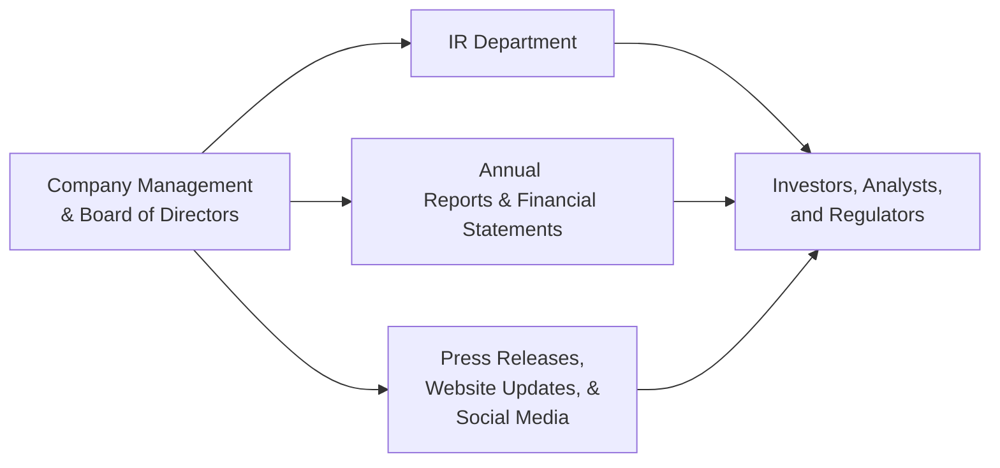

## Overview

Transparency and regular engagement with stakeholders can feel, at times, like a juggling act—especially in dynamic financial markets. Yet, strong communication practices are absolutely core to building trust, enhancing corporate reputation, and reducing uncertainty among investors, lenders, boards, and even the broader community. In this section, we’ll explore a variety of key communication channels, discuss best practices for delivering essential information, and highlight some common challenges. We’ll also see how thoughtful communication strategies tie into broader topics explored in this chapter, such as stakeholder conflicts, minority shareholder protections, and the role of institutional investors.

## Importance of Effective Communication

Before we delve into specific channels, let’s pause to consider why strong communication practices matter. First, they reinforce accountability: once stakeholders have clear insight into a company’s performance, they can hold the leadership team responsible for outcomes. Second, transparency in communications limits the rumor mill and helps prevent misinformation from taking root. Third, consistent updates and robust disclosure can smooth out volatility in a company’s share price, as the market typically rewards clarity and punishes rumor-driven speculation.

There’s also an element of stakeholder confidence at work. For instance, when a CFO walks through major strategic decisions with clarity and candor, guess what happens? Investors, lenders, and other parties become less anxious and more supportive. In my past life working in investor relations (IR), I saw firsthand how a straightforward explanation of quarterly variances in revenue often quelled concerns that might otherwise balloon into bigger issues. Even small bits of timely information, like an updated sales forecast or a notice about changes in management, can be pivotal.

## Key Communication Channels

### Annual Reports and Financial Statements

Annual reports and audited financial statements are the bedrock of formal communication. These documents provide:

• A comprehensive overview of company performance, including revenue, Net Income, and operating margins.  
• Management’s discussion and analysis (MD&A), which outlines the reasons behind performance trends and expectations for the future.  
• Disclosures regarding risks, corporate governance, and compliance with regulatory standards.  

Investors and analysts rely on these reports to make informed decisions, so timeliness and accuracy are paramount. Discrepancies—in the footnotes, for example—may raise doubts. Moreover, both International Financial Reporting Standards (IFRS) and US Generally Accepted Accounting Principles (GAAP) require specific disclosures on material matters, ensuring that crucial facts (like significant litigation or major capital expenditures) are appropriately communicated.

### Company Websites, Press Releases, and Investor Presentations

Company websites serve as a living communication tool. While an annual report is more of a snapshot, the website and press releases function more like a dynamic journal, regularly updated with:

• New product announcements or strategic initiatives  
• Changes in leadership or major hires  
• Upcoming events such as conferences or trade shows  

Meanwhile, investor presentations typically accompany quarterly earnings releases, industry conferences, and non-deal roadshows. These can highlight crucial metrics such as sales breakdown by region, recent capital investments, or guidance for the coming periods. Remember that a well-designed slideshow can sometimes communicate complex data more effectively than a lengthy text-based report.

### Investor Relations (IR) Department

As introduced in 2.2 (Stakeholder Groups and Their Interests), multiple groups contend for the corporation’s attention: institutional investors, retail shareholders, bondholders, and more. This coordination is usually handled by the IR department. They literally bridge the gap between management and external parties by:

• Delivering corporate updates to investors and analysts.  
• Responding to queries about financial results or strategic decisions.  
• Organizing special events, such as analyst days or non-deal roadshows, to maintain investor engagement.  

In many jurisdictions, IR also ensures compliance with disclosure regulations—for instance, in the United States, Regulation Fair Disclosure (Reg FD) mandates that all material information be disseminated to the investing public simultaneously. So, if an IR professional only told a few key analysts about a crucial contract or a revenue shortfall, that might create a selective disclosure problem (and potential legal troubles).

### General Meetings, Conference Calls, and Webcasts

Annual general meetings (AGMs) and extraordinary general meetings (EGMs) are primary vehicles for direct communication between the board, management, and the broader shareholder base. Stakeholders can ask questions, propose resolutions, and vote on critical governance matters. Companies often also conduct:

• Quarterly earnings calls or webcasts, discussing financial and operational updates.  
• Live Q&A sessions, enabling direct interaction with key executives.  

From an exam perspective, keep in mind that these venues are not just for show. If an executive reveals new “material information” during a call, the company might be obligated to issue a press release so that all stakeholders have equal access. This practice helps maintain market fairness and can limit insider trading risks.

### Corporate Social Media Accounts

You might be thinking, “Wait, is social media even relevant for a large corporation dealing with major stakeholders?” Absolutely yes. Social media platforms—from LinkedIn to Twitter—provide near-instant updates to a wide audience. They’re also increasingly used for crisis management, responding quickly when negative news breaks. A real-world example: during product safety recalls, some companies have posted immediate alerts on their official social channels, often significantly reducing the rumor-mongering that can follow. However, such postings must still align with disclosure regulations. You can’t just tweet something that would move markets without also posting it in official filings or press releases.

## Impact on Market Perceptions and Share Price

Communication has a direct link to market sentiment and share price stability. For instance, if the CEO of a multinational corporation abruptly leaves, a well-timed press release with context and reassurance about succession planning might calm anxious investors. On the flip side, a poorly communicated strategic pivot (like venturing into a completely new market without clarity on rationale) can create confusion, sending the stock price plunging. The less formal channels—social media, for instance—are often scrutinized by short-term traders looking for hints or tone shifts that might signal a big announcement.

From an exam standpoint, remember that investor psychology interacts with real-world financial statements. Even if the fundamentals look okay, negative or ambiguous signals from management can impact cost of capital (since stakeholders might see the company as riskier). This interplay underscores why “soft” messaging skills matter as much as “hard” financial data.

## Diagrams: Information Flow to Stakeholders

Below is a simplified flowchart illustrating how information can travel from company management to various stakeholders:

In this diagram, management is the primary source of data that gets distributed through multiple channels, with the IR department often playing a central coordinating role.

## Best Practices for Communication

• Consistency: Whenever disclosures go out, maintain a consistent tone and storyline. If your business environment changes—say commodity prices jump—tie that to what you’ve previously said regarding risk management.  
• Timeliness: Delayed communication can feed rumors. Rapid updates reduce information asymmetry.  
• Accessibility: Provide materials in various formats. Not every stakeholder will dive into an 80-page PDF. Short summary videos or infographics can widen reach.  
• Compliance: Respect legal requirements and guidelines from bodies like the SEC in the US, the FCA in the UK, or relevant authorities in other regions. Adhere to IFRS/GAAP for numeric disclosures.  
• Engagement: Encourage Q&A in conference calls. Host online forums or live streamed events. Genuine interaction fosters trust and can reveal stakeholder concerns early on.

## Potential Pitfalls and Challenges

Even the best communication strategy can run into snags:

• Selective Disclosure: Accidentally sharing material information with a small group of analysts or certain investors.  
• Overhyping: Managers may be tempted to paint too rosy a picture. Once reality hits, credibility can suffer.  
• Under-Communication: Failing to mention critical developments—like significant product delays—can create legal liabilities, particularly when “material” events are not disclosed.  
• Cultural/Language Barriers: Large multinational firms might operate in multiple time zones and languages, complicating the uniformity of messages.  

Staying on top of these issues takes discipline and often requires strong internal processes. For instance, centralizing the approval of any external statements can help ensure consistent messaging.

## Real-World Example: Non-Deal Roadshows

Non-deal roadshows illustrate how corporations can maintain dialogues with institutional investors even when they aren’t looking to raise capital. In these engagements, C-suite executives and IR professionals travel to meet large investors, share business updates, and gather feedback. It’s a proactive approach that can help gauge market sentiment and shape future strategic decisions. But it’s also a prime opportunity for selective disclosure pitfalls. Companies must be careful that any major revelation shared with one investor group is also made publicly available.

## Glossary

• Investor Relations (IR): A strategic management responsibility that integrates finance, communication, marketing, and compliance to optimize the flow of information between a company and stakeholders.  
• Earnings Call/Webcast: A quarterly or annual forum (often online) where management discusses financial results, operational progress, and outlook with analysts and investors.  
• Non-Deal Roadshow: A series of meetings with potential or existing investors without an explicit capital-raising goal, meant to maintain visibility and gather market feedback.  
• Material Information: Any information that could significantly influence an investor’s decision to buy or sell securities.  

## References and Further Reading

• National Investor Relations Institute (NIRI):  
  – Best practices, case studies, and conferences. (https://www.niri.org/)  
• Business Roundtable Publications:  
  – “Guide to Effective Stakeholder Communication,” covering ethics and governance best practices.  
• “The Theory and Practice of Investor Relations Management,” Corporate Communications: An International Journal (Emerald Insight).  
• CFA Institute – Code of Ethics and Standards of Professional Conduct:  
  – Emphasizes fair dealings and accurate representation in communicating with clients and prospects.  
• Local Regulatory Guidelines:  
  – For example, Regulation FD in the US, the Market Abuse Regulation (MAR) in the EU, etc.

## Exam Relevance and Final Tips

In exam questions, you might see scenarios testing your ability to spot selective disclosure problems, evaluate announcements in annual filings, or determine the best channel to communicate time-sensitive information. Pay close attention to how the question frames “materiality” and which stakeholders need immediate disclosure. Remember that effective communication underpins both corporate governance (Chapter 3) and stakeholder relations (Chapter 2). If you see “agency costs” or “minority shareholder rights” mentioned, think about how robust disclosure and engagement practices might mitigate potential conflicts.

A few final reminders:

• Understand the nature of each communication channel—some are formal, some more conversational—and know how to use them appropriately.  
• Integrate consistency, timeliness, compliance, and engagement in your approach.  
• Watch for the interplay between disclosure and market reaction.  
• Consider stakeholder perceptions in your answers: how and what you communicate can shift everything from share price to lender terms.

If you keep these points in mind, you’ll be in a better position to address communication-based exam questions successfully and apply them in professional practice.

---

## Test Your Knowledge: Stakeholder Communication Channels



### Which of the following illustrates a formal channel of communication with stakeholders?

- [ ] A series of tweets about product updates
- [x] An audited annual report filed with regulators
- [ ] A private question-and-answer session with select analysts
- [ ] An internal memo circulated among employees only

> **Explanation:** Tweeting and holding private sessions can be considered more informal or selective. An audited annual report filed with the regulator is a formal channel that provides comprehensive financial and strategic disclosure to all stakeholders.

### A company arranges special meetings with high-net-worth investors but is not issuing new securities. What type of engagement is this most likely to represent?

- [ ] A mandatory annual shareholder meeting
- [ ] The issuance of private placement debt
- [x] A non-deal roadshow
- [ ] An activist-driven board meeting

> **Explanation:** A non-deal roadshow is used to maintain ongoing discussions with investors when there is no actual deal (equity or debt issuance) in process.

### A CFO discloses new material information to a single analyst before making a formal public announcement. Which of the following is most likely the primary regulatory concern?

- [ ] The CFO made an innocent mistake, so it is not a legal issue.
- [x] Selective disclosure, which can violate fair disclosure regulations.
- [ ] Fraudulent misrepresentation on conference calls.
- [ ] Mandatory insider trading by the analyst.

> **Explanation:** Providing material information to only a small group of stakeholders before public release constitutes selective disclosure, violating fair disclosure requirements in many jurisdictions.

### Which communication channel typically has the highest level of assurance and reliability for stakeholders?

- [ ] Social media updates
- [x] Audited annual financial statements
- [ ] Press releases
- [ ] Internal monthly newsletters

> **Explanation:** Annual financial reports are subject to independent audits and strict regulatory standards, giving them the highest level of credibility among listed channels.

### Management wants to convey a complex change in strategic direction that includes multiple market segments and financial projections. Which channel combination could be the most effective?

- [ ] A single-page press release
- [ ] A series of social media stories
- [x] A detailed investor presentation and webcast, plus a press release
- [ ] An internal memo only

> **Explanation:** A detailed investor presentation and accompanying webcast allows for a thorough explanation and Q&A, while a press release ensures broad reach. Social media alone may not capture the strategy’s complexity.

### A publicly listed company posts its quarterly earnings on its website but fails to issue the same information to stock exchanges and major media outlets. Which best practice has it violated?

- [x] Simultaneous release of material information to all stakeholders
- [ ] Over-disclosure of sensitive data
- [ ] Use of multiple distribution channels
- [ ] Meeting prescriptive IFRS footnote requirements

> **Explanation:** Companies should release material information simultaneously across all major distribution channels to ensure no stakeholder is disadvantaged.

### In a quarterly earnings call, the CEO makes a forward-looking statement about future products. Which principle is most relevant for ensuring compliance and accurate market understanding?

- [x] Provide adequate cautionary language and disclaimers
- [ ] Withhold all future-oriented details
- [ ] Share only if the product is fully realized
- [ ] Use employee social media accounts to gauge feedback

> **Explanation:** Forward-looking statements typically require cautionary language under securities regulations to clarify the assumptions and risks involved.

### Which channel is most susceptible to real-time market rumors and immediate responses?

- [x] Social media
- [ ] Annual reports
- [ ] Quarterly financial statements
- [ ] General meetings

> **Explanation:** Social media platforms allow immediate posting, amplify market rumors quickly, and can provoke instantaneous reactions from stakeholders.

### Which of the following best characterizes the role of the Investor Relations (IR) department?

- [ ] Formulating detailed internal strategy for product launches
- [ ] Managing cybersecurity risks
- [x] Serving as a liaison between company management, investors, analysts, and regulators
- [ ] Determining payroll and employee benefits

> **Explanation:** By definition, IR is responsible for bridging the gap between internal management and external stakeholders such as shareholders and analysts.

### True or False: Poor communication can increase a company’s perceived risk and potentially raise the cost of capital.

- [x] True
- [ ] False

> **Explanation:** Inconsistent or substandard communication can shake investor confidence. Stakeholders may demand higher returns (i.e., cost of capital) to compensate for uncertainty.


