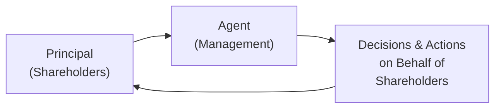

## Overview

What happens when the people who own a company (shareholders) are not the same folks who run it (management)? Well, that’s basically the story behind principal–agent conflicts. I once chatted with a friend who owned a small local business; he complained that when he hired managers, they suddenly began spending on fancy office furniture that he himself would never have approved. This mismatch between the owner’s priorities (minimize waste, maximize profit) and the manager’s personal objectives (maybe nicer chairs) is the core of what we call the principal–agent problem.

For larger corporations, this can get pretty complicated—and expensive. Shareholders, or principals, rely on managers (agents) to make decisions in the best interests of the firm. But if managers have limited stake in the firm’s outcomes, or if they have other agendas, they might pursue perks, empire-building, or personal prestige that offers them satisfaction but might hurt shareholder value. Enter agency costs: the price we pay to keep managers’ decisions and shareholders’ best interests aligned.

## The Principal–Agent Problem

In finance theory, Jensen and Meckling brought the idea of the principal–agent relationship to the forefront. Their research helped everyone realize that once you separate ownership (the principal) from control (the agent), a risk emerges. We typically see issues like:

• Excessive risk-taking (or insufficient risk-taking) when managers want to protect their positions.  
• Managers awarding themselves lavish compensation packages or expensive corporate jets.  
• Managers delaying tough decisions—like cutting an underperforming division—if it jeopardizes their job security or reputation.

Over time, these conflicts eat away at value. In well-functioning markets, firms try to align managerial interests with shareholder interests—through stock options, restricted stock, or performance-based bonuses. But, as you might guess, there’s no perfect solution. Monitoring is also key: boards of directors, auditors, and regulators keep watch. However, monitoring itself has a cost, and that cost is part of what we call “agency costs.”

Below is a simple diagram illustrating the relationship between principals and agents in a corporation:

## Common Agency Costs

Agency costs come in a few flavors, and they generally boil down to:

• Monitoring Costs: Expenses to monitor managerial behavior, like hiring external auditors or specialized consultants.  
• Bonding Costs: Funds spent by agents to show that they are trustworthy, such as performance bonds or third-party verifications.  
• Residual Loss: The value lost when decisions are still misaligned, even after monitoring and bonding. Think of it as the leftover friction that you just can’t fix.

### Monitoring Costs

The most obvious example is an external audit. Shareholders (through the board) pay for an independent auditor or a consulting firm to review the financials. These costs can be steep. In many large firms, you might see separate consultants reviewing internal controls for compliance with frameworks like COSO or Sarbanes-Oxley—especially if the firm is subject to US GAAP or IFRS. Or there might be oversight committees that convene to ensure top management is on the right path. All these costs are part of the “monitoring” process to reduce the risk of managerial mischief.

### Bonding Costs

Sometimes managers will buy company stock at their own expense—this is them basically saying, “Hey, I have skin in the game, you can trust I’m motivated by the company’s success.” Or they might sign a contract that penalizes them if they leave the firm too early or fail to meet performance targets. These actions can help reassure shareholders that managers won't just bail at the first sign of trouble. But these arrangements themselves can be costly and require documentation, legal fees, and so on.

### Residual Loss

Even with the best monitoring and bonding, no system is perfect. Maybe managers still choose suboptimal investments that give them personal prestige (like an acquisition spree that doubles their empire but doesn’t really improve earnings per share). The cost of those suboptimal choices is a residual loss. In real life, it’s incredibly tough—and expensive—to monitor every idea management might pursue. That leftover inefficiency is part of the ongoing friction of business.

## Mechanisms to Address Agency Conflicts

### Incentive Alignment

Boards and shareholders often push for performance-based pay. For instance, managers might get stock options that only pay off if the share price surpasses a certain threshold. Or they might earn bonuses tied to return on equity, earnings, or even environmental, social, and governance (ESG) targets. The main idea is to tie managerial compensation to shareholder-friendly outcomes. But you’ve probably heard some stories where executives still find loopholes—like artificially boosting earnings short-term at the expense of long-term sustainability—so designing these incentives is tricky.

### Board Oversight and Independence

An independent board of directors can be a powerful check on managerial overreach. A strong, independent audit committee can question suspicious accounting entries; a separate compensation committee can set executive pay that is more aligned with shareholder returns. In practice, though, if the board is loaded with management’s friends—or if the CEO is also the board chair—well, you can guess how truly “independent” those decisions will be.

### Shareholder Activism

Activist investors—like hedge funds—sometimes push for changes when they believe the board is asleep at the wheel. They can accumulate enough shares to force board seats or threaten a proxy fight, thereby pressuring management to alter strategic decisions, slash excessive spending, or dethrone an ineffective CEO. Although activism can be controversial, it can also serve as an external check on entrenchment.

### Takeover Threat

The possibility of a hostile takeover—where an outside bidder swoops in and buys control—serves as an external governance mechanism. In theory, if managers are performing poorly, the firm’s stock price might be depressed enough that a competitor or private equity group sees an opportunity. Knowing that they could be ousted if the firm’s value slips can prod management to keep shareholder value in mind.

## Moral Hazard and Adverse Selection

Sometimes managers might accept more risk than what shareholders truly want. For instance, if a manager’s knowledge—and reward structure—is skewed, they might initiate a project that has a big downside for shareholders yet a big upside for them personally, especially if their compensation is heavily bonus-based. That potential for misalignment is moral hazard.

Adverse selection is a slightly different, though related, concept: managers might hide certain negative information from prospective shareholders (or new hires), leading those shareholders to make the wrong decision about investing or even voting on a strategic plan. Both moral hazard and adverse selection hamper capital allocation efficiency and inflate agency costs.

## Managerial Entrenchment

Ever see a CEO who’s practically immovable even if the company keeps missing quarterly targets? That’s entrenchment. Often, it’s because they’ve shaped the board or built a web of allies within the firm. Trying to replace them might trigger expensive severance packages or messy legal battles. In entrenchment situations, managers have a high degree of control, so they’re less likely to act consistently in shareholders’ best interest unless their personal interests happen to coincide.

## Practical Illustration

Let’s take a hypothetical scenario: Redwood Tech. Redwood’s CFO has a large portion of her compensation in the form of Redwood’s stock, which vests over three years. Meanwhile, Redwood’s CTO has a fixed salary with minimal equity. You can probably see where this is going:

• The CFO, with equity incentives, is pushing for a streamlined R&D plan that can show near-term profitability.  
• The CTO, though, might favor big, ambitious projects—impressive from a tech standpoint, but with uncertain returns—because a fixed salary means job security even if the project fails to deliver immediate results.

To mitigate this conflict, Redwood might introduce a bonus structure for the CTO with milestones tied to a project’s commercial viability. In addition, Redwood might appoint an external technology adviser to the board who can help assess project viability. All those solutions cost time, money, and resources—classic agency costs—but if done right, Redwood can keep its leadership’s interests aligned for the long run.

## Best Practices and Common Pitfalls

1. Align Compensation with Long-Term Goals  
   If executive pay is tied primarily to short-term financial metrics, managers might inflate near-term numbers to get higher bonuses, secretly undermining the company’s long-term viability.

2. Maintain True Board Independence  
   Interlocking directorships (where board members serve on each other’s boards) or nepotism can compromise the board's objectivity. Experienced, external directors help reduce agency conflicts.

3. Ensure Transparent Disclosure  
   High-quality, timely financial statements provide a clearer view of performance and reduce information asymmetry. This transparency is crucial for shareholders to evaluate management decisions and intervene if needed.

4. Remain Vigilant about Company Culture  
   Even the best compensation designs can fail if the corporate culture incentivizes the wrong behaviors. Having an open-door policy or strong whistleblower mechanisms can help detect early signs of misalignment.

5. Plan for Succession  
   If there's no plan for who steps in when the CEO retires (or is removed), managers can become entrenched. A robust succession plan ensures leadership continuity and prevents power consolidation.

## Exam Tips and Pitfalls

• For the CFA exam, especially in scenario-based questions, remember to identify the type of agency cost: monitoring, bonding, or residual.  
• Look for “red flags” like boards that are too close to management, unusually high executive perks, or a compensation structure that rewards short-term stock price spikes.  
• If given a case with moral hazard, ask: Is management protected from the downside? Then that’s likely moral hazard at play.  
• If given a case with adverse selection, ask: Was critical information hidden? Did one party have more knowledge than the other?  
• Consider how different corporate governance structures—like an activist investor or a powerful independent board—might reduce agency conflicts.  
• In essay responses, show how to align incentives, weigh the costs of monitoring, and discuss trade-offs in real-world applications (like Redwood Tech in the illustration).

## References and Further Reading

• Jensen, M.C. and Meckling, W.H. “Theory of the Firm: Managerial Behavior, Agency Costs and Ownership Structure.” Journal of Financial Economics.  
• Fama, E.F. “Agency Problems and the Theory of the Firm.” Journal of Political Economy.  
• OECD Principles of Corporate Governance: https://www.oecd.org/corporate/principles-corporate-governance.htm  
• Harvard Business Review, various articles on executive compensation and corporate governance best practices.

-------------------

## Test Your Knowledge: Principal–Agent Conflicts and Agency Costs



### Which of the following best describes the principal–agent conflict?

- [ ] The conflict between bondholders and shareholders over capital structure decisions.  
- [x] The conflict between owners (shareholders) and managers (agents) caused by misaligned incentives.  
- [ ] The conflict between employees and customers over product pricing.  
- [ ] The conflict between regulators and company stakeholders regarding compliance.  

> **Explanation:** Principal–agent conflict arises when the interests of those who manage a firm (agents) are not perfectly aligned with those who own the firm (principals).

### Which of the following is an example of a monitoring cost?

- [ ] A manager’s salary increase due to market adjustments.  
- [x] Hiring an external auditor to verify financial statements.  
- [ ] Costs associated with a new product launch.  
- [ ] Paying dividends to shareholders.  

> **Explanation:** Monitoring costs typically involve expenses to oversee or audit managerial behavior, such as engaging external auditors.

### If a manager deliberately chooses a riskier project than shareholders prefer because she benefits more from any upside, which issue is this illustrating?

- [ ] Adverse selection.  
- [x] Moral hazard.  
- [ ] Managerial entrenchment.  
- [ ] Minority shareholder oppression.  

> **Explanation:** Moral hazard occurs when the manager can benefit from the project’s upside while shareholders bear most of the downside risk.

### Entrenchment describes a situation where:

- [ ] Shareholders can easily remove and replace senior management.  
- [x] Managers have gained so much control that removing them is difficult.  
- [ ] Managers prioritize bondholder interests over shareholder interests.  
- [ ] A competitor has successfully initiated a hostile takeover.  

> **Explanation:** Entrenchment arises when managers gain extensive control, making it very hard for shareholders or the board to remove them.

### Which of the following strategies can best align manager and shareholder objectives?

- [x] Implementing performance-based compensation linked to long-term metrics.  
- [ ] Allowing managers to determine their own compensation packages.  
- [x] Requiring significant equity ownership by managers.  
- [ ] Eliminating board oversight to reduce costs.  

> **Explanation:** Long-term performance-based compensation and equity ownership by managers are effective ways to align interests.

### Which of these is considered part of “agency costs” in a firm?

- [x] The expense of an external consultant tasked with reviewing managerial decisions.  
- [ ] Losses from a poor economic environment affecting all firms equally.  
- [ ] Increases in corporate tax rates mandated by the government.  
- [ ] Consumer refunds under warranty policies.  

> **Explanation:** Agency costs include any expense or loss due to the principal–agent relationship, such as paying an external consultant to ensure management’s decisions align with shareholders.

### A firm that heavily relies on short-term stock price boosts to reward executives might encounter:

- [x] Higher risk of short-termism and potential moral hazard.  
- [ ] Lower risk of managerial entrenchment.  
- [x] Misaligned incentives leading to potential underinvestment in R&D.  
- [ ] Reduced requirement for board oversight.  

> **Explanation:** Linking pay heavily to short-term price movement risks encouraging short-term maneuvers and potential neglect of long-term investment.

### When an investor group buys a controlling interest in an underperforming firm to force managerial changes, this is an example of:

- [ ] Adverse selection by new shareholders.  
- [ ] Unrelated corporate spinoffs.  
- [x] The market for corporate control acting as an external governance mechanism.  
- [ ] Performance-based compensation.  

> **Explanation:** Takeover threats are part of external governance mechanisms—if management consistently underperforms, new investors can buy the firm and make changes.

### In which situation is adverse selection most likely to occur?

- [x] A manager withholding negative project information leading to investment in unprofitable ventures.  
- [ ] A board awarding performance-based stock to executives.  
- [ ] An activist shareholder successfully removing a CEO.  
- [ ] A firm paying a higher than normal dividend.  

> **Explanation:** Adverse selection occurs when one party to a transaction—here, the manager—has more information than the other and thus can lead shareholders to make uninformed decisions.

### High managerial ownership of company shares can typically reduce principal–agent conflicts.  
- [x] True  
- [ ] False  

> **Explanation:** When managers own a substantial stake in the company, their personal financial outcomes become more closely tied to shareholders’ outcomes, which helps align interests.


