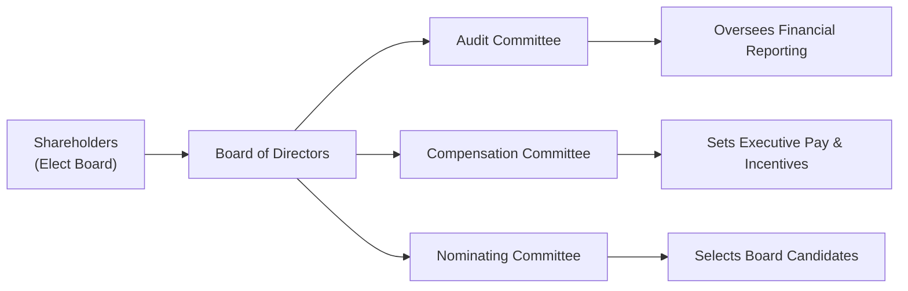

## Introduction

When you think about how a company keeps its leadership in check, you might imagine external regulations, market forces, or activist shareholders clamoring for reforms. However, a big chunk of effective corporate governance happens from within. Internal governance mechanisms—like the board of directors and executive compensation structures—help ensure that managers make decisions that benefit shareholders and other stakeholders over the long haul. This alignment is especially critical in easing the classic principal–agent conflict, where managers (agents) might be tempted to pursue their own goals rather than those of shareholders (principals).

In this section, we will explore how boards of directors and compensation policies work, in concert, to promote transparency, accountability, and sustainable value creation. We’ll also highlight some personal observations, pitfalls, and real-world examples to make the concepts more tangible. This content ties back to prior discussions in Chapter 3.1 on principal–agent conflicts, as well as forward links in the curriculum (e.g., Chapter 2.2 Stakeholder Groups, Chapter 6.2 Capital Structure Theories) because sound governance underpins a company’s financial decisions in every domain—from capital investments to mergers and acquisitions.

## The Board of Directors

### Composition and Role
The board of directors is the strategic heartbeat of corporate governance. Elected by shareholders, boards safeguard shareholders’ (and, arguably, other stakeholders’) interests. While they typically meet only a handful of times per year, these formal gatherings can shape a company’s direction for years, if not decades.

• Independence. An effective board usually comprises a majority of independent directors. In other words, these are non-executive directors who have no close ties to management. Independence aims to reduce conflicts of interest, preserve critical objectivity, and protect minority shareholder rights.

• Expertise and Diversity. Individuals from varied backgrounds—finance, industry-specific experience, regulation, technology, marketing—bring complementary skills that drive more robust decision-making. Diversity of gender, ethnicity, and tenure can help the board remain vigilant to emerging risks and competitive dynamics.

• Oversight Responsibilities. Boards typically hire, fire, and evaluate the chief executive officer (CEO); assess mergers and acquisitions; approve major capital allocation decisions (such as big expansions or share repurchases from Chapter 8, Dividends and Share Repurchases); and oversee risk management. A board can also challenge high-level strategic initiatives, ensuring they are consistent with long-term shareholder value creation.

### Board Dynamics: Independence vs. Management
On the surface, it might seem obvious that boards should keep managers on a short leash, but it doesn’t always happen that way. Suppose you have a longtime CEO who’s a charismatic figure. Over time, certain directors may become close to this CEO, or might feel indebted to them for board appointments or perks. This can compromise independence. In my experience chatting with a few board members while working on a corporate development project, I found that the sense of loyalty that emerges over years of association can subtly shift objectivity. Even well-intentioned boards can become complacent if they lack regular refreshment of skills or new perspectives.

Board tenure also matters. Directors serving beyond a certain number of years (in some jurisdictions, over nine) might be considered, by proxy advisers, less independent. And while continuity is important, it’s often best to balance long-standing directors who know the company’s history with fresh voices who can spot industry disruptors from a mile away.

### Board Committees
In a more advanced take on internal governance, many boards set up committees to tackle specialized areas:

• Audit Committee. Oversees the integrity of financial reporting, interacts with external auditors, and ensures compliance with regulatory standards (e.g., IFRS, US GAAP).  
• Compensation Committee. Crafts executive pay structures that align with shareholders’ long-term interests. They may also handle stock option plans, bonus arrangements, and performance metrics.  
• Nominating Committee. Identifies qualified board candidates and recommends new appointments, ensuring the board’s collective skill set remains up-to-date.

Below is a simplified Mermaid diagram showing multiple board committees and their relationships:

This structure fosters accountability and precision in board oversight. However, the committees are only as effective as their members, their mandates, and their independence from executive influence.

## Compensation Policies and Agency Conflicts

### Why Compensation Matters
Compensation policies link the interests of the people running the company (executives) with those who own it (shareholders). By carefully designing variable pay, boards can steer executives toward better strategic decisions, mitigating short-termism or risk-aversion that might otherwise creep in.

Short-termism—where managers emphasize quarterly earnings at the expense of R&D, capital investments, or intangible assets—can become destructive for shareholder value. By tying part of an executive’s pay to longer time horizons (with multi-year vesting schedules or clawback provisions), companies can help ensure that the individuals steering the firm make decisions that resonate even five or ten years into the future.

### Common Compensation Elements
Compensation typically has a fixed component (base salary) plus variable elements—commonly structured as follows:

• Annual Bonus. Usually based on short-term performance indicators such as earnings per share (EPS), revenue growth, or profit margins.  
• Stock Options. Offer executives the right to purchase shares at a preset (“exercise”) price. If the share price rises above that strike price, the option holder benefits. Stock options encourage managers to pursue strategies they believe will boost the stock price.  
• Restricted Stock Units (RSUs). These represent shares granted to employees, subject to vesting conditions (time-based or performance-based). RSUs can reduce the temptation for managers to artificially pump short-term stock prices because they typically cannot convert the grant into cash until the vesting period ends.  
• Long-Term Incentive Plans (LTIPs). These plans usually revolve around multi-year performance metrics. For instance, a CEO might earn shares or cash if, over a three-year period, the company meets or exceeds certain benchmarks (e.g., total shareholder return or return on invested capital).  
• Clawback Provisions. If a firm discovers managerial misconduct or has to restate earnings due to fraudulent reporting, the clawback mechanism can recover previously awarded bonuses or equity. This not only deters unethical behavior but also reinforces accountability.

### Balancing Short-Term and Long-Term Goals
One major pitfall I’ve seen is an overreliance on near-term metrics. When managers know their bonus is tied primarily to this year’s earnings, they might engage in “earnings smoothing” or cut vital discretionary costs (like R&D or marketing) to meet short-term targets. A balanced approach to compensation, including multi-year vesting of stock and robust performance measures, can mitigate these distortions.  

A friendly CFO once told me, “If I know my entire bonus depends on next quarter’s EPS number, I might think about stretching revenue recognition or deferring certain expenses.” While he was half-joking, the deeper message was clear: if you design the system to reward certain behaviors, you can’t be surprised when managers follow the incentive trail.

### Pay-for-Performance: A Quick Formula View
Sometimes, a simplified pay-for-performance ratio is used as a gauge of alignment. It can be conceptualized as:


\text{Pay-for-Performance Sensitivity} = \frac{\Delta \text{Executive Wealth}}{\Delta \text{Shareholder Wealth}}


The formula conceptually measures how much an executive’s net worth changes in relation to changes in the company’s share price. A higher ratio suggests the executive has a lot at stake and might act in ways that maximize shareholder returns. Of course, if it’s too high, it can push executives toward excessive risk-taking—so there’s a balance to be struck.

## Practical Governance Analysis for Analysts and Investors

Despite robust board oversight and carefully designed compensation plans, governance can still fail. As a Level III candidate or advanced finance professional, you’ll often evaluate corporate governance as part of your security analysis or portfolio management. Some key items to watch:

• Board Composition and Skill Sets. Does the board’s mix of experience match the firm’s strategy and industry? Check the proportion of independent directors, the presence of domain experts, and the board’s track record in challenging questionable management actions.  
• Transparent Performance Metrics. Scrutinize whether the metrics for executive compensation are disclosed, objective, and consistently applied. Are they focusing on the right drivers of long-term success?  
• Risk Oversight. Has the board created appropriate committees (audit, risk management) and do they meet often enough? Are they aware of major operational, market, and cyber risks (see Chapter 7.11: Cybersecurity and Technology Risk)?  
• Pay Discrepancies. Excessive pay packages, especially if unmoored from performance, may suggest weak governance.  
• CEO and Board Chair Duality. In some jurisdictions, best practices recommend separating the roles of CEO and board chair to reduce conflicts. If roles are combined, ask whether there’s a strong lead independent director, or robust checks and balances in place.  

## Integrating Internal Governance with Corporate Strategy

An often-overlooked facet of internal governance is its link to strategic aims. A board that tasks the compensation committee with constructing pay packages around the firm’s strategic priorities—and not just short-term profit—tends to steer executives toward sustainable growth. For instance, if the company’s strategic priority is to invest in new technology that might not pay off for three to five years, a larger portion of equity-based compensation with a multi-year vesting schedule can align managers with that timeline. By contrast, a heavily front-loaded bonus structure might inadvertently discourage investing in intangible assets with uncertain payoffs.

In the context of corporate finance topics from this volume, strong internal governance also influences capital structure (Chapter 6), dividend and share repurchase policies (Chapter 8), and even merger or acquisition decisions (Chapter 9). A well-functioning board ensures that capital allocation decisions reflect the best long-term interest of the company rather than short-lived share-price gains.

## Real-World Case Example

Let’s do a hypothetical scenario, drawing inspiration from real corporate events without naming names:

Imagine “TechNova,” a fast-growing software company. Over three years, TechNova’s revenue soared, but it neglected to invest properly in cybersecurity (a strategic risk area). The board’s risk committee met only once a year, and many members had limited tech expertise. Meanwhile, the CEO’s compensation was largely in stock options tied to short-term revenue growth, with no strong link to operational resilience metrics.

Suddenly, TechNova experienced a data breach, exposing critical customer information. Its share price plummeted, eroding $3 billion of shareholder value. Investors hammered the board for failing to assign proper oversight roles or invest in preventative technology. The board realized too late that it had anchored executive pay to top-line revenue, ignoring risk management. This fiasco triggered an overhaul of governance practices: rotating in directors with cybersecurity backgrounds, forming a dedicated risk committee, and adding operational KPIs to the CEO’s long-term incentive plan.

This example shows how internal governance misalignment—especially through the board composition and poorly designed incentives—can lead to underinvestment in mission-critical areas, eventually hurting the company and shareholders.

## Common Governance Pitfalls and Best Practices

• Pitfall: Token Independent Directors. Merely having “independent” directors on paper isn’t enough. If they aren’t truly independent—due to friendships, cross-directorships, or informal ties—they won’t effectively question management.  
• Pitfall: Overlapping Committee Memberships. When the same few directors sit on multiple committees, the ability for in-depth oversight may be diluted.  
• Best Practice: Regular Board Evaluations. Periodic third-party assessments of the board’s performance can inject new perspectives into board processes.  
• Best Practice: Balanced Performance Metrics. Combine financial metrics (like EBITDA, share price performance) with strategic, operational, and ESG metrics (as explained in Chapter 2.4: ESG Factors) for a well-rounded compensation plan.  
• Best Practice: Clawback Policies. These are increasingly popular in highly regulated industries (finance, healthcare). Including them is a strong signal of accountability.

## Conclusion

Internal governance mechanisms—particularly a well-composed board of directors and thoughtfully structured executive compensation—add a vital layer of checks and balances within a company. These two pillars do more than keep managers honest; they encourage forward-looking strategy, balanced risk-taking, and a focus on long-term shareholder wealth creation. If you only remember one thing, remember this: governance isn’t just about preventing negative outcomes; it’s also about enabling more innovative, responsible, and sustainable corporate decisions.

As you prepare for the CFA exams (especially at Level III, where practical portfolio management scenarios feature heavily), understanding these mechanisms and their impacts on a firm’s valuation is crucial. You might be asked to evaluate a company’s governance structure in an item set or outline proposal steps for improving internal governance in an essay question. Keep an eye out for potential exam questions exploring how boards or compensation plans affect capital allocation decisions, risk oversight, or shareholder returns.

## Final Exam Tips

• Scenario Analysis. In practice questions, look for clues about the board’s composition, tenure, and expertise to evaluate independence rigorously.  
• Case Studies. Many exam scenarios involving corporate failures or turbulent M&A deals revolve around missing or inadequate board approvals or poorly structured compensation frameworks.  
• Ethical Implications. Revisit the CFA Institute Code of Ethics and the Standards of Professional Conduct to see how misaligned incentives can stray into unethical territory—particularly around disclosures and conflicts of interest.  
• Time Management. Exam item sets might include multiple layers of analysis. Identify the key governance red flags first, then connect them to the recommended solutions.  

## References

• Mallin, C. “Corporate Governance.” Oxford University Press.  
• CFA Institute: Corporate Governance Manual.  
• The Institute of Directors: “Board Effectiveness and Best Practices.”  

## Test Your Knowledge: Internal Governance Mechanisms Quiz



### Which of the following best describes a key role of the board of directors in corporate governance?

- [ ] Conducting daily operational tasks and managing inventory.
- [x] Overseeing and guiding the company’s strategic direction on behalf of shareholders.
- [ ] Maintaining the company’s website and investor relations portal.
- [ ] Setting the risk-free rate for the company’s capital projects.

> **Explanation:** The board is primarily responsible for high-level oversight and strategic guidance, not daily operations.

### A company has an annual bonus plan solely based on quarterly earnings per share (EPS). Which of the following is the most likely outcome?

- [ ] Managers will focus on balancing long-term growth with short-term goals.
- [x] Managers may engage in short-term earnings manipulation or cost-cutting to boost quarterly EPS.
- [ ] The board’s compensation committee will diversify the company’s capital structure.
- [ ] Analysts will ignore EPS and focus entirely on free cash flow.

> **Explanation:** Tying bonuses to very short-term metrics can encourage managers to take actions that artificially inflate quarterly results, at the expense of the company’s long-term health.

### What is the main advantage of having non-executive (independent) directors on the board?

- [ ] They ensure the company’s marketing budget grows every quarter.
- [x] They provide unbiased oversight and challenge management decisions.
- [ ] They typically possess more equity than executive directors.
- [ ] They eliminate the need for external auditors.

> **Explanation:** Independent directors offer external perspectives and reduce conflicts of interest, thus enhancing overall governance.

### A compensation policy that heavily relies on stock options without incorporating any clawback provisions may lead to which of the following risks?

- [x] Executives taking excessive risks to inflate short-term share prices.
- [ ] Executives choosing to under-report revenue to defer taxes.
- [ ] A decrease in agency conflict because managers share a common goal with shareholders.
- [ ] Automatic payout if the stock price drops below the strike price.

> **Explanation:** When compensation is linked predominantly to stock options, executives might be incentivized to take excessive or speculative risks to drive up the share price quickly. Without clawbacks, there’s little recourse if misconduct or inflated earnings are discovered later.

### Which measure best reflects how closely an executive’s financial interests align with shareholder wealth?

- [ ] Dividend yield factor
- [ ] The proportion of base salary to total compensation
- [x] Pay-for-Performance Sensitivity
- [ ] Weighted average cost of capital

> **Explanation:** Pay-for-Performance Sensitivity measures how much an executive’s wealth changes for a given change in shareholder wealth, indicating alignment of interests.

### A board that comprises mostly directors with a background in the same industry, all with over 15 years of service on this board, may encounter which potential downside?

- [x] Majority of directors may share the same opinions as management.
- [ ] The board may be forced to pay more dividends.
- [ ] Directors may resign en masse due to conflicting interests.
- [ ] Independent advisors will automatically join the board.

> **Explanation:** Long tenure and a homogeneous background can reduce fresh perspectives and lead to groupthink or insufficient challenge of management decisions.

### Why might a board choose to include ESG performance metrics (like environmental targets) in its executive compensation plan?

- [ ] Because ESG data is always publicly verifiable and not prone to manipulation.
- [x] To ensure managers pay attention to sustainability goals and reduce long-term risks.
- [ ] To guarantee permanent increases in the stock price.
- [ ] To sidestep any need for financial performance metrics.

> **Explanation:** Incorporating ESG metrics encourages managers to operate responsibly and helps mitigate sustainability and reputational risks.

### In reviewing CEO compensation, an analyst notices that the time-based restricted stock units vest three years after grant date. What is the primary benefit of such a vesting schedule?

- [ ] It guarantees immediate liquidity for the executive.
- [x] It promotes a longer-term focus and discourages short-term actions aimed at boosting the current stock price.
- [ ] It disconnects pay from firm performance, reducing stress.
- [ ] It eliminates the need for any annual bonus program.

> **Explanation:** Longer vesting periods align the executive’s incentives with the firm’s multi-year performance and discourage myopic decision-making.

### Which of the following elements would most strongly indicate effective board oversight of risk?

- [ ] Holding just one meeting a year with a single subcommittee.
- [ ] Eliminating the audit committee to reduce overhead.
- [x] Creating and empowering dedicated committees (audit, risk, technology) with directors having relevant expertise.
- [ ] Delegating all risk oversight responsibilities to the CFO.

> **Explanation:** Having specialized and empowered committees, staffed by directors with suitable expertise, helps the board tackle complex and evolving risk areas.

### True or False: A clawback provision allows a company to reclaim previously awarded compensation if certain negative events—like fraud or restatements—occur.

- [x] True
- [ ] False

> **Explanation:** Clawbacks can protect shareholders by recovering compensation that was based on performance figures later found to be inaccurate or fraudulent.


