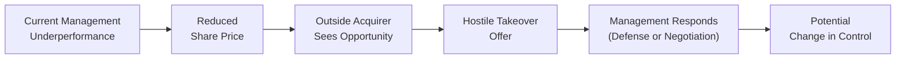

## Introduction

So, let’s say you’re analyzing a company that seems a bit off track. You suspect the board is weak, or maybe management is being complacent. You might wonder: Who’s responsible for keeping this ship sailing smoothly aside from the board and shareholders inside the company? That’s where external governance mechanisms come into play, essentially external forces that step in to keep a firm on the right path (or at least nudge it closer to good governance standards).

Internal mechanisms—which we discussed elsewhere in Chapter 3—encompass boards of directors, executive compensation structures, and internal audits. But if internal checks fail, we look outward. Investors, regulators, and the broader market for corporate control can impose discipline by threatening changes in ownership or legal intervention. In this section, we’ll examine how these external forces work, why they matter, and how you (as an analyst, investor, or professional adviser) can spot the signals that they’re in motion.

## The Market for Corporate Control

You’ve probably heard stories of once-thriving companies that suddenly get shaken up by a takeover. It might feel dramatic—like a blockbuster plot twist—and in many ways, it is. The market for corporate control is the set of transactions and activities related to acquiring or merging with companies, often for the purpose of improving performance, shaking up poor management, or capturing beneficial synergies. At the broadest level, it’s how the external market “votes” on a firm’s governance quality.

### Hostile Takeovers as a Governance Tool

A hostile takeover occurs when an acquirer bypasses the target company’s board and directly makes an offer to shareholders or attempts to replace existing management. For a quick mental picture, think of an investor group swooping in and saying, “Hey shareholders, we think we can run the show better, so sell us your shares and we’ll fix this company up.” If the target’s existing leadership has been doing a dismal job, shareholders might be happy to accept the offer, especially if the acquirer is willing to pay a premium above the market price for the shares.

Because poorly managed firms are more susceptible to being acquired, the threat of a hostile takeover acts as a deterrent: managers know they can lose their jobs if they significantly underperform or ignore shareholders’ concerns. This external pressure often motivates internal improvements in governance, even before any real takeover attempt happens.

### Takeover Defenses

Of course, target companies rarely roll over without a fight. Some rely on takeover defenses—like poison pills (which flood the market with discounted shares, diluting the acquirer’s position) or golden parachutes (lucrative severance packages for top executives). One friend of mine who invests in distressed companies jokes that a robust poison pill is like building a moat with piranhas: sure, it might protect the castle, but it could also scare off valued new investors. Overly aggressive defenses sometimes create friction between management and shareholders who want the best possible buyout outcome.

### Proxy Fights

If a full-blown hostile takeover seems too cumbersome, activist investors might conduct a proxy fight. This is basically a campaign to persuade other shareholders to vote out current management or adopt new strategic directions. Imagine an activist hedge fund publicly announcing: “We can enhance this company’s value by replacing half the board and ordering a big share buyback.” They seek enough proxy votes from shareholders to replace directors or radically shift policies. Proxy fights can be less expensive than a full takeover, yet still significantly reshape the governance landscape.

### The Role of Takeover Premiums

When an acquirer launches a takeover bid, it typically offers a “takeover premium” above the stock’s market price. This premium compensates target shareholders for handing over control. The existence of a sweetened bid motivates holders to say, “Sure, that extra 30% sounds pretty nice.” But ironically, if management has managed to create strong shareholder value on its own, the share price might already be high—making a takeover less likely or more expensive.

Below is a simplified diagram illustrating how a hostile takeover might unfold:



## Regulatory Framework and Oversight

While the market for corporate control relies on competition and investment incentives, regulators help shape the playing field through rules, disclosure requirements, and enforcement actions. In other words, you can think of regulators as referees who blow the whistle if a company commits a “foul”—like misreporting earnings or engaging in questionable transactions that harm investors.

### Government Agencies and Self-Regulatory Bodies

Depending on where a firm is headquartered or where its shares are listed, it might be overseen by a variety of government agencies or self-regulatory organizations (SROs). For instance, in the United States, the Securities and Exchange Commission (SEC) compels listed firms to file quarterly and annual reports, disclosing material events and ensuring that shareholders have the information needed to make informed decisions. Meanwhile, exchanges like the NYSE or NASDAQ impose listing requirements regarding board independence, financial transparency, and governance structures.

### Regulatory Arbitrage

Although regulators try to ensure fairness, some companies engage in “regulatory arbitrage.” This is when firms purposely structure corporate or financial transactions to exploit differences or gaps in regulations across jurisdictions. Picture a scenario where a company might list on a stock exchange known for less stringent corporate governance requirements. This can lead to moral hazards if the firm’s home-country investors expect robust protections, but the firm’s “official” listing region offers fewer safeguards.

### Licensing, Listing, and Ongoing Compliance

Different stock exchanges have different listing rules. For example, some require a minimum number of independent directors on a board, while others might enforce more lenient norms. If a company doesn’t comply, it risks getting delisted, potentially losing access to capital markets. So, there is a big incentive for firms to maintain governance practices that meet or exceed those guidelines. That said, compliance doesn’t guarantee stellar governance—plenty of companies simply check the box superficially and still underperform or breach shareholder trust. But at least it sets a baseline minimum standard.

Below is a diagram showing the interplay between a corporate issuer’s actions and regulatory oversight:

```mermaid
flowchart LR
    R["Regulators"] --> |Set Rules/Enforce| Co["Corporate Issuer"]
    Co["Corporate Issuer"] --> |Disclosure/Compliance| R["Regulators"]
    Co --> Inv["Investors and Stakeholders"]
    R --> Inv
    Inv --> |Market Feedback (Pricing)| Co
```

## Proxy Advisors and Institutional Investors

So, we’ve talked about takeovers and regulations, but there’s another big player in external governance: institutional investors and proxy advisors. You might recall that institutional players (like pension funds, mutual funds, or sovereign wealth funds) can hold huge blocks of shares, which means they have real clout when casting votes or pressuring management.

### Proxy Advisors

Companies like Institutional Shareholder Services (ISS) or Glass Lewis advise large shareholders on how to vote on critical governance proposals, such as appointing directors or approving executive compensation plans. If you’re wondering why these services exist, it’s partly because busy fund managers oversee thousands of positions and often rely on these external advisors for in-depth corporate governance analysis. The recommendations from proxy advisors can sway thousands of votes, effectively shaping the outcome of key decisions.

### Institutional Engagement

Institutional investors don’t just rely on proxy advisors: they often engage directly with corporate boards and management teams. For instance, a big pension fund concerned about environmental, social, or governance (ESG) issues might schedule private meetings with the company to discuss climate strategy or board diversity. This is sometimes referred to as “quiet engagement,” as opposed to more public activist campaigns. Regardless of the approach, the message is clear: if the company doesn’t address institutional shareholders’ concerns, it may face negative votes, public scrutiny, or even a push for changes at the board level.

Institutional investors and proxy advisors thus serve as an external check on managerial power, helping ensure that decisions align with broader shareholder interests and regulatory norms.

## Key Action Items for Analysts and Investors

1. Monitor Ownership Changes: Keep an eye on regulatory filings (e.g., Form 13D in the U.S. or substantial shareholder notifications in other regions) that show when activist investors are accumulating large stakes or a potential acquirer is sniffing around.  
2. Evaluate Regulatory Compliance: A track record of fines, restatements, or legal disputes can hint at poor governance or a management team that dismisses regulatory constraints.  
3. Note Exchange Requirements: Check whether a company meets (or is on the verge of failing) its exchange’s listing rules. Non-compliance can lead to forced delisting—a major red flag for investors.  
4. Investigate Auditor Opinions: External auditors can highlight material weaknesses in reporting controls or hint at questionable corporate behavior. If a reputable auditor resigns unexpectedly, that’s a huge red flag.  
5. Understand Proxy Voting Trends: Institutional investors usually disclose proxy voting guidelines and records. Noticing shifts in these trends can signal that major governance changes might be on the horizon.

## Common Pitfalls and Best Practices

• Overreliance on Regulatory Minimums: Some firms do the bare minimum to comply, but this rarely translates into robust governance.  
• Blind Trust in Takeover Defenses: Poison pills and other defenses can create complacency and reduce accountability to shareholders.  
• Ignoring Institutional Investor Signals: If a large shareholder voices concerns publicly (or refuses to support management’s proposals), this can foreshadow instability.  
• Non-Transparent Reporting Practices: Inconsistent disclosures or delayed filings often indicate deeper governance problems.  
• Failing to Engage with Regulators: When companies treat regulators as adversaries rather than collaborative overseers, they often face bigger troubles later.

## Conclusion

External governance mechanisms act like guardrails that limit managerial misbehavior or broaden accountability. The prospect of a hostile takeover, demands from institutional investors, and scrutiny from regulators collectively shape a company’s governance landscape. Ideally, these forces motivate management to act in shareholders’ best interests—just as any good system of checks and balances would. As you continue refining your analytical skills, pay attention to how these external influences come to life in real-world corporate episodes. Often, changes in ownership or new legislation can reveal hidden vulnerabilities—or fresh opportunities.

## Final Exam Tips

• Understand that the market for corporate control is more than just M&A deals; it’s an accountability mechanism.  
• Be prepared to discuss specific takeover defenses and their implications for shareholder value.  
• Demonstrate knowledge of regulatory structures; for instance, how different listing requirements may shape corporate governance in cross-border listings.  
• Show how institutional investors and proxy advisors can influence governance outcomes without necessarily forcing a takeover.  
• Be fluent in analyzing disclosures, auditor notes, and regulatory filings as part of your standard due diligence approach.

## References and Further Reading

- Lipton, M., and Lorsch, J. “A Modest Proposal for Improved Corporate Governance.” The Business Lawyer.  
- Bebchuk, L., Brav, A., and Jiang, W. “The Long-Term Effects of Hedge Fund Activism.” Corporate Governance Analysis Series.  
- Official website of the U.S. SEC:  
  https://www.sec.gov  

----------

## External Governance Mastery Quiz



### Which of the following is often considered a hostile takeover defense?

- [ ] Proxy fight
- [ ] Share buyback
- [ ] Discounted debt issuance
- [x] Poison pill

> **Explanation:** Poison pills are specifically designed to deter hostile acquirers by diluting their ownership stake when certain thresholds are crossed.

### When an acquirer offers a price per share above current market value to gain control, this extra amount is called:

- [x] Takeover premium
- [ ] Dividend yield
- [ ] Forward price
- [ ] Warrants issuance

> **Explanation:** A takeover premium is the acquirer’s markup over the stock’s current market price, incentivizing target firm shareholders to sell their shares.

### A proxy advisor primarily:

- [ ] Arranges mergers and acquisitions
- [ ] Sells shares on behalf of major equity holders
- [x] Issues voting recommendations for institutional investors
- [ ] Audits corporate financial statements

> **Explanation:** Proxy advisors provide research and voting recommendations, especially for large institutional investors, on governance matters and shareholder proposals.

### Which of the following describes “regulatory arbitrage”?

- [ ] Buying shares in a different country to exploit dividend tax rates
- [ ] Selling short in one market while buying long in another
- [x] Structuring operations to benefit from weaker regulatory requirements
- [ ] Avoiding equity issuance in foreign markets

> **Explanation:** Regulatory arbitrage means leveraging cross-jurisdiction differences or loopholes in regulations to gain an advantage or reduce oversight.

### Which factor often prompts institutional investors to engage or pressure management changes?

- [x] Underperformance and weak governance
- [ ] High leverage and strong growth
- [x] Significant ESG risks
- [ ] Unusually high insider ownership

> **Explanation:** Institutional investors frequently use their voting power to push for changes, especially when they see underperformance, potential governance lapses, or material ESG risks.

### A proxy fight typically involves:

- [x] Challengers seeking to gain enough shareholder votes to replace existing management or board members
- [ ] The board buying back shares at a premium to deter an acquirer
- [ ] New stock issuance to block existing shareholders from gaining a majority
- [ ] A privately negotiated merger agreement

> **Explanation:** A proxy fight is a method for external parties (often activists) to rally shareholder support and vote out current management or directors.

### Which of the following statements is TRUE regarding external auditors?

- [x] They provide an independent review of the company’s financial statements and disclosures
- [ ] They manage the internal control system directly
- [x] They issue opinions that can highlight governance or control weaknesses
- [ ] Their primary goal is to secure financing for the company

> **Explanation:** External auditors ensure objectivity; they do not manage internal controls but they do highlight deficiencies and questionable accounting practices that can be symptomatic of governance issues.

### One potential negative outcome of a poison pill defense is:

- [x] It dilutes existing shareholders when triggered
- [ ] It immediately reduces takeover premiums
- [ ] It makes the company more transparent
- [ ] It simplifies the governance structure

> **Explanation:** Poison pills can dilute the share base and dissuade not only a hostile bidder but possibly other beneficial investors. This can strain the relationship between management and existing shareholders.

### Regulators play a role in the market for corporate control by:

- [x] Setting disclosure requirements that make potential target firms more transparent
- [ ] Dictating the exact takeover price
- [ ] Substituting for board oversight
- [ ] Guaranteeing M&A deals

> **Explanation:** Regulators set minimum standards for disclosures, ensuring the market has sufficient information to gauge a target’s value and potential risks, but they don’t fix the price or act as the board.

### An institutional investor holding a large stake in a firm might:

- [x] Pressure the board to adopt new governance reforms
- [ ] Always avoid voting in proxy proposals
- [ ] Remain silent due to conflicts of interest
- [ ] Routinely submit inflated revenue figures to regulators

> **Explanation:** Large institutional investors frequently engage in proactive governance discussions with the board to protect and potentially enhance their investment value.


