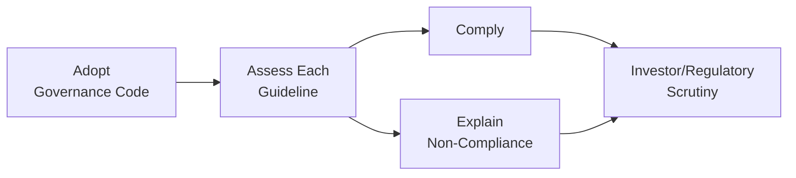

## Overview

Corporate governance codes of best practice, often referred to as “soft law,” represent a vital part of today’s business environment. I still remember, years ago, reading about how one large corporation’s chaotic boardroom disputes led investors to question its ethics and operations—like, literally question whether management had any plan at all. Eventually, the board realized that having strong governance guidelines (rather than a chaotic approach) was essential for sustaining trust. So, over time, many countries and professional bodies developed formalized codes or guidelines to push companies toward better accountability and transparency. These codes aim to protect shareholders, reduce agency costs, and strengthen the relationship between companies and the wider range of stakeholders (including employees, regulators, and local communities).

Corporate governance codes often rely on a “comply or explain” principle. This approach allows companies flexibility. They can either adhere to the code in full or offer current, detailed justifications regarding deviations. For analysts and investors—like many of you reading this volume—it’s crucial to understand why a company might choose not to comply, and whether such disclosures reveal hidden (or not so hidden) vulnerabilities.

In this section, we’ll examine the underpinning concepts of governance codes, highlight well-known examples such as the OECD Principles of Corporate Governance, the UK Corporate Governance Code, and the King IV Report on Corporate Governance for South Africa, then consider the challenges of implementation. We’ll also describe how to understand, interpret, and apply these codes when analyzing investment opportunities and monitoring risk. In some cases, these guidelines can be decisive in forging a stronger governance framework that mitigates conflicts of interest and enhances long-term performance.

## Major Codes and Their Foundational Principles

Below are three of the most prominent global examples of corporate governance codes. Even though they originate in different regions, they share many principles, including transparency, accountability, fairness, and responsibility.

### OECD Principles of Corporate Governance
The Organization for Economic Co-operation and Development (OECD) developed these principles to provide international guidelines on governance matters. Think of them as a broad-based, globally recognized framework. The OECD emphasizes:  
• Ensuring the basis for an effective corporate governance framework.  
• The rights and equitable treatment of shareholders.  
• Institutional investors, stock markets, and other intermediaries.  
• The role of stakeholders in corporate governance.  
• Disclosure and transparency.  
• The responsibilities of the board.  

These guidelines are particularly relevant to cross-border or multinational entities because they distill governance best practices into a widely accepted standard.

### UK Corporate Governance Code
The UK Corporate Governance Code is administered by the Financial Reporting Council (FRC). It is frequently updated to keep up with evolving business practices. The code is applicable to companies listed on the London Stock Exchange (Premium Listing), and it uses the famous “comply or explain” method. Key aspects include:  
• Leadership: Boards should have a clear division of responsibilities; strong leadership is paramount.  
• Effectiveness: Directors should have the appropriate skills, independence, and resources.  
• Accountability: Boards should present a balanced and comprehensible assessment of a company’s position and prospects.  
• Remuneration: Pay structures should be designed to promote the long-term success of the company (ties into “3.6 Executive and Board Compensation Structures”).  
• Relations with Shareholders: Ongoing dialogue is encouraged, with an emphasis on AGM (Annual General Meeting) guidance.  

### King IV Report on Corporate Governance for South Africa
While Africa has various governance guidelines, the King Reports stand out. King IV (which followed King III) promotes an integrated approach to governance—often referred to as “integrated thinking.” The King IV Report acknowledges the interconnectedness of strategy, risk, and sustainable economic, social, and environmental performance. Distinct features include:  
• Principle-based rather than rules-based guidance, ensuring flexibility for organizations of different sizes.  
• Sustainable development goals integrated into governance.  
• Disclosure of outcomes and achievements against set objectives (a form of integrated reporting).  

## Core Elements of Governance Codes

Despite differences in local laws, protocols, and cultures, corporate governance codes typically emphasize these core elements:

• Board Structure and Independence: To reduce conflicts of interest, codes often specify criteria for independent directors—those with no material or familial connections to the company. Independence fosters balanced decision-making at the board level, as mentioned in “3.7 Board Diversity and Composition.”

• Transparency and Disclosure: Under most governance codes, timely and accurate disclosure around financials, strategy, and risk factors is non-negotiable. This includes compliance statements, risk management approaches, and any relationships or conflicts that might affect decision-making.

• Shareholder and Stakeholder Engagement: Reflecting broader societal expectations, codes promote effective communication with shareholders, employees, customers, and regulators. The “stakeholder” concept, described in “2.2 Stakeholder Groups and Their Interests,” is vital here, reinforcing the idea that governance is not just about shareholders but a range of constituency interests.

• Accountability and Regulatory Compliance: Codes place accountability firmly at the board and executive level. Directors must be prepared to justify corporate decisions and ensure compliance with relevant regulations like IFRS, US GAAP, or local listing rules (see also “1.10 Regulatory Reporting Requirements (IFRS vs. US GAAP) and Strategic Considerations”).

• Leadership and Ethical Culture: The tone at the top matters, a lot. Most governance codes include a strong emphasis on ethical leadership. Board members set the moral compass of the company; if the board consistently skirts ethical lines, it’s a red flag with potential reputational or even legal consequences.

## The “Comply or Explain” Approach

One of the most interesting aspects of many governance codes is the so-called “comply or explain” approach. It’s a bit like being invited to a fancy dinner party but told, “If you don’t want to follow the dress code, no worries—just explain why not.” On paper, that might sound lenient. However, it can be quite strict if investors or regulators are not satisfied with the explanations given.

Under “comply or explain,” companies are expected to:

1. Comply with each recommendation in the code (for instance, maintaining a majority of independent directors, establishing separate CEO and Chairperson roles, etc.).  
2. If they choose not to comply, explain the rationale in their annual report or governance disclosure, detailing how the deviation still serves investors’ or stakeholders’ best interests.

Investors scrutinize these explanations—particularly institutional investors who adhere to stewardship codes, which encourage them to be active, responsible owners. If the explanation for non-compliance is superficial or suspicious, it may raise the cost of capital or attract activist shareholders pushing for changes.

### Mermaid Diagram: “Comply or Explain” Flow

In the diagram above, companies adopt a governance code, assess each guideline, and either comply directly or choose to deviate (with an explanation). The process loops back around as investors and regulators evaluate the company’s disclosures.

## Implementation Challenges

While codified governance practices are well-intentioned, some genuine hurdles and subtle roadblocks often arise:

• Cultural Differences: In some countries, a strong hierarchical culture can run counter to the independence demands of governance codes, resulting in boards that simply rubber-stamp executive decisions.  
• Enforcement Environment: If local regulators lack resources or political will, a “comply or explain” approach might devolve into “comply if we feel like it.” Real enforcement is critical for credibility.  
• Over-Standardization: Each corporation is unique. Some worry that strict governance codes can lead to a box-ticking mentality, where real independence and effective board oversight might not exist behind well-worded compliance statements.  
• Cost and Administrative Burden: Smaller firms might find governance codes burdensome. They might have valid reasons for partial compliance (e.g., limited resources for forming multiple board committees).  
• Evolving Business Models: Rapid changes in technology and globalization mean that governance codes must adapt. A governance practice that seemed robust five years ago might be inadequate for new digital platform models (discussed in “7.7 Platform and Subscription-Based Models”).

## Key Action Items for Analysts and Investors

For financial analysts, portfolio managers, and those of us who get excited about fundamental analysis, corporate governance signals can be extremely telling. When evaluating an issuer:

• Review Governance Disclosures: Look for explicit statements about code compliance. If there are multiple deviations, dig deeper into the reasons.  
• Use Peer Comparison: Compare the company’s disclosures to peers within the same market. If all but one competitor have established an audit committee with independent directors, that outlier is worth investigating.  
• Dive into Board Composition: Check whether directors labeled “independent” truly meet independence criteria (e.g., no prior roles in the company, no close family connections with top executives).  
• Focus on Potential Red Flags: Frequent CEO-Chair duality with no compelling explanation, repeated governance controversies, or incomplete disclosures. Each can be a sign of deeper governance shortcomings.  
• Engage with Stewardship Codes: If you represent an institutional investor subject to a stewardship code, you’ll likely be required to engage actively with investee companies on governance issues. That might mean meeting with board members, voting on shareholder proposals, or pushing for more robust disclosure.  
• Evaluate Nomination and Compensation Policies: A hallmark of robust governance is the presence of a well-structured, independent compensation committee. A poorly designed executive compensation scheme may encourage short-term risk-taking, while a balanced, well-structured plan typically aligns with sustainable growth (see “3.6 Executive and Board Compensation Structures”).

## Practical Example: Analyzing Governance in a Hypothetical Company

Let’s say you’re evaluating Redwood Consulting, a fictional mid-cap technology firm. Redwood discloses in its annual report that it follows a local code based on OECD principles. However, Redwood is deviating from the following recommended provisions:

1. The board includes only one independent director (the local code suggests at least three).  
2. The CEO also serves as the board chair, a scenario the local code typically discourages.  

Redwood’s explanation? They argue that the technology sector is highly specialized, and the CEO’s technical expertise is integral to board leadership. They also note difficulties in recruiting suitable independent directors with relevant tech experience. Now, does that explanation make sense? Possibly—especially if Redwood is in an emerging market with a limited pool of qualified professionals. But if Redwood remains a single-founder operation and there’s no transparent plan to expand board independence, it could signal a control dynamic that leaves minority shareholders with limited oversight. If Redwood also lives in a region where investor activism is minimal, Redwood might never truly test its governance structure.

As an analyst, you would incorporate these findings into your valuation and risk assessment. You might apply a higher discount rate to Redwood’s future cash flows or be cautious about Redwood’s capacity for quick, unbiased changes in strategy—particularly if the CEO-Chair role fosters groupthink or fails to challenge questionable decisions.

## Beyond Compliance: Soft Law, Hard Consequences

Interestingly, while many corporate governance codes function as “soft law” (i.e., not legally binding), the market often imparts “hard” consequences. Investors, rating agencies, and lenders pay attention to a firm’s governance profile. Weak governance can lead to a reputational discount or even hamper access to capital. Ratings agencies sometimes integrate governance assessments into their overall rating frameworks, using considerations such as board composition, transparency, and risk oversight.

For instance, in a credit analysis, agencies might incorporate governance risk into the “management and governance” score—an integral component of the overall credit rating. If Redwood (from our example) is flagged for poor board independence, its credit spreads could increase, raising the firm’s cost of debt (see “6.1 Weighted-Average Cost of Capital (WACC)”).

## Looking Ahead: Future Developments in Governance Codes

Governance codes are not static. The business environment changes, and so do stakeholder expectations. Some ongoing and emerging trends include:

• Enhanced Sustainability Reporting: Environmental, social, and governance (ESG) metrics are increasingly part of codes. According to many stewardship codes, institutional investors are encouraged to push for ESG transparency (“2.4 Environmental, Social, and Governance Factors”).  
• Digital and Cyber Governance: With the rise of data-driven business, boards are now expected to oversee cybersecurity risks (touched on in “7.11 Cybersecurity and Technology Risk”).  
• Heightened Attention to Diversity: Codes are starting to require or strongly encourage diversity in board composition. That can mean, for example, gender quotas or thoughtful approaches to ensuring varied backgrounds and skill sets on the board.  
• Increased Shareholder Activism: Hedge funds, private equity firms, and even smaller activist funds are stepping in more frequently to demand changes when boards ignore best practices.  
• Global Convergence of Standards: As businesses go multinational, you’ll see more cross-pollination of governance expectations. Chinese companies listed in Hong Kong, for example, often align partially with UK governance practices due to investor expectations, even if local codes differ.

## Exam Relevance and Strategies

If you’re preparing for professional exams (including the CFA Program), corporate governance codes of best practice can appear in various question formats. You may be given scenarios involving board structures, compensation policies, or comply-or-explain disclosures and asked to evaluate the adequacy of governance. Common pitfalls include:

• Failing to scrutinize “comply or explain” statements, especially if they seem vague.  
• Overlooking local cultural or legal contexts that shape how codes are implemented.  
• Ignoring the interplay between governance and other corporate finance topics, such as cost of capital, investment policy, or working capital management.  

Keep in mind that well-governed companies generally have better access to capital and a reduced risk of crises triggered by oversight failures. In practical exam questions, you might be asked to decide whether an investment is prudent given certain governance deficiencies or to assess the strength of a board’s disclosure and independence.

## References and Further Reading

• UK Corporate Governance Code:  
  https://www.frc.org.uk/directors/corporate-governance-and-stewardship

• King IV Report on Corporate Governance for South Africa:  
  https://www.iodsa.co.za/page/KingIV  

• OECD Principles of Corporate Governance:  
  https://www.oecd.org/corporate/principles-corporate-governance.htm

• CFA Institute (Global):  
  https://www.cfainstitute.org/research/esg-investing  

• Sample Governance Ratings and Commentary:  
  Major credit rating agencies often publish insights on governance in their methodology papers (e.g., S&P, Moody’s).  

## Test Your Knowledge: Corporate Governance Codes of Best Practice Quiz



### Which of the following best describes the “comply or explain” approach to corporate governance?

- [x] Companies either adhere to governance recommendations or provide justifications for non-compliance.
- [ ] Companies must strictly follow all governance code provisions with no exceptions.
- [ ] Companies can choose whether or not to publicly disclose their compliance status.
- [ ] Companies only have to comply with mandatory legislative requirements and none of the voluntary guidelines.

> **Explanation:** Under the “comply or explain” approach, companies are expected to comply with each aspect of a governance code or provide detailed reasons why they have chosen another path. Failure to offer a valid explanation can prompt scrutiny from investors and regulators.

### Which governance code explicitly introduces the concept of “integrated thinking” and a strong emphasis on sustainability?

- [ ] UK Corporate Governance Code
- [x] King IV Report on Corporate Governance for South Africa
- [ ] OECD Principles of Corporate Governance
- [ ] US Sarbanes-Oxley Act

> **Explanation:** King IV focuses on contexts beyond traditional financial metrics, integrating ESG considerations, stakeholder relationships, and ethical leadership into governance processes.

### An organization that fully adopts a governance code and meets all the key standards would most likely:

- [ ] Experience excessive compliance costs with minimal benefits.
- [x] Provide investors with greater confidence and potentially reduce its cost of capital.
- [ ] Face higher taxes due to strict regulatory requirements.
- [ ] Ignore stakeholder concerns to focus strictly on financial reporting.

> **Explanation:** Firms that comply with recognized governance codes often enjoy enhanced trust from investors, which can lead to a lower cost of equity or debt financing.

### In evaluating a company’s governance practices, why should analysts pay special attention to the composition of the board of directors?

- [x] The board’s independence and expertise are critical factors in overseeing management and safeguarding shareholder interests.
- [ ] The board rarely influences corporate strategy and primarily focuses on operational tasks.
- [ ] Only the composition of the audit committee matters, not the full board.
- [ ] Board composition has no impact on executive remuneration policy.

> **Explanation:** A well-structured board, with independent directors who have relevant expertise, typically offers more effective oversight, thus mitigating agency costs and aligning with best practices.

### In a “comply or explain” setting, if a company deviates from a governance guideline, it must:

- [x] Provide a transparent and valid rationale for the deviation.
- [x] Ensure no competitive disadvantages arise from adhering to the code.
- [ ] Seek approval from all shareholders before proceeding.
- [ ] File a legal waiver with the regulatory authority.

> **Explanation:** The essence of “comply or explain” hinges on openness. If the company skips a certain recommendation, it should publicly clarify its reasoning to maintain investor confidence.

### Which of the following is unlikely to be emphasized in a corporate governance code?

- [x] Secretive board deliberations that limit external disclosures.
- [ ] Transparent board practices and open communication channels.
- [ ] Ethical leadership from the top.
- [ ] Fair treatment of minority shareholders.

> **Explanation:** Governance codes universally encourage transparency, fairness, and ethical conduct. Secretive practices or limited transparency would go against these principles.

### A key difference between binding legislation and “soft law” governance codes is that:

- [x] Soft law relies on voluntary compliance or explanation, while legislation imposes enforceable legal requirements.
- [ ] Soft law is only relevant to private firms, not publicly listed companies.
- [x] Legislation doesn’t need to be enforced, whereas soft law includes sanctions for non-compliance.
- [ ] Soft law is always older than legislation and thus considered outdated.

> **Explanation:** Governance codes are typically not strictly enforceable by law; rather, companies voluntarily follow them. Non-compliance is permitted if adequately explained to the market.

### Which scenario would most likely raise a red flag for governance analysts?

- [x] A CEO who also serves as board chair with no independent directors.
- [ ] Regular reviews of risk management processes and information systems.
- [ ] Clear and well-documented ESG disclosures in the annual report.
- [ ] A functioning audit committee comprising mainly independent directors.

> **Explanation:** Combining the CEO and chair roles without robust checks or independent board members can lead to excessive concentration of power and insufficient oversight, flagging governance risks.

### Which factor often affects the success of a “comply or explain” regime?

- [x] The rigor of investor and regulatory scrutiny applied to explanations for non-compliance.
- [ ] The size of the firm’s marketing budget.
- [ ] Only historical financial performance metrics.
- [ ] The cost of tangible assets on the balance sheet.

> **Explanation:** “Comply or explain” depends on how vigilantly the market, investors, and regulators evaluate a firm’s disclosures. Without scrutiny, such regimes become more theoretical than effective.

### Corporate governance codes generally encourage more robust stakeholder engagement because:

- [x] Engaging stakeholders such as employees, suppliers, and local communities can enhance the firm’s sustainability and trustworthiness.
- [ ] Stakeholder engagement has no direct impact on daily operations or strategic decision-making.
- [ ] Codes only focus on shareholder returns.
- [ ] Stakeholders have no legal standing in corporate matters.

> **Explanation:** Modern codes emphasize balanced and responsible governance, aligning the interests of shareholders with those of a broader set of stakeholders, which in turn reinforces the company’s social license to operate.


