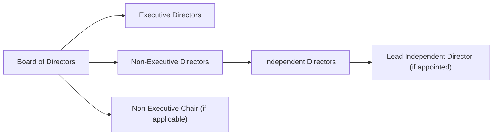

## Overview

Board diversity and composition, if you ask me, is a cornerstone of modern corporate governance. Pick up any annual report these days, and you’re bound to see a healthy discussion around how many independent directors sit on the board, whether the company is meeting diversity targets, or if there are skill sets specifically related to emerging risks like cybersecurity. Why the sudden fuss? Because a variety of backgrounds, experiences, and perspectives on a board can help reduce groupthink, lead to more innovative insights, and strengthen the checks and balances that carry an organization toward its long-term objectives.

In many jurisdictions, regulators and investors are applying new lenses—like gender quotas or diversity disclosures—to scrutinize corporate boards. Whether you’re reading this wearing your investor hat, preparing for the CFA exam, or maybe just curious about how boards operate, understanding these dynamics in board composition is critical for analyzing a company’s governance and risk profile. Let’s dive in.

## Dimensions of Board Diversity

When people say “board diversity,” they often think immediately of gender diversity. And sure, that’s a big one—some regulatory frameworks (especially in Europe) have instituted minimum female director requirements. But did you know diversity goes well beyond gender and includes elements like ethnicity, nationality, age, education, and professional background?

• Gender Diversity: Many governance codes now encourage (or even mandate) companies to have at least a certain percentage of female directors.  
• Ethnicity & Nationality: Global organizations often need broader representation to address cross-border challenges.  
• Skill Sets & Professional Backgrounds: Think of technology, legal, marketing, engineering, risk management, you name it. For instance, having a cybersecurity specialist on the board might prove invaluable when discussing data protection strategies.  

I once worked (in a previous consulting gig) with a board composed almost entirely of retired accountants, who excelled at the financial aspects but lacked a specialized understanding of digital disruption. It felt like we were missing half the puzzle until the company brought in a technology entrepreneur. The difference—almost overnight—was remarkable.

## Rationale for Board Diversity

The rationale for board diversity can be summarized in a few key themes:

• Better Decision-Making: A more diverse board challenges assumptions and can flag risks that a homogenous board might miss.  
• Increased Innovation: Varied backgrounds often foster a more creative approach to problem-solving, supporting the firm’s strategic initiatives.  
• Enhanced Reputation: Firms with diverse boards send a positive signal to employees, investors, and the public about inclusivity and corporate responsibility.  
• Improved Stakeholder Alignment: Different perspectives help the board anticipate stakeholder concerns, from employee retention to environmental and social governance (ESG) issues.  

There is also growing empirical evidence (Terjesen, Sealy, and Singh) suggesting that companies with more diverse boards see benefits such as superior returns on equity or reduced volatility in earnings. It’s not guaranteed—mind you, there is no silver bullet—but the correlations are strong enough to garner regulatory and investor attention worldwide.

## Board Composition Essentials

Board composition reveals how power and responsibility are balanced at the highest levels of a firm’s governance. Broadly, it aims for the right mix of executive and non-executive directors, with a special emphasis on the presence of independent directors.

### Executive vs. Non-Executive Directors

• Executive Directors: These are members of management—like the CEO or CFO—who also serve on the board. Executive directors bring deep operational knowledge, but they can struggle to maintain objectivity when evaluating their own performance.  
• Non-Executive Directors: These individuals aren’t part of the daily management team. Ideally, they bring an outside perspective, reviewing management’s performance and strategies with a more objective lens.

### Independent Directors

In many jurisdictions, boards are required or strongly encouraged to have a certain proportion of independent directors—individuals who have no significant business or personal relationships with the company. The logic is, well, independence fosters objectivity. If you have directors who owe their best friend a contract renewal or who sell to or consult for the company, they might compromise their judgment. This independence is crucial for internal checks and balances, especially in areas like executive compensation, audits, and the nomination of new board members.

### Non-Executive Chair and Lead Independent Director

• Non-Executive Chair: Some boards separate the roles of chair and CEO (duality is when one individual holds both titles). Having a non-executive chair helps ensure the chair is not influenced by management responsibilities.  
• Lead Independent Director: If the chair is not independent (perhaps they’re also the CEO), a lead independent director coordinates the activities of the independent directors, which might include setting agendas or leading sessions without executive management present.

Below is a simple Mermaid diagram illustrating the conceptual structure:

This snapshot emphasizes how a board might be segmented. Lines in reality can be fuzzy—for instance, a non-executive director might become an executive if they temporarily assume an operational role, or an independent director might lose that independence if they develop a conflict of interest.

## Skill Matrix and Competency Mapping

Firms are increasingly using a formal skill matrix to identify the governance needs of the business and map them to current board members. The matrix usually outlines domains like accounting, finance, technology, marketing, international business, sustainability, and so on. Each board member is evaluated against these attributes. If you’re an analyst, you often see this in the corporate governance section of the annual report—some companies share partial versions to reassure investors that the board is well-equipped and balanced.

For instance, suppose you see zero out of 10 directors with digital marketing or e-commerce expertise, yet the company’s strategic plan includes launching a new digital platform. That’s a red flag, or at least a question mark, about how well the board can oversee a new strategic initiative. Similarly, if the company faces large environmental challenges but no board member has experience with environmental regulation or sustainability, that might be a governance blind spot.

## Refreshment and Succession Planning

A board that never changes risks becoming stale and losing track of emerging risks. Annual or periodic refreshment processes help ensure new, relevant skill sets get in the door. Many boards use a scheduled rotation—say, limiting director terms to three or four years, or requiring mandatory retirement ages. Some boards also adopt procedures where directors must stand for re-election each year.

Succession planning applies not only to the CEO but also to board roles. If the audit committee chair is nearing retirement, the board’s nomination committee should identify potential successors well in advance. This approach fosters continuity and reduces the risk of disruptions.

## Regulatory and Investor Focus

Investors, particularly large institutions like pension funds, pay close attention to board diversity. Proxy advisors often have guidelines that recommend voting against nominating committees if the board lacks sufficient representation of women or minority groups. In some cases, failing to meet local regulatory guidelines (like the “comply or explain” model in certain European countries) can cause reputational halos or tarnishes in the marketplace.

ESG frameworks—think about the “Governance” piece—usually evaluate how well the board represents multiple perspectives of the firm’s stakeholders. If a company claims strong social values but consistently refuses to nominate diverse candidates, that inconsistency can hurt its ESG scores and its ability to attract socially conscious investors.

## Potential Pitfalls and Challenges

• Tokenism: A board might recruit one individual from an underrepresented group without fully integrating or valuing their input, undermining the benefits of diversity.  
• Lack of Genuine Independence: Directors who appear independent on paper but have subtle (or not-so-subtle) relationships with management can hinder effective oversight.  
• Excessive Director Overboarding: Some directors serve on many boards, leaving little time to carry out their duties effectively.  
• Conflicting Agendas: Different backgrounds can generate disagreements, which, if unmanaged, can create decision logjams.  

Personally, I’ve seen a situation where a newly joined—extremely talented—director never got the chance to truly weigh in because all of the “real” decisions happened informally before board meetings, among a close-knit group of longtime directors. So much for diversity, right?

## Implications for Corporate Governance and Risk Management

A well-structured board improves risk oversight by bringing different perspectives to the table. Increased diversity can surface concerns—whether financial, operational, or reputational—that uniform boards might overlook. Unchecked, these risks could spiral into crises. Particularly in areas like cybersecurity, social responsibility, or environmental impact—where challenges evolve rapidly—a diverse, skillful board is better positioned to identify potential crises early.

## Action Items for Analysts and Investors

1. Examine the Independence Mix: Check the proportion of independent directors and see if there’s a lead independent director when the CEO also serves as board chair.  
2. Evaluate the Skill Matrix: See whether the board’s backgrounds align with the company’s strategy. Gaps here might be critical.  
3. Note Any Recent Refreshes or Succession Plans: Has the board proactively appointed new directors with relevant skills?  
4. Look for a Clear Diversity Policy: Some companies explicitly outline how they foster diversity at the board level.  
5. Scrutinize Board Committees: Audit, compensation, and nomination committees often show how (and how well) independent directors shape governance.  

These items matter both qualitatively (e.g., analyzing the board’s approach to emerging risks) and quantitatively (e.g., any effect on cost of capital or share price volatility).

## Exam Tips and Strategies

On the CFA exam—particularly at advanced levels—you might see scenario-based questions where you have to assess a board’s composition in relation to a company’s risk profile, growth strategy, or conflict of interest. Be prepared to:

• Discuss how board diversity can mitigate principal–agent conflicts.  
• Evaluate a board’s independence based on relationships or personal ties between directors and management.  
• Recommend actions, such as adding an independent director with specialized expertise if the company faces a new strategic or regulatory challenge.  
• Analyze how diversity policies and board refreshment processes might align with best practices in corporate governance.  

Make sure you can articulate not only definitions (like Non-Executive Chair or Lead Independent Director) but also the value they add in practice.

## Glossary

• Gender Quota: Regulations or guidelines prescribing a minimum proportion of female directors on a board.  
• Independent Director: A director free from relationships that may materially interfere with exercising independent judgment or hamper objective analysis.  
• Non-Executive Chair: A board chair who does not simultaneously hold a CEO or other executive position.  
• Lead Independent Director: A designated independent director who coordinates the activities of independent directors, especially when the chair is not independent.  
• Diversity Policy: A formal policy specifying the recruitment and selection processes aimed at broadening board demographics and skill sets.  
• Skill Matrix: A table or chart identifying each board member’s areas of expertise to reveal “skill gaps” and guide the nomination process.

## References & Further Reading

• Terjesen, S., Sealy, R., and Singh, V. “Women Directors on Corporate Boards: A Review and Research Agenda.” Corporate Governance: An International Review.  
• European Corporate Governance Institute (ECGI): https://ecgi.global/  
• CFA Institute, Global ESG Disclosure Standards.  
• OECD Principles of Corporate Governance.

---

## Test Your Knowledge: Board Diversity and Composition



### Which of the following best describes the purpose of board diversity?

- [ ] It primarily helps management maintain full control by keeping the board homogeneous.
- [ ] It only ensures a broader cultural representation without affecting strategic decisions.
- [x] It fosters a broader range of perspectives, reducing groupthink and enhancing decision-making quality.
- [ ] It lowers the company’s reporting burden by minimizing governance disclosures.

> **Explanation:** Diversity of gender, background, and skill sets often widens the lens through which strategic and risk considerations are evaluated, mitigating groupthink.

### A board where the CEO also serves as chair would typically benefit from:

- [ ] Fewer independent directors overall.
- [x] A lead independent director to balance decision-making.
- [ ] Prohibiting all tenure over five years.
- [ ] Removing all executive directors.

> **Explanation:** When one individual holds the CEO and chair roles, a lead independent director helps ensure non-executive voices are heard and effective governance is maintained.

### A skill matrix for directors:

- [ ] Is primarily used to track equity incentives among board members.
- [ ] Is intended to uniformly categorize all directors as either financial experts or non-financial experts.
- [x] Identifies functional expertise and potential gaps in the board composition.
- [ ] Eliminates the need for any periodic refreshment of the board.

> **Explanation:** A skill matrix maps each director’s expertise, helping the nomination committee address current or emerging needs (e.g., technology, ESG, finance competence).

### Which of the following is considered a benefit of having a non-executive chair?

- [x] Enhanced independence in board leadership and oversight.
- [ ] More direct link to the operating decisions within the firm.
- [ ] Eliminates the need for annual director elections.
- [ ] Reduced emphasis on the nomination process.

> **Explanation:** A non-executive chair typically ensures that top-level oversight remains unbiased, independent from management’s day-to-day influences.

### When analyzing board diversity, which scenario best indicates a potential oversight gap?

- [ ] A technology start-up with at least two directors having strong tech backgrounds.
- [x] A company with expansion plans into Asia but no directors with international business experience.
- [ ] A retail chain that includes a marketing executive, a finance expert, and an HR specialist on its board.
- [x] Both the second and third options (oversight gap for international but not necessarily the retail chain).

> **Explanation:** If the strategic plan focuses heavily on market expansion but there is no corresponding expertise on the board, it can present an oversight gap that could hamper the firm’s success in new regions.

### A “comply or explain” regulation for board diversity implies:

- [x] Companies must meet diversity guidelines or disclose why they have not complied.
- [ ] Companies are not required to consider diversity at all.
- [ ] Companies face automatic delisting for non-compliance.
- [ ] Investors cannot vote against boards based on diversity shortfalls.

> **Explanation:** Under comply-or-explain, firms are either expected to meet standards or provide a public explanation; investors can then judge the adequacy of that explanation.

### One major pitfall associated with board diversity initiatives is:

- [ ] Reduced potential for innovation and creativity.
- [x] Tokenism, where individuals from underrepresented groups are brought on but never fully included.
- [ ] Inability to oversee new technologies.
- [ ] Increased alignment of personal relationships.

> **Explanation:** Tokenism can defeat the objective of genuine diversity. Even when the board technically has diverse members, it must also empower them.

### The primary role of independent directors on the board is to:

- [x] Provide objective oversight and protect shareholder interests.
- [ ] Strengthen management’s authority with minimal questioning.
- [ ] Ensure all board members share a unified professional background.
- [ ] Maximize overboarding for closer industry connections.

> **Explanation:** Independent directors are free from relationships that might compromise objectivity, which helps maintain accountability on behalf of shareholders.

### What advantage may arise from regular board refreshment?

- [x] The board can align its expertise with evolving strategic and technological demands.
- [ ] Directors become complacent due to frequent turnover.
- [ ] It reduces the regulatory burden on annual disclosures.
- [ ] It guarantees higher dividend payouts to shareholders.

> **Explanation:** Refreshment ensures that board composition keeps pace with changing industry trends and company strategy, maintaining relevant expertise.

### Independent directors are always separate from the company's daily operations. True or False?

- [x] True
- [ ] False

> **Explanation:** By definition, independent directors are not part of management and lack any significant business or personal relationships that might influence their judgment.


