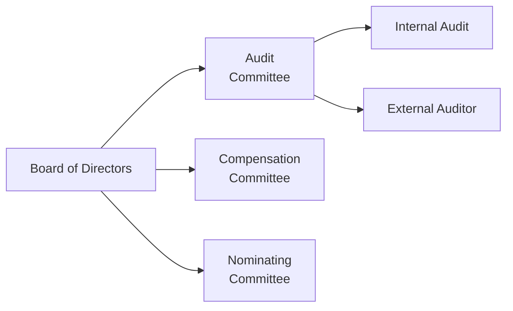

## The Role of Board Committees in Corporate Governance

When it comes to corporate governance, board committees often operate like specialized task forces that keep critical aspects of a company on track. Think of the board of directors as a well-balanced team of individuals, each with distinct skill sets. Then consider committees as sub-teams, drilling into specific areas—like finance, executive remuneration, talent recruitment, or risk oversight—to ensure no detail slips through the cracks. 

I recall the first time I saw a board committee in action. We were in a stuffy meeting room, and an external auditor was walking through financial statements, pointing out subtle accounting treatments that could have big implications. The committee members asked probing questions, carefully dissecting every footnote. By the end, I realized these committees are absolutely integral to well-functioning governance structures. They’re the gatekeepers who help prevent nasty surprises from damaging a company’s reputation or shareholder value. 

This article focuses on three of the most common and vital committees: the Audit Committee, the Compensation (or Remuneration) Committee, and the Nominating (or Governance) Committee. Along the way, we’ll note how other specialized committees, like Risk or ESG Committees, can also enhance governance. And we’ll share a few stories—and maybe a bit of personal insight from experiences with these committees—to bring these topics to life.

## The Audit Committee

The Audit Committee is often considered the guardian of a company’s financial integrity. It’s tasked with overseeing the company’s financial reporting process, internal controls, compliance programs, and sometimes risk management initiatives. The committee works closely with the external auditors. You’ve probably seen references to external auditors issuing an opinion on whether the company’s financial statements are free from material misstatement—this is where the Audit Committee takes center stage.

### Key Responsibilities

• Oversee Financial Reporting: The Audit Committee ensures that the financial statements are transparent, accurate, and aligned with applicable accounting standards (IFRS, US GAAP, or local equivalents).  
• Internal Controls: Strong internal controls help maintain reliable reporting, compliance, and operational efficiency. The Audit Committee reviews management’s assessment of control effectiveness and any internal audit findings.  
• External Auditor Relationship: The committee typically recommends the appointment or reappointment of the external auditor. It reviews the auditor’s scope of work, fees, and independence.  
• Compliance and Ethics: Many Audit Committees also track whistleblower programs, regulatory compliance, and any reported misconduct.

### Real-World Example

Picture a global manufacturing firm, Delta Tools Corporation (not a real name). They faced scrutiny from regulators for revenue recognition issues. The Audit Committee swiftly launched an internal investigation, engaging external experts to review the concerns. Thanks to diligent oversight, they uncovered a problem in the way certain product returns were accounted for, which inflated revenue in the short term. The committee then directed management to restate the financials, collaborated with external auditors for transparency, and strengthened future policies. Though it was a tough process, it ultimately preserved the company’s credibility.

Here’s a quick visual representation of how the Audit Committee fits into the broader governance structure:

## The Compensation (Remuneration) Committee

Remember that friend who always said, “Show me the money!”? Well, the Compensation Committee is effectively responsible for the “show me the money” part of corporate governance. It sets and reviews compensation policies for senior executives and directors, ensuring these packages align with the company’s goals, shareholder expectations, and best market practices. 

In my experience, this can become quite a heated topic, especially when executive bonuses are sky-high while the company’s performance isn’t. The world saw uproars about executive pay structures following the global financial crisis. One root cause identified was misaligned incentives leading to excessive risk-taking. The Compensation Committee’s mission, in part, is to prevent that scenario from happening again.

### Core Functions

• Executive Compensation Structure: Determining base salaries, bonuses, stock options, restricted share units, and other incentive plans to balance short-term and long-term performance goals.  
• Alignment with Corporate Strategy: Compensation schemes should reinforce long-term shareholder value rather than short-lived gains.  
• Regulatory and Disclosure Requirements: The committee ensures compliance with remuneration disclosure guidelines, especially in annual proxy statements. Investors like to see exactly how (and why) executives earn what they do.  
• Risk Management: The Compensation Committee must consider whether pay arrangements encourage imprudent or excessive risk-taking.

### Practical Consideration

Let’s say an energy company, OmniEnergy, ties a large portion of executive pay to meeting short-term production targets. If the executives ramp up production aggressively, they might neglect environmental or safety concerns to hit those targets—leading potentially to environmental harm, costly lawsuits, or even catastrophic accidents. A well-designed compensation policy might incorporate sustainability goals or safety metrics to achieve a more balanced approach.

## The Nominating (Governance) Committee

When a board seat opens up, the question becomes: “Who will fill this position?” Enter the Nominating (sometimes called Governance) Committee. This committee hunts for individuals with the right mix of skills, expertise, and independence to support the company’s strategic direction. If you think about it, the future trajectory of any company often hinges on who’s in the boardroom making critical decisions, so the Nominating Committee’s role is crucial.

### Primary Duties

• Director Candidate Search: Determines the criteria (nominating thresholds) for new board members—like industry expertise or the need for technological savvy.  
• Independence and Diversity: Many governance codes specify that a majority of the board, and definitely the committee members, must be independent from management. Diversity in backgrounds, experiences, and perspectives is also increasingly recognized as a core strength.  
• Board Evaluations: The Nominating Committee periodically evaluates the board’s performance. This includes director effectiveness, teamwork, and whether the board’s composition meets evolving corporate needs.  
• Succession Planning: This goes beyond just board seats—some Nominating Committees also get involved in ensuring a succession plan for key executives.

### Real-World Anecdote

I once spoke with a Director of Corporate Governance at a large technology firm. Her biggest worry wasn’t short-term profitability—it was whether the board had people who truly understood emerging tech trends. She reminded me that ignoring future skill needs on the board can lead to major blind spots. With digital disruption happening so quickly, the Nominating Committee’s role in anticipating future expertise is absolutely vital.

## Other Specialized or Emerging Committees

While the three committees we’ve discussed are essential, boards sometimes create additional committees tailored to specific needs:

• Risk Committee: Focuses on identifying, assessing, and mitigating strategic and operational risks (see Chapter 3.3 on External Governance Mechanisms for context on regulatory oversight).  
• ESG/Sustainability Committee: Oversees environmental, social, and governance initiatives, ensuring that sustainability issues are embedded into the company’s strategy.  
• Technology or Cybersecurity Committee: Addresses tech strategy, data privacy, cybersecurity concerns, and digital transformation.

These committees can make sense for large, complex organizations with specialized risk areas. In smaller companies, their responsibilities might be folded into the Audit or other main committees.

## Key Action Items for Analysts and Investors

Analysts and investors looking to evaluate a company’s governance should pay special attention to the composition and activities of board committees. Here are some practical tips:

• Check for Independence: Verify if committee members (especially on Audit, Compensation, and Nominating Committees) meet independence standards to avoid conflicts of interest.  
• Review the Charters: These detail how committees operate, what authority they have, and how they report their activities. Best practices suggest that these charters should be publicly disclosed.  
• Assess Committee Reports: Proxy statements and annual reports often contain valuable nuggets about committee decisions—like remodels in compensation structure, audit findings, or new board candidate criteria.  
• Interactions with Auditors: How often does the Audit Committee meet with external auditors without management present? That can be a sign of healthy independence.  
• Look for Red Flags: Excessive pay raises despite lackluster performance, large restatements of previous financial periods, or a board succession crisis might signal deeper governance issues.

## Glossary of Key Terms

• Charter: A formal document outlining a committee’s roles, responsibilities, and authority. Compliant committees will follow their charters strictly in fulfilling their mandates.  
• Internal Controls: Processes that ensure reliability of financial reports, compliance with laws/regulations, and operational efficiency.  
• Remuneration Disclosure: Required reporting that details executive and board compensation decisions and rationales—often in the annual proxy statement.  
• Nominating Thresholds: Established criteria for recommending or appointing new directors (e.g., independence, diversity, specific skill sets).  
• Audit Opinion: The external auditor’s statement regarding whether the financials fairly represent the company’s financial position without material misstatement.  
• Independence Standards: Guidelines (often set by regulators or exchange listing rules) that define what qualifies a director as independent from management.  
• Annual Proxy Statement: A key document provided to shareholders that outlines governance matters, executive compensation, shareholder proposals, and more, often published before the annual meeting.

## Best Practices and Potential Pitfalls

Boards that excel in committee governance demonstrate a few consistent best practices:

• Maintain a Predominantly Independent Board: Minimizes conflicts of interest.  
• Rotate Committee Membership: Prevents complacency and fosters fresh perspectives.  
• Encourage Ongoing Education: Committee members should stay updated on evolving regulations, industry trends, and best practices.  
• Conduct Regular Self-Evaluations: Ensures each committee remains effective, aligned with corporate goals, and up-to-date with stakeholder expectations.

Potential pitfalls include:

• Committee Overreach: Sometimes committees might blur their lines of responsibility, leading to confusion.  
• Insufficient Expertise: Having underqualified committee members checking vital areas like financial reporting or cybersecurity is a huge risk.  
• Lack of Transparency: If a committee’s work is done behind a veil of secrecy, shareholders may lose faith in the governance process.  
• Inadequate Meeting Frequency: Some board committees meet too infrequently to handle complex issues, missing red flags until it’s too late.

## Putting It All Together

Board committees are integral to a well-functioning corporate governance system. Audit Committees bolster financial integrity, Compensation Committees ensure pay structures are balanced, and Nominating Committees steer the board’s culture and future direction. Together, they mitigate principal–agent conflicts (discussed in Chapter 3.1) and reinforce accountability, creating an environment where company objectives align with shareholder and stakeholder interests.

Investors, including those of you preparing for advanced exams, should consider the rigor and breadth of these committees’ work. By reading meeting minutes, evaluating charters, and analyzing the composition of each committee, you gain critical insights into a company’s governance quality and the potential for future risks or opportunities. After all, a robust committee structure can lead to more stable performance over the long term—no one wants to invest where the “small stuff” gets overlooked.

## References and Further Reading

• The Institute of Internal Auditors: https://www.theiia.org/en/  
• Public Company Accounting Oversight Board (PCAOB): https://pcaobus.org/  
• International Standards on Auditing (ISA): https://www.ifac.org/auditing-assurance  

Many countries also have their own corporate governance codes—like the UK Corporate Governance Code or the OECD Principles of Corporate Governance—that provide comprehensive guidelines for board committees. For detailed reading on broader governance frameworks, you might explore the CFA Institute’s materials on corporate governance best practices as well.

## Test Your Knowledge: Board Committees (Audit, Compensation, Nominating)



### Which of the following is a core responsibility of the Audit Committee?

- [ ] Determining executive compensation packages
- [x] Oversight of the external audit process
- [ ] Selecting nominees for the board of directors
- [ ] Approving all company mergers and acquisitions

> **Explanation:** The Audit Committee must oversee the company’s financial reporting integrity, including liaising with external auditors and assessing the adequacy of internal controls.

### What is the primary purpose of the Compensation Committee?

- [x] Designing and reviewing executive remuneration
- [ ] Conducting internal audits
- [ ] Crafting the company’s public relations strategy
- [ ] Monitoring the board’s succession plan

> **Explanation:** The Compensation Committee’s mandate is to develop and monitor pay structures and incentives for senior management, ensuring they align with risk management and long-term shareholder value.

### Which of the following steps can an analyst take to evaluate the effectiveness of a company’s board committees?

- [x] Review committee charters and meeting frequency
- [ ] Ignore the annual proxy statement
- [ ] Focus solely on stock price trends
- [ ] Rely exclusively on press releases

> **Explanation:** By examining the committee charters, independence, and disclosures in the annual proxy statement, analysts gain deeper insights into governance practices.

### What best describes the role of the Nominating Committee?

- [ ] It supervises a company’s auditing and compliance functions
- [x] It identifies and recommends qualified candidates for board membership
- [ ] It sets all budgets for capital expenditures
- [ ] It prepares the annual report for shareholders

> **Explanation:** The Nominating Committee is responsible for selecting potential board members and ensuring their qualifications and independence align with the board’s needs.

### How can a Compensation Committee mitigate excessive risk-taking?

- [x] By structuring executive pay to balance short and long-term performance
- [x] By incorporating non-financial metrics like safety or sustainability
- [ ] By disregarding incentive-based compensation altogether
- [ ] By avoiding any disclosure of remuneration policies

> **Explanation:** Well-designed incentive structures promote balanced decision-making. Including non-financial performance metrics and oversight by independent directors helps prevent reckless strategies driven purely by short-term bonuses.

### Which statement accurately describes a board committee’s Charter?

- [x] It outlines the mission, authority, and responsibilities of the committee
- [ ] It is a stock option agreement for senior management
- [ ] It is the detailed code of conduct for all employees
- [ ] It is a marketing strategy document presented to investors

> **Explanation:** A committee’s charter formally sets forth the scope of authority, responsibilities, and operational guidelines, ensuring clarity and transparency.

### Which committee often oversees initiatives like whistleblower programs or investigations into alleged financial misconduct?

- [x] The Audit Committee
- [ ] The Compensation Committee
- [x] The Risk Committee
- [ ] The Nominating Committee

> **Explanation:** The Audit Committee typically monitors compliance and financial controls, although in some companies a separate Risk Committee may handle or share some of these responsibilities.

### In what situation might a board form a specialized ESG Committee?

- [x] When environmental and social standards are critical to the firm’s operations
- [ ] When the company’s revenue is primarily from fixed-income instruments
- [ ] When the firm is strictly in the software development sector
- [ ] When the CEO requests secret oversight programs

> **Explanation:** Companies facing significant environmental, social, or governance pressures often establish an ESG Committee to ensure these areas receive dedicated board-level attention.

### Why are board evaluations and succession planning crucial for the Nominating Committee?

- [x] To ensure the board has the right mix of skills and expertise over time
- [ ] To override the Audit Committee’s decisions
- [ ] To manage the company’s day-to-day operations
- [ ] To eliminate the need for external audits

> **Explanation:** Effective board evaluations and succession planning help maintain an optimal board composition, aligned with the company’s evolving requirements and strategic vision.

### A robust board committee system primarily benefits shareholders because:

- [x] True
- [ ] False

> **Explanation:** True. By addressing critical governance areas such as financial reporting, compensation alignment, and leadership succession, a well-structured board committee system supports sustainable value creation for shareholders.


