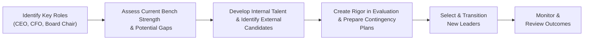

## Introduction and Context

Board evaluations and succession planning might sound like lofty, abstract ideas, but, in practice, they have a tangible impact on a company’s success. I remember, as a volunteer on a local nonprofit board, we once did a simple self-assessment process and realized we lacked expertise in digital marketing (seriously, none of us even had a clue how Google Ads worked). We swiftly brought on a director with that background, and it was pretty amazing how one skill gap, once filled, elevated team performance. Although most corporate boards operate on a much larger scale, the principle is the same: the board must routinely look inward and plan for the future to keep the organization’s strategic vision alive.

For CFA® candidates—whether you’ve just about mastered microeconomics or you’ve spent hours analyzing capital structures—gaining an appreciation for board evaluations and leadership continuity will help you see the “big governance picture.” Investors pay significant attention to how effective a board is, how strong its leadership pipeline might be, and which protocols are in place to reduce disruptions when key executives depart. In advanced portfolio management scenarios, robust board governance practices can reduce risk, arguably lower a firm’s cost of capital in the long run, and encourage more stable returns for shareholders.

Below, we’ll delve into the two main pillars of this section—the intricacies of board evaluations and the processes behind succession planning—offering best practices, real-life anecdotes, and some diagrams to illustrate the flow of these processes. Let’s walk through it together.

## Board Evaluations: Why They Matter

If you’ve ever been on a sports team, you know that periodic feedback—from your coach or your teammates—makes you better over time. Boards thrive on a similar principle. Evaluations keep directors accountable, draw attention to performance gaps, and encourage ongoing improvements that align leadership with corporate strategy.

### Approaches to Board Evaluation

• Self-Assessments:  
  In self-assessments, directors individually and collectively reflect on their performance, pinpoint strengths, and address weaknesses. This might involve standardized questionnaires, open-ended surveys, or guided discussions. You’d be surprised how revealing a well-crafted questionnaire can be. Directors might discover that while they excel in operational oversight, they’re lacking in strategic risk management know-how.  

• Peer Reviews:  
  In peer reviews, each board member offers feedback on fellow directors—sometimes anonymously, sometimes facilitated by the board chair or an external consultant. Peer reviews can be sensitive (no one loves reading negative feedback about themselves), but they provide frank insights about interpersonal dynamics, meeting contributions, and leadership quality.  

• External Facilitation:  
  Bringing a third-party consultant into the process can add objectivity. External facilitators usually conduct interviews, gather feedback from executives who interact with the board, and present unbiased findings. This tactic often helps boards tackle tough issues head-on—especially if there’s a conflict of interest or some tension that internal reviews alone might suppress.

### Key Steps in the Board Evaluation Process

A robust evaluation generally follows a structured “life cycle,” from planning to follow-up. Below is a simple flowchart to illustrate this process:

• Determine Scope & Criteria:  
  Does your review focus on individual director effectiveness, overall board function, or both? Are you honing in on strategy, risk oversight, or stakeholder engagement?  

• Gather Data:  
  This might involve surveys, questionnaires, one-on-one interviews, or even group workshops. In some larger corporations, the evaluation could incorporate 360-degree feedback from lower-level managers or key external stakeholders.  

• Analyze & Identify Gaps:  
  Results get aggregated and summarized. The board (or the governance committee) typically zeroes in on areas where improvement is deemed critical, such as financial literacy, technology expertise, or diversity of thought.  

• Develop Action Plans:  
  This stage might call for reorganizing committee memberships, incorporating new training programs, or implementing a board refreshment policy—perhaps triggered by mandatory retirement ages or term limits for directors.  

• Implement Changes and Evaluate Outcomes:  
  Once the plan is set, the board takes action. Over time, follow-up evaluations help measure the effectiveness of any strategic or operational shift.

### Common Outputs from Evaluations

1. Adjusting Committee Compositions:  
   The audit committee may need a certified public accountant with experience in the latest financial standards, while the technology committee might need a director with cybersecurity credentials.

2. Training for Directors:  
   If the board collectively realizes they lack data analytics expertise, targeted workshops or training sessions can help.

3. Leadership Role Changes:  
   Sometimes a board chair might step aside if there is a more suitable candidate, or the chairs of certain committees switch roles.

4. Director Succession:  
   Evaluations often feed into broader director succession. If the board sees a “director competency gap,” they’ll start looking for new talent that can help fill it.

### Board Refreshment Policy

“Board refreshment” has become somewhat of a buzz phrase. It simply means having guidelines that ensure new blood periodically enters the boardroom—be it through term limits, retirement ages, or deliberate recruitment of directors with novel perspectives. This helps prevent complacency and fosters an environment of continuous improvement.

### Transparency and Investor Scrutiny

Analysts and investors care about board evaluations because they speak volumes about governance quality. Firms that regularly disclose information about their board evaluation process—like frequency, methodology, or major outcomes—tend to signal higher accountability. If you’re reading a proxy statement and spot a robust disclosure around this, that’s often a positive sign. On the flip side, an almost total lack of transparency on board performance might raise some eyebrows.

## Succession Planning: The Next Step in Governance

Making sure the board performs well is one thing. Ensuring stable leadership for the future is another. Succession planning is about identifying and grooming talent—most often for the CEO role, but it can expand to other C-suite positions and even board chairs.

I once watched a mid-sized manufacturing company struggle mightily when its CEO suddenly retired without a clear successor. The scramble to find someone new, keep morale high, and maintain the company’s relationships with critical suppliers was a logistical nightmare. A little prior planning could have prevented so many headaches (and a sharp drop in share price).

### Key Goals of Succession Planning

• Leadership Continuity:  
  You want to avoid the dreaded “leadership vacuum,” where a top executive’s departure leaves the organization aimless or, worse, in disarray.  

• Preservation of Organizational Culture:  
  It’s incredibly important that the incoming leaders share the company’s values and vision, especially if the corporation prides itself on a particular culture (e.g., an innovative atmosphere, a customer-centric approach, or a strong environmental, social, and governance [ESG] ethos).  

• Readiness for Strategic Shifts:  
  The corporate environment evolves quickly—think technology disruptions, regulatory changes, or shifts in consumer behavior. Having leaders in the pipeline who can adapt to new realities is invaluable.

### Succession Planning Process

Below is a flowchart that summarizes how many companies approach succession planning:

• Identify Key Roles:  
  Typically focuses on CEO or CFO, but can include other senior positions.  

• Assess Bench Strength:  
  Examine current managers and directors. Evaluate who’s ready now, who has the potential to be ready in, say, three years, and who might be better suited to remain in a specialized role.  

• Develop Internal Talent & Identify External Candidates:  
  Many firms prefer to groom someone from within who fully understands the company’s culture and operations. However, external hires can bring fresh perspectives, especially in times of transformation.  

• Contingency Plans:  
  If the CEO (or another leader) unexpectedly steps down or falls ill, do we have a short-term replacement or interim leader? Are we sure our key strategic initiatives won’t stall?  

• Transition & Ongoing Monitoring:  
  The new leader steps into the role. You keep evaluating performance, ensuring alignment with the firm’s vision, and adjusting if any unexpected complications arise.

### CEO Succession vs. Broader Leadership

CEO succession planning usually captures most of the headlines, but advanced boards also consider a “succession matrix” for other top executives—CFO, COO, General Counsel, and even board committee chairs. For instance, an audit committee chair with decades of finance experience might eventually retire; a well-planned transition to a new director with similarly strong credentials helps maintain investor confidence.

### Best Practices in Succession Planning

• Formal Documentation:  
  A written policy or plan that clearly stipulates timelines, responsibilities, and selection criteria.  

• Regular Updating:  
  Internal or external dynamics can shift rapidly, so the succession plan must be fluid and revisited often—annually for many companies.  

• Holistic Leadership Development:  
  Mentoring, coaching, job rotations, and performance benchmarks all build a leadership pipeline that’s robust and diverse.  

• External Validation:  
  Some firms use a third-party consultant to assess their talent pool, ensuring a more objective view of leadership capabilities and potential blind spots.

## Integrating Board Evaluations and Succession Planning

Board evaluations and succession planning aren’t siloed. In fact, a board evaluation might reveal a lack of expertise or urgent need for oversight in certain areas, prompting more proactive steps in leadership development. For example, if the evaluation process reveals that the board has only a superficial grasp on digital transformation, they might highlight a future CEO or CFO candidate with proven tech-savvy. Conversely, a thorough succession plan might include a short list of emerging leaders who could revitalize the board.

From an investor’s or analyst’s perspective, companies that show transparency and rigor in these areas often exhibit:

• Lower key-man risk (i.e., less reliance on a single executive).  
• Improved strategic agility (the ability to adapt to new market trends).  
• Better risk management (especially if the board places emphasis on oversight expertise).  

That said, a firm with weak governance, murky disclosure, or ad hoc approaches to leadership transitions can unnerve stakeholders. Panic or confusion can ensue during a sudden vacancy, harming value in the short term and possibly eroding trust in the long term.

## Practical Considerations for Analysts and Investors

For those analyzing governance from an investment standpoint (which definitely includes advanced CFA candidates who might see essay questions about how to evaluate intangible governance factors):

• Check Frequency of Evaluations:  
  Is the board evaluation done yearly, every two years, or only when problems arise? Regular, systematic processes generally equate to stronger governance.  

• Scrutinize Succession Plans for Key C-Suite Roles:  
  Look for mentions of “CEO ready-now candidates,” “internal leadership development programs,” or external search procedures.  

• Assess Transparency:  
  Does the firm mention board evaluations or succession planning in their annual report, proxy statements, or sustainability reports? Do they share broad findings or detailed action steps?  

• Timelines and Readiness Levels:  
  Key insight often lies in companies disclosing how soon a potential successor is prepared to step in. Some might even detail specific readiness levels (e.g., “immediately,” “6–12 months,” “development needed”).

## Case Example: Rapid Transition at Tech Innovators Inc.

Imagine Tech Innovators Inc., a high-growth software company whose founder-CEO is essentially the face of the brand. With an aging founder who is rumored to be less active, the board recognized the need for a strong successor. During a board evaluation, directors discovered they lacked solid guidance on how to handle a sudden retirement. Alarmed, they quickly crafted a succession plan.

The plan identified one internal candidate—a rising star in R&D—and an external candidate with proven success scaling other tech startups. They also assigned a veteran CFO as interim CEO if an emergency transition occurred. This well-drafted plan signaled to investors that even if the founder stepped back, the company wouldn’t lose momentum. Sure enough, a year later, the founder resigned. Thanks to the prior planning, the CFO took over seamlessly while the board finalized the permanent successor. Markets reacted positively, and the firm’s share price hardly blinked.

## Glossary of Key Terms

• Self-Assessment  
Method by which directors evaluate their own performance and the board’s effectiveness.

• External Facilitation  
When a third-party consultant conducts board evaluations to provide an objective perspective.

• CEO Succession Planning  
The formal, documented process of preparing one or more candidates to assume the CEO role.

• Contingency Plan  
An emergency plan for leadership if the CEO or another leader suddenly becomes unavailable.

• Talent Bench Strength  
The pool of high-potential managers within a company who can be future C-suite or board members.

• Board Refreshment Policy  
A set of guidelines on tenure limits or retirement ages for directors to ensure the periodic infusion of fresh perspectives.

• Director Competency Gap  
A shortfall in the board’s collective expertise needed to align with the company’s strategic vision.

## Common Pitfalls

• Complacency:  
  Boards that figure their current composition is solid might skip evaluations. Overconfidence can hamper organizational agility.

• Overreliance on One Leader:  
  If a board devotes no time to succession planning, a sudden departure can cause operational chaos.

• Superficial Evaluations:  
  Sometimes boards treat evaluations as a “check-the-box” exercise, ignoring tough feedback. This undermines the entire governance process.

• Lack of Transparency:  
  Even well-run boards can spark suspicion among stakeholders if they fail to communicate about their governance processes.

## Best Practices for Effective Implementation

• Engage the Right Stakeholders:  
  Involving key executives, relevant committees, and occasionally outside experts can ensure meaningful feedback.

• Use Data and Benchmarks:  
  Some boards look to peer companies or widely accepted governance frameworks (like the NACD Board Evaluation Toolkit) to see how they measure up.

• Link to Strategy:  
  Board evaluations and succession plans should be mapped to the organization’s long-term strategic priorities. Issues like digital transformation, ESG integration, or global expansion might inform the expertise needed.

• Communicate Results:  
  Publicly traded companies often summarize board evaluation outcomes and succession plans in proxy statements to reassure shareholders about the board’s competency and readiness.

## Final Exam Tips

For the CFA Level III candidate (and truly for any advanced governance curriculum), question prompts in the exam often center on assessing a company’s corporate governance quality. Here’s how to handle them:

• Scenario Analysis in Essay Questions:  
  You might be given an excerpt from a company’s annual report indicating minimal disclosure on board evaluations, plus mention of an aging CEO. Prepare to discuss the significance of these issues and how they might affect the firm’s strategic continuity.

• Correlation with Agency Conflicts:  
  Look for ways in which robust board evaluations and succession planning reduce principal–agent conflicts or mitigate risk. You could tie this into broader risk management topics (like how the board addresses operational or reputational risk).

• Support with Real-World Logic:  
  Offering an example—like the hypothetical Tech Innovators Inc.—can help illustrate your point. Provide real or hypothetical frameworks that show you understand the process from start to finish.

• Time Management:  
  Remember that in the essay portion, connecting board evaluations and succession planning to the broader corporate governance and risk management framework is often critical. Don’t go overly deep on unasked-for details; focus on addressing the question’s scope.

## References

• Heidrick & Struggles: “Board Monitor” annual reports on board trends and evaluations.  
• Russell Reynolds Associates: “Building a Better Board.”  
• NACD (National Association of Corporate Directors) Board Evaluation Toolkit.  

## Test Your Knowledge: Board Evaluations and Succession Planning Quiz



### Which of the following is a primary goal of regular board evaluations?

- [x] Improving board performance and addressing competency gaps.
- [ ] Restructuring a company’s entire capital structure.
- [ ] Fulfilling regulatory requirements for obtaining tax concessions.
- [ ] Auditing the financial statements of subsidiary operations.

> **Explanation:** Board evaluations focus on ensuring directors remain effective, engaged, and that the board collectively addresses evolving organizational needs. They are not directly designed to restructure capital or fulfill tax-related mandates.

### What is the main advantage of engaging external consultants for board evaluations?

- [x] They can provide a more objective and unbiased perspective.
- [ ] They reduce the cost of the evaluation process.
- [ ] They officially represent government bodies during audits.
- [ ] They eliminate the need for peer reviews entirely.

> **Explanation:** External facilitators offer third-party objectivity, helping to uncover issues or tensions that might be overlooked in self-assessments or peer reviews.

### In the context of CEO succession planning, a “contingency plan” primarily refers to:

- [x] An emergency approach to leadership in case the CEO becomes unavailable.
- [ ] A secondary plan to issue more shares during a market downturn.
- [ ] A legal blueprint for navigating regulatory investigations.
- [ ] An acquisition strategy for cross-border expansion.

> **Explanation:** A contingency plan outlines the interim leadership and immediate steps to protect company interests if the current CEO’s departure is abrupt.

### Which key finding might lead to a director competency gap being identified?

- [x] The board lacks global supply chain experience, but the firm is expanding internationally.
- [ ] The board’s average tenure is nearly 10 years.
- [ ] The CFO announces an earlier-than-expected retirement.
- [ ] The CEO holds an MBA from a less recognized program.

> **Explanation:** When the board’s collective skill set is not aligned to the firm’s strategic trajectory—like expanding overseas without sufficient experience—that indicates a critical gap.

### During a board evaluation, what is the likely outcome of discovering that few directors understand cybersecurity risks?

- [x] A recommendation to recruit or train directors with cybersecurity expertise.
- [ ] Immediate termination of all current board members.
- [ ] Delaying the next board evaluation for several years to hide the gap.
- [ ] Converting the board to an advisory council format.

> **Explanation:** Identifying a competency gap typically leads to an action plan—either training current directors or recruiting new experts who can address emerging risks like cybersecurity.

### Why do investors often scrutinize a company’s succession planning disclosures?

- [x] To gauge the stability of future leadership and reduce key-man risk.
- [ ] To ensure management is aware of microeconomic theory.
- [ ] To confirm the firm is reducing greenhouse gas emissions.
- [ ] To assess if the directors hold personal stakes in competitor firms.

> **Explanation:** Succession planning helps minimize the company’s vulnerability to sudden leadership changes, thus reducing key-man risk and signaling organizational resilience.

### Which action often follows from a well-executed board evaluation?

- [x] Restructuring committees to match directors’ skill sets more appropriately.
- [ ] Changing the corporate logo and branding identity.
- [ ] Eliminating all board committees to simplify governance.
- [ ] Disbanding the board until the next financial year.

> **Explanation:** When a board identifies certain expertise gaps or areas of improvement, realigning committees and roles is a common corrective measure to enhance effectiveness.

### A robust CEO succession plan would typically include:

- [x] Identification and preparation of internal and external potential candidates.
- [ ] A complete reallocation of shares to all directors as bonuses.
- [ ] External auditors conducting forensic accounting on board finances.
- [ ] Regular changes to the organization’s capital structure every quarter.

> **Explanation:** Succession plans generally screen both internal and external candidates, provide training or role stretch opportunities for insiders, and keep an open horizon for transformative external hires.

### Which of the following best describes “talent bench strength”?

- [x] The pool of high-potential managers who can potentially move into C-suite roles.
- [ ] A direct assessment of the physical fitness level of board members.
- [ ] A measure of how many people attend the annual shareholder meeting.
- [ ] The number of auditors available to review financial statements.

> **Explanation:** Talent bench strength refers to the internal lineup of capable individuals ready to step into top leadership roles, ensuring organizational continuity.

### In a board evaluation context, is it true that “directors typically prefer to disclose detailed internal discussions to reassure the markets”?

- [x] True
- [ ] False

> **Explanation:** Some boards emphasize transparency more than others, but trends indicate a growing preference for sharing at least an outline of evaluation findings to demonstrate accountability. While the exact “detail level” can vary, many directors recognize that providing a degree of disclosure can reassure shareholders and mitigate governance concerns.


