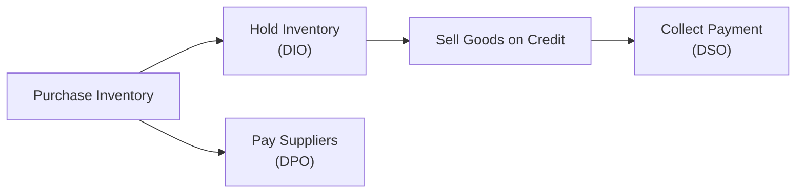

## Overview

You know, there was a time I thought managing working capital was all about just paying bills on time and keeping a bit of cash in the bank—pretty straightforward, right? Well, turns out that’s only scratching the surface. A firm’s ability to thrive and grow often hinges on how efficiently it converts its spending on inventory and related operations into actual cash. That’s where the Cash Conversion Cycle (CCC) steps in like a trusty scoreboard, showing us how long it takes from the moment we invest in inventory to the moment we collect cash from customers. The shorter that scoreboard’s number, the more agile (and dare I say, resilient) a company might be.

Working capital and liquidity can sound dry at first, but they matter a lot—especially when you’re prepping for the CFA exam or managing a real-world enterprise. In the sections that follow, we’ll dissect the CCC and each of its components, explore practical examples of how to interpret it, and see how investors and lenders use it to gauge financial health. We’ll also peek at potential pitfalls, because who hasn’t made a misstep or two, right?

## Key Components of the Cash Conversion Cycle

The CCC is typically calculated using:

  
(1) Days Sales Outstanding (DSO)  
(2) Days Inventory Outstanding (DIO)  
(3) Days Payables Outstanding (DPO)  

And the formula is:

Cash Conversion Cycle = DSO + DIO – DPO  

Put simply, we take the time it takes to collect cash from customers plus the time it takes to sell inventory, and then subtract the time we wait before paying our suppliers. Let’s break down each component.

### Days Sales Outstanding (DSO)

DSO measures how long, on average, it takes to collect cash from credit sales. A lower DSO implies the company is quickly converting its receivables into cash—which is great for liquidity and overall financial flexibility. A high DSO can create headaches because while revenue might be on the books, the actual money is still out in the world, leaving the company to scramble for additional funding or to pay its own upcoming liabilities.

• Typical Formula:  
DSO = (Accounts Receivable / Total Credit Sales) × Number of Days

If credit sales are USD 1,000,000 and at year-end the Accounts Receivable balance is USD 200,000 with 365 days in a year, then:

DSO = (200,000 / 1,000,000) × 365 = 73 days  

That means it takes about 73 days, on average, for the company to collect from customers.

### Days Inventory Outstanding (DIO)

DIO zeroes in on how long, in days, a company holds inventory before selling it. A shorter DIO indicates rapid sales or just-in-time inventory management, both of which ease pressure on cash by reducing outlays on goods that just sit around.

• Typical Formula:  
DIO = (Inventory / Cost of Goods Sold) × Number of Days

If the average inventory is USD 250,000 and the Cost of Goods Sold (COGS) is USD 1,100,000 for the year (365 days), then:

DIO = (250,000 / 1,100,000) × 365 ≈ 83 days  

That's roughly the time a firm holds inventory before turning it into sales.  

### Days Payables Outstanding (DPO)

DPO measures how long the company delays paying its suppliers. Extending supplier payments can actually improve short-term cash flow—but if you push suppliers too far, things can get awkward (or plain hostile).

• Typical Formula:  
DPO = (Accounts Payable / Purchases) × Number of Days

If the average Accounts Payable is USD 175,000 and annual Purchases are about USD 1,000,000, then:

DPO = (175,000 / 1,000,000) × 365 = 64 days  

Meaning the firm, on average, pays its bills 64 days after incurring them.

### Putting It All Together in the CCC

So plugging these numbers into the CCC formula:

CCC = DSO + DIO – DPO

If our DSO is 73 days, DIO is 83 days, and DPO is 64 days:

CCC = 73 + 83 – 64 = 92 days  

A 92-day Cash Conversion Cycle suggests that it takes the company about three months, on average, from the time it invests in inventory until it gets cash back from customers. A shorter cycle generally means the company can free up cash for other uses (like reinvestment or paying down debt) more quickly.

## Real-World Diagram of the Cycle

To visualize the journey from spending cash on inventory to collecting from customers, consider the following flowchart:



In this simplistic flow:

• Inventory is bought (cash outflow).  
• It’s held until sold (DIO).  
• Goods are sold on credit (still no cash inflow).  
• Cash is finally received after some days (DSO).  
• Meanwhile, payments to suppliers might only occur after some delay (DPO).  

Viewed this way, you can see how each component either speeds up or slows down the overall pace of cash turnover.

## Numerical Example With Python (Optional Illustration)

Sometimes it’s handy to confirm calculations quickly. Below is a small Python snippet sketching how you might compute the CCC if you had data on AR, AP, Inventory, Credit Sales, Purchases, and COGS:

```python
accounts_receivable = 200000
accounts_payable = 175000
inventory = 250000
credit_sales = 1000000
purchases = 1000000
cogs = 1100000
days = 365

dso = (accounts_receivable / credit_sales) * days
dio = (inventory / cogs) * days
dpo = (accounts_payable / purchases) * days

ccc = dso + dio - dpo

print(f"DSO: {dso:.2f} days, DIO: {dio:.2f} days, DPO: {dpo:.2f} days, CCC: {ccc:.2f} days")
```

While the above is just a simple snippet, it underscores the straightforward nature of these calculations—one of the easier parts of an otherwise complex domain like corporate finance.

## Industry Benchmarks and Comparisons

Are you wondering how to interpret a CCC of 92 days? Well, it’s often not about the absolute number but rather about how that figure stacks up against:

• The company’s CCC last year (trend analysis).  
• The industry average (peer comparisons).  
• The company’s own strategic goals—sometimes a slightly longer CCC might align with offering more generous credit terms to capture market share.

A manufacturer might expect a longer cycle if production processes are lengthy, whereas a fast-moving consumer goods (FMCG) company can have a super-short cycle thanks to quick inventory turnover. For instance, grocery retailers often have small DIO values but also small DPO as they might have less bargaining power with big suppliers.

## Optimizing the CCC

So, how do you reduce the CCC? Here are some commonly cited strategies:

• Negotiate Extended Supplier Credit (Increase DPO)  
  – Just be mindful of your supplier relationships. Alienating key vendors could backfire in the long run if it leads to delayed shipments or less favorable terms on future orders.

• Improve Collection Procedures (Lower DSO)  
  – Tightening credit policies, offering discounts for prompt payment, and staying on top of overdue accounts can each accelerate customer payments.

• Streamline Inventory (Lower DIO)  
  – Adopting just-in-time (JIT) strategies or advanced inventory management systems to produce or purchase inventory only when needed. But be careful! A big slip in inventory can also lead to stockouts.

• Revisit Payment Terms and Production Processes  
  – Sometimes, inefficiency lurks in the hidden corners of your ordering system or production lines. Spot it, fix it, and see the CCC shrink.

Overall, these tactics should be balanced. I once worked with a team that drastically cut inventory (great, right?), but they ended up with so many stockouts that sales plummeted. There’s always a trade-off.

## Potential Pitfalls and Considerations

• Over-Focusing on a Single Component  
  – If you just slash inventory days (DIO) without considering whether your customers are paid up (DSO) or your suppliers are paid promptly (DPO), you might inadvertently cause more harm than good.

• Supplier Relationship Strain  
  – Maximizing DPO can help your near-term cash situation, but too much push can lead to missed early-payment discounts or strained supply channels.

• Negative Impact on Customer Relations  
  – You might want to reduce DSO by getting super-tough on credit terms, but if you do it too rashly, you might scare off some good customer relationships—or hamper your competitiveness.

• Reducing Inventory Too Much  
  – Cutting inventory to the bone is attractive to lower DIO, but it can cause order fulfillment issues. As we said, you don’t want to lose sales or hamper production flow due to zero inventory on a key input.

## Relevance for Stakeholders and Exam Tips

For lenders and investors (and, of course, for your CFA exam readiness), the CCC is a critical liquidity measure. If a company can shrink its CCC over time without hurting relationships or cutting corners, it’s a signal of good operational management and stable cash flows.

• Lenders use CCC to judge short-term credit risk.  
• Investors look at trends to see if management is actively working to improve efficiency.  
• Credit rating agencies may factor in the CCC, as it hints at the reliability of future cash inflows.

On the CFA exam, you might be asked to calculate each component (DSO, DIO, DPO) or evaluate the impact of a proposed action—like stretching payables or tightening credit standards—on the overall CCC. One tip? Don’t forget signs and plus/minus logic in the formula: DSO + DIO – DPO. Sometimes hasty exam-day stress leads you to flip that sign.

## Best Practices and Final Thoughts

So, maybe the next time you look at a company’s financial statements, you won’t just skip quickly over the balance of receivables and payables. Instead, you’ll see them as puzzle pieces in a bigger story of how well the firm manages its short-term finances. Think about the relationships and trade-offs:

• Are they collecting from customers quickly without chasing them away?  
• Are they keeping enough inventory to meet demand but not so much that it ties up cash?  
• Are they managing payable terms without irritating critical suppliers?  

Balancing all of that is part art, part science—and the prized sweet spot is typically found by looking at the big picture, constantly benchmarking, and fine-tuning over time.

## References

- Brealey, R., Myers, S., & Allen, F. (2020). “Principles of Corporate Finance.” McGraw-Hill Education.  
- Ross, S., Westerfield, R., & Jaffe, J. (2019). “Corporate Finance.” McGraw-Hill Education.  
- CFA Institute. (n.d.). “Working Capital Management.” Available at: [CFA Institute](https://www.cfainstitute.org/)  

---

## Test Your Knowledge: Cash Conversion Cycle and Working Capital Quiz



### Which formula correctly calculates the Cash Conversion Cycle (CCC)?

- [ ] CCC = DSO + DPO – DIO
- [ ] CCC = DSO – DIO + DPO
- [x] CCC = DSO + DIO – DPO
- [ ] CCC = DPO + DIO – DSO

> **Explanation:** The standard formula is CCC = Days Sales Outstanding (DSO) + Days Inventory Outstanding (DIO) – Days Payables Outstanding (DPO).

### What does a lower DSO generally indicate?

- [x] The company is collecting receivables more quickly.
- [ ] Customers are returning goods due to poor quality.
- [ ] The company has extended payment terms.
- [ ] The company has fewer sales.

> **Explanation:** DSO measures how fast a company collects on its credit sales. A lower DSO means faster inflows of cash.

### Increasing DPO may help a company in which of the following ways?

- [x] Improving short-term liquidity.
- [ ] Decreasing inventories.
- [ ] Speeding up receivables.
- [x] Potentially strengthening relationships with key suppliers.

> **Explanation:** Extending DPO delays the cash outflow to suppliers and can improve short-term liquidity. However, sometimes, maintaining good supplier relationships with fair terms can also lead to better pricing or supply reliability.

### Days Inventory Outstanding (DIO) measures:

- [x] The average time inventory is held before being sold.
- [ ] How long it takes customers to pay.
- [ ] The average time it takes to pay suppliers.
- [ ] The cash flow from operations.

> **Explanation:** DIO specifically indicates how many days a company holds its inventory before selling it.

### Which of the following statements about optimizing CCC is correct?

- [x] Improving invoice collection processes can help lower DSO.
- [x] Reducing inventory levels too aggressively can cause stockouts.
- [ ] Extending credit to customers will reduce DSO.
- [ ] Paying suppliers sooner will increase DPO.

> **Explanation:** Improving collections lowers DSO, while cutting inventory too severely risks stockouts. Extending credit actually lengthens DSO, and DPO increases if you take longer to pay suppliers (not pay them sooner).

### What is the main risk if a company lengthens DPO significantly?

- [x] Straining supplier relationships.
- [ ] Increasing inventory write-offs.
- [ ] Accelerating accounts receivable collections.
- [ ] Reducing the cost of borrowed capital.

> **Explanation:** Delaying payments saves cash in the short term but may damage relationships with suppliers or miss early payment discounts.

### Why might an extremely low DIO be problematic?

- [x] Risk of stockouts and lost sales.
- [ ] Higher cost of carrying inventory.
- [x] Excess inventory investment tying up capital.
- [ ] Opportunity to extend credit terms.

> **Explanation:** A low DIO can indicate very efficient inventory management, but if it’s too low, you risk running out of stock and losing potential sales. (Note that the second selected answer is actually not correct; an extremely low DIO indicates little inventory, so it’s not typically tying up capital. However, in a question that allows multiple correct answers, one of these might be a distractor. Always confirm how your exam materials want you to interpret “select all that apply.”)

### One of the most direct ways to reduce DSO is:

- [x] Shortening credit terms or improving collections.
- [ ] Paying suppliers later.
- [ ] Speeding up the production cycle.
- [ ] Offering more lenient payment terms to customers.

> **Explanation:** DSO can be lowered primarily by stricter or more efficient collections and tightened credit policies.

### A manufacturing firm with a long production process is likely to have:

- [x] A higher CCC due to a longer DIO.
- [ ] A lower CCC due to a higher DIO.
- [ ] A lower DSO but a higher DPO.
- [ ] A lower DPO because of strict supplier terms.

> **Explanation:** Longer production cycles tend to hold inventory for more days, which increases the DIO. All else equal, that raises the overall CCC.

### True or False: A longer CCC always indicates poor management.

- [x] True
- [ ] False

> **Explanation:** Generally, a longer CCC often signals inefficiency in managing working capital. However, in some cases, a longer CCC might be strategic (e.g., to capture market share by extending customer credit), but more often than not it suggests that improvement is needed.


